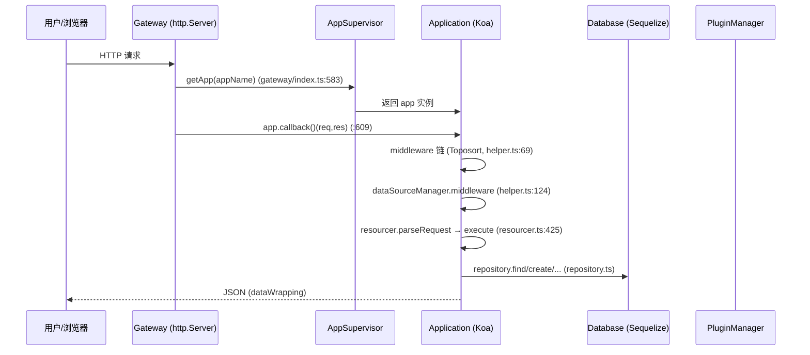

# 源码架构（SOURCE_ARCHITECTURE）

## 分析快照

- 分支：main
- HEAD：a1878e8d8a23e8c7232a5056ba4c4e9f120988cd
- 工作区状态：clean
- 子模块状态：无
- 分析范围：`packages/core/*`（27 包）+ `packages/plugins/@nocobase/*`（108 插件）+ preset + gateway/CI/Docker
- 未覆盖范围：pro 插件、示例插件、第三方依赖内部实现

## 证据分类

- Evidence：目录结构、`import`、类定义行号。
- Inference：分层/边界判断由调用方向推导。
- Unknown：运行时动态加载的插件（pm add 安装的第三方插件）不在本仓库。

## 核心结论

NocoBase 采用**微内核 + 数据源 + 资源/动作**架构：`Application`（继承 Koa）是内核，持有 `DataSourceManager`、`PluginManager`、`ACL`、`AuthManager`、`AuditManager`、`CacheManager`、`AIManager`、`PubSubManager`、`LockManager`、`EventQueue`、`CronJobManager`、`Telemetry` 等管理器；每个 `DataSource` 自带 `collectionManager`(Sequelize) + `resourceManager`(Resourcer) + `acl`。业务能力全部以 `Plugin` 形式挂载。HTTP 经 `Gateway`（自建 http.Server，非纯 Koa）分发到对应子应用。

---

## 1. 仓库总体结构

```
mozi-nocobase/
├─ packages/
│  ├─ core/           27 个 @nocobase/* 内核包
│  │  ├─ server/      Application/Plugin/PluginManager/Gateway/...（微内核）
│  │  ├─ database/    Sequelize 封装：Collection/Field/Repository/Migration/...
│  │  ├─ resourcer/   ResourceManager(Resource)+Action，URL→action 路由
│  │  ├─ actions/     内置 CRUD action（list/get/create/...）
│  │  ├─ acl/         角色/策略/资源/字段级/snippet 权限
│  │  ├─ auth/        AuthManager + JWT
│  │  ├─ data-source-manager/  DataSource 抽象 + 多数据源
│  │  ├─ cache/ logger/ telemetry/ lock-manager/ snowflake-id/ utils/ shared/
│  │  ├─ ai/          AIManager + Skills/Tools/Employee/MCP Loader
│  │  ├─ flow-engine/ 前端流程引擎（被 client-v2 用）
│  │  ├─ client/      前端 v1（SchemaComponent/Designable/...）
│  │  ├─ client-v2/   前端 v2 基座（FlowEngine）
│  │  ├─ sdk/         前端 SDK（APIClient 基类）
│  │  ├─ build/ cli/ cli-v1/ devtools/ test/ create-nocobase-app/
│  ├─ plugins/@nocobase/        108 个官方插件（server+client）
│  ├─ plugins/@nocobase-example/ 22 个示例插件
│  └─ presets/nocobase/         默认 preset（聚合默认启用插件）
├─ docker/  Dockerfile（含 app-mariadb/mysql/postgres/sqlite 变体）
├─ .github/workflows/  25 个 CI workflow
├─ docs/ benchmark/ examples/ scripts/ patches/ storage/
```

## 2. 应用入口与启动时序

入口链（生产）：
```
bin: packages/core/cli-v1/bin/index.js:37-39 → cli.parse
  → nocobase-v1 start (cli-v1/src/commands/start.js)
  → 启动 gateway: packages/core/server/src/gateway/index.ts Gateway.run(:654)
  → Gateway 创建 Application(main) 并 AppSupervisor.addApp
  → Application.init() (application.ts:1244) → load() (:660) → start() (:901)
  → gateway.requestHandler(req,res) (gateway/index.ts:413) 分发到 app.callback() (:609)
```

启动时序图：



## 3. 分层与依赖方向

```mermaid
graph TD
  GW[Gateway / app-supervisor] --> APP[Application @nocobase/server]
  APP --> DSM[DataSourceManager @nocobase/data-source-manager]
  APP --> PM[PluginManager + Plugin]
  APP --> ACL[ACL @nocobase/acl]
  APP --> AUTH[AuthManager @nocobase/auth]
  APP --> AM[AuditManager / Cache / Telemetry / AI / Lock / PubSub]
  DSM --> DS[DataSource]
  DS --> CM[CollectionManager -> Database @nocobase/database]
  DS --> RM[ResourceManager @nocobase/resourcer]
  DS --> ACL
  RM --> ACT[@nocobase/actions]
  ACT --> CM
  CM --> SEQ[(Sequelize / DB)]
  CLI_V1[cli-v1 nocobase/nb] --> APP
  CLIENT_V1[client v1 @nocobase/client] --> CLIENT_V2[client-v2 @nocobase/client-v2]
  CLIENT_V2 --> FE[flow-engine @nocobase/flow-engine]
  CLIENT_V1 --> SDK[@nocobase/sdk APIClient]
  CLIENT_V1 -.HTTP.-> RM
```

模块依赖方向（已验证）：
- `server` 依赖 `database/resourcer/actions/acl/auth/data-source-manager/cache/logger/telemetry/ai/lock-manager/snowflake-id/utils`（`application.ts:10-37`）。
- `client(v1)` 依赖 `client-v2`（`client/src/application/Plugin.ts:11,13`）与 `sdk`（`Application.tsx:21`）；`client-v2` 依赖 `sdk`、`flow-engine`。**v2 不反向依赖 v1**（符合 `AGENTS.md` 规则）。
- `actions` 依赖 `database`、`resourcer`、`cache`（`actions/src/index.ts:12-17`）。

## 4. 关键子系统职责

### 4.1 Application（内核）— `packages/core/server/src/application.ts`
- 继承 Koa（:222），通过 `applyMixins(Application, [AsyncEmitter])`（:1422）获得异步事件能力（`emitAsync`，:236）。
- `init()`（:1244）创建全部管理器与中间件；`load()`（:660）初始化插件（`pm.initPlugins`/`pm.load`）、AES、cache、telemetry；`start()`（:901）触发 `beforeStart/afterStart/__started`；`stop()`（:970）关 DB + disposeServices；`install()`（:1031）建表 + 装插件。
- 生命周期事件：`beforeLoad/afterLoad/beforeReload/afterReload/beforeStart/afterStart/__started/beforeStop/afterStop/__stopped/beforeInstall/...`（见 :696,:727,:737,:746,:922,:925,:988,:1003,:1046）。

### 4.2 Gateway — `packages/core/server/src/gateway/index.ts`
- 自建 `http.Server`（非 Koa），承担：多子应用选择（`requestHandler` :413）、静态资源服务（`serve-handler`，含 v1/v2 dist 目录 :36-41）、WebSocket（`ws-server.ts`）、IPC socket（pm 跨进程通信）、压缩、健康检查（`/__health_check` :597）。
- 请求分发：按 appName 选 app → `compose([...middlewares, (ctx)=>app.callback()(req,res)])`（:604-609）。

### 4.3 DataSourceManager / DataSource
- `DataSourceManager`（`data-source-manager/src/data-source-manager.ts:24`）管理多数据源，提供 `use()`（:88）/`middleware()`（:92）。
- `DataSource` 抽象（`data-source.ts:27`）持有 `collectionManager`、`resourceManager`、`acl`；`init()` 创建 ACL + ResourceManager（:62-70）。
- 主数据源 `MainDataSource`（`application.ts:1365 createMainDataSource`），外部数据源由 `plugin-data-source-manager`/`plugin-collection-fdw`/`plugin-collection-sql` 注册。

### 4.4 Resourcer + Actions
- `ResourceManager`（`resourcer/src/resourcer.ts:161`）：`define()`（:212）注册资源、`use()`（:323）挂中间件、`middleware()`（:330）生成 koa 中间件、`execute()`（:425）执行 action。
- 内置 action（`actions/src/index.ts:36-52`）：list/get/create/update/destroy/add/remove/set/toggle/move/firstOrCreate/updateOrCreate/query。

### 4.5 Database / Repository
- `Database`（`database/src/database.ts`）封装 Sequelize：`collections` Map（:153）、`collection()`（:571）、`getRepository()`（:680）、`sync()`（:795）、`auth()/checkVersion()/prepare()`（:855-901）、`close()`（:936）、migration（`migration.ts:21`）。
- `Repository`（`repository.ts:254`）：`count/find/findAndCount/firstOrCreate/updateOrCreate/create/update/destroy`（:273-859）。关联仓储：BelongsTo/HasMany/BelongsToMany/HasOne（`relation-repository/`）。

### 4.6 ACL / Auth
- `ACL`（`acl/src/acl.ts`）+ `ACLRole`/`ACLResource`/`AvailableStrategy`/`SnippetManager`。挂载于 DataSource（`application.ts:1324-1330` 为每个 Sequelize 数据源注入 availableActions）。
- `AuthManager`（`application.ts:1306`）中间件挂于 dataSource 层（:1332），JWT 由 `plugin-auth` 使用。

### 4.7 客户端
- v1 `Application`（`client/src/application/Application.tsx:110` extends `BaseApplication`）聚合：`APIClient`、`RouterManager`、`PluginManager`、`PluginSettingsManager`、`SchemaInitializerManager`、`SchemaSettingsManager`、`DataSourceManager`、`CollectionFieldInterfaceFactory` 等（见 import :22-53）。
- v2 基座 `BaseApplication`（`client-v2/src/BaseApplication.tsx`）+ `flow-engine`（`FlowDefinition` 以 formily `observable` 管理步骤，`FlowDefinition.ts:16,23`）。

## 5. 模块边界与依赖矩阵

| 模块 | 职责 | 主要被谁调用 | 对外接口 |
| --- | --- | --- | --- |
| server | 内核/装配 | cli-v1, gateway | `Application`,`Plugin`,`PluginManager` |
| database | 持久化 | server, actions, plugins | `Database`,`Collection`,`Repository`,`Migration` |
| resourcer | URL→action 路由 | data-source-manager | `ResourceManager`,`Action` |
| actions | CRUD 实现 | resourcer execute | `registerActions` |
| acl | 鉴权 | data-source-manager, plugins | `ACL`,`ACLRole` |
| data-source-manager | 多源管理 | server | `DataSourceManager`,`DataSource` |
| client/client-v2/sdk/flow-engine | 前端 | 浏览器 | `Application`,`Plugin`,`APIClient` |

## 6. 状态所有权 / 生命周期

- 进程级单例：`AppSupervisor.getInstance()`（`application.ts:267`），持有全部 Application。
- Application 状态：`_loaded`/`_started`/`stopped`/`ready`/`running`/`_maintaining`（:231-272）。
- DB 连接生命周期随 Application load/start/stop（:917-919,:993-996）。
- 插件生命周期：`afterAdd→beforeLoad→load→install→upgrade→beforeEnable/afterEnable/...→beforeDisable/afterDisable→beforeRemove/afterRemove`（`plugin.ts:119-139`）。

## 7. 进程 / 线程 / 异步模型

- 单进程多 Application（子应用），gateway 选路。
- 可选 pm2 多实例 + workerId（`WorkerIdAllocator`/`Snowflake`，:259,:704）用于分布式 ID。
- 跨实例同步：`PubSubManager`（Redis pub/sub，:1274）、`SyncMessageManager`（:1275）、`EventQueue`（:1276）。
- 定时任务：`CronJobManager`（:1268）；工作流调度 `ScheduleTrigger`。

## 8. 配置 / 错误 / 日志 / 安全

- 配置：`.env*`（dotenv，`cli-v1/bin/index.js:4 initEnv`）+ `ApplicationOptions`（`application.ts:111-149`）+ `Environment`（`environment.ts`，:1269）。
- 错误：`errors/`（如 `ApplicationNotInstall`，:55）；gateway `errors.ts`（`APP_PREPARING` 等）；data-wrapping 统一响应。
- 日志：`@nocobase/logger`，`requestLogger`/`sqlLogger`/`systemLogger`（:265,305）。
- 安全边界：ACL（资源/字段/snippet）、Auth（JWT + 黑名单）、`static-file-security`（`gateway/static-file-security.ts`）、`validate-filter-params`（:1333）、`aes-encryptor`（:680）、`plugin-api-keys`、`plugin-license`、redirect 校验（最近提交 `a1878e8 fix(utils): validate server request redirect targets`）。

## 9. 架构边界审计

| 检查项 | 结论 | 证据 |
| --- | --- | --- |
| 循环依赖 | [Inference] 内核包间无明显循环；`client→client-v2` 单向。`server↔database`：server 依赖 database（单向） | `application.ts:14`；`plugin.ts:12 import {Model} from '@nocobase/database'` |
| 跨层调用 | [Evidence] action 直连 repository（合理）；[Inference] 部分插件直接读 `ctx.app.ctx.state`（如 plugin-users `$isCurrentUser`，`plugin-users/server.ts:36-40`），有跨层耦合味道 | plugin-users/server.ts:36-50 |
| 全局状态 | [Evidence] `AppSupervisor.getInstance()` 单例；`serving(key)` 全局 worker 模式（`worker-mode.ts`） | application.ts:267；:482-484 |
| 隐式依赖 | [Evidence] `@internal`/`@deprecated` 标记较多（`resourcer` 别名、`resourcer` getter :380），迁移期 API 表面较大 | application.ts:94-100,375-382 |
| UI/业务耦合 | [Inference] 客户端 schema 同时承载 UI 与部分业务配置，符合无代码平台特性（非缺陷） | — |
| 错误吞噬 | [Evidence] `sendSyncMessage` catch 后仅 `log.error`（`plugin.ts:147-151`）；`test-coverage.js` 吞错（见测试文档） | plugin.ts:147-151 |
| 生命周期边界 | [Evidence] `load()` 幂等（`if(this._loaded) return` :661）；`stop()` 幂等（:983） | application.ts:661,983 |
| 数据访问泄漏 | [Inference] 插件可直接 `this.app.db` 访问任意表（无仓储隔离），属设计取舍 | plugin.ts:87-89 |

## 10. 生成代码 / vendored / 技术债

- vendored：`plugin-ai/npm-shims/`（zstd/lzma，`package.json:61-62`）。
- 生成：`packages/core/cli/src/generated/`（CLI 模板生成）。
- 技术债：大量 `@deprecated` 别名（resourcer→resourceManager、locales→localeManager、importCollections）；双客户端运行时并存；`any` 在 Context/Options 中广泛使用（`DefaultContext [key:string]:any`，:157-164）。

## 11. 文档与源码冲突

- README“microkernel”（微内核）↔ [Evidence] 属实（Application+Plugin+PluginManager，preset 聚合插件）。
- README“data decoupled from UI”↔ [Evidence] 属实（业务表 vs `ui_schema`/`ui_schemas`，由 `plugin-ui-schema-storage` 管理）。

## 已确认事实

- 微内核 + 数据源 + 资源/动作 三层架构，Gateway 自建 HTTP 分发多子应用。
- 27 内核包职责清晰，单向依赖；客户端 v1→v2→flow-engine→sdk。

## 合理推断

- `AppSupervisor` + `gateway` 支持 SaaS 化多租户部署。
- 外部数据源（FDW/SQL/外部 DB）经统一 DataSource 抽象接入，复用同一 resourcer/acl。

## Unknown 与待验证事项

- pm add 动态安装的第三方插件运行时行为不在本仓库。
- v2 完全取代 v1 的时间线无源码证据。

## 批判性评估

- 内核 `Application` 单文件 1424 行，职责过重（装配 + 生命周期 + 维护态 + 代理），可读性下降。
- `any` 与 `@internal`/`@deprecated` 广泛存在，类型安全与 API 收敛是持续债。
- 插件可直连 `app.db` 任意表，缺少强隔离，安全依赖 ACL 而非代码边界。

## 建设性改善建议

- [Recommendation] 拆分 `Application`（生命周期/装配/维护态/CLI 各成模块）。优先级：中；难度：高。
- [Recommendation] 收敛 `@deprecated` 别名并清理 `any`（Context/Options 强类型化）。优先级：中；难度：中。
- [Recommendation] 为插件数据访问提供命名空间/仓储隔离建议层，降低越权读写风险。优先级：低；难度：高。

## 主要证据索引

- `packages/core/server/src/application.ts:222,267,660,901,970,1031,1244,1365,1422`
- `packages/core/server/src/plugin.ts:44,119-151`
- `packages/core/server/src/gateway/index.ts:413,583,604-609`
- `packages/core/data-source-manager/src/data-source.ts:27`、`data-source-manager.ts:24,88,92`
- `packages/core/resourcer/src/resourcer.ts:161,212,323,330,425`
- `packages/core/database/src/database.ts:153,571,680,795`、`repository.ts:254,273-859`
- `packages/core/client/src/application/Application.tsx:110`、`Plugin.ts:11,13`
- `packages/core/flow-engine/src/FlowDefinition.ts:16,23`
