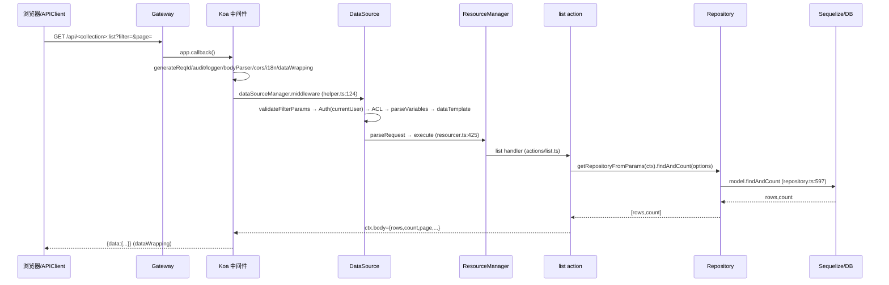
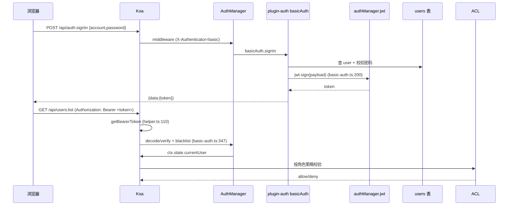
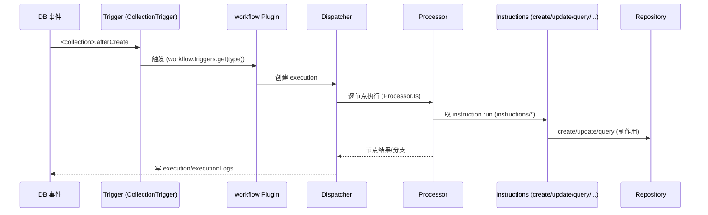

# 核心数据流（核心数据流.md）

## 分析快照

- 分支：main
- HEAD：a1878e8d8a23e8c7232a5056ba4c4e9f120988cd
- 工作区状态：clean
- 子模块状态：无
- 分析范围：HTTP CRUD、登录鉴权、工作流触发、Schema 渲染、外部数据源、AI 调用、同步消息
- 未覆盖范围：实际 DB 执行计划（需运行时）

## 证据分类

- Evidence：中间件链、action、repository、workflow、auth 源码行号。
- Inference：事务/竞态边界由代码结构推导。
- Unknown：生产并发下的真实竞态表现。

## 核心结论

所有业务数据流最终汇入同一管线：**浏览器 → Gateway 选 app → Koa 中间件链 → DataSourceManager.middleware → ResourceManager.execute → Action → Repository → Sequelize → DB**。差异在触发点、ACL/事务边界与副作用。

---

## 数据流 1：列表查询（list）

- 触发点：前端区块 `useRequest`/`APIClient.resource(name).list()`。
- 输入：`filter/fields/sort/page/pageSize/appends/except/tree`（`actions/list.ts:24-32`）。
- 大表优化：`getEstimatedRowCount` 超阈值自动切 `simplePaginate`（`list.ts:55-78`，写回 collection options）。
- 事务边界：单次查询，无显式事务（只读）。
- 错误路径：filter 非法→`validateFilterParams`；ACL 拒绝→403；dataWrapping 统一封装。

## 数据流 2：创建记录（create）

- 入口：`POST /api/<collection>` → `create` action（`actions/create.ts`）。
- 链路同上，action 调 `repository.create({...values})`（`repository.ts:680`）。
- 关键：`parseVariables`（`middlewares/parse-variables.ts`）把 `{{变量}}` 替换为运行时值；`dataTemplate` 注入默认值；`createdBy/updatedBy` 由 plugin-users 注入（`plugin-users/server.ts:43-50`）。
- 事务：`repository.create` 内 `getTransaction`（`repository.ts:276`）；关联数据经 `updateAssociations`（`repository.ts:52`）。
- 副作用：触发 `db.on('<collection>.afterCreate')` 事件 → 可能触发工作流 CollectionTrigger。

## 数据流 3：登录与鉴权（signIn → 后续请求）

- 登录 resource：`auth`（`application.ts:1314-1317`），action 来自 `@nocobase/auth`。
- 多认证器：`X-Authenticator` 头选择（`authManager.authKey:'X-Authenticator'`，:1307）。
- token 失效：`jwt.blacklist.has`（`basic-auth.ts:347`）→ 401。

## 数据流 4：工作流触发与执行

- 注册：`triggers: Registry<Trigger>` + `instructions: Registry<InstructionInterface>`（`plugin-workflow/src/server/Plugin.ts:55-56`）。
- 触发器：CollectionTrigger（数据事件）、ScheduleTrigger（定时）。
- 指令：condition/calculation/create/update/destroy/query/end/output/multiConditions（`instructions/`）。
- 执行：`Dispatcher.ts` + `Processor.ts`；超时/恢复：`ExecutionTimeoutManager`/`RunningExecutionRegistry`。
- 事务/竞态：[Inference] 单 execution 串行节点；并发触发由 execution 级注册表 + 锁控制。

## 数据流 5：无代码页面渲染（Schema → UI）

- 前端拉取 `ui_schemas`（`plugin-ui-schema-storage`）→ `SchemaComponent` 以 formily `Schema` 解析 → `RecursionField` 递归渲染 → AntD 组件。
- 数据区块：`DataBlockProvider`（`client/src/data-source/data-block/DataBlockProvider.ts`）发起 `APIClient.resource().list()`（即数据流 1）。
- 配置态：`SchemaInitializer`（加区块）/`SchemaSettings`（改配置）修改 Schema → 保存回 `ui_schemas`。

## 数据流 6：外部数据源查询

- 注册：`plugin-data-source-manager`/`plugin-collection-fdw`/`plugin-collection-sql` 向 `DataSourceManager` 添加非 main 数据源（`DataSource` 抽象 `data-source.ts:27`）。
- 请求：URL 带数据源标识 → `dataSourceManager.middleware` 选对应 DataSource → 其 `resourceManager`/`acl` → action → 该源的 collectionManager（可能是 SQL 视图或 FDW 映射）。
- [Inference] 外部源复用同一 action/ACL，但 collectionManager 实现不同。

## 数据流 7：AI 调用（AIManager）

- `app.aiManager`（`application.ts:262`）聚合 LLM 适配；插件经 `SkillsLoader/ToolsLoader/AIEmployeeLoader/MCPLoader`（`plugin.ts:21`）注册能力。
- MCP：`plugin-mcp-server` 暴露 MCP 端点，外部 Agent 经标准协议调用 → 经 ACL 鉴权 → 触发 action/工具/工作流。
- [Unknown] 具体 LLM vendor 调用细节（`plugin-ai`/`plugin-ai-gigachat`）未深读。

## 数据流 8：跨实例同步消息

- 插件 `sendSyncMessage`（`plugin.ts:142`）→ `SyncMessageManager.publish` → `PubSubManager`(Redis) → 其他实例 `handleSyncMessage`（:141）。
- 风险：发布失败被吞（`plugin.ts:147-151`）。

## 数据流审计（重复转换 / 错误丢失 / 多真相源 / 越层 / 事务 / 幂等 / 竞态）

| 检查项 | 结论 | 证据 |
| --- | --- | --- |
| 重复转换 | [Inference] filter 经 `FilterParser` + Sequelize where 两次转换，属必要 | repository.ts, filter-parser.ts |
| 错误丢失 | [Evidence] 同步消息吞错；`db.close()` 失败吞错 | plugin.ts:147-151；application.ts:990-999 |
| 多真相源 | [Inference] collection 定义既在代码（插件 `db.collection`）又在 `collections` 元数据表，二者需保持一致 | database.ts, plugin-collection-manager |
| 越层访问 | [Evidence] 插件可直接 `this.app.db` 访问任意表 | plugin.ts:87-89 |
| 事务边界 | [Inference] 单 action 有事务；跨 action/工作流多节点无统一分布式事务 | repository.ts:276 |
| 幂等性 | [Inference] `firstOrCreate/updateOrCreate` 提供幂等创建；工作流触发无天然去重 | repository.ts:636-649 |
| 竞态 | [Inference] 并发触发同一工作流可能产生多个 execution；需 `LockManager` 显式控制 | plugin-workflow |

## 已确认事实

- 统一请求管线覆盖 CRUD/鉴权/工作流/AI/同步。
- 工作流为独立子系统的触发→调度→执行链。

## 合理推断

- 外部数据源与主库共享 action/ACL 但持久化实现不同。

## Unknown 与待验证事项

- LLM 调用细节、MCP 生产可用性。
- 高并发下工作流去重与一致性。

## 批判性评估

- 多处 `catch{log}` 吞错（同步、db.close）。
- 跨节点工作流无分布式事务，最终一致性依赖重试/补偿（未见统一补偿框架）。

## 建设性改善建议

- [Recommendation] 同步/db.close 失败需可观测与重试。优先级：高；难度：中。
- [Recommendation] 工作流触发去重与幂等键机制。优先级：中；难度：高。
- [Recommendation] 明确跨 action 业务事务模式（如 saga 或显式 transaction 传递）。优先级：中；难度：高。

## 主要证据索引

- `packages/core/server/src/helper.ts:69-124`
- `packages/core/resourcer/src/resourcer.ts:425`
- `packages/core/actions/src/actions/list.ts:24-90`
- `packages/core/database/src/repository.ts:276,597,636-680`
- `packages/core/server/src/application.ts:1314-1332`
- `packages/plugins/@nocobase/plugin-auth/src/server/basic-auth.ts:200,312,332,347`
- `packages/plugins/@nocobase/plugin-workflow/src/server/Plugin.ts:55-56`、`Dispatcher.ts`、`Processor.ts`
- `packages/core/server/src/plugin.ts:141-151`
