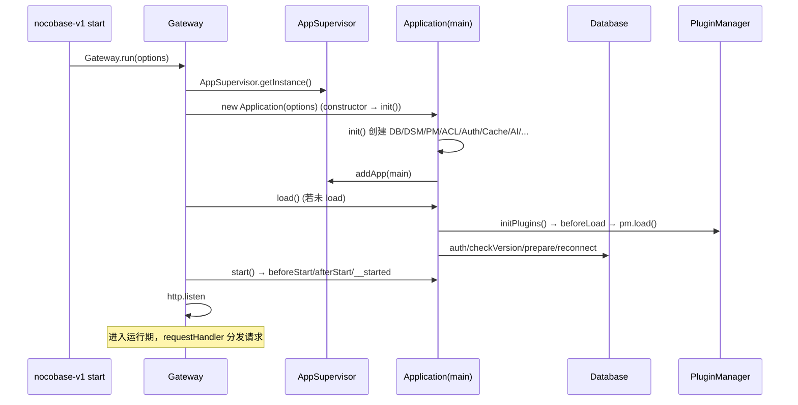
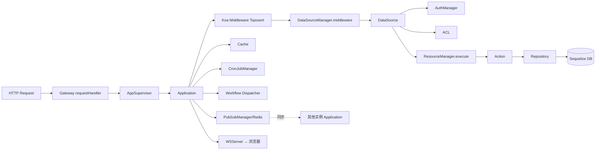
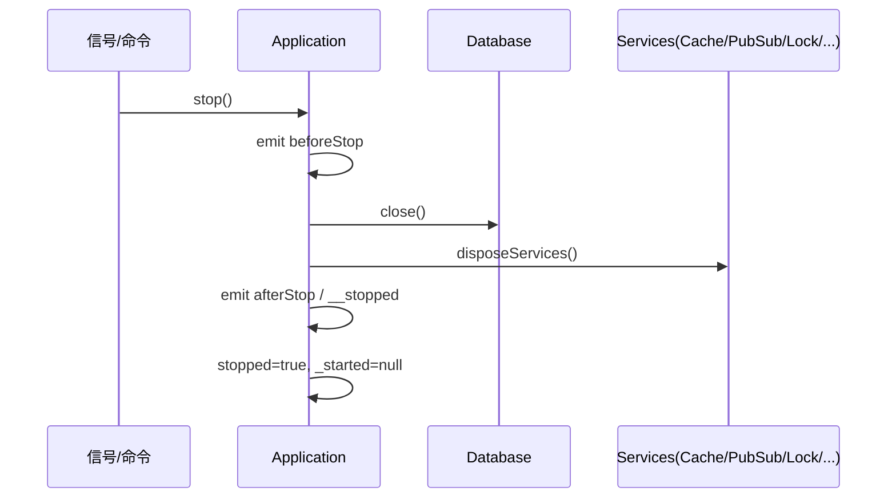

# 运行时架构（运行时架构.md）

## 分析快照

- 分支：main
- HEAD：a1878e8d8a23e8c7232a5056ba4c4e9f120988cd
- 工作区状态：clean
- 子模块状态：无
- 分析范围：进程模型、启动/关闭时序、生命周期、并发、IPC、网关、故障模式
- 未覆盖范围：实际生产部署的进程拓扑（pm2/容器编排）需运行时确认

## 证据分类

- Evidence：`gateway/index.ts`、`application.ts` 生命周期、`worker-mode.ts`、`app-supervisor/`、`pub-sub-manager`。
- Inference：多实例/分布式行为由管理器配置推导。
- Unknown：真实多副本部署的 Redis/锁适配器选型。

## 核心结论

运行期由一个**自建 HTTP Gateway 进程**承载，它持有 `AppSupervisor`（多 Application 单例）并按请求的子应用名分发到对应 `Application.callback()`（Koa）。每个 Application 在内部完成 load→start→（运行）→stop 的生命周期，并管理各自的 DB 连接、插件、缓存、定时任务、工作流执行器。跨实例协作通过 `PubSubManager`(Redis)、`SyncMessageManager`、`EventQueue`、`LockManager`、`WorkerIdAllocator`/`Snowflake` 完成。

---

## 1. 进程组成

| 组件 | 角色 | Evidence |
| --- | --- | --- |
| Gateway（主进程） | `http.Server`，多子应用分发、静态资源、WebSocket、IPC socket | `gateway/index.ts:413,654`；`ws-server.ts`；`ipc-socket-server.ts` |
| Application（Koa） | 业务运行时，每个子应用一个实例 | `application.ts:222`；`AppSupervisor.getApp` `gateway/index.ts:583` |
| AppSupervisor | 进程级单例，注册/查询/启停 Application | `app-supervisor/main-only-adapter.ts`；`application.ts:267` |
| IPCSocketServer/Client | pm（插件管理）跨进程命令通道 | `gateway/ipc-socket-{server,client}.ts` |
| WSServer | WebSocket 推送（同步消息/维护态） | `gateway/ws-server.ts`、`SyncMessageManager` |
| 可选 pm2 多实例 | daemon 模式生产进程管理 | `cli-v1/src/commands/start.js`、`pm2.js` |

[Inference] 默认 `MainOnlyAdapter`（仅 main app）；多租户/多 app 由 `plugin-multi-app-manager` 激活。

## 2. 启动期时序

关键顺序：`init()`（`application.ts:1244`）→ `load()`（:660）→ `start()`（:901）。`load` 内：`AesEncryptor.create` → `createCacheManager` → `pm.initPlugins` → `emitAsync('beforeLoad')` → `workerId`/`snowflake` → `telemetry.init/start` → `pm.load` → 可选 `db.sync` → `emitAsync('afterLoad')`（:680-729）。

## 3. 正常运行期组件图

## 4. 服务生命周期与依赖注入

- `Application` 持有所有管理器实例（`application.ts:262-276`），通过 getter 暴露（`db/acl/authManager/auditManager/cache/pm/...`）。
- `ServiceContainer`（:274）用于服务注册。
- 插件通过 `this.app.xxx` 访问（`plugin.ts:79-97` `ai/pm/db`）。
- `context.db`/`context.cache`/`context.resourceManager` 注入到 Koa ctx（`application.ts:1281-1291`）。

## 5. 数据库连接 / 状态生命周期

- 连接：`createDatabase`（:1383）；`db.reconnect()`（start 时若 closed，:917-919）；`db.close()`（stop，:993-996）。
- 状态：`_loaded`/`_started`/`stopped`（:231-235,328,315）；维护态 `_maintaining`/`_maintainingCommandStatus`（:269-272）。

## 6. 后台任务 / 调度

- `CronJobManager`（:1268）。
- 工作流：`plugin-workflow` 的 `Dispatcher`/`Processor`/`ExecutionTimeoutManager`/`RunningExecutionRegistry`（`plugin-workflow/src/server/`）；`ScheduleTrigger` 定时触发。
- 异步长任务：`plugin-async-task-manager`。

## 7. IPC / RPC / 网络 / 事件

- IPC：`IPCSocketServer`/`Client`（插件管理命令，跨进程）。
- WebSocket：`WSServer` 推送维护态/同步消息到前端。
- 事件：`Application extends AsyncEmitter`（`emitAsync`，:236,:1422），事件如 `beforeLoad/afterLoad/beforeStart/afterStart/__started/beforeStop/afterStop/__stopped/maintaining`。
- 跨实例：`PubSubManager`（Redis pub/sub，:1274）、`SyncMessageManager`（:1275）、`EventQueue`（:1276）。

## 8. 文件监听 / 插件加载

- 开发热重载：`cli-v1/src/commands/dev.js`（chokidar 监听）。
- 插件加载：`PluginManager.load`（`pm.load` 在 `application.ts:719`），静态导入由 `run-plugin-static-imports.ts` 协助；pm add 安装的插件经 IPC + 动态 require。
- 插件符号链接：`@nocobase/utils/plugin-symlink`（`gateway/index.ts:13` `syncPluginSymlinks`）。

## 9. 资源清理 / 正常关闭

`stop()`（:970）：`beforeStop` → 关 DB → `disposeServices` → `afterStop` → `__stopped` → `stopped=true`。`destroy()`（:1011）= `beforeDestroy` → `stop` → `afterDestroy` → `closeLogger`。

## 10. 关闭时序图

## 11. 异常关闭 / 崩溃恢复

- [Evidence] `stop()` 用 try/catch 包裹 `db.close()`，失败仅 `log.error`（:990-999）。
- 工作流：`RunningExecutionRegistry`（`plugin-workflow/src/server/RunningExecutionRegistry.ts`）+ `ExecutionTimeoutManager` 处理执行恢复与超时；`start(recover)`（`StartOptions.recover` :200）。
- gateway 对崩溃/未就绪 app 返回 `APP_PREPARING/APP_INITIALIZING/...`（`gateway/index.ts:560-602`），支持懒重启。

## 12. 编译期 vs 启动期 vs 运行期 vs 关闭期（区分）

| 阶段 | 结构 | Evidence |
| --- | --- | --- |
| 编译期 | TS→JS（tsc/bundler），v1 umi、v2 rsbuild | `@nocobase/build`、`cli-v1/build.js` |
| 启动期 | `init→load→start`，建管理器、装插件、连 DB | `application.ts:1244,660,901` |
| 运行期 | gateway 分发；中间件链；action→repository；后台任务 | `gateway/index.ts:609`、`helper.ts:69-124` |
| 关闭期 | `stop`/`destroy`；关 DB；dispose | `application.ts:970,1011` |

## 13. 平台差异 / 故障模式

- 多 DB 方言：Sequelize 支持 postgres/mysql/mariadb/sqlite/kingbase/mssql/oracle（见 `repository.ts:324-373` 逐方言 row 估算）。
- 故障：DB 不可达→`db.auth` 抛错；Redis 不可达→PubSub/Sync 降级（`sendSyncMessage` 吞错，`plugin.ts:147-151`）；app 未就绪→gateway 返回状态码。
- [Inference] `LockManager`/`WorkerIdAllocator` 依赖 Redis，缺失时退单实例。

## 已确认事实

- Gateway 单进程多 Application；启动 `init→load→start`，关闭 `stop/destroy`。
- 跨实例经 Redis PubSub + SyncMessage + Lock + Snowflake。

## 合理推断

- 设计支持水平扩展（workerId + 分布式锁 + pubsub），但需 Redis。

## Unknown 与待验证事项

- 实际多副本部署拓扑与 Redis 适配器。
- 工作流长任务在崩溃后的恢复完整性。

## 批判性评估

- `db.close()` 失败被吞（:990-999），关闭期连接泄漏风险。
- `sendSyncMessage` 吞错可能导致多实例间状态不一致而无告警。
- gateway 与 Application 耦合在同一进程，单点故障影响所有子应用。

## 建设性改善建议

- [Recommendation] 关闭流程增加超时与强制清理，避免连接泄漏。优先级：中；难度：中。
- [Recommendation] PubSub/Sync 失败需可观测告警。优先级：高；难度：低。
- [Recommendation] 文档化水平扩展所需依赖（Redis/锁/workerId）与降级行为。优先级：中；难度：低。

## 主要证据索引

- `packages/core/server/src/gateway/index.ts:413,560-609,654`
- `packages/core/server/src/application.ts:222,236,267,660,901,970,1011,1244-1305,1422`
- `packages/core/server/src/app-supervisor/main-only-adapter.ts:25-157`
- `packages/core/server/src/plugin.ts:147-151`
- `packages/core/server/src/worker-mode.ts`、`redis-connection-manager.ts`
- `packages/plugins/@nocobase/plugin-workflow/src/server/{Dispatcher,Processor,ExecutionTimeoutManager,RunningExecutionRegistry}.ts`
