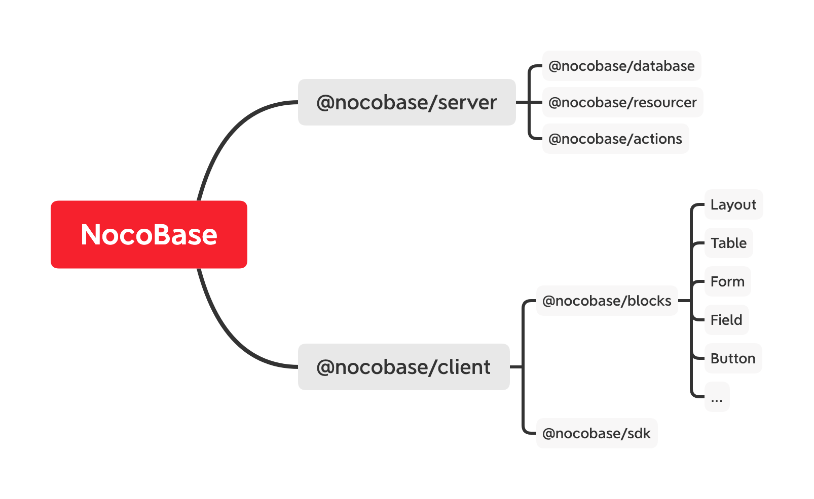

# 介绍

NocoBase 核心主要围绕三点：

- 数据的存储 —— 结构和关系
- 数据的行为 —— 操作和事件
- 数据的形态 —— 页面和区块

由此构建了

- @nocobase/database：提供灵活且强大的数据库构造器
- @nocobase/resourcer：为数据提供资源操作方法
- @nocobase/blocks：为数据提供的 UI 模块

更近一步

- @nocobase/database 和 @nocobase/resourcer 组装成了 @nocobase/server，也就是最核心的 NocoBase
- @nocobase/blocks 是前端最重要部分，提供了现代化的 Block-styled Editor/Renderer

## 数据的存储 —— 结构和关系

## 数据的行为 —— 操作和事件

## 数据的形态 —— 页面和区块