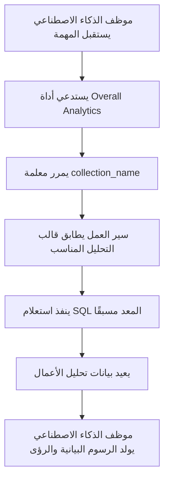

# الأدوار والصلاحيات

## مقدمة

تتضمن إدارة صلاحيات موظفي الذكاء الاصطناعي مستويين:

1.  **صلاحيات وصول موظف الذكاء الاصطناعي**: التحكم في المستخدمين الذين يمكنهم استخدام موظفي الذكاء الاصطناعي.
2.  **صلاحيات الوصول إلى البيانات**: كيفية تطبيق موظفي الذكاء الاصطناعي لضوابط الصلاحيات عند معالجة البيانات.

يوضح هذا المستند بالتفصيل طرق إعداد هذين النوعين من الصلاحيات ومبادئ عملهما.

---

## إعداد صلاحيات وصول موظفي الذكاء الاصطناعي

### تحديد موظفي الذكاء الاصطناعي المتاحين للأدوار

انتقل إلى صفحة `User & Permissions`، ثم انقر على علامة التبويب `Roles & Permissions` للدخول إلى صفحة إعداد الدور.


اختر دورًا، ثم انقر على علامة التبويب `Permissions`، وبعد ذلك انقر على علامة التبويب `AI employees`. ستظهر هنا قائمة موظفي الذكاء الاصطناعي التي تتم إدارتها ضمن إضافة موظفي الذكاء الاصطناعي.

انقر على مربع الاختيار في عمود `Available` بقائمة موظفي الذكاء الاصطناعي للتحكم فيما إذا كان الدور الحالي يمكنه الوصول إلى موظف الذكاء الاصطناعي هذا.


---
:::tip إشعار الترجمة بالذكاء الاصطناعي
تمت ترجمة هذه الوثائق تلقائيًا بواسطة الذكاء الاصطناعي.
:::


## صلاحيات الوصول إلى البيانات

عند معالجة موظفي الذكاء الاصطناعي للبيانات، تعتمد طريقة التحكم في الصلاحيات على نوع الأداة المستخدمة:

### أدوات استعلام البيانات المضمنة في النظام (تتبع صلاحيات المستخدم)

تقوم الأدوات التالية بالوصول إلى البيانات **بشكل صارم وفقًا لصلاحيات بيانات المستخدم الحالي**:

| اسم الأداة                            | الوصف                     |
| ------------------------------------ | ------------------------------- |
| **Data source query**                | استعلام قاعدة البيانات باستخدام مصدر البيانات، المجموعة، والحقول |
| **Data source records counting**     | عد إجمالي السجلات باستخدام مصدر البيانات، المجموعة، والحقول |

**آلية العمل:**

عندما يستدعي موظفو الذكاء الاصطناعي هذه الأدوات، يقوم النظام بما يلي:
1.  تحديد هوية المستخدم الحالي المسجل دخوله.
2.  تطبيق قواعد الوصول إلى البيانات التي تم إعدادها لذلك المستخدم في **الأدوار والصلاحيات**.
3.  إرجاع البيانات التي يملك المستخدم صلاحية عرضها فقط.

**سيناريو مثال:**

لنقل أن مندوب المبيعات "أ" يمكنه فقط عرض بيانات العملاء المسؤول عنها. عندما يستخدم موظف الذكاء الاصطناعي Viz لتحليل العملاء:
-   يستدعي Viz أداة `Data source query` للاستعلام عن جدول العملاء.
-   يطبق النظام قواعد تصفية صلاحيات البيانات لمندوب المبيعات "أ".
-   يمكن لـ Viz فقط رؤية وتحليل بيانات العملاء التي يملك مندوب المبيعات "أ" صلاحية الوصول إليها.

هذا يضمن أن **موظفي الذكاء الاصطناعي لا يمكنهم تجاوز حدود وصول المستخدم نفسه إلى البيانات**.

---

### أدوات الأعمال المخصصة لسير العمل (منطق صلاحيات مستقل)

أدوات استعلام الأعمال المخصصة من خلال سير العمل، يكون التحكم في صلاحياتها **مستقلاً عن صلاحيات المستخدم**، ويتم تحديده بواسطة منطق عمل سير العمل.

تُستخدم هذه الأدوات عادةً من أجل:
-   عمليات تحليل الأعمال الثابتة.
-   الاستعلامات التجميعية المعدة مسبقًا.
-   التحليلات الإحصائية عبر حدود الصلاحيات.

#### مثال 1: Overall Analytics (تحليل الأعمال العام)


في عرض CRM التوضيحي، `Overall Analytics` هو محرك تحليل أعمال قائم على القوالب:

| الميزة     | الوصف                                    |
| ------ | ------------------------------------- |
| **طريقة التنفيذ** | يقرأ سير العمل قوالب SQL المعدة مسبقًا وينفذ استعلامات للقراءة فقط              |
| **التحكم في الصلاحيات** | لا يتقيد بصلاحيات المستخدم الحالي، ويُخرج بيانات أعمال ثابتة محددة بواسطة القوالب           |
| **حالات الاستخدام** | يوفر تحليلاً شاملاً موحدًا لكائنات أعمال محددة (مثل العملاء المحتملين، الفرص، العملاء)       |
| **الأمان**  | يتم إعداد ومراجعة جميع قوالب الاستعلام مسبقًا بواسطة المسؤولين، لتجنب إنشاء استعلامات SQL ديناميكيًا        |

**سير العمل:**



**الخصائص الرئيسية:**
-   يحصل أي مستخدم يستدعي هذه الأداة على **نفس المنظور التجاري**.
-   يتم تحديد نطاق البيانات بواسطة منطق الأعمال، ولا يتم تصفيتها بواسطة صلاحيات المستخدم.
-   مناسبة لتقديم تقارير تحليل أعمال موحدة.

#### مثال 2: SQL Execution (أداة تحليل متقدمة)


في عرض CRM التوضيحي، `SQL Execution` هي أداة أكثر مرونة ولكنها تتطلب تحكمًا صارمًا:

| الميزة     | الوصف                                    |
| ------ | ------------------------------------- |
| **طريقة التنفيذ** | يسمح للذكاء الاصطناعي بإنشاء وتنفيذ عبارات SQL                    |
| **التحكم في الصلاحيات** | يتحكم سير العمل في من يمكنه الوصول، وعادة ما يقتصر على المسؤولين فقط                  |
| **حالات الاستخدام** | تحليل البيانات المتقدم، الاستعلامات الاستكشافية، التحليل التجميعي عبر الجداول                  |
| **الأمان**  | يتطلب تقييد عمليات القراءة فقط (SELECT) في سير العمل، والتحكم في التوفر من خلال إعدادات المهمة   |

**توصيات الأمان:**

1.  **تقييد النطاق**: يتم التمكين فقط في المهام ضمن كتل الإدارة.
2.  **قيود المطالبة**: تحديد نطاق الاستعلام وأسماء الجداول بوضوح في مطالبات المهمة.
3.  **التحقق من سير العمل**: التحقق من عبارات SQL في سير العمل لضمان تنفيذ عمليات SELECT فقط.
4.  **سجلات التدقيق**: تسجيل جميع عبارات SQL المنفذة لتسهيل التتبع.

**مثال على الإعداد:**

```markdown
قيود مطالبة المهمة:
- يمكن فقط استعلام الجداول المتعلقة بـ CRM (leads, opportunities, accounts, contacts)
- يمكن تنفيذ استعلامات SELECT فقط
- النطاق الزمني يقتصر على آخر سنة واحدة
- النتائج المعادة لا تتجاوز 1000 سجل
```

---

## توصيات تصميم الصلاحيات

### اختيار استراتيجية الصلاحيات حسب سيناريو العمل

| سيناريو العمل         | نوع الأداة الموصى به         | استراتيجية الصلاحيات         | السبب                   |
| ------------ | -------------- | ------------ | -------------------- |
| مندوب المبيعات يعرض عملاءه  | أدوات الاستعلام المضمنة في النظام       | تتبع صلاحيات المستخدم       | تضمن عزل البيانات وحماية أمان الأعمال        |
| مدير القسم يعرض بيانات الفريق   | أدوات الاستعلام المضمنة في النظام       | تتبع صلاحيات المستخدم       | تطبيق نطاق بيانات القسم تلقائيًا           |
| المدير التنفيذي يعرض تحليل الأعمال العالمي   | أدوات سير العمل المخصصة / Overall Analytics       | منطق عمل مستقل       | توفر منظورًا شاملاً موحدًا           |
| محلل البيانات يستكشف الاستعلامات   | SQL Execution  | تقييد صارم للكائنات المتاحة     | تتطلب مرونة، ولكن يجب التحكم في نطاق الوصول      |
| المستخدمون العاديون يعرضون التقارير القياسية   | Overall Analytics | منطق عمل مستقل       | معايير تحليل ثابتة، لا داعي للقلق بشأن الصلاحيات الأساسية      |

### استراتيجية الحماية متعددة الطبقات

لسيناريوهات الأعمال الحساسة، يوصى بتبني تحكم متعدد الطبقات في الصلاحيات:

1.  **طبقة وصول موظف الذكاء الاصطناعي**: التحكم في الأدوار التي يمكنها استخدام موظف الذكاء الاصطناعي هذا.
2.  **طبقة رؤية المهام**: التحكم في عرض المهام من خلال إعدادات الكتل.
3.  **طبقة ترخيص الأداة**: التحقق من هوية المستخدم وصلاحياته في سير العمل.
4.  **طبقة الوصول إلى البيانات**: التحكم في نطاق البيانات من خلال صلاحيات المستخدم أو منطق الأعمال.

**مثال:**

```
السيناريو: قسم المالية فقط يمكنه استخدام الذكاء الاصطناعي للتحليل المالي

- صلاحيات موظف الذكاء الاصطناعي: دور المالية فقط يمكنه الوصول إلى موظف الذكاء الاصطناعي "Finance Analyst"
- إعدادات المهمة: مهام التحليل المالي تظهر فقط في وحدات المالية
- تصميم الأداة: أداة سير عمل المالية تتحقق من قسم المستخدم
- صلاحيات البيانات: صلاحيات الوصول إلى الجداول المالية تُمنح لدور المالية فقط
```

---

## الأسئلة الشائعة

### س: ما هي البيانات التي يمكن لموظفي الذكاء الاصطناعي الوصول إليها؟

**ج:** يعتمد ذلك على نوع الأداة المستخدمة:
-   **أدوات الاستعلام المضمنة في النظام**: يمكنها فقط الوصول إلى البيانات التي يملك المستخدم الحالي صلاحية عرضها.
-   **أدوات سير العمل المخصصة**: يتم تحديدها بواسطة منطق عمل سير العمل، وقد لا تكون مقيدة بصلاحيات المستخدم.

### س: كيف يمكن منع موظفي الذكاء الاصطناعي من تسريب البيانات الحساسة؟

**ج:** من خلال تبني حماية متعددة الطبقات:
1.  إعداد صلاحيات وصول دور موظف الذكاء الاصطناعي، لتقييد من يمكنه استخدامه.
2.  بالنسبة للأدوات المضمنة في النظام، الاعتماد على صلاحيات بيانات المستخدم للتصفية التلقائية.
3.  بالنسبة للأدوات المخصصة، تطبيق التحقق من منطق الأعمال في سير العمل.
4.  العمليات الحساسة (مثل SQL Execution) يجب أن تُمنح صلاحيتها للمسؤولين فقط.

### س: ماذا لو أردت أن يتجاوز بعض موظفي الذكاء الاصطناعي قيود صلاحيات المستخدم؟

**ج:** استخدم أدوات الأعمال المخصصة لسير العمل:
-   إنشاء سير عمل لتنفيذ منطق استعلام أعمال محدد.
-   التحكم في نطاق البيانات وقواعد الوصول في سير العمل.
-   إعداد الأدوات لاستخدامها من قبل موظفي الذكاء الاصطناعي.
-   التحكم في من يمكنه استدعاء هذه الإمكانية من خلال صلاحيات وصول موظف الذكاء الاصطناعي.

### س: ما الفرق بين Overall Analytics و SQL Execution؟

**ج:**

| معيار المقارنة   | Overall Analytics   | SQL Execution     |
| ------ | ------------------- | ----------------- |
| المرونة    | منخفضة (يمكن استخدام القوالب المعدة مسبقًا فقط)        | عالية (يمكن إنشاء استعلامات ديناميكيًا)        |
| الأمان    | عالٍ (جميع الاستعلامات مراجعة مسبقًا)         | متوسط (يتطلب قيودًا وتحققًا)        |
| المستخدمون المستهدفون   | مستخدمو الأعمال العاديون              | المسؤولون أو المحللون المتقدمون        |
| تكلفة الصيانة   | تحتاج إلى صيانة قوالب التحليل            | لا تحتاج إلى صيانة، ولكن تتطلب مراقبة       |
| اتساق البيانات  | قوي (مقاييس موحدة)            | ضعيف (قد تكون نتائج الاستعلام غير متسقة)      |

---

## أفضل الممارسات

1.  **الالتزام بصلاحيات المستخدم افتراضيًا**: ما لم تكن هناك حاجة عمل واضحة، يجب إعطاء الأولوية لاستخدام أدوات النظام المضمنة التي تتبع صلاحيات المستخدم.
2.  **التحليل القياسي القائم على القوالب**: لسيناريوهات التحليل الشائعة، استخدم نمط Overall Analytics لتوفير إمكانيات موحدة.
3.  **التحكم الصارم في الأدوات المتقدمة**: يجب ترخيص الأدوات ذات الصلاحيات العالية مثل SQL Execution لعدد قليل من المسؤولين فقط.
4.  **عزل على مستوى المهمة**: إعداد المهام الحساسة في كتل محددة، وتطبيق العزل من خلال صلاحيات الوصول إلى الصفحة.
5.  **التدقيق والمراقبة**: تسجيل سلوك وصول موظفي الذكاء الاصطناعي إلى البيانات، ومراجعة العمليات غير الطبيعية بانتظام.