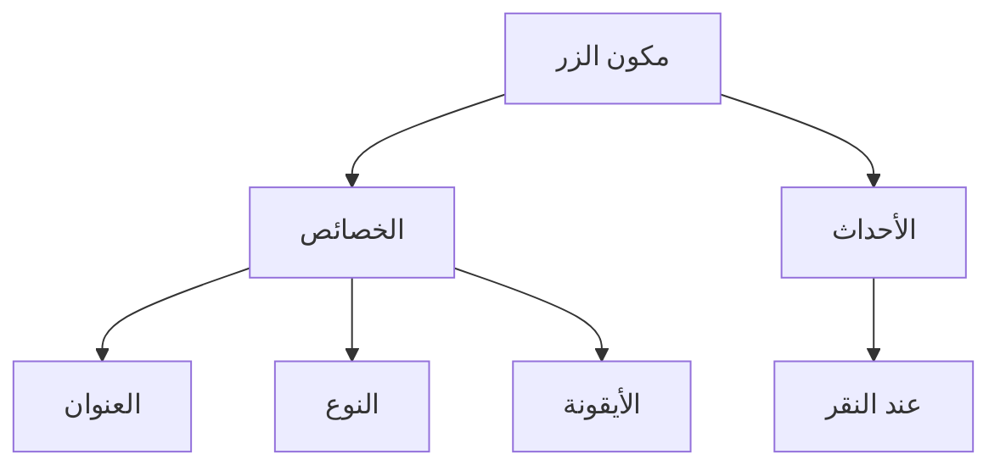
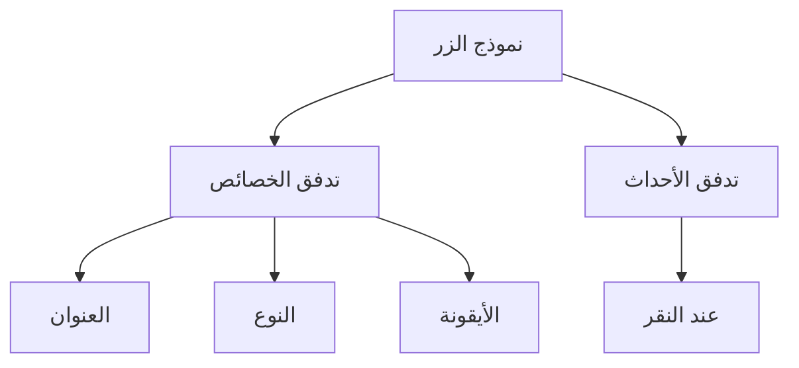

# البدء السريع: بناء مكون زر قابل للتنظيم

في React، عادةً ما نقوم بعرض مكون زر بهذه الطريقة:

```tsx pure
import { Button } from 'antd';

export default function App() {
  return <Button type="primary">Primary Button</Button>;
}
```

على الرغم من بساطة الكود أعلاه، إلا أنه يعتبر **مكونًا ثابتًا** ولا يمكنه تلبية متطلبات منصات "بدون كود" (no-code) من حيث قابلية التكوين وقدرات التنظيم.

في FlowEngine الخاص بـ NocoBase، يمكننا بناء مكونات تدعم التكوين وتعتمد على الأحداث بسرعة باستخدام **FlowModel + FlowDefinition**، مما يحقق قدرات "بدون كود" (no-code) أكثر قوة.

---

## الخطوة الأولى: عرض المكون باستخدام FlowModel

<code src="./demos/quickstart-1-basic.tsx"></code>

### 🧠 مفاهيم أساسية

- `FlowModel` هو نموذج المكون الأساسي في FlowEngine، ويقوم بتغليف منطق المكون، العرض، وقدرات التكوين.
- يمكن إنشاء نسخة من كل مكون واجهة مستخدم (UI) وإدارته بشكل موحد من خلال `FlowModel`.

### 📌 خطوات التنفيذ

#### 1. إنشاء فئة نموذج مخصصة

```tsx pure
class MyModel extends FlowModel {
  render() {
    return <Button {...this.props} />;
  }
}
```

#### 2. إنشاء نسخة من النموذج

```ts
const model = this.flowEngine.createModel({
  uid: 'my-model',
  use: 'MyModel',
  props: {
    type: 'primary',
    children: 'Primary Button',
  },
});
```

#### 3. العرض باستخدام `<FlowModelRenderer />`

```tsx pure
<FlowModelRenderer model={model} />
```

---
:::tip إشعار الترجمة بالذكاء الاصطناعي
تمت ترجمة هذه الوثائق تلقائيًا بواسطة الذكاء الاصطناعي.
:::


## الخطوة الثانية: إضافة PropsFlow لجعل خصائص الزر قابلة للتكوين

<code src="./demos/quickstart-2-register-propsflow.tsx"></code>

### 💡 لماذا نستخدم PropsFlow؟

يتيح استخدام Flow بدلاً من الخصائص الثابتة (static props) تحقيق ما يلي للخصائص:
- التكوين الديناميكي
- التحرير المرئي
- إعادة تشغيل الحالة واستمراريتها

### 🛠 التعديلات الرئيسية

#### 1. تعريف Flow لخصائص الزر

```tsx pure

const buttonSettings = defineFlow({
  key: 'buttonSettings',
  
  title: 'إعدادات الزر',
  steps: {
    setProps: {
      title: 'التكوين العام',
      uiSchema: {
        title: {
          type: 'string',
          title: 'عنوان الزر',
          'x-decorator': 'FormItem',
          'x-component': 'Input',
        },
        type: {
          type: 'string',
          title: 'النوع',
          'x-decorator': 'FormItem',
          'x-component': 'Select',
          enum: [
            { label: 'أساسي', value: 'primary' },
            { label: 'افتراضي', value: 'default' },
            { label: 'خطر', value: 'danger' },
            { label: 'متقطع', value: 'dashed' },
            { label: 'رابط', value: 'link' },
            { label: 'نص', value: 'text' },
          ],
        },
        icon: {
          type: 'string',
          title: 'أيقونة',
          'x-decorator': 'FormItem',
          'x-component': 'Select',
          enum: [
            { label: 'بحث', value: 'SearchOutlined' },
            { label: 'إضافة', value: 'PlusOutlined' },
            { label: 'حذف', value: 'DeleteOutlined' },
            { label: 'تعديل', value: 'EditOutlined' },
            { label: 'إعدادات', value: 'SettingOutlined' },
          ],
        },
      },
      defaultParams: {
        type: 'primary',
      },
      // دالة معالج الخطوة، تقوم بتعيين خصائص النموذج
      handler(ctx, params) {
        ctx.model.setProps('children', params.title);
        ctx.model.setProps('type', params.type);
        ctx.model.setProps('icon', params.icon ? React.createElement(icons[params.icon]) : undefined);
      },
    },
  },
});

MyModel.registerFlow(buttonSettings);
```

#### 2. استخدام `stepParams` بدلاً من `props` الثابتة

```diff
const model = this.flowEngine.createModel({
  uid: 'my-model',
  use: 'MyModel',
- props: {
-   type: 'primary',
-   children: 'Primary Button',
- },
+ stepParams: {
+   buttonSettings: {
+     general: {
+       title: 'Primary Button',
+       type: 'primary',
+     },
+   },
+ },
});
```

> ✅ استخدام `stepParams` هو النهج الموصى به في FlowEngine، لأنه يتجنب المشكلات المتعلقة بالبيانات غير القابلة للتسلسل (مثل مكونات React).

#### 3. تمكين واجهة تكوين الخصائص

```diff
- <FlowModelRenderer model={model} />
+ <FlowModelRenderer model={model} showFlowSettings />
```

---

## الخطوة الثالثة: دعم تدفق أحداث الزر (EventFlow)

<code src="./demos/quickstart-3-register-eventflow.tsx"></code>

### 🎯 سيناريو: إظهار مربع حوار تأكيد بعد النقر على الزر

#### 1. الاستماع لحدث `onClick`

إضافة `onClick` بطريقة غير تطفلية

```diff
const myPropsFlow = defineFlow({
  key: 'buttonSettings',
  steps: {
    general: {
      // ... omitted
      handler(ctx, params) {
        // ... omitted
+       ctx.model.setProps('onClick', (event) => {
+         ctx.model.dispatchEvent('click', { event });
+       });
      },
    },
  },
});
```

#### 2. تعريف تدفق الأحداث

```ts
const myEventFlow = defineFlow({
  key: 'clickSettings',
  on: 'click',
  title: 'حدث الزر',
  steps: {
    confirm: {
      title: 'تكوين إجراء التأكيد',
      uiSchema: {
        title: {
          type: 'string',
          title: 'عنوان نافذة التأكيد المنبثقة',
          'x-decorator': 'FormItem',
          'x-component': 'Input',
        },
        content: {
          type: 'string',
          title: 'محتوى نافذة التأكيد المنبثقة',
          'x-decorator': 'FormItem',
          'x-component': 'Input.TextArea',
        },
      },
      defaultParams: {
        title: 'تأكيد الإجراء',
        content: 'لقد نقرت على الزر، هل أنت متأكد؟',
      },
      async handler(ctx, params) {
        // النافذة المنبثقة
        const confirmed = await ctx.modal.confirm({
          title: params.title,
          content: params.content,
        });
        // الرسالة
        await ctx.message.info(`لقد نقرت على الزر، نتيجة التأكيد: ${confirmed ? 'تم التأكيد' : 'تم الإلغاء'}`);
      },
    },
  },
});
MyModel.registerFlow(myEventFlow);
```

**ملاحظات إضافية:**
- يتيح تدفق الأحداث (EventFlow) تكوين سلوك الزر بمرونة من خلال سير عمل، مثل إظهار مربعات الحوار، الرسائل، إجراء استدعاءات API، وما إلى ذلك.
- يمكنك تسجيل تدفقات أحداث مختلفة لأحداث مختلفة (مثل `onClick`، `onMouseEnter`، إلخ) لتلبية متطلبات العمل المعقدة.

#### 3. تكوين معلمات تدفق الأحداث

عند إنشاء النموذج، يمكنك تكوين المعلمات الافتراضية لتدفق الأحداث عبر `stepParams`:

```ts
const model = this.flowEngine.createModel({
  uid: 'my-model',
  use: 'MyModel',
  stepParams: {
    buttonSettings: {
      general: {
        title: 'Primary Button',
        type: 'primary',
      },
    },
    clickSettings: {
      confirm: {
        title: 'تأكيد الإجراء',
        content: 'لقد نقرت على الزر، هل أنت متأكد؟',
      },
    },
  },
});
```

---

## مقارنة النماذج: ReactComponent مقابل FlowModel

لا يغير Flow طريقة تنفيذ المكونات. بل يضيف دعمًا لـ PropsFlow و EventFlow إلى ReactComponent، مما يسمح بتكوين خصائص المكون وأحداثه وتنظيمها بصريًا.


### ReactComponent



### FlowModel



## ملخص

من خلال الخطوات الثلاث المذكورة أعلاه، أكملنا مكون زر يدعم التكوين وتنظيم الأحداث، ويتمتع بالمزايا التالية:

- 🚀 تكوين الخصائص بصريًا (مثل العنوان، النوع، الأيقونة)
- 🔄 يمكن إدارة استجابات الأحداث بواسطة سير عمل (مثل النقر لإظهار نافذة منبثقة)
- 🔧 يدعم التوسعات المستقبلية (مثل المنطق الشرطي، ربط المتغيرات، إلخ)

ينطبق هذا النمط أيضًا على أي مكون واجهة مستخدم (UI)، مثل النماذج والقوائم والمخططات. في FlowEngine الخاص بـ NocoBase، **كل شيء قابل للتنظيم**.