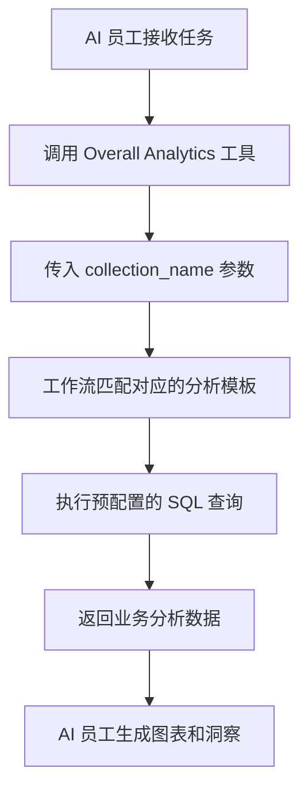

# 角色与权限

## 介绍

AI 员工的权限管理包含两个层面:

1. **AI 员工的访问权限**:控制哪些用户可以使用哪些 AI 员工
2. **数据访问权限**:AI 员工处理数据时如何应用权限控制

本文档将详细说明这两种权限的配置方式和工作原理。

---

## 配置 AI 员工的访问权限

### 设置角色可使用的 AI 员工

进入 `User & Permissions` 页面，点击 `Roles & Permissions` 标签页，进入角色配置页面。


选择一个角色，点击 `Permissions` 标签页，然后点击 `AI employees` 标签页，这里会显示 AI 员工插件中管理的 AI 员工列表。

点击 AI 员工列表 `Available` 列的勾选框，控制当前角色是否可以访问该 AI 员工。


---

## 数据访问权限

当 AI 员工处理数据时，权限控制方式取决于使用的工具类型:

### 系统内置数据查询工具(遵循用户权限)

以下工具会**严格按照当前用户的数据权限**进行数据访问:

| 工具名称                            | 说明                     |
| ------------------------------- | ---------------------- |
| **Data source query**           | 使用数据源、数据表和字段查询数据库      | 
| **Data source records counting** | 使用数据源、数据表和字段统计记录总数     |

**工作原理:**

当 AI 员工调用这些工具时，系统会:
1. 识别当前登录用户的身份
2. 应用该用户在**角色与权限**中配置的数据访问规则
3. 仅返回该用户有权查看的数据

**示例场景:**

假设销售人员 A 只能查看自己负责的客户数据，当他使用 AI 员工 Viz 分析客户时:
- Viz 调用 `Data source query` 查询客户表
- 系统应用销售人员 A 的数据权限过滤规则
- Viz 只能看到并分析销售人员 A 有权访问的客户数据

这确保了 **AI 员工不会突破用户自身的数据访问边界**。

---

### 工作流自定义业务工具(独立权限逻辑)

通过工作流自定义的业务查询工具，其权限控制**独立于用户权限**，由工作流的业务逻辑决定。

这类工具通常用于:
- 固定的业务分析流程
- 预先配置的聚合查询
- 跨权限边界的统计分析

#### 示例 1: Overall Analytics(通用业务分析)


在 CRM Demo 中，`Overall Analytics` 是一个模板化的业务分析引擎:

| 特性     | 说明                                    |
| ------ | ------------------------------------- |
| **实现方式** | 工作流读取预配置的 SQL 模板，执行只读查询              |
| **权限控制** | 不受当前用户权限限制，输出由模板定义的固定业务数据           |
| **适用场景** | 针对特定业务对象(如线索、商机、客户)提供标准化的整体分析       |
| **安全性**  | 所有查询模板由管理员预先配置和审核，避免动态生成 SQL        |

**工作流程:**



**关键特性:**
- 任何调用该工具的用户都会得到**相同的业务视角**
- 数据范围由业务逻辑定义，不受用户权限过滤
- 适合提供标准化的业务分析报表

#### 示例 2: SQL Execution(高级分析工具)


在 CRM Demo 中，`SQL Execution` 是一个更灵活但需要严格控制的工具:

| 特性     | 说明                                    |
| ------ | ------------------------------------- |
| **实现方式** | 允许 AI 生成并执行 SQL 语句                    |
| **权限控制** | 由工作流控制谁可以访问，通常仅限管理员                  |
| **适用场景** | 高级数据分析、探索性查询、跨表聚合分析                  |
| **安全性**  | 需在工作流中限制只读操作(SELECT)，并通过任务配置控制可用性   |

**安全建议:**

1. **限制可用范围**:仅在管理区块的任务中配置开启
2. **提示词约束**:在任务提示词中明确限定查询范围和表名
3. **工作流验证**:在工作流中验证 SQL 语句，确保仅执行 SELECT 操作
4. **审计日志**:记录所有执行的 SQL 语句，便于追溯

**示例配置:**

```markdown
任务提示词约束:
- 只能查询 CRM 相关表(leads, opportunities, accounts, contacts)
- 只能执行 SELECT 查询
- 时间范围限制在最近 1 年内
- 返回结果不超过 1000 条记录
```

---

## 权限设计建议

### 按业务场景选择权限策略

| 业务场景         | 推荐工具类型         | 权限策略         | 原因                   |
| ------------ | -------------- | ------------ | -------------------- |
| 销售人员查看自己的客户  | 系统内置查询工具       | 遵循用户权限       | 确保数据隔离，保护业务安全        |
| 部门经理查看团队数据   | 系统内置查询工具       | 遵循用户权限       | 自动应用部门数据范围           |
| 高管查看全局业务分析   | 工作流自定义工具 / Overall Analytics       | 独立业务逻辑       | 提供标准化的整体视角           |
| 数据分析师探索性查询   | SQL Execution  | 严格限制可用对象     | 需要灵活性，但必须控制访问范围      |
| 普通用户查看标准报表   | Overall Analytics | 独立业务逻辑       | 固定分析口径，无需关心底层权限      |

### 多层防护策略

对于敏感业务场景，建议采用多层权限控制:

1. **AI 员工访问层**:控制哪些角色可以使用该 AI 员工
2. **任务可见性层**:通过区块配置控制任务是否显示
3. **工具授权层**:在工作流中验证用户身份和权限
4. **数据访问层**:通过用户权限或业务逻辑控制数据范围

**示例:**

```
场景:只有财务部门可以使用 AI 进行财务分析

- AI 员工权限:仅财务角色可访问 "Finance Analyst" AI 员工
- 任务配置:财务分析任务仅在财务模块显示
- 工具设计:财务工作流工具验证用户部门
- 数据权限:财务表的访问权限仅授予财务角色
```

---

## 常见问题

### Q: AI 员工能访问哪些数据?

**A:** 取决于使用的工具类型:
- **系统内置查询工具**:只能访问当前用户有权限查看的数据
- **工作流自定义工具**:由工作流的业务逻辑决定，可能不受用户权限限制

### Q: 如何防止 AI 员工泄露敏感数据?

**A:** 采用多层防护:
1. 配置 AI 员工的角色访问权限，限制谁能使用
2. 对于系统内置工具，依赖用户数据权限自动过滤
3. 对于自定义工具，在工作流中实现业务逻辑验证
4. 敏感操作(如 SQL Execution)仅授权给管理员

### Q: 我想让某些 AI 员工突破用户权限限制怎么办?

**A:** 使用工作流自定义业务工具:
- 创建工作流实现特定的业务查询逻辑
- 在工作流中控制数据范围和访问规则
- 将工具配置给 AI 员工使用
- 通过 AI 员工访问权限控制谁可以调用该能力

### Q: Overall Analytics 和 SQL Execution 的区别是什么?

**A:**

| 对比维度   | Overall Analytics   | SQL Execution     |
| ------ | ------------------- | ----------------- |
| 灵活性    | 低(仅能使用预配置模板)        | 高(可动态生成查询)        |
| 安全性    | 高(所有查询预先审核)         | 中(需要约束和验证)        |
| 适用对象   | 普通业务人员              | 管理员或高级分析师        |
| 维护成本   | 需要维护分析模板            | 无需维护，但需要监控       |
| 数据一致性  | 强(标准化口径)            | 弱(查询结果可能不一致)      |

---

## 最佳实践

1. **默认遵循用户权限**:除非有明确的业务需求，优先使用遵循用户权限的系统内置工具
2. **模板化标准分析**:对于常见的分析场景，使用 Overall Analytics 模式提供标准化能力
3. **严格控制高级工具**:SQL Execution 等高权限工具仅授权给少数管理员
4. **任务级别隔离**:将敏感任务配置在特定区块，通过页面访问权限实现隔离
5. **审计与监控**:记录 AI 员工的数据访问行为，定期审查异常操作
