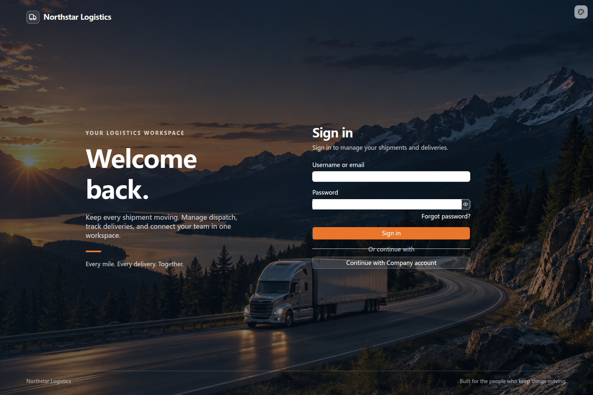

# 定制登录页面

登录页面可以使用应用自己的品牌和业务说明。Logo、标题、宣传内容及登录方式布局都可以调整，认证动作继续复用应用已有能力。

## 示例：运输企业的登录页面

下面为运输企业 Northstar Logistics 定制登录入口，用整页背景、品牌配色和业务文案体现企业风格。向开发 Agent 提出：

```text
请为 Northstar Logistics 的运输管理系统定制登录页。

使用卡车行驶在山路上的照片作为整页背景，配上深蓝色遮罩，保证文字清晰。
顶部显示公司名称和图标。左侧显示「欢迎回来」，
并说明系统可以管理运输调度、跟踪配送进度、协调团队工作。
右侧放置登录表单，使用白色文字、白色输入框和橙色登录按钮。

保留账号密码登录、企业账号登录和忘记密码入口。
账号由管理员统一创建，不显示自助注册入口。
复用现有登录逻辑，登录成功后进入应用首页。
```

如果已有应用 Logo，可以一并提供文件；多个主题需要不同图片时，说明各图片对应的使用场景。

## 查看效果

打开登录页，可以看到卡车与山路的整页背景、公司品牌和运输业务说明。登录表单直接放在背景上，白色文字与橙色按钮形成清晰的视觉层次。页面的背景、配色、内容布局都可以按企业需求调整。



点击登录按钮后的认证过程与定制前一致。更换品牌、标题和布局，不需要重新实现账号登录或会话。

## 展示多种登录方式

可以按应用需要排列不同方式：

```text
登录页保留账号密码表单，在下方增加「企业账号登录」按钮。
将默认方式设为账号密码，企业账号登录使用已经接入的身份平台。
```

如果希望使用企业账号或第三方账号登录，需要先完成[增加认证方式](./sign-in-methods)中的接入。这里负责入口的展示与布局，放置按钮不会自动接通身份平台。

## 进一步调整

登录、注册和密码相关页面在应用的 `client/pages/auth/` 中，表单和布局组件在 `client/extensions/` 中。开发 Agent 可以在应用内修改这些文件，无需修改认证插件。

登录后的跳转目标也可以按业务调整，例如销售人员进入客户列表，采购人员进入待办订单。关闭注册、调整密码要求和密码找回的业务规则见[密码认证](../methods/password)。
