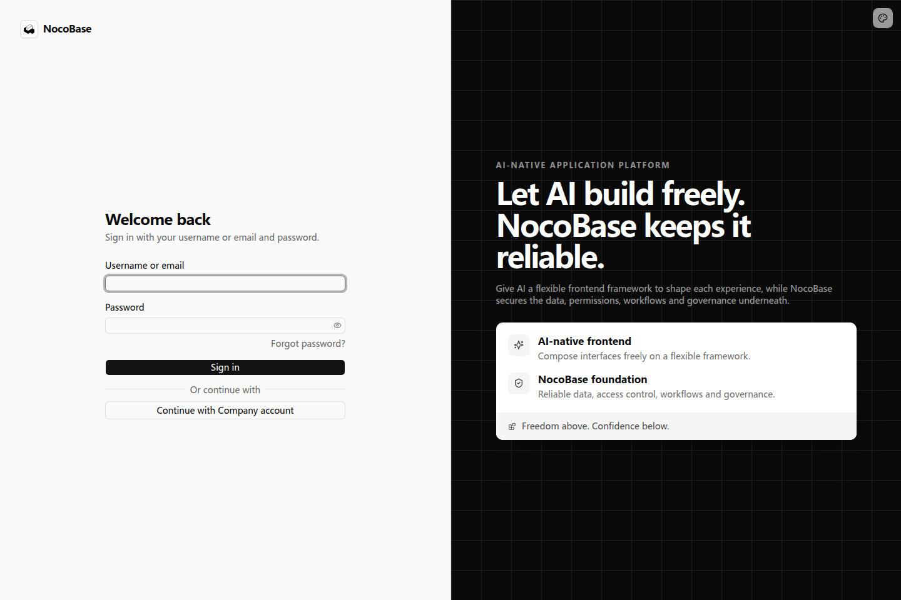
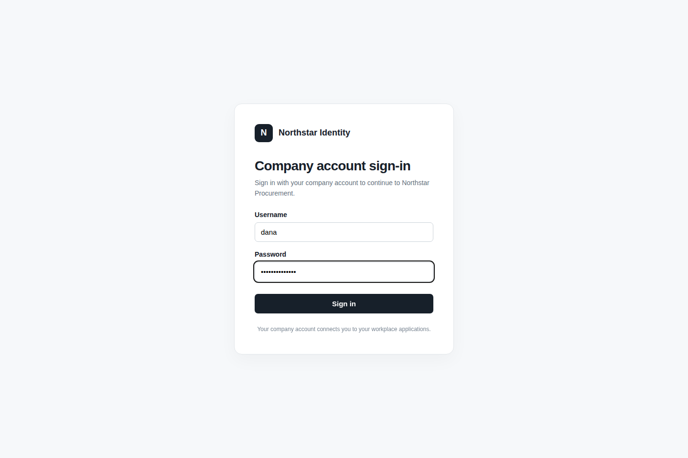
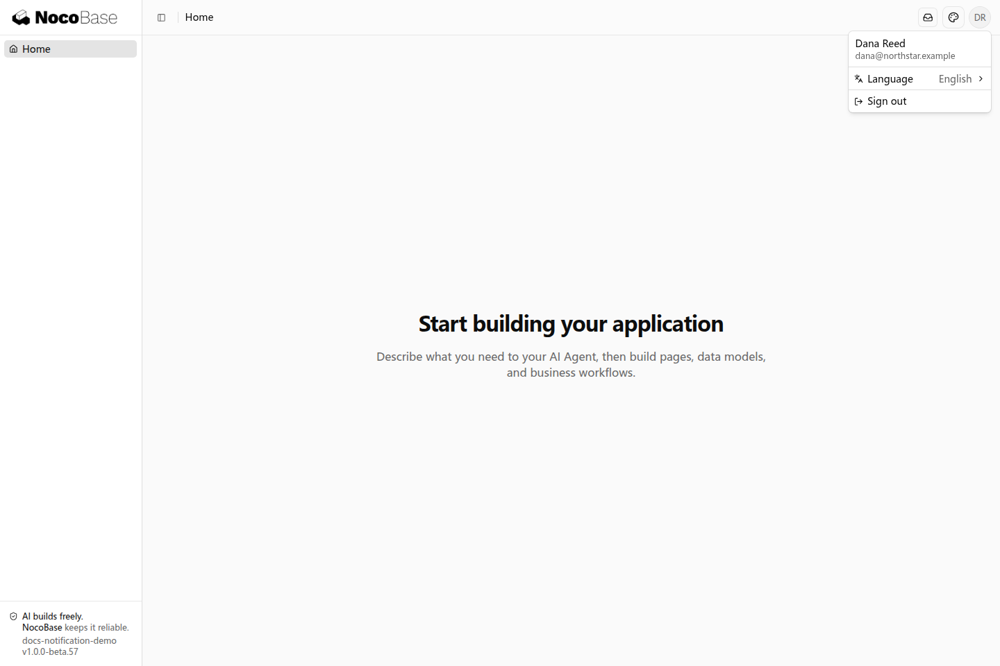

# 增加认证方式

除了账号密码，应用还可以使用已有身份平台完成登录。用户在身份平台验证账号后返回应用，应用建立自己的会话，继续使用已有业务权限。

## 可以接入哪些方式

| 需求                                       | 接入方式                                                       | 需要准备                           |
| ------------------------------------------ | -------------------------------------------------------------- | ---------------------------------- |
| 使用 GitHub、Google 等账号登录             | Better Auth 已支持的平台配置                                   | 平台应用信息与回调地址             |
| 使用公司统一账号登录                       | 标准 OAuth 2.0 或 OIDC 接入，例如 Keycloak、Microsoft Entra ID | 身份平台地址、应用信息与账号规则   |
| 使用钉钉、飞书等平台账号登录               | 按平台的授权和用户信息接口接入                                 | 开放平台应用、登录权限与回调地址   |
| 邮箱验证码、登录链接、Passkey 或双因素认证 | 对应认证扩展                                                   | 所选方式需要的邮件服务、页面及存储 |
| 使用公司内部的 ticket 或签名协议           | 自定义认证扩展                                                 | 协议文档、验证接口与用户标识       |

这些方式需要在应用中接入，并非默认模板已开启的登录入口。开发 Agent 根据应用使用的 Better Auth 版本及身份平台文档选择合适的实现。

## 接入前准备

身份平台管理员为业务应用创建登录接入，提供应用标识、身份服务地址和所需凭据，并登记应用的回调地址。应用开发人员完成服务端接入和登录入口；凭据由负责配置的人填写到运行环境中。

还需要确定两条账号规则：首次登录是否自动创建应用账号，以及是否允许与已有账号关联。身份平台返回的稳定用户标识用于识别账号，不能仅凭显示名称判断是同一个人。

## 示例：使用企业账号登录

公司已经有统一身份平台，希望员工用企业账号进入采购系统。下面使用 OpenID Connect（OIDC）接入，它是一种标准登录协议。

```text
请让员工使用公司的统一身份平台登录采购系统，采用 OIDC。

保留原有账号密码登录，在登录页增加「企业账号登录」入口。
点击后进入企业身份平台，登录成功后返回采购系统首页。

首次登录允许创建应用账号，以身份平台的稳定用户标识识别用户。
不要根据同名或相同邮箱自动关联已有账号，新账号沿用应用默认权限。

请列出身份平台管理员需要提供的信息，以及需要登记的回调地址。
```

开发 Agent 会给出身份平台需要登记的回调地址，以及应用需要的配置项。身份平台与应用两侧的地址应保持一致；应用的公网地址和部署子路径也需要与实际访问地址一致。

### 登录过程

**第一步：点击企业账号登录。**

打开应用登录页，在账号密码表单下方点击 Continue with Company account。



**第二步：在身份平台登录。**

浏览器进入企业身份平台的登录页，输入企业账号完成登录。



**第三步：返回应用。**

登录成功后自动回到采购系统。右上角用户菜单显示企业账号对应的用户身份，之后通过应用会话访问业务页面。



## 其他接入示例

### GitHub 登录

```text
请为当前应用增加 GitHub 登录，保留账号密码登录。
首次登录可以创建应用账号，不根据相同邮箱自动合并已有账号。
登录成功后进入首页。
请告诉我需要在 GitHub 创建什么应用、提供哪些配置，以及回调地址填什么。
```

由 GitHub 应用负责人创建 OAuth 应用并登记回调地址，应用开发人员接入登录按钮与回调流程。完整配置细节参见 [Better Auth 的 GitHub 指南](https://www.better-auth.com/docs/authentication/github)。

### 公司内部登录协议

```text
公司门户会带着一次性 ticket 跳转到本应用。
请按照提供的协议文档，调用门户验证接口取得用户身份，再完成应用登录。
使用门户返回的稳定用户标识识别账号，首次登录不自动创建账号。
保留原有账号密码登录，登录成功后进入首页。
```

提供门户协议文档和演示账号，并明确如何关联应用中的已有账号。开发 Agent 通过认证扩展接入协议，最终仍由应用的认证能力建立会话。

## 进一步使用

账号首次登录、绑定及退出规则可以按业务调整。例如，企业账号必须先由管理员分配后才能登录，或者退出应用时还要退出身份平台。这些规则应在接入需求中说明。

根据所选认证方式，接入时可能需要保存身份平台的用户标识，或补充账号绑定等页面。这些内容由开发 Agent 随登录流程一起完成。
