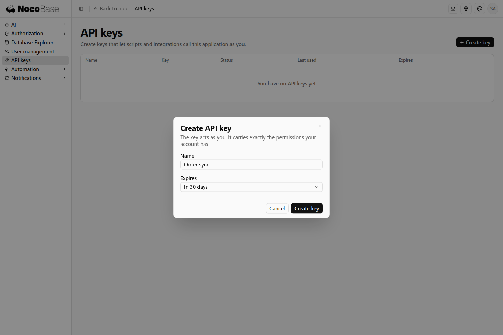
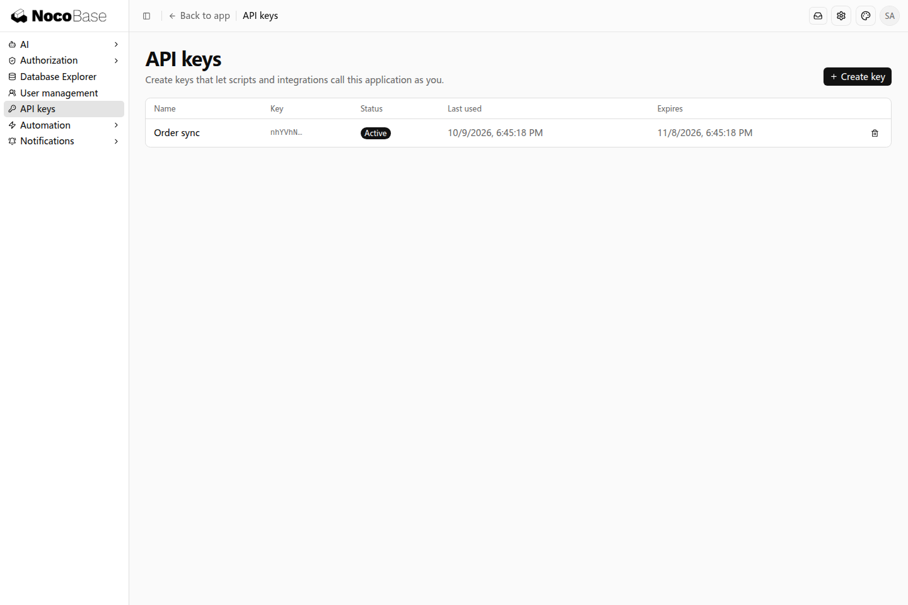

# API keys

API key 用于让脚本、定时任务或外部系统调用应用接口，无需在浏览器中登录。默认配置下，Key 代表创建它的用户，使用该用户已有的权限。

例如，采购系统每天将订单同步到其他系统，可以为执行同步的账号创建一个 Key，让同步程序读取该账号可访问的订单。

## 创建 Key

用需要执行接口调用的账号登录应用，在「设置 → API keys」中点击 Create key。填写便于识别用途的名称，例如 `Order sync`，并选择有效期。



创建后页面只显示一次完整 Key，复制并保存到调用程序的运行环境中。之后列表仅显示用于辨认的片段，无法重新取回完整值。

账号需要具有 API keys 页面的访问权限；如果没有这个设置入口，由应用管理员为相应角色分配访问权限。

## 查看和撤销

创建的 Key 会显示在列表中，可以查看名称、状态、有效期和最近使用时间。



不再使用时，点击对应记录的撤销按钮并确认。撤销后，这个 Key 不能继续调用接口；需要再次接入时重新创建。

Key 不会增加用户权限。使用权限合适的业务账号创建 Key；账号被禁用时，该账号的 Key 也不能继续用于访问。

## 示例：用脚本拉取订单

下面以采购应用的订单列表为例。先将创建的 Key 保存到脚本运行环境的 `NOCOBASE_API_KEY` 变量中，再向开发 Agent 提出：

```text
我的 API key 已保存在环境变量 NOCOBASE_API_KEY 中。
请写一个 Python 脚本，调用采购应用的订单接口，拉取这个账号有权访问的所有订单并输出结果。
应用地址是 http://localhost:13000/main，订单接口是 /api/orders。
从环境变量读取 Key，不把它写进脚本。
```

Agent 生成的脚本从环境变量读取 Key，将它放入请求头 `x-api-key`，再向订单接口发送请求。本例的脚本可以写成：

```python
import json
import os
from urllib.request import Request, urlopen

request = Request(
    "http://localhost:13000/main/api/orders",
    headers={"x-api-key": os.environ["NOCOBASE_API_KEY"]},
)
with urlopen(request) as response:
    result = json.load(response)

print(json.dumps(result, ensure_ascii=False, indent=2))
```

将脚本保存为 `fetch_orders.py`，在已设置环境变量的终端运行 `python3 fetch_orders.py`。请求成功后，脚本输出该账号可访问的订单数据，例如：

```json
{
  "data": [
    {
      "number": "PO-2026-001",
      "title": "Office equipment purchase",
      "status": "approved"
    }
  ]
}
```

上面节选了订单数据中的一条记录和部分字段。使用自己的应用时，将提示词中的地址和接口路径换成实际值；如果订单接口分页返回数据，让 Agent 按接口的分页方式拉取全部订单。
