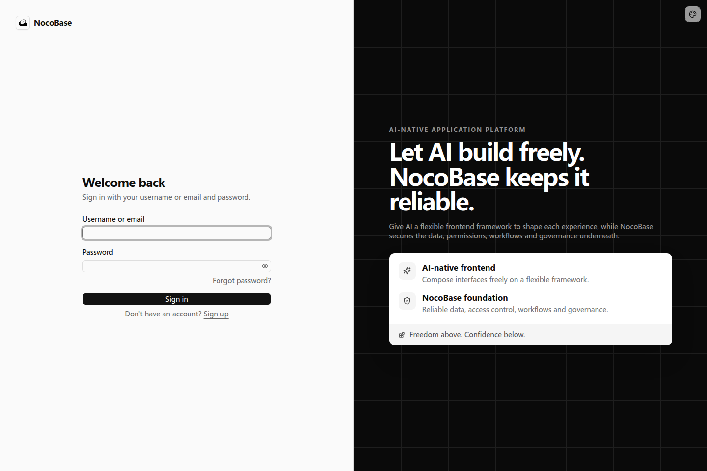

# 密码认证

密码认证让用户使用用户名或邮箱和密码登录应用。默认应用模板提供登录、注册、忘记密码和重置密码页面，登录后通过会话保持当前用户身份。

## 登录和退出

打开应用，在登录页输入账号和密码，点击 Sign in。新建应用的初始管理员账号以创建应用时的配置为准。



登录成功后进入应用。需要退出时，打开右上角的用户菜单，点击 Sign out。下次访问需要登录的页面时，重新登录即可。

## 关闭自助注册

内部业务系统通常由管理员统一创建员工账号。可以将下面的需求交给开发 Agent：

```text
这个应用只供公司员工使用，账号由管理员统一创建。
请关闭自助注册，登录页不再显示注册入口。
已有员工仍能使用原账号和密码登录，保留忘记密码入口。
```

完成后，登录页不再显示 Sign up；管理员仍可通过用户管理创建账号。关闭注册既涉及服务端注册规则，也涉及页面入口，不能仅隐藏一个链接。


## 调整密码要求

可以按业务需要调整新密码的要求。例如：

```text
新注册和重置密码时，密码至少需要 12 个字符。
在注册和重置密码表单中显示这条要求，并使用一致的校验提示。
保留已有账号的登录能力，已有用户无需立即修改密码。
```

这类调整由开发 Agent 接入应用的认证配置及表单。用户设置新密码时，按照页面提示填写即可。

## 邮箱验证

如果需要确认注册邮箱属于当前用户，可以要求注册后发送验证邮件，再允许用户使用应用：

```text
注册后向用户邮箱发送验证邮件，使用应用已有的邮件通知渠道。
用户完成邮箱验证后才能登录。页面说明下一步需要打开邮箱完成验证。
```

邮箱验证需要可用的邮件渠道，以及认证流程中的验证邮件发送配置。邮件渠道的准备方式见[通知](../../notification#进一步使用邮件和群通知)。应用开发人员负责将发件渠道接入注册验证流程。

## 找回与重置密码

配置好邮件渠道并接入密码找回流程后，用户就可以通过已有的忘记密码和重置密码页面修改密码。可以将下面的需求交给开发 Agent：

```text
请接入忘记密码功能，使用应用已配置的邮件渠道发送重置链接。
用户在登录页点击忘记密码，填写邮箱后收到邮件。
点击邮件中的链接打开本应用的重置密码页，设置新密码后返回登录页。
无论填写的邮箱是否存在，提交后都显示相同的提示。
```

用户点击 Forgot password?，填写邮箱；收到邮件后打开链接，设置新密码，再回到登录页登录。重置链接的有效期和一次性使用由认证流程处理。

## 登录状态

刷新页面时，应用会读取已有会话，无需每次重新输入密码。会话过期后需要重新登录；管理员禁用账号后，该账号不能继续访问需要登录的功能。自定义业务对会话的使用见[保护接口和页面](../advanced/protecting-apis)。
