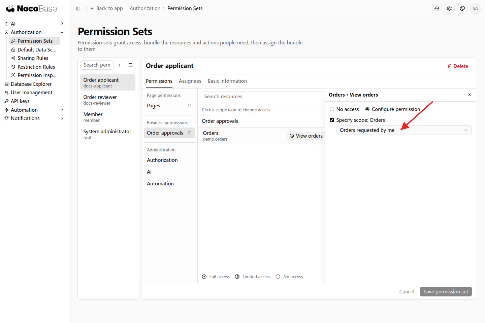

# 数据范围与规则

数据范围决定一项业务操作可以处理哪些记录。同样拥有「查看订单」权限，采购申请人可以只看本人订单，审批人可以查看需要处理的订单。

## 示例：申请人只查看本人订单

```text
采购申请人只查看自己申请的订单，以订单的申请人字段判断归属。
订单审批人可以查看所有订单，处理待审批订单。
管理员可以在权限集中分别调整两个岗位的订单查看范围。
```

Agent 接入订单申请人与当前登录用户的关联，并提供相应范围选项。管理员在采购申请人权限集的业务权限中，为「查看订单」选择本人申请。



Alice 登录后，订单列表显示她申请的记录；Bob 登录后显示他申请的记录。这是同一个订单页面根据当前用户权限返回不同数据。


## 按业务选择范围

| 范围           | 适合的职责                                 |
| -------------- | ------------------------------------------ |
| 本人申请       | 申请人查看自己的订单                       |
| 全部订单       | 负责统筹订单的人员                         |
| 业务条件       | 查看待审批订单、指定金额区间等             |
| 部门或团队范围 | 已接入组织关系的应用，按部门或团队职责访问 |

范围选项由应用的业务接入提供。「本人申请」对应订单申请人，并不一定等于记录创建人。让 Agent 明确使用哪个业务字段即可。

## 进一步使用规则

已有岗位范围可以按协作需要调整：用[默认数据范围](./default-access)提供共同可查阅记录，用[共享规则](./sharing-rules)增加指定同事的协作记录，用[限制规则](./restriction-rules)进一步限定结果。三种规则调整数据范围，页面和操作权限仍由权限集分配。
