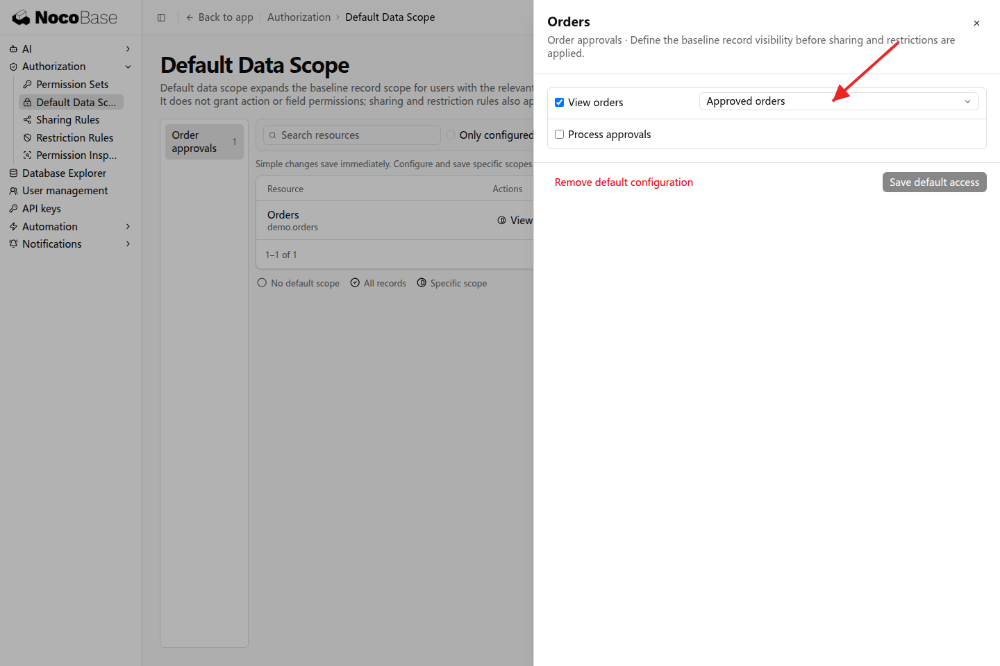
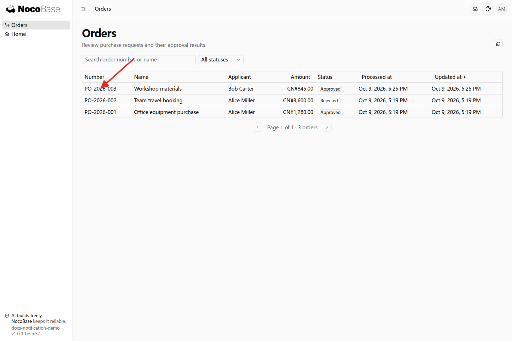

# 默认数据范围

默认数据范围让已经拥有某项操作权限的人，共同访问一部分记录。例如，采购申请人平时查看本人订单，同时可以查阅已批准订单，作为采购参考。

## 示例：共同查阅已批准订单

```text
采购申请人保留查看本人订单的权限。
所有拥有「查看订单」权限的人员，也可以查阅已批准的订单作为采购参考。
将这部分共同可查看的数据配置为默认数据范围，管理员可以在设置中调整。
```

接入后，在「设置 → 权限 → 默认数据范围」中为订单的查看操作配置已批准订单范围。本例只增加查看范围，审批职责保持原样。



### 查看效果

Alice 的列表既包含本人申请的订单，也包含 Bob 已批准的 PO-2026-003。其他已具备订单查看权限的人员同样可以查阅这部分记录。



## 调整共同范围

默认数据范围会与岗位已有范围合并，不会替换本人订单范围。管理员可以修改这部分共同记录的条件；同一个资源的不同操作在同一条默认规则中分别配置。

如果只是让指定人员查阅额外记录，使用[共享规则](./sharing-rules)。共同查看记录的范围与编辑、审批的范围可以分别设置。
