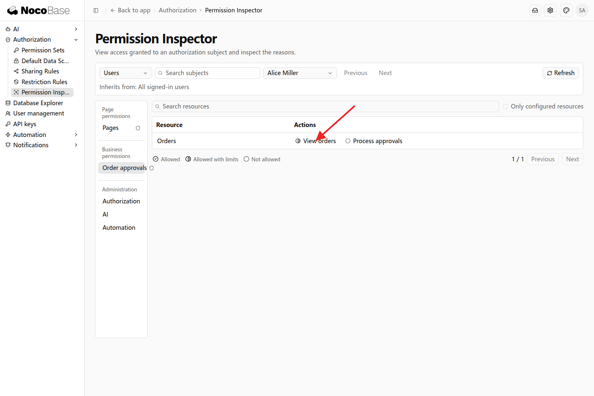
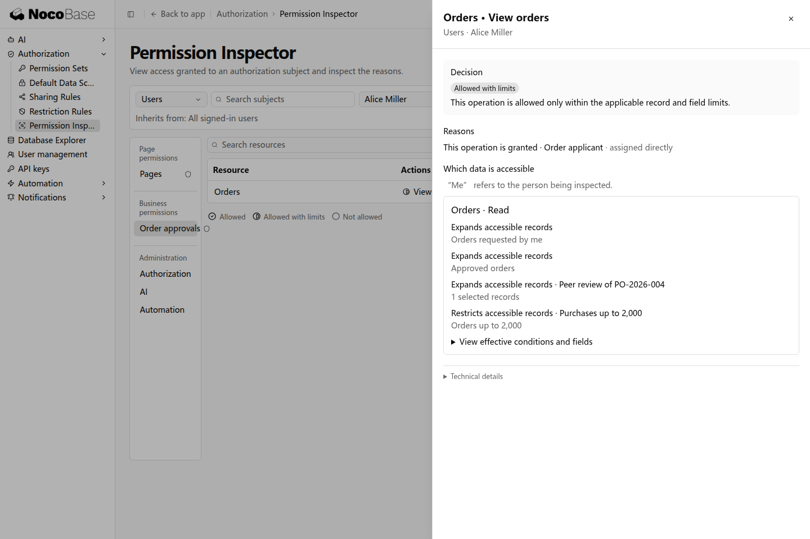

# 检查权限结果

权限检查器帮助管理员了解一个用户有什么权限，以及这些权限来自哪里。例如，Alice 同时拥有岗位权限、共同默认范围和一笔共享订单，可以在检查器中查看它们如何配合。

## 示例：查看 Alice 的订单权限

有检查权限的管理员打开「设置 → 权限 → 权限检查器」，选择用户 Alice Miller，再进入 Order approvals（订单审批）分区，点击 View orders 查看详情。

详情中可以查看权限集、数据范围和规则来源。本例中，采购申请人权限集提供订单查看能力，默认范围允许查阅已批准订单，共享规则增加 PO-2026-004，限制规则保留金额不超过 2,000 的记录。

## 根据来源调整配置

需要改变岗位职责时，调整权限集；增加共同可查看记录时，调整默认数据范围；临时协作时，调整共享规则；金额等范围条件变化时，调整限制规则。检查器用于查看结果，具体修改在相应设置页完成。

检查结果描述授权及条件，不统计实际可访问记录数量。查看某个人的实际权限时选择该用户；选择团队时看到的是分配给团队本身的权限。

超级管理员拥有不受限访问。查看业务岗位的效果时，选择对应员工账号。
