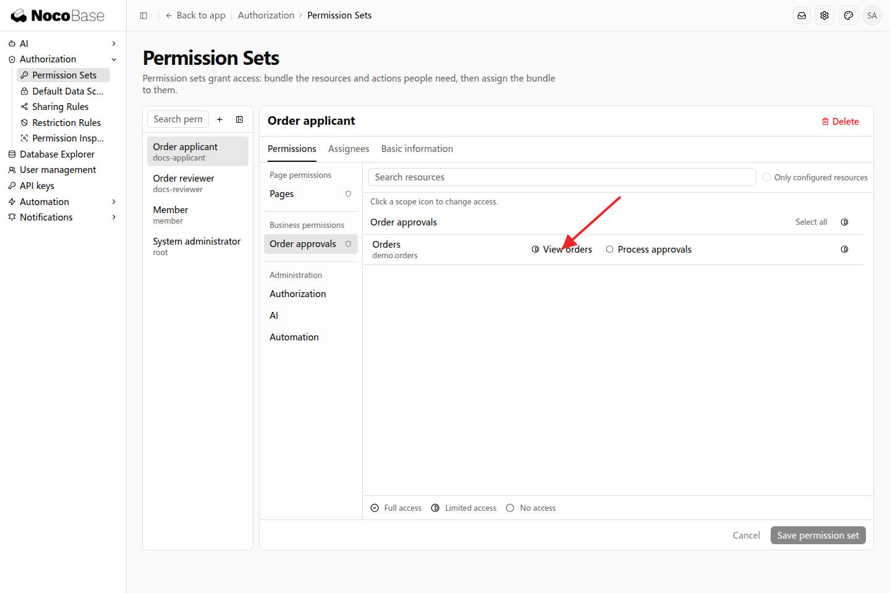
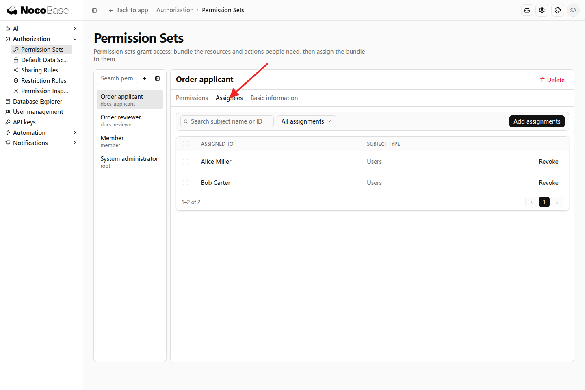
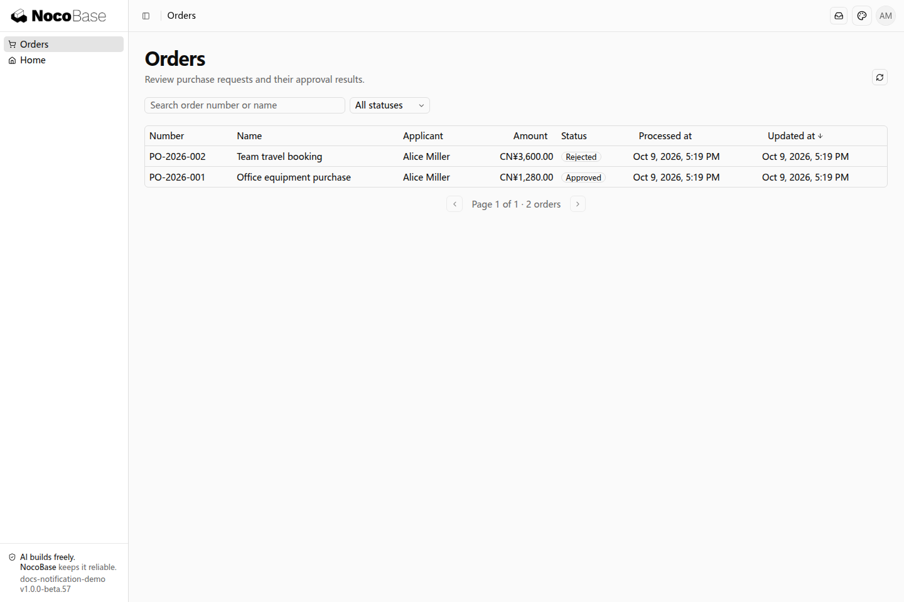
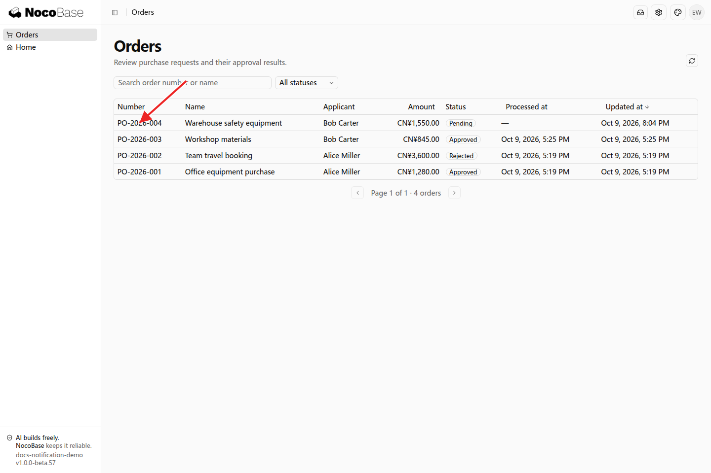
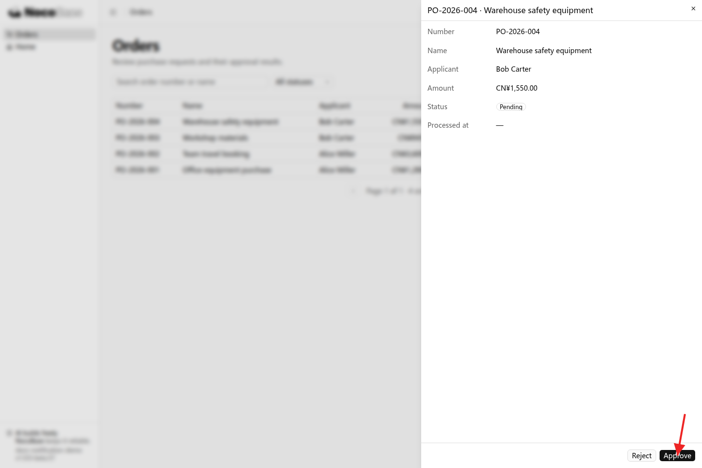

# 权限集与分配

权限集把一组权限组合为可重复分配的岗位职责。例如，采购申请人可以查看本人订单，审批人可以查看订单并处理审批。多个员工担任同一岗位时，可以分配同一个权限集。

## 示例：采购申请人与审批人

采购系统需要两类业务人员。向开发 Agent 提出：

```text
请为采购系统设置「采购申请人」和「订单审批人」两个岗位。
采购申请人可以进入订单页面，查看本人申请的订单。
订单审批人可以进入订单页面，查看订单，并批准或驳回待审批订单。
只有应用管理员可以调整岗位权限和人员分配。
请接入应用已有的权限能力，让管理员以后可以在设置中调整权限和分配人员。
```

接入后，管理员在「设置 → 权限 → 权限集」中打开对应岗位。权限分为三个部分：

| 部分     | 本例中的配置                                 |
| -------- | -------------------------------------------- |
| 页面权限 | 允许进入订单页面                             |
| 业务权限 | 采购申请人查看订单；审批人查看订单、处理审批 |
| 系统管理 | 由管理员维护权限配置，业务岗位按职责分配     |

在业务权限中点击 View orders 旁的范围图标，选择 Orders requested by me（本人申请），再保存配置。审批人的查看范围可以覆盖待处理业务，审批按钮只在订单处于待审批状态时显示。



### 分配人员

在权限集的分配页添加人员。本例将 Alice Miller 和 Bob Carter 分配为采购申请人，将 Emma Wilson 分配为订单审批人。



### 查看岗位效果

Alice 登录后查看本人申请的订单；Emma 登录后查看订单并处理待审批订单。岗位配置决定能做什么，业务状态决定这笔订单当前是否可以审批。





点击待审批的 PO-2026-004 打开详情，Emma 可以使用 Approve 或 Reject 处理订单。



## 调整与复用

管理员可以继续调整权限集，并为新员工分配同一岗位。一个用户可以拥有多个权限集，获得各项职责。团队、部门分配需要应用先接入相应组织及成员关系，接入后可按这些对象批量分配。

默认的成员权限集面向所有登录用户，适合放共同需要的基础能力。日常岗位使用各自权限集；超级管理员用于管理应用。
