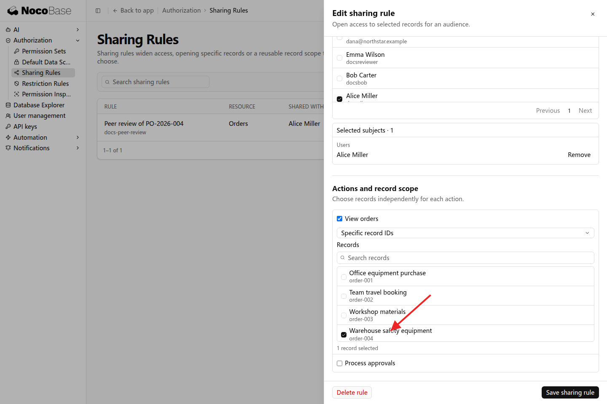
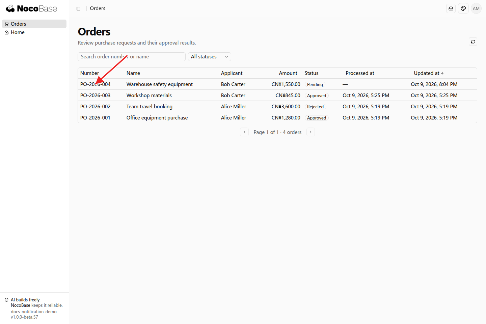

# 共享规则

共享规则用于临时协作或业务交接，为指定人员增加可访问的记录。例如，Bob 请 Alice 帮忙复核一笔采购订单，可以将这笔订单的查看范围共享给 Alice。

## 示例：同事协助复核订单

Alice 已经拥有订单查看权限，平时查看本人订单。现在需要查阅 Bob 的一笔待审批订单：

```text
请将 Bob 的 PO-2026-004 订单共享给 Alice，让她协助复核。
Alice 已有订单查看权限，本次增加这笔订单的查看范围。
保留她原有的岗位职责，审批仍由订单审批人处理。
这项共享需要能由管理员在设置中管理。
```

管理员在「设置 → 权限 → 共享规则」中创建规则，选择订单查看操作、要共享的订单及接收人 Alice。



### 查看效果

Alice 打开订单列表，可以查看 Bob 申请的 PO-2026-004；原有订单仍按既有范围显示。



## 协作结束后

管理员可以调整或删除共享规则。共享补充的是数据范围，接收人仍需要相应的页面和业务操作权限。如果协作需要编辑或审批，应在需求中同时说明这些职责，再配置各项操作的范围。

应用已接入团队或部门时，也可以将规则分配给相应对象，便于管理多人协作。
