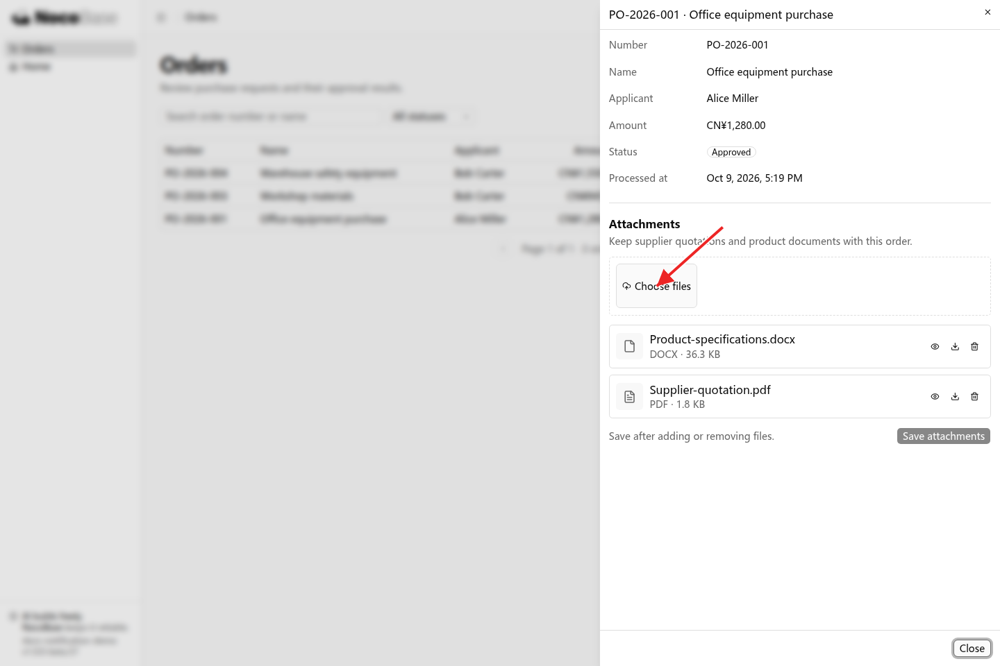
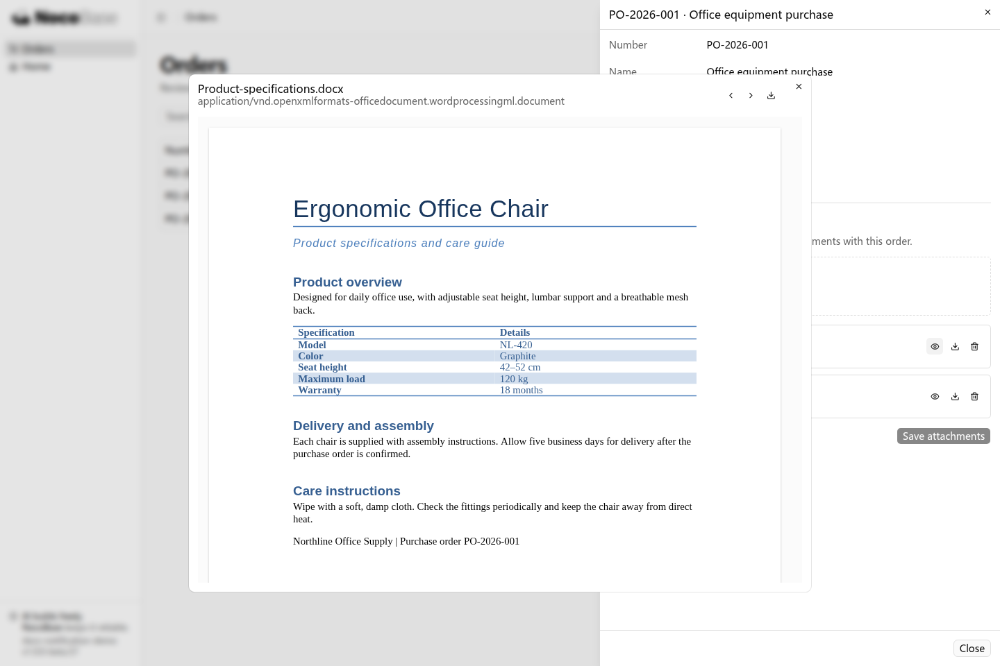
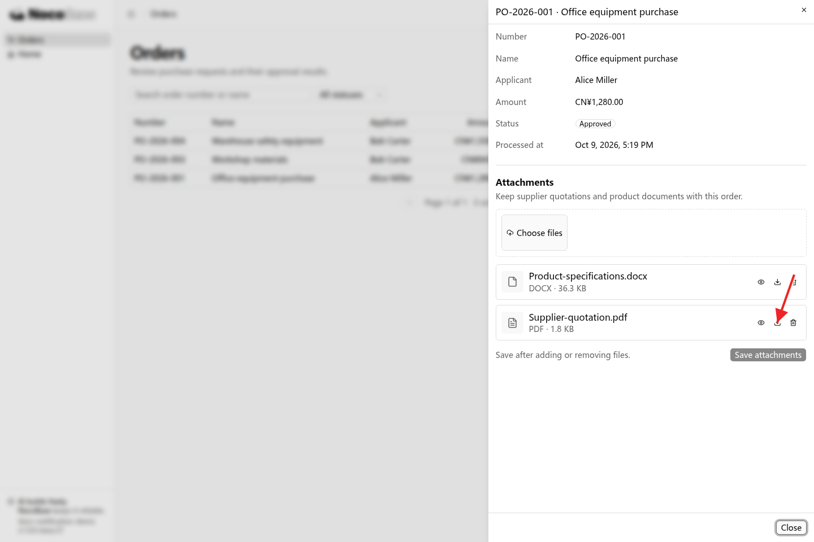

# 文件

NocoBase 3 提供文件上传、预览、下载和存储管理能力，可以为应用添加附件功能和图片存储。附件可以与业务记录关联，方便用户查阅相关资料；图片存储可以用于员工头像、产品图片等场景。

你可以向 Agent 说明文件用于哪项业务、每条记录需要多少个文件，以及谁可以访问，由它接入文件能力和相应页面。

## 接入前准备

本例在已有的订单管理应用中添加附件。准备一条订单，以及用于上传的采购资料，例如供应商报价单和产品说明书。

需要告诉 Agent 的是：附件放在哪个页面、支持哪些格式、谁可以上传和查看，以及移除附件时是否保留文件。

## 示例：给订单添加采购附件

采购人员希望在订单中保存报价单和产品说明书，审批人员查看订单时也能直接查阅这些资料。

```text
给现有订单管理应用增加采购附件功能。

在订单详情中添加附件区域，每个订单可以上传多个文件，支持 PDF、图片和 DOCX。
显示附件的文件名和大小，支持预览、下载和移除。
上传后点击保存，将附件关联到当前订单；重新打开订单时仍能看到这些附件。
有权查看订单的人员可以查看和下载附件，申请人和审批人员可以添加或移除附件。
移除附件只解除它与当前订单的关联，保留文件。
```

### 查看效果

1. 打开订单详情，在附件区域点击 **Choose files**，选择采购资料，然后点击 **Save attachments**。保存后，附件出现在当前订单中；重新打开订单，仍能查看这些文件。



2. 点击附件旁的 **Preview**，直接查看文件内容。



3. 点击 **Download** 下载原文件。点击 **Remove** 并保存，可以从当前订单移除附件。



## 进一步使用

### 员工头像和产品图片

员工头像、产品封面通常只需要一个文件，上传新文件后替换原来的关联。产品相册和订单附件则可以关联多个文件。例如：

```text
给员工增加头像，每名员工最多一张。
支持上传和更换头像，在员工列表和详情中显示。
更换后使用新头像，刷新页面后仍能正常显示。
```

### 文件存储

文件名、大小和业务关联保存在数据库中，实际文件保存在应用配置的存储位置。默认应用使用本地存储，也支持接入 S3 兼容的对象存储。

使用对象存储时，由存储服务管理员准备存储桶、访问地址、区域和访问凭据；应用开发或部署人员将这些信息配置到应用服务端，再让 Agent 为相应业务接入这个存储配置。备份应用时，需要同时备份数据库和实际文件。

切换存储后，新上传的文件使用新的配置。需要搬迁已有文件时，应另外说明迁移范围。

### 附件访问权限

业务附件的访问规则应与所属记录一致。例如，员工只能查看自己可访问订单的附件，审批人员可以查看待处理订单的采购资料。

让 Agent 同时为上传、文件列表、预览和下载接口接入相应的登录与业务权限校验。相关规则见[权限](./authorization/index.md)。

## 开发参考

文件表保存文件信息，实际内容由存储服务管理。Agent 接入时需要保留标准文件字段，并保存业务记录与文件的关联。

<details>
<summary>文件表的标准字段</summary>

| 字段                          | 用途                   |
| ----------------------------- | ---------------------- |
| `id`                          | UUID 文件标识          |
| `disk`、`key`                 | 存储配置名称及文件位置 |
| `filename`、`ext`、`mimeType` | 文件名、扩展名及类型   |
| `size`                        | 文件大小，单位为字节   |
| `createdAt`、`updatedAt`      | 创建与更新时间         |

字段名称固定，上传时由文件能力填写。`contentUrl` 根据文件标识和扩展名生成，无需保存为数据库字段。额外业务字段应允许为空或提供默认值，上传后再保存业务关联。

</details>

## 常见问题

### 哪些文件可以预览？

文件组件支持图片、PDF、文本、Markdown、音频和视频预览。DOCX、XLSX、PPTX 支持在浏览器中本地预览；其他格式可提供下载入口。旧版 Office 格式也可以接入 Office Online，需要文件地址可从外网访问。

### 上传后，为什么没有出现在订单中？

上传会创建文件记录，保存附件会将文件与订单关联。本例选择文件后需要点击 **Save attachments**，再重新打开订单查看。

### 移除附件会删除文件吗？

本例只解除附件与当前订单的关联，保留文件记录和实际文件。需要彻底清理文件时，应明确清理范围及其他业务记录引用的处理方式，由 Agent 接入对应逻辑。

### 如何调整上传限制？

可以向 Agent 说明允许的格式、每个文件的最大大小和每条记录的附件数量，让它设置页面提示和服务端限制。内置接口默认单文件上传请求上限为 5 MiB，批量上传请求上限为 20 MiB，包含整个请求的内容。
