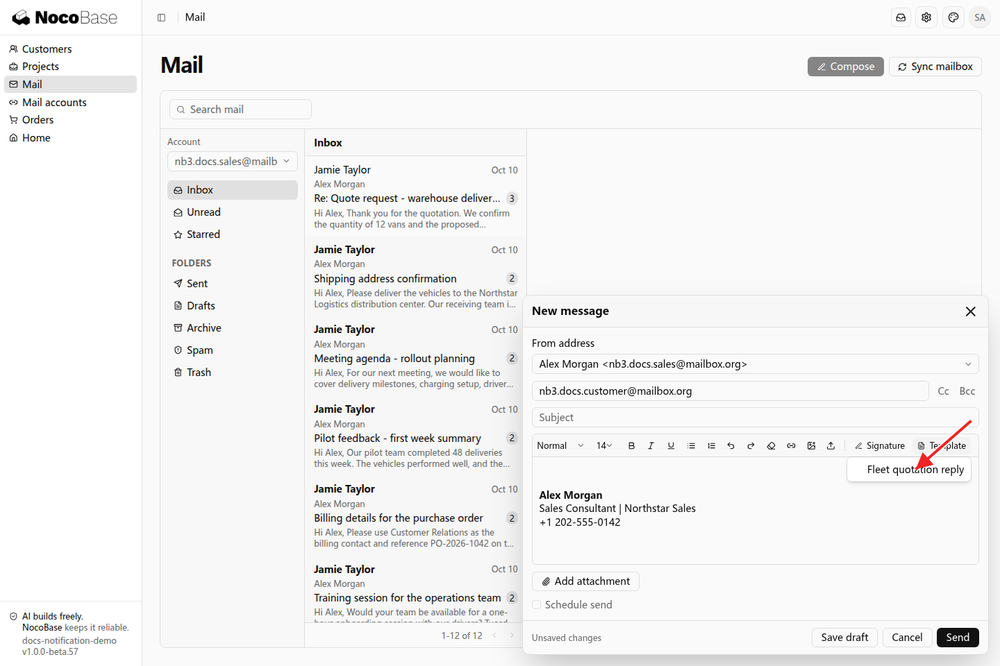
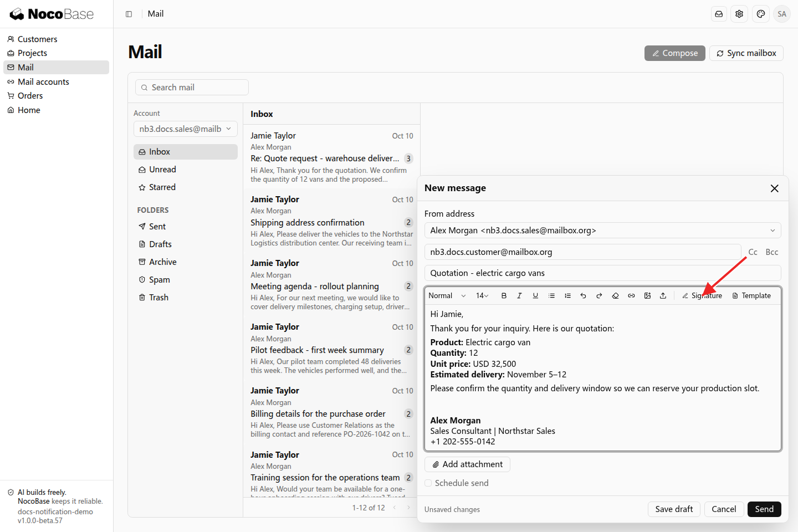
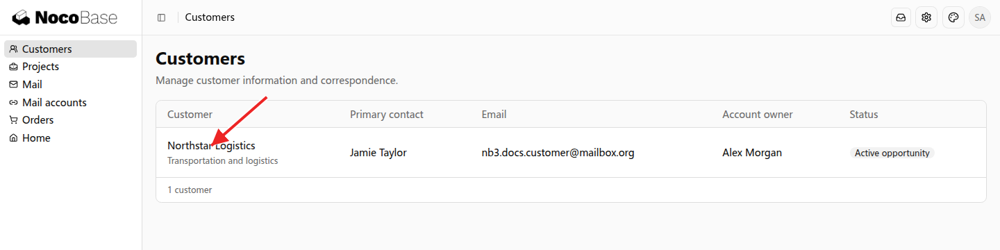
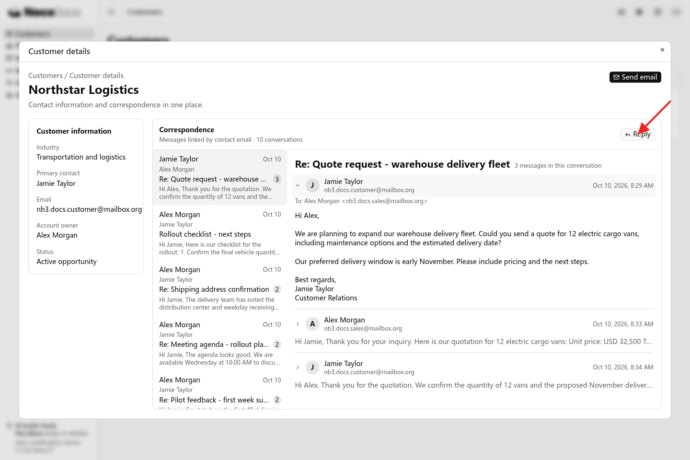
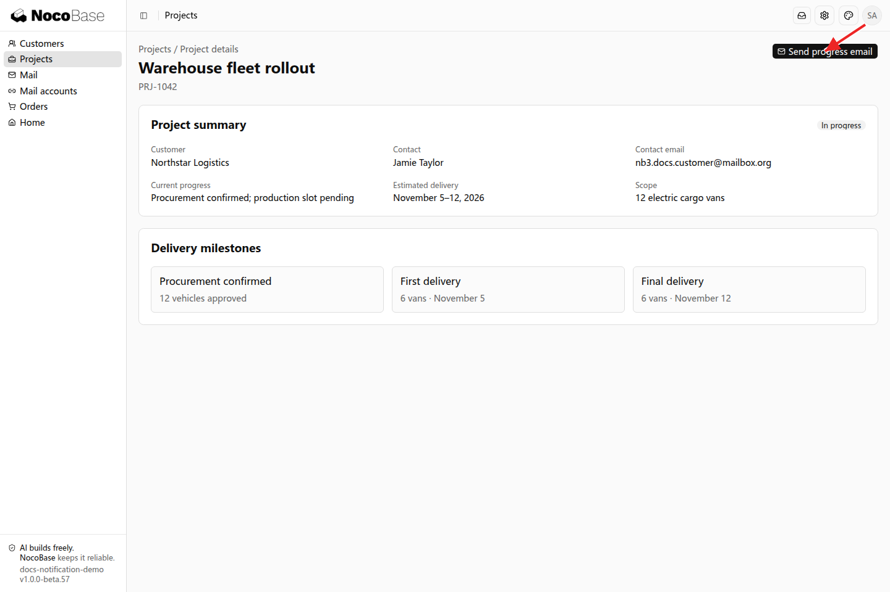
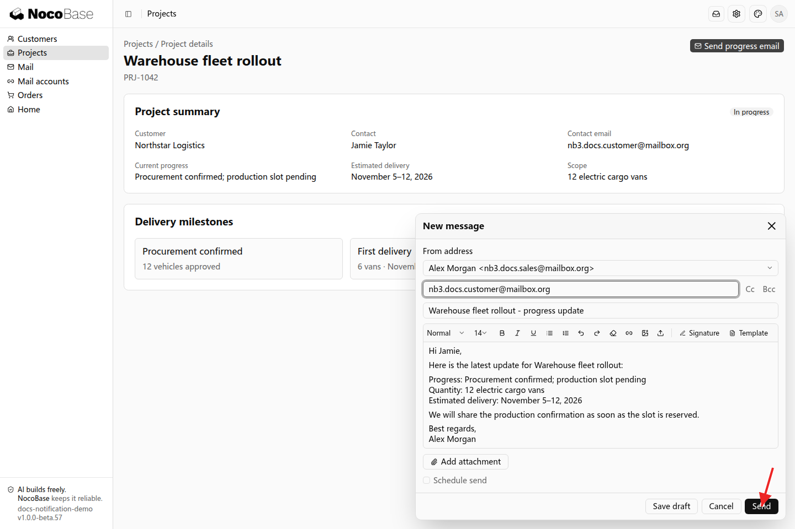

# 更多邮件功能

除了在邮件中心收发邮件，还可以复用签名和模板，或将邮件操作放到应用的其他页面中。

## 使用签名和模板

签名用于在邮件末尾附上姓名、职位和联系方式；模板用于复用常用主题和正文。写信时可以选择签名和模板，再根据本次沟通调整内容，减少重复填写。

在邮箱账号页打开 **Signatures** 或 **Templates**，维护自己的签名和常用内容。例如，销售人员可以复用报价回复模板：

```text
为我的邮箱添加签名，包含姓名、职位和联系电话。准备一份报价回复模板，包含产品、数量、单价和预计交付日期。写信时可以选择签名和模板，并修改本次报价的内容。
```

写信时点击 **Template**，选择报价回复模板。



模板带入主题和报价内容后，点击 **Signature** 选择签名。选择模板后，可以编辑邮件内容，确认后发送。



## 在业务页面中查看往来邮件

邮件可以放到客户、项目、供应商等业务页面中，让用户在查看业务资料时处理相关往来，无需切换到独立邮件中心。应用根据联系人邮箱等信息查找相关邮件。

例如，在客户详情中按联系人邮箱展示往来邮件：

```text
在客户详情页添加往来邮件区，展示发件人或收件人与当前客户联系人邮箱匹配的邮件。销售人员可以在这里阅读正文、查看附件和回复，使用自己关联的邮箱。
```

在客户列表中点击客户名称，打开客户详情。



详情中显示客户资料和联系人相关的邮件列表。点击一封邮件查看往来内容，点击 **Reply** 即可继续回复。



项目或供应商详情也可以按联系人邮箱展示相关往来邮件。

## 从业务页面发起邮件

业务页面可以提供写信入口，自动带入当前记录中的收件人、主题和正文信息。用户可以修改内容，确认后使用自己的邮箱发送，减少在页面之间复制资料的操作。

例如，从项目详情发送进度邮件：

```text
在项目详情页添加“发送进度邮件”操作。收件人从项目联系人中选择，主题包含项目名称，正文带入当前进度和预计交付日期。员工可以编辑收件人和内容，确认后使用自己的邮箱发送。
```

打开项目详情，点击 **Send progress email**。



收件人、主题和正文已根据项目资料填入。员工可以修改内容，确认后发送。



## 使用提示

- 需要获取新邮件时，使用同步操作；刷新列表显示的是已同步到应用的内容。
- 使用搜索、加星和标签整理往来邮件；部分操作是否同步到服务商，取决于接入方式。
- 首次同步可选择所需历史范围，避免导入暂不需要的历史邮件。

页面接入与权限配置，见[开发参考](./development.md)。
