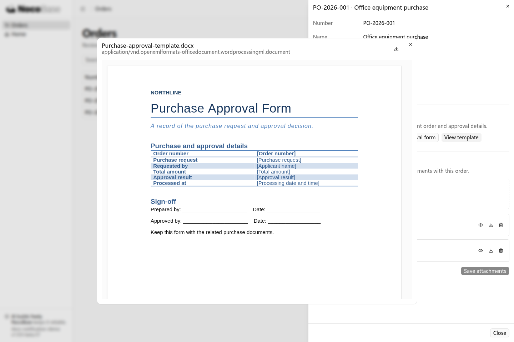
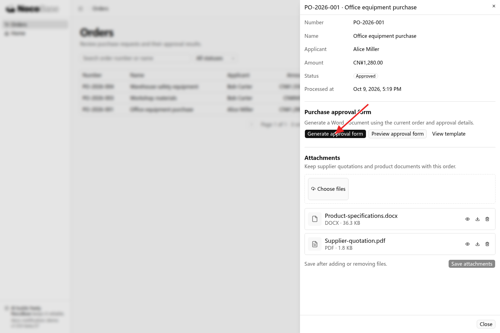
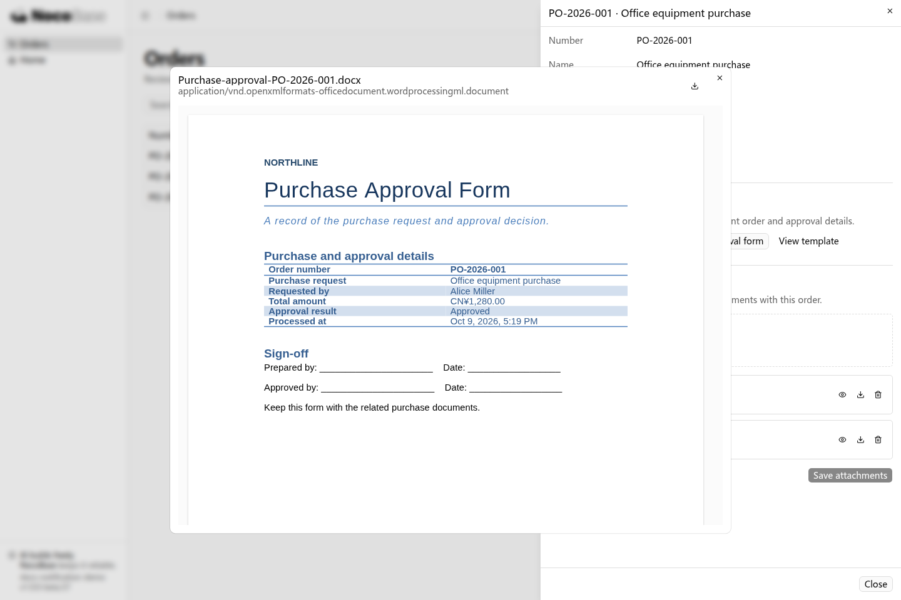

# 模板打印

模板打印可以将业务数据填入固定版式的文档，生成可下载、归档或打印的文件，适用于合同、审批单、发货清单和报表等场景。

你可以提供现有模板，向 Agent 说明要填入哪些信息、在哪里生成以及需要什么格式，由它在应用中接入生成入口和文件输出。

## 接入前准备

- **业务数据**：已有的业务页面，以及需要生成文档的记录。
- **文档模板**：例如公司正在使用的 Word 审批单或合同。没有模板时，可以先描述版式，让 Agent 做一份供你确认。
- **生成要求**：模板中需要填入的信息、生成入口、文件格式和可使用的人员。

本例使用一份 Word 采购审批单模板，为当前订单生成 DOCX 文件。模板包含标题、采购信息表和签名区域，Agent 负责把模板中的信息与应用字段对应起来。

<a href="/cn/downloads/purchase-approval-template.docx" download>下载本例 Word 模板</a>



## 示例：从订单生成采购审批单

采购人员希望把订单信息和审批结果整理成统一的审批单，用于归档。将模板提供给 Agent，再描述需求：

```text
在订单详情中增加“生成采购审批单”功能。

使用我提供的 Word 模板，填入当前订单的编号、采购事项、申请人、金额、审批结果和处理时间。
保留模板的标题、表格布局和签名区域，生成文件名为“采购审批单-订单编号”，提供 Word 文件下载。
有权查看该订单的人员可以生成审批单，生成文件使用当前订单的数据。
```

### 查看效果

1. 打开订单详情，点击 **Generate approval form**，下载当前订单的采购审批单。



2. 点击 **Preview approval form** 查看生成效果，也可以用 Word 打开下载的文件。订单编号、申请人、金额和审批结果已经填入，模板中的标题、表格布局和签名区域保持原样。



业务数据更新后，可以再次生成，得到包含当前信息的文件。已下载的文件保留生成时的内容。

## 进一步使用

### 批量生成

需要从列表生成文档时，说明处理的是勾选记录、当前页还是全部筛选结果，以及生成一个汇总文件还是每条记录各一份。例如：

```text
在发货列表增加“生成发货清单”。
只处理我勾选的记录，按照发货单编号排序。
使用我提供的 Excel 模板，填入收货人、地址和商品明细，生成一个 XLSX 文件。
```

### PDF 输出

PDF 适合直接打印或发送给其他人。可以在已有文档生成流程上增加 PDF 下载：

```text
为采购审批单增加 PDF 下载，保留 Word 模板的字体、表格和签名区域。
```

应用开发或部署人员需要为服务端准备文档转换环境和模板使用的字体，再由 Agent 接入转换。图片、Logo 或二维码也可以按模板需要接入，具体实现取决于采用的生成方案。

### 管理多份模板

固定模板可以由应用开发人员维护。业务人员需要自行上传、替换或选择模板时，可以让 Agent 增加对应管理入口：

```text
采购审批单有国内版和海外版。
管理员可以上传和替换模板，采购人员生成审批单时选择适用版本。
两份模板都使用当前订单的数据，普通采购人员只能使用模板。
```

## 常见问题

### 怎样调整文档里的信息和版式？

修改模板中的标题、表格、字体和签名区域，可以调整版式。增加业务信息时，需要告诉 Agent 该信息从哪里读取，并将它对应到模板。表格明细可以按业务记录逐行填入。

### 可以直接打印到打印机吗？

生成文件后，用户可以在 Word 或 PDF 查看器中选择打印机。需要自动发送到指定打印机时，应另外说明打印设备和使用环境，让 Agent 接入对应方案。

### 谁可以生成和下载文档？

本例中，有权查看订单的人员可以生成该订单的审批单。涉及合同、客户资料等内容时，应明确相应访问规则，由 Agent 在读取业务数据和返回文件时接入权限校验。相关规则见[权限](./authorization/index.md)。
