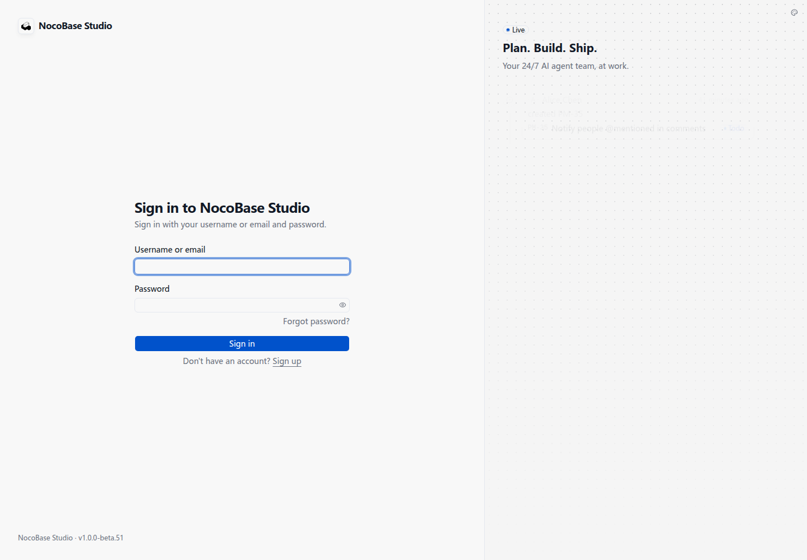

# 在本地 Agent 中使用 Studio

安装 Studio CLI 后，你可以在 Codex、Claude Code 等本地 Agent 的对话里提出需求，让它查看 Studio 中的项目、创建任务或更新进度。CLI 使用你授权的 Studio 账号操作。

## 登录 Studio

打开 Studio 地址，输入用户名或邮箱和密码，点击 **Sign in**。



登录后，首页提供对话入口，以及 **Use Studio in your agent（在你的 Agent 中使用 Studio）**。


首页项目助理旁的 **Online（在线）** 表示 Agent 类型；实际能否回答取决于模型服务是否可用。未配置模型服务时，会提示 **Model unavailable（模型不可用）**。本节使用本地 Agent，直接选择下方的 CLI 接入入口。

## 将安装提示词交给 Agent

点击 **Use Studio in your agent**，复制弹窗中的提示词，粘贴到本地 Agent 的对话中。


Agent 会下载并安装 `nb-studio` CLI，随后发起登录并提供确认码。弹窗中的安装凭据有有效期；需要重新安装时，可以生成新的链接。截图中的凭据已遮盖，请复制你自己的页面生成的提示词。

## 确认 CLI 登录

打开 Agent 提供的授权页面，核对确认码与终端显示的一致，再点击 **Approve（批准）**。


页面提示 **Device approved（设备已批准）** 后，返回 Agent 对话继续操作。


Agent 完成登录后会读取 Studio 的命令说明。此时，你可以直接向本地 Agent 提出需求，例如：

```text
帮我查看 Studio 中有哪些项目，以及每个项目还未完成的任务。
```

接下来[添加运行环境](./runtimes)，为 Studio 接入执行开发任务的 Runner。运行环境可以是本机，也可以是其他电脑或服务器；接入后，才能从 Studio 网页下发开发任务。
