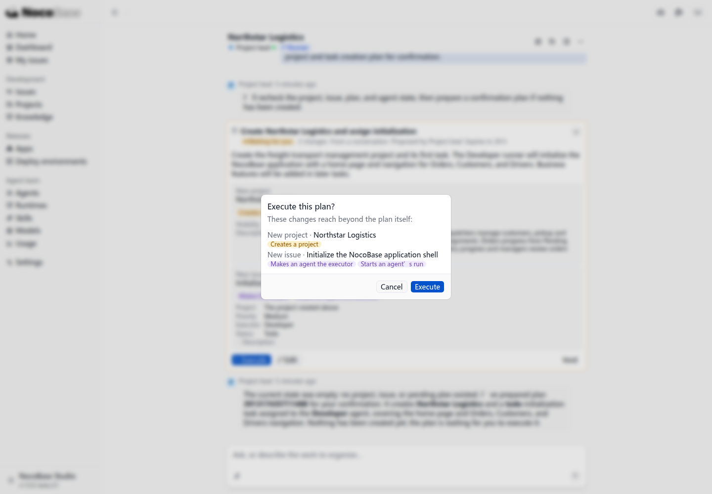

# 创建第一个项目

以一家运输公司的订单管理应用为例，先创建项目并安排应用初始化。后续再逐步添加订单管理、文件上传、通知等业务功能。

:::danger 目前阻塞点

1. **首次开发前缺少仓库准备提示。** 我们提出创建应用并开始开发，项目主管直接创建并派发初始化任务，没有先提示或引导准备 Git 仓库等代码位置。开发 Agent 启动后才发现没有关联仓库、没有应用源码，任务停在 **Blocked**，首次开发流程中断。
2. **本地 Studio 缺少公网地址。** 当前 Studio 只在本机访问，GitHub 无法向它发送 Webhook，GitHub 托管的 Actions 也无法访问它的 API，后续 CI 和自动部署接入受阻。此项尚未进入实测，不影响先在本地初始化应用。

这两点分别影响首次开发和后续 CI 接入的连贯性。详细配置与流程改进建议见[本轮待确认问题](./review-notes)。

:::

## 选择项目主管

在首页的 Agent 选择器中，选择 **Project lead（项目主管）**。它通过 Runner 运行；接入本地 Codex 后，无需在线模型服务即可对话。


## 描述业务背景和第一步目标

先说明业务由谁使用、处理什么，再提出当前要完成的任务。可以使用下面的提示词：

```text
我们是一家货物运输公司，需要搭建一个名为 Northstar Logistics 的运输订单管理应用。

调度员登记客户、取货和送货地址、货物信息及要求的交付日期，为订单分配司机，并跟踪待处理、已分配、运输中、已送达的状态。司机更新配送进度，管理人员查看订单和运营情况。

请在 Studio 中创建这个项目，并安排第一个任务：初始化一个 NocoBase 应用，提供首页以及订单、客户、司机的导航。将初始化任务分配给开发 Agent。应用准备好后，我们再逐步添加业务功能。
```

将提示词输入首页对话框，确认当前选择的是项目主管，再发送。


## 查看项目主管的回复

项目主管会检查现有项目、任务和可用 Agent，再生成操作计划。本例的计划包含两项操作：

- 创建 **Northstar Logistics** 项目。
- 创建应用初始化任务，分配给 **Developer**，提供首页以及 Orders、Customers、Drivers 导航。


核对计划中的项目、任务和执行 Agent，点击 **Execute（执行）** 确认。计划中标记的 **Wakes Developer（唤起开发 Agent）** 表示执行后会触发开发 Agent 处理任务。

确认弹窗会列出创建项目和启动 Agent 的影响。核对后，点击 **Execute** 执行。



执行后，在 **Projects（项目）** 列表中可以看到 Northstar Logistics。打开项目的 **Issues（任务）**，可以查看初始化任务 PM-1 及执行状态。


