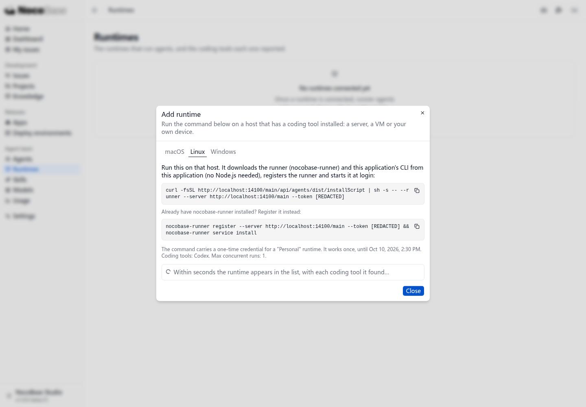

# 添加运行环境

运行环境是执行开发任务的电脑、服务器或虚拟机。Runner 运行在这台机器上，连接 Studio，并调用已经安装和登录的 Codex、Claude Code 等编码工具。

## 准备编码工具

先在目标机器安装并登录准备使用的编码工具。本例使用已经通过 ChatGPT 账号登录的 Codex，无需另外填写模型服务的 API Key。

Runner 支持 macOS 和 Linux，暂不支持原生 Windows。Windows 用户需在 WSL 的 Linux 环境中安装并登录编码工具，再使用 Linux 安装命令接入 Runner。本例在 WSL 的 Linux 环境中运行。

## 生成安装命令

打开 **Agent team → Runtimes（Agent 团队 → 运行环境）**，点击 **Add runtime（添加运行环境）**。

选择使用范围和编码工具。本例选择 **Personal（个人）**、**Codex**，最大并发保留为 **1**。

- **Personal**：只执行由你发起的工作，适合个人电脑。
- **Team**：执行团队成员发起的工作，适合共享服务器。
- **Coding tools**：选择允许这个运行环境使用的编码工具。

点击 **Generate install command（生成安装命令）**。

## 在目标机器执行命令

选择 **Linux** 标签，复制安装命令，在目标机器的终端执行。

命令会下载安装包、注册运行环境并启动 Runner。命令包含一次性凭据，请使用当前页面生成的命令。

安装、注册并启动完成后，页面会显示连接成功，以及 Runner 检测到的编码工具。

## 查看接入结果

点击 **Done（完成）** 返回列表。本例的运行环境显示 **Online**，Codex 显示 **Signed in（已登录）**。

点击运行环境名称，可以查看各工具的版本、登录状态和是否允许执行任务。

“几秒钟后出现在列表”指执行安装命令并启动 Runner 之后。添加页勾选工具只是决定允许使用哪些工具，工具本身需要提前安装和登录。

接下来[选择项目主管，创建第一个项目](./first-project)。
