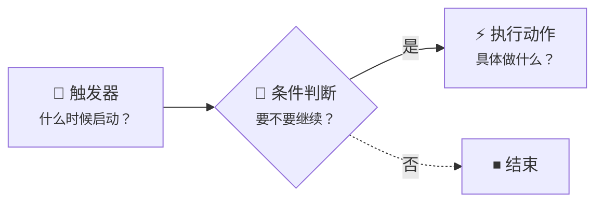

# 第 6 章：工作流 — 让系统自动干活

上一章我们给系统加上了权限，不同角色看到不同的内容。但所有操作还是靠人手动完成——新工单来了要自己去看，状态改了没人知道。

这一章，我们让系统**自动干活**。

## 6.1 什么是工作流（Workflow）

工作流就是一套自动化的"如果……那么……"规则。

打个比方：你手机上设了个闹钟，每天早上 8 点响。闹钟就是最简单的工作流——**条件满足（到了 8 点），就自动执行（响铃）**。

NocoBase 的工作流也是同样的思路：

- **触发器**：工作流的入口。比如"有人创建了一条新工单"或"某条数据被更新了"
- **条件判断**：可选的过滤步骤。比如"只有处理人不为空时才继续"
- **执行动作**：真正干活的步骤。比如"发送通知"或"更新某个字段"

工作流的执行动作可以串联多个节点，常用的节点类型有：

- **流程控制**：条件判断、并行分支、循环、延时
- **数据操作**：新增数据、更新数据、查询数据、删除数据
- **通知与外部**：通知、HTTP 请求、运算

本教程只用到其中最常见的几个，学会组合后就能应对大多数场景。

### 触发器类型一览

NocoBase 提供了多种触发器类型，在创建工作流时选择：

| 触发器 | 说明 | 典型场景 |
|-------|------|---------|
| **数据表事件** | 数据新增、更新或删除时触发 | 新工单通知、状态变更记录 |
| **定时任务** | 按 Cron 表达式或固定时间触发 | 每天生成日报、定期清理过期数据 |
| **操作后事件** | 用户在界面执行操作后触发 | 表单提交后发送通知 |
| **审批** | 发起审批流程，支持多级审批 | 请假审批、采购审批 |
| **自定义操作** | 绑定到自定义按钮，点击触发 | 一键归档、批量操作 |
| **操作前事件** | 拦截用户操作，同步执行后再放行 | 提交前校验、自动补全字段 |
| **AI 员工** | 将工作流作为工具提供给 AI 员工调用 | AI 自动执行业务操作 |

本教程会用到 **数据表事件** 和 **操作后事件** 两种触发器，其他类型的用法类似，学会后就能举一反三。

NocoBase 的工作流是内置插件，不需要额外安装，开箱即用。

## 6.2 场景一：新工单自动通知处理人

**需求**：当有人创建了一条新工单，并且指定了处理人，系统自动给处理人发一条站内消息，让他知道"有活儿来了"。

### 第一步：创建工作流

打开右上角插件配置菜单，进入 **工作流管理**。

点击 **新建**，在弹出的对话框中：

- **名称**：填写"新工单通知处理人"
- **触发器类型**：选择 **数据表事件**

提交后，点击列表中的 **配置** 链接，进入流程编辑界面。

### 第二步：配置触发器

点击顶部的触发器卡片，打开配置抽屉：

- **数据表**：选择 主数据源 / 「工单」
- **触发时机**：选择「新增或更新数据后」
- **发生变动的字段**：勾选「处理人（Assignee）」——只有处理人字段变了才触发，避免其他字段的修改产生不必要的通知（新增数据时，所有字段都被视为发生变动，所以新建工单也会触发）
- **满足以下条件才触发**：模式选「满足组内**任意**条件」，添加两个条件：
  - `assignee_id` 不为空
  - `Assignee / ID` 不为空

  > 为什么要配两个条件？因为触发时表单里可能只有外键（assignee_id）而没有查出关联对象，也可能有了关联对象但外键字段为空。两个条件用 OR 关系，确保只要指定了处理人就一定触发。

- **预加载关联数据**：勾选「Assignee」——后续通知节点需要用到处理人的信息，必须在触发器里提前加载

点击保存。这样，触发器本身就完成了条件判断——只有处理人不为空时才触发，不需要额外添加条件判断节点。

### 第三步：添加通知节点

点击触发器下方的 **+**，选择 **通知** 节点。

打开通知节点的配置，第一项就是选择 **通知渠道**——但我们还没有创建过渠道，下拉列表是空的。先去创建一个。

### 第四步：创建通知渠道

NocoBase 支持多种通知渠道类型：

| 渠道类型 | 说明 |
|---------|------|
| **站内信** | 浏览器内通知，实时推送到用户的通知中心 |
| **邮件** | 通过 SMTP 发送邮件，需要配置邮件服务器 |

本教程使用最简单的 **站内信** 渠道：

1. 打开右上角插件设置，进入 **通知管理**
2. 点击 **新建渠道**

3. 渠道类型选择 **站内信**，填写渠道名称（如"系统站内信"）
4. 保存

### 第五步：配置通知节点

回到工作流编辑页面，打开通知节点的配置。

通知节点有以下配置项：

- **通知渠道**：选择刚才创建的「系统站内信」
- **接收人**：点击选择 查询用户 → 「id = 触发器变量/触发数据/责任人/ID」
- **标题**：填写通知标题，如"你有一条新工单待处理"。支持插入变量，比如加上工单标题：`新工单：{{触发数据 / 标题}}`
- **内容**：填写通知正文，同样可以插入变量引用工单的优先级、描述等字段

(下一步我们去找工单地址，退出弹窗之前，记得先保存！)

- **桌面端详情页**：填写工单详情页的 URL 路径。获取方式：在前端打开任意一条工单的详情弹窗，复制浏览器地址栏中的路径，格式类似 `/admin/camcwbox2uc/view/d8f8e122d37/filterbytk/353072988225540`。将路径粘贴到配置框中，其中 `filterbytk/` 后面的数字就是工单 ID——把这部分替换为触发数据的 ID 变量即可（点击变量选择器 → 触发数据 → ID）。配置后，用户在通知列表中点击该通知就能直接跳转到对应工单的详情页，同时自动标记为已读

- **发送失败时继续**：可选，勾选后即使通知发送失败，工作流也不会中断

> 通知发出后，处理人可以在页面右上角的 **通知中心** 里看到这条消息，未读的还会有红点提示。点击通知即可跳转到工单详情页查看完整信息。

### 第六步：测试并启用

> 场景一的完整流程只有两个节点：触发器（含条件过滤）→ 通知。简单直接。

先别急着启用——工作流提供了 **手动执行** 功能，可以用指定数据测试流程是否正确：

1. 点击右上角的 **执行** 按钮（不是启用开关）
2. 选择一条已有的工单数据作为触发数据
  > 如果工单选择栏中展示的是 id，在数据源 > 数据表 > 工单 中，将 “标题” 列设置为标题字段即可

3. 点击执行，工作流会执行并自动切换到复制的新版本

4. 点击右上角的三个点，选择 执行历史。这个时候应该能看到我们刚才的执行记录，点击查看后，就能看到执行的细节，包括触发情况、每个节点的执行细节、参数。

5. 刚才的那条工单似乎是给 Alice 的，我们切换到 Alice 的账号看看，成功收到！

点击可以跳转到目标工单页，同时通知会自动被标记为已读。

确认流程没问题后，点击右上角的 **启用/停用** 开关，将工作流切换为启用状态。

> **注意**：工作流一旦被执行过（包括手动执行），就会变成**只读**状态（灰色），不能再编辑。如果需要修改，点击右上角的 **「复制到新版本」**，在新版本上继续编辑。旧版本会自动停用。

回到工单页面，创建一条新工单，记得选一个处理人。然后切换到处理人的账号登录，检查通知中心——应该能看到一条新通知。

恭喜，第一个自动化流程跑起来了！

## 6.3 场景二：状态变更自动记录完成时间

**需求**：当工单状态变为"已完成"时，系统自动在"完成时间"字段填入当前时间。这样不需要手动记录，也不会忘。

> 如果你还没有在工单表中创建"完成时间"字段，请先到 **数据表管理 → 工单** 中添加一个 **日期** 类型的字段，命名为"完成时间"。具体步骤参考第 2 章的字段创建方法，这里不再赘述。
> 

### 第一步：新建工作流

回到工作流管理页面，点击新建：

- **名称**：填写"工单完成自动记录时间"
- **触发器类型**：这次我们熟悉一下其他类型的触发器，选择 **操作后事件**（执行了某个操作之后才触发）
- **执行模式**：同步
> 关于同步和异步：
> - 异步：操作之后，我们可以继续做其他事情，工作流自动执行后通知我们结果
> - 同步：操作之后，界面会处于等待模式，等待工作流执行完毕之后我们才能干其他事情

### 第二步：配置触发器

打开触发器配置：

- **数据表**：选择「工单」
- **触发模式**：选择「局部模式，绑定该工作流的操作执行完毕后触发」

> 这里更推荐「全局模式」并勾选相关操作，不过为了熟悉触发器和操作绑定的机制，我们先采用「局部模式」作为教学。后面大家可以自行改回全局模式。

### 第三步：添加条件判断

不同于数据表事件触发器自身包含了判断条件，我们需要自己来添加条件判断节点：

我们推荐选择 「“是” 和 “否” 分别继续」，以便于后续的扩展。

- 条件：**触发数据 → 状态** 等于 **已完成**，注意此处必须复制字段配置中的 “选项值” 过来，否则判断会失败。

这样只有状态变为"已完成"时才继续执行，变成其他状态（如"处理中"）不会触发后续动作。

### 第四步：添加更新数据节点

点击 **+**，选择 **更新数据** 节点：

- **数据表**：选择「工单」
- **筛选条件**：ID 等于 触发数据 → ID（确保只更新当前这条工单）
- **字段值**：完成时间 = **系统变量 / 系统时间**

### 第五步：创建"完成"操作按钮

工作流配好了，但"操作后事件"需要绑定到一个具体的操作按钮上才会触发。我们在工单列表的操作列中创建一个专用的"完成"按钮：

1. 进入 UI 编辑器模式，在工单表格的操作列中，点击 **「+」**，选择 **「更新数据」** 操作按钮
2. 点击按钮的配置项，将标题修改为 **「完成」**，并选择一个完成相关的小图标（如对勾图标）

3. 配置“字段值”，设置 “状态 = 已完成”。这样用户点击按钮时，就会触发这个赋值操作。

4. 给按钮配置 **联动规则**：当工单状态已经是"已完成"时，隐藏这个按钮（已完成的工单不需要再点"完成"）
   - 条件：当前数据 → 状态 等于 已完成
   - 动作：隐藏

5. 打开按钮配置项中的 **「绑定工作流」**，选择我们刚才创建的「工单完成自动记录时间」工作流

### 第六步：启用并测试

回到工作流管理页面，启用「工单完成自动记录时间」工作流。

然后打开一条状态为"处理中"的工单，在操作列中点击 **「完成」** 按钮。刷新页面后，可以看到：

- 工单的"完成时间"字段自动填上了当前时间
- "完成"按钮在这条工单上已经消失（联动规则生效了）

是不是很方便？这就是工作流的第二种常见用法——**自动更新数据**。而且通过"操作后事件 + 局部模式 + 绑定按钮"的方式，我们实现了一个精确的触发机制：只有点击特定按钮才会执行工作流。

## 6.4 查看执行历史

工作流跑了几次？有没有出错？NocoBase 全都帮你记着。

在工作流管理列表中，每个工作流后面都有一个 **执行次数** 的数字链接。点击它，可以看到每次执行的详细记录：

- **执行状态**：成功（绿色）还是失败（红色），一目了然
- **触发时间**：什么时候触发的
- **节点详情**：点进去可以看到每个节点的执行结果

如果某次执行失败了，点进详情可以看到是哪个节点出了问题，以及具体的错误信息。这是调试工作流最重要的工具。

## 小结

这一章我们创建了两个简单但实用的工作流：

- **新工单通知**（数据表事件触发）：新建或变更处理人后自动通知，不用再人工喊话
- **自动记录完成时间**（操作后事件触发）：点击"完成"按钮后自动填写时间，杜绝人为遗漏

两个工作流分别演示了两种不同的触发方式，加起来不到 10 分钟的配置量，系统就已经能自动干活了。NocoBase 还支持更多节点类型（HTTP 请求、运算、循环等），但对于入门来说，掌握这些组合就足够应对大多数场景了。

## 下一章预告

系统能自动干活了，但我们还缺一个"全局视角"——一共多少工单？哪个分类最多？每天新增多少？下一章我们用图表区块搭一个 **数据仪表盘**，一眼看全局。
