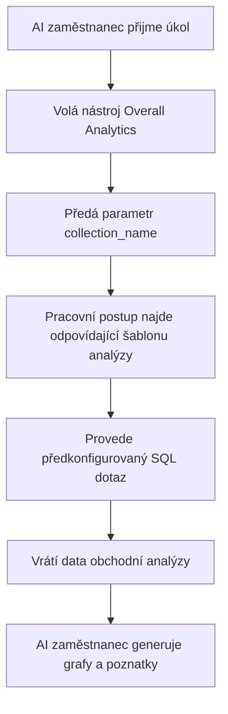

:::tip
Tento dokument byl přeložen umělou inteligencí. V případě nepřesností se prosím obraťte na [anglickou verzi](/en)
:::


# Role a oprávnění

## Úvod

Správa oprávnění AI zaměstnanců zahrnuje dvě úrovně:

1.  **Oprávnění k přístupu AI zaměstnanců**: Kontroluje, kteří uživatelé mohou používat které AI zaměstnance.
2.  **Oprávnění k přístupu k datům**: Jak AI zaměstnanci aplikují kontrolu oprávnění při zpracování dat.

Tento dokument podrobně vysvětluje způsoby konfigurace a principy fungování těchto dvou typů oprávnění.

---

## Konfigurace oprávnění k přístupu AI zaměstnanců

### Nastavení dostupných AI zaměstnanců pro role

Přejděte na stránku `Uživatelé a oprávnění`, klikněte na záložku `Role a oprávnění` a dostanete se na stránku konfigurace rolí.


Vyberte roli, klikněte na záložku `Oprávnění` a poté na záložku `AI zaměstnanci`. Zde se zobrazí seznam AI zaměstnanců spravovaných v pluginu AI zaměstnanců.

Kliknutím na zaškrtávací políčko ve sloupci `Dostupné` v seznamu AI zaměstnanců určíte, zda má aktuální role přístup k danému AI zaměstnanci.


## Oprávnění k přístupu k datům

Když AI zaměstnanci zpracovávají data, metoda kontroly oprávnění závisí na typu použitého nástroje:

### Systémové vestavěné nástroje pro dotazování dat (dodržují uživatelská oprávnění)

Následující nástroje přistupují k datům **striktně podle datových oprávnění aktuálního uživatele**:

| Název nástroje                   | Popis                                           |
| :------------------------------- | :---------------------------------------------- |
| **Data source query**            | Dotazování databáze pomocí zdroje dat, kolekce a polí. |
| **Data source records counting** | Počítání celkového počtu záznamů pomocí zdroje dat, kolekce a polí. |

**Jak to funguje:**

Když AI zaměstnanci volají tyto nástroje, systém:
1.  Identifikuje identitu aktuálně přihlášeného uživatele.
2.  Aplikuje pravidla přístupu k datům nakonfigurovaná pro tohoto uživatele v sekci **Role a oprávnění**.
3.  Vrátí pouze data, ke kterým má uživatel oprávnění.

**Příklad scénáře:**

Předpokládejme, že prodejce A může prohlížet pouze data zákazníků, za které je zodpovědný. Když používá AI zaměstnance Viz k analýze zákazníků:
-   Viz volá `Data source query` k dotazování tabulky zákazníků.
-   Systém aplikuje pravidla filtrování datových oprávnění prodejce A.
-   Viz může vidět a analyzovat pouze data zákazníků, ke kterým má prodejce A přístup.

To zajišťuje, že **AI zaměstnanci nemohou obejít vlastní hranice přístupu uživatele k datům**.

---

### Vlastní obchodní nástroje pracovního postupu (nezávislá logika oprávnění)

Obchodní dotazovací nástroje přizpůsobené prostřednictvím pracovních postupů mají kontrolu oprávnění **nezávislou na uživatelských oprávněních**, jež je určena obchodní logikou pracovního postupu.

Tyto nástroje se obvykle používají pro:
-   Pevné procesy obchodní analýzy.
-   Předkonfigurované agregační dotazy.
-   Statistické analýzy napříč hranicemi oprávnění.

#### Příklad 1: Overall Analytics (obecná obchodní analýza)


V CRM demu je `Overall Analytics` šablonový nástroj pro obchodní analýzu:

| Vlastnost             | Popis                                                                                              |
| :-------------------- | :------------------------------------------------------------------------------------------------- |
| **Implementace**      | Pracovní postup čte předkonfigurované SQL šablony a provádí dotazy pouze pro čtení.                 |
| **Kontrola oprávnění** | Není omezena aktuálními uživatelskými oprávněními, výstupem jsou pevná obchodní data definovaná šablonami. |
| **Případy použití**   | Poskytuje standardizovanou komplexní analýzu pro konkrétní obchodní objekty (např. leady, obchodní příležitosti, zákazníky). |
| **Zabezpečení**       | Všechny šablony dotazů jsou předkonfigurovány a zkontrolovány administrátory, čímž se zabraňuje dynamickému generování SQL. |

**Pracovní postup:**



**Klíčové vlastnosti:**
-   Každý uživatel, který volá tento nástroj, získá **stejný obchodní pohled**.
-   Rozsah dat je definován obchodní logikou, není filtrován uživatelskými oprávněními.
-   Vhodné pro poskytování standardizovaných zpráv obchodní analýzy.

#### Příklad 2: SQL Execution (pokročilý analytický nástroj)


V CRM demu je `SQL Execution` flexibilnější, ale přísně kontrolovaný nástroj:

| Vlastnost             | Popis                                                                                              |
| :-------------------- | :------------------------------------------------------------------------------------------------- |
| **Implementace**      | Umožňuje AI generovat a provádět SQL příkazy.                                                      |
| **Kontrola oprávnění** | Řízeno pracovním postupem, obvykle omezeno pouze na administrátory.                                |
| **Případy použití**   | Pokročilá analýza dat, průzkumné dotazy, agregační analýza napříč tabulkami.                       |
| **Zabezpečení**       | Vyžaduje, aby pracovní postup omezil operace pouze pro čtení (SELECT) a kontroloval dostupnost prostřednictvím konfigurace úkolů. |

**Bezpečnostní doporučení:**

1.  **Omezte rozsah**: Povolte pouze v úkolech bloku správy.
2.  **Omezení výzev**: Jasně definujte rozsah dotazu a názvy tabulek ve výzvách úkolů.
3.  **Validace pracovního postupu**: Validujte SQL příkazy v pracovním postupu, abyste zajistili, že se provádějí pouze operace SELECT.
4.  **Auditní protokoly**: Zaznamenávejte všechny provedené SQL příkazy pro zpětnou dohledatelnost.

**Příklad konfigurace:**

```markdown
Omezení výzev úkolů:
- Lze dotazovat pouze tabulky související s CRM (leads, opportunities, accounts, contacts)
- Lze provádět pouze dotazy SELECT
- Časový rozsah omezen na poslední 1 rok
- Vrácené výsledky nepřesahují 1000 záznamů
```

---

## Doporučení pro návrh oprávnění

### Výběr strategie oprávnění podle obchodního scénáře

| Obchodní scénář                       | Doporučený typ nástroje             | Strategie oprávnění         | Důvod                                       |
| :------------------------------------ | :---------------------------------- | :-------------------------- | :------------------------------------------ |
| Prodejce prohlížející si vlastní zákazníky | Systémové vestavěné dotazovací nástroje | Dodržuje uživatelská oprávnění | Zajišťuje izolaci dat a chrání obchodní bezpečnost. |
| Vedoucí oddělení prohlížející si týmová data | Systémové vestavěné dotazovací nástroje | Dodržuje uživatelská oprávnění | Automaticky aplikuje rozsah dat oddělení.   |
| Manažer prohlížející si globální obchodní analýzu | Vlastní nástroje pracovního postupu / Overall Analytics | Nezávislá obchodní logika   | Poskytuje standardizovaný celkový pohled.   |
| Datový analytik provádějící průzkumné dotazy | SQL Execution                       | Přísně omezuje dostupné objekty | Vyžaduje flexibilitu, ale musí kontrolovat rozsah přístupu. |
| Běžní uživatelé prohlížející si standardní reporty | Overall Analytics                   | Nezávislá obchodní logika   | Pevné analytické standardy, není třeba se starat o podkladová oprávnění. |

### Vícevrstvá strategie ochrany

Pro citlivé obchodní scénáře se doporučuje přijmout vícevrstvou kontrolu oprávnění:

1.  **Vrstva přístupu AI zaměstnanců**: Kontroluje, které role mohou používat daného AI zaměstnance.
2.  **Vrstva viditelnosti úkolů**: Kontroluje zobrazení úkolů prostřednictvím konfigurace bloků.
3.  **Vrstva autorizace nástrojů**: Ověřuje identitu a oprávnění uživatele v pracovních postupech.
4.  **Vrstva přístupu k datům**: Kontroluje rozsah dat prostřednictvím uživatelských oprávnění nebo obchodní logiky.

**Příklad:**

```
Scénář: Pouze finanční oddělení může používat AI pro finanční analýzu

- Oprávnění AI zaměstnanců: Pouze finanční role má přístup k AI zaměstnanci "Finance Analyst".
- Konfigurace úkolů: Úkoly finanční analýzy se zobrazují pouze ve finančních modulech.
- Návrh nástroje: Nástroje finančního pracovního postupu ověřují oddělení uživatele.
- Datová oprávnění: Oprávnění k přístupu k finančním tabulkám jsou udělena pouze finanční roli.
```

---

## Často kladené otázky

### Q: K jakým datům mají AI zaměstnanci přístup?

**A:** Záleží na typu použitého nástroje:
-   **Systémové vestavěné dotazovací nástroje**: Mohou přistupovat pouze k datům, která má aktuální uživatel oprávnění prohlížet.
-   **Vlastní nástroje pracovního postupu**: Určeno obchodní logikou pracovního postupu, nemusí být omezeno uživatelskými oprávněními.

### Q: Jak zabránit AI zaměstnancům v úniku citlivých dat?

**A:** Použijte vícevrstvou ochranu:
1.  Nakonfigurujte oprávnění k přístupu rolí AI zaměstnanců, abyste omezili, kdo je může používat.
2.  U systémových vestavěných nástrojů se spoléhejte na uživatelská datová oprávnění pro automatické filtrování.
3.  U vlastních nástrojů implementujte validaci obchodní logiky v pracovních postupech.
4.  Citlivé operace (jako je SQL Execution) by měly být autorizovány pouze administrátorům.

### Q: Co když chci, aby někteří AI zaměstnanci obešli omezení uživatelských oprávnění?

**A:** Použijte vlastní obchodní nástroje pracovního postupu:
-   Vytvořte pracovní postupy pro implementaci specifické logiky obchodních dotazů.
-   V pracovních postupech kontrolujte rozsah dat a pravidla přístupu.
-   Nakonfigurujte nástroje pro použití AI zaměstnanci.
-   Kontrolujte, kdo může tuto schopnost volat, prostřednictvím oprávnění k přístupu AI zaměstnanců.

### Q: Jaký je rozdíl mezi Overall Analytics a SQL Execution?

**A:**

| Srovnávací dimenze | Overall Analytics                     | SQL Execution                           |
| :----------------- | :------------------------------------ | :-------------------------------------- |
| Flexibilita        | Nízká (lze použít pouze předkonfigurované šablony) | Vysoká (lze dynamicky generovat dotazy) |
| Bezpečnost         | Vysoká (všechny dotazy předem zkontrolovány) | Střední (vyžaduje omezení a validaci)   |
| Cíloví uživatelé   | Běžní obchodní uživatelé              | Administrátoři nebo seniorní analytici  |
| Náklady na údržbu  | Je třeba udržovat analytické šablony  | Žádná údržba, ale vyžaduje monitorování |
| Konzistence dat    | Silná (standardizované metriky)       | Slabá (výsledky dotazů mohou být nekonzistentní) |

---

## Doporučené postupy

1.  **Výchozí nastavení na uživatelská oprávnění**: Pokud neexistuje jasná obchodní potřeba, upřednostněte použití systémových vestavěných nástrojů, které dodržují uživatelská oprávnění.
2.  **Šablonová standardní analýza**: Pro běžné analytické scénáře použijte vzor Overall Analytics k poskytování standardizovaných funkcí.
3.  **Přísná kontrola pokročilých nástrojů**: Nástroje s vysokými oprávněními, jako je SQL Execution, by měly být autorizovány pouze několika administrátorům.
4.  **Izolace na úrovni úkolů**: Nakonfigurujte citlivé úkoly do specifických bloků a implementujte izolaci prostřednictvím oprávnění k přístupu na stránky.
5.  **Audit a monitorování**: Zaznamenávejte chování AI zaměstnanců při přístupu k datům a pravidelně kontrolujte neobvyklé operace.