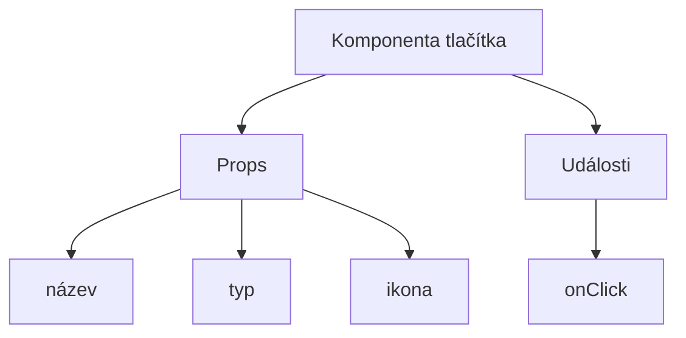
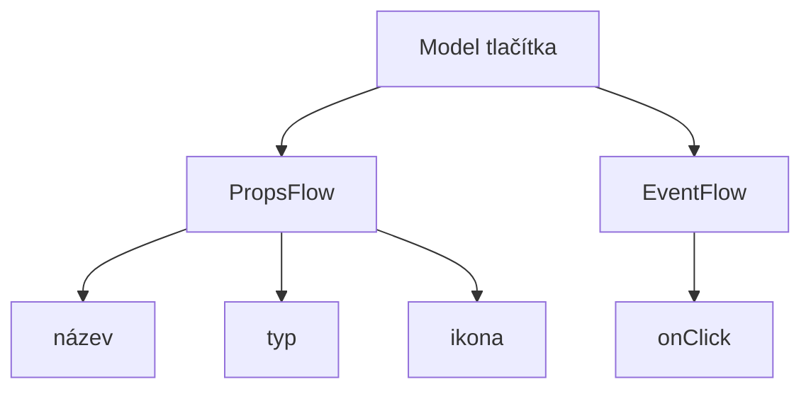

:::tip
Tento dokument byl přeložen umělou inteligencí. V případě nepřesností se prosím obraťte na [anglickou verzi](/en)
:::


# Rychlý start: Vytvoření orchestrovatelné komponenty tlačítka

V Reactu obvykle vykreslujeme komponentu tlačítka takto:

```tsx pure
import { Button } from 'antd';

export default function App() {
  return <Button type="primary">Primary Button</Button>;
}
```

Přestože je výše uvedený kód jednoduchý, jedná se o **statickou komponentu**, která nemůže splňovat požadavky no-code platformy na konfigurovatelnost a možnosti orchestrace.

V NocoBase FlowEngine můžeme rychle vytvářet komponenty, které podporují konfiguraci a jsou řízeny událostmi, pomocí **FlowModel + FlowDefinition**, čímž dosáhneme výkonnějších no-code možností.

---

## Krok 1: Vykreslení komponenty pomocí FlowModel

<code src="./demos/quickstart-1-basic.tsx"></code>

### 🧠 Klíčové koncepty

- `FlowModel` je základní model komponenty v FlowEngine, který zapouzdřuje logiku komponenty, vykreslování a konfigurační možnosti.
- Každou UI komponentu lze instanciovat a jednotně spravovat prostřednictvím `FlowModel`.

### 📌 Kroky implementace

#### 1. Vytvoření vlastní třídy modelu

```tsx pure
class MyModel extends FlowModel {
  render() {
    return <Button {...this.props} />;
  }
}
```

#### 2. Vytvoření instance modelu

```ts
const model = this.flowEngine.createModel({
  uid: 'my-model',
  use: 'MyModel',
  props: {
    type: 'primary',
    children: 'Primary Button',
  },
});
```

#### 3. Vykreslení pomocí `<FlowModelRenderer />`

```tsx pure
<FlowModelRenderer model={model} />
```

## Krok 2: Přidání PropsFlow pro konfigurovatelnost vlastností tlačítka

<code src="./demos/quickstart-2-register-propsflow.tsx"></code>

### 💡 Proč používat PropsFlow?

Použití Flow namísto statických props umožňuje:
- Dynamickou konfiguraci
- Vizuální úpravy
- Přehrávání stavu a perzistenci

### 🛠 Klíčové úpravy

#### 1. Definování Flow pro vlastnosti tlačítka

```tsx pure

const buttonSettings = defineFlow({
  key: 'buttonSettings',
  
  title: 'Nastavení tlačítka',
  steps: {
    general: {
      title: 'Obecná konfigurace',
      uiSchema: {
        title: {
          type: 'string',
          title: 'Název tlačítka',
          'x-decorator': 'FormItem',
          'x-component': 'Input',
        },
        type: {
          type: 'string',
          title: 'Typ',
          'x-decorator': 'FormItem',
          'x-component': 'Select',
          enum: [
            { label: 'Primární', value: 'primary' },
            { label: 'Výchozí', value: 'default' },
            { label: 'Nebezpečné', value: 'danger' },
            { label: 'Přerušované', value: 'dashed' },
            { label: 'Odkaz', value: 'link' },
            { label: 'Textové', value: 'text' },
          ],
        },
        icon: {
          type: 'string',
          title: 'Ikona',
          'x-decorator': 'FormItem',
          'x-component': 'Select',
          enum: [
            { label: 'Hledat', value: 'SearchOutlined' },
            { label: 'Přidat', value: 'PlusOutlined' },
            { label: 'Smazat', value: 'DeleteOutlined' },
            { label: 'Upravit', value: 'EditOutlined' },
            { label: 'Nastavení', value: 'SettingOutlined' },
          ],
        },
      },
      defaultParams: {
        type: 'primary',
      },
      // Funkce pro zpracování kroku, nastavuje vlastnosti modelu
      handler(ctx, params) {
        ctx.model.setProps('children', params.title);
        ctx.model.setProps('type', params.type);
        ctx.model.setProps('icon', params.icon ? React.createElement(icons[params.icon]) : undefined);
      },
    },
  },
});

MyModel.registerFlow(buttonSettings);
```

#### 2. Použití `stepParams` namísto statických `props`

```diff
const model = this.flowEngine.createModel({
  uid: 'my-model',
  use: 'MyModel',
- props: {
-   type: 'primary',
-   children: 'Primary Button',
- },
+ stepParams: {
+   buttonSettings: {
+     general: {
+       title: 'Primary Button',
+       type: 'primary',
+     },
+   },
+ },
});
```

> ✅ Použití `stepParams` je doporučený přístup ve FlowEngine, protože zabraňuje problémům s neserializovatelnými daty (jako jsou React komponenty).

#### 3. Povolení rozhraní pro konfiguraci vlastností

```diff
- <FlowModelRenderer model={model} />
+ <FlowModelRenderer model={model} showFlowSettings />
```

---

## Krok 3: Podpora toku událostí tlačítka (EventFlow)

<code src="./demos/quickstart-3-register-eventflow.tsx"></code>

### 🎯 Scénář: Zobrazení potvrzovacího dialogu po kliknutí na tlačítko

#### 1. Naslouchání události onClick

Přidání onClick neinvazivním způsobem

```diff
const myPropsFlow = defineFlow({
  key: 'buttonSettings',
  steps: {
    general: {
      // ... vynecháno
      handler(ctx, params) {
        // ... vynecháno
+       ctx.model.setProps('onClick', (event) => {
+         ctx.model.dispatchEvent('click', { event });
+       });
      },
    },
  },
});
```

#### 2. Definování toku událostí

```ts
const myEventFlow = defineFlow({
  key: 'clickSettings',
  on: 'click',
  title: 'Událost tlačítka',
  steps: {
    confirm: {
      title: 'Konfigurace potvrzovací akce',
      uiSchema: {
        title: {
          type: 'string',
          title: 'Název výzvy v dialogu',
          'x-decorator': 'FormItem',
          'x-component': 'Input',
        },
        content: {
          type: 'string',
          title: 'Obsah výzvy v dialogu',
          'x-decorator': 'FormItem',
          'x-component': 'Input.TextArea',
        },
      },
      defaultParams: {
        title: 'Potvrdit akci',
        content: 'Klikli jste na tlačítko, potvrdit?',
      },
      async handler(ctx, params) {
        // Dialog
        const confirmed = await ctx.modal.confirm({
          title: params.title,
          content: params.content,
        });
        // Zpráva
        await ctx.message.info(`Klikli jste na tlačítko, výsledek potvrzení: ${confirmed ? 'Potvrzeno' : 'Zrušeno'}`);
      },
    },
  },
});
MyModel.registerFlow(myEventFlow);
```

**Doplňující poznámky:**
- EventFlow umožňuje flexibilní konfiguraci chování tlačítka prostřednictvím toku, například zobrazení dialogů, zpráv, volání API atd.
- Můžete registrovat různé toky událostí pro různé události (jako `onClick`, `onMouseEnter` atd.), abyste splnili složité obchodní požadavky.

#### 3. Konfigurace parametrů toku událostí

Při vytváření modelu můžete konfigurovat výchozí parametry pro tok událostí prostřednictvím `stepParams`:

```ts
const model = this.flowEngine.createModel({
  uid: 'my-model',
  use: 'MyModel',
  stepParams: {
    buttonSettings: {
      general: {
        title: 'Primary Button',
        type: 'primary',
      },
    },
    clickSettings: {
      confirm: {
        title: 'Potvrdit akci',
        content: 'Klikli jste na tlačítko, potvrdit?',
      },
    },
  },
});
```

---

## Porovnání modelů: ReactComponent vs FlowModel

Flow nemění způsob implementace komponent. Pouze přidává podporu pro PropsFlow a EventFlow k React komponentě, což umožňuje vizuální konfiguraci a orchestraci vlastností a událostí komponenty.


### ReactComponent



### FlowModel



## Shrnutí

Prostřednictvím výše uvedených tří kroků jsme dokončili komponentu tlačítka, která podporuje konfiguraci a orchestraci událostí, s následujícími výhodami:

- 🚀 Vizuální konfigurace vlastností (jako je název, typ, ikona)
- 🔄 Reakce na události mohou být řízeny tokem (např. kliknutí pro zobrazení dialogu)
- 🔧 Podpora budoucích rozšíření (jako je podmíněná logika, vázání proměnných atd.)

Tento vzor je použitelný i pro jakoukoli UI komponentu, jako jsou formuláře, seznamy a grafy. V NocoBase FlowEngine je **vše orchestrovatelné**.