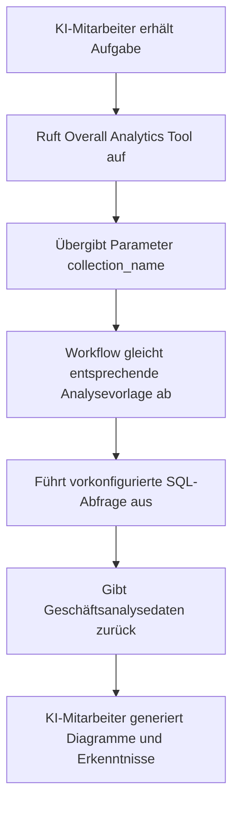

# Rollen und Berechtigungen

## Einführung

Die Berechtigungsverwaltung für KI-Mitarbeiter umfasst zwei Ebenen:

1.  **Zugriffsrechte für KI-Mitarbeiter**: Steuerung, welche Benutzer welche KI-Mitarbeiter nutzen dürfen
2.  **Datenzugriffsberechtigungen**: Wie KI-Mitarbeiter Berechtigungen beim Verarbeiten von Daten anwenden

Dieses Dokument beschreibt detailliert die Konfigurationsmöglichkeiten und die Funktionsweise dieser beiden Berechtigungsarten.

---

## Konfiguration der Zugriffsrechte für KI-Mitarbeiter

### Festlegen der für Rollen verfügbaren KI-Mitarbeiter

Navigieren Sie zur Seite `User & Permissions` und klicken Sie auf den Tab `Roles & Permissions`, um zur Rollenkonfigurationsseite zu gelangen.


Wählen Sie eine Rolle aus, klicken Sie auf den Tab `Permissions` und anschließend auf den Tab `AI employees`. Hier wird eine Liste der KI-Mitarbeiter angezeigt, die im KI-Mitarbeiter-Plugin verwaltet werden.

Klicken Sie das Kontrollkästchen in der Spalte `Available` der KI-Mitarbeiterliste an, um zu steuern, ob die aktuelle Rolle auf den jeweiligen KI-Mitarbeiter zugreifen kann.


---
:::tip KI-Übersetzungshinweis
Diese Dokumentation wurde automatisch von KI übersetzt.
:::


## Datenzugriffsberechtigungen

Wenn KI-Mitarbeiter Daten verarbeiten, hängt die Methode der Berechtigungssteuerung vom verwendeten Tool-Typ ab:

### Systeminterne Abfragetools (folgen Benutzerberechtigungen)

Die folgenden Tools greifen **strikt gemäß den Datenberechtigungen des aktuellen Benutzers** auf Daten zu:

| Tool-Name                          | Beschreibung                                                 |
| :--------------------------------- | :----------------------------------------------------------- |
| **Data source query**              | Abfrage der Datenbank unter Verwendung von Datenquelle, Sammlung und Feldern |
| **Data source records counting**   | Zählung der Gesamtzahl von Einträgen unter Verwendung von Datenquelle, Sammlung und Feldern |

**Funktionsweise:**

Wenn KI-Mitarbeiter diese Tools aufrufen, wird das System:
1.  Die Identität des aktuell angemeldeten Benutzers ermitteln
2.  Die für diesen Benutzer in **Rollen und Berechtigungen** konfigurierten Datenzugriffsregeln anwenden
3.  Nur die Daten zurückgeben, die der Benutzer anzeigen darf

**Beispielszenario:**

Angenommen, Vertriebsmitarbeiter A darf nur Kundendaten einsehen, für die er zuständig ist. Wenn er den KI-Mitarbeiter Viz zur Kundenanalyse verwendet:
-   Viz ruft `Data source query` auf, um die Kundentabelle abzufragen
-   Das System wendet die Datenberechtigungs-Filterregeln von Vertriebsmitarbeiter A an
-   Viz kann nur die Kundendaten sehen und analysieren, auf die Vertriebsmitarbeiter A Zugriff hat

Dies stellt sicher, dass **KI-Mitarbeiter die eigenen Datenzugriffsgrenzen des Benutzers nicht umgehen können**.

---

### Workflow-basierte benutzerdefinierte Geschäftstools (unabhängige Berechtigungslogik)

Geschäftsabfragetools, die über Workflows angepasst werden, verfügen über eine Berechtigungssteuerung, die **unabhängig von Benutzerberechtigungen** ist und durch die Geschäftslogik des Workflows bestimmt wird.

Diese Tools werden typischerweise verwendet für:
-   Feste Geschäftsanalyseprozesse
-   Vorkonfigurierte Aggregationsabfragen
-   Statistische Analysen über Berechtigungsgrenzen hinweg

#### Beispiel 1: Overall Analytics (Allgemeine Geschäftsanalyse)


Im CRM-Demo ist `Overall Analytics` eine vorlagenbasierte Geschäftsanalyse-Engine:

| Merkmal              | Beschreibung                                                 |
| :------------------- | :----------------------------------------------------------- |
| **Implementierung**  | Der Workflow liest vorkonfigurierte SQL-Vorlagen und führt schreibgeschützte Abfragen aus |
| **Berechtigungssteuerung** | Nicht durch aktuelle Benutzerberechtigungen eingeschränkt, gibt feste Geschäftsdaten aus, die durch Vorlagen definiert sind |
| **Anwendungsfälle**  | Bietet eine standardisierte ganzheitliche Analyse für spezifische Geschäftsobjekte (z. B. Leads, Opportunities, Kunden) |
| **Sicherheit**       | Alle Abfragevorlagen werden von Administratoren vorkonfiguriert und überprüft, wodurch die dynamische SQL-Generierung vermieden wird |

**Workflow:**



**Hauptmerkmale:**
-   Jeder Benutzer, der dieses Tool aufruft, erhält die **gleiche Geschäftsperspektive**
-   Der Datenumfang wird durch die Geschäftslogik definiert und nicht durch Benutzerberechtigungen gefiltert
-   Geeignet für die Bereitstellung standardisierter Geschäftsanalyseberichte

#### Beispiel 2: SQL Execution (Erweitertes Analysetool)


Im CRM-Demo ist `SQL Execution` ein flexibleres, aber streng kontrolliertes Tool:

| Merkmal              | Beschreibung                                                 |
| :------------------- | :----------------------------------------------------------- |
| **Implementierung**  | Ermöglicht der KI, SQL-Anweisungen zu generieren und auszuführen |
| **Berechtigungssteuerung** | Wird durch den Workflow gesteuert, typischerweise nur für Administratoren zugänglich |
| **Anwendungsfälle**  | Erweiterte Datenanalyse, explorative Abfragen, aggregierte Analysen über mehrere Tabellen hinweg |
| **Sicherheit**       | Erfordert, dass der Workflow schreibgeschützte Operationen (SELECT) einschränkt und die Verfügbarkeit über die Aufgabenkonfiguration steuert |

**Sicherheitsempfehlungen:**

1.  **Umfang einschränken**: Nur in Aufgaben von Verwaltungsblöcken aktivieren
2.  **Prompt-Einschränkungen**: Definieren Sie den Abfrageumfang und die Tabellennamen in den Aufgaben-Prompts klar
3.  **Workflow-Validierung**: Validieren Sie SQL-Anweisungen im Workflow, um sicherzustellen, dass nur SELECT-Operationen ausgeführt werden
4.  **Audit-Logs**: Protokollieren Sie alle ausgeführten SQL-Anweisungen zur Nachvollziehbarkeit

**Beispielkonfiguration:**

```markdown
Einschränkungen für Aufgaben-Prompts:
- Es dürfen nur CRM-bezogene Tabellen abgefragt werden (leads, opportunities, accounts, contacts)
- Es dürfen nur SELECT-Abfragen ausgeführt werden
- Der Zeitraum ist auf das letzte 1 Jahr beschränkt
- Die Anzahl der zurückgegebenen Ergebnisse ist auf 1000 Einträge begrenzt
```

---

## Empfehlungen für das Berechtigungsdesign

### Wählen Sie die Berechtigungsstrategie nach Geschäftsszenario

| Geschäftsszenario                          | Empfohlener Tool-Typ               | Berechtigungsstrategie        | Grund                                                        |
| :----------------------------------------- | :--------------------------------- | :---------------------------- | :----------------------------------------------------------- |
| Vertriebsmitarbeiter, der eigene Kunden ansieht | Systeminterne Abfragetools         | Folgt Benutzerberechtigungen  | Gewährleistet Datenisolation und schützt die Geschäftssicherheit |
| Abteilungsleiter, der Teamdaten ansieht    | Systeminterne Abfragetools         | Folgt Benutzerberechtigungen  | Wendet den Datenumfang der Abteilung automatisch an         |
| Führungskraft, die globale Geschäftsanalysen ansieht | Workflow-basierte benutzerdefinierte Tools / Overall Analytics | Unabhängige Geschäftslogik    | Bietet eine standardisierte ganzheitliche Perspektive        |
| Datenanalyst, der explorative Abfragen durchführt | SQL Execution                      | Verfügbare Objekte streng einschränken | Erfordert Flexibilität, muss aber den Zugriffsumfang kontrollieren |
| Reguläre Benutzer, die Standardberichte ansehen | Overall Analytics                  | Unabhängige Geschäftslogik    | Feste Analysestandards, keine Sorge um zugrunde liegende Berechtigungen |

### Mehrschichtige Schutzstrategie

Für sensible Geschäftsszenarien wird eine mehrschichtige Berechtigungssteuerung empfohlen:

1.  **Zugriffsebene für KI-Mitarbeiter**: Steuert, welche Rollen welche KI-Mitarbeiter nutzen dürfen
2.  **Aufgaben-Sichtbarkeitsebene**: Steuert die Anzeige von Aufgaben durch Blockkonfiguration
3.  **Tool-Autorisierungsebene**: Überprüft Benutzeridentität und Berechtigungen in Workflows
4.  **Datenzugriffsebene**: Steuert den Datenumfang durch Benutzerberechtigungen oder Geschäftslogik

**Beispiel:**

```
Szenario: Nur die Finanzabteilung darf KI für Finanzanalysen nutzen

- KI-Mitarbeiter-Berechtigungen: Nur die Finanzrolle kann auf den KI-Mitarbeiter "Finance Analyst" zugreifen
- Aufgabenkonfiguration: Finanzanalyseaufgaben werden nur in Finanzmodulen angezeigt
- Tool-Design: Finanz-Workflow-Tools überprüfen die Benutzerabteilung
- Datenberechtigungen: Zugriffsrechte für Finanztabellen werden nur der Finanzrolle gewährt
```

---

## Häufig gestellte Fragen (FAQ)

### F: Auf welche Daten können KI-Mitarbeiter zugreifen?

**A:** Dies hängt vom verwendeten Tool-Typ ab:
-   **Systeminterne Abfragetools**: Können nur auf Daten zugreifen, die der aktuelle Benutzer anzeigen darf
-   **Workflow-basierte benutzerdefinierte Tools**: Werden durch die Geschäftslogik des Workflows bestimmt und sind möglicherweise nicht durch Benutzerberechtigungen eingeschränkt

### F: Wie kann verhindert werden, dass KI-Mitarbeiter sensible Daten preisgeben?

**A:** Wenden Sie einen mehrschichtigen Schutz an:
1.  Konfigurieren Sie die Rollenzugriffsberechtigungen für KI-Mitarbeiter, um einzuschränken, wer sie nutzen darf
2.  Bei systeminternen Tools verlassen Sie sich auf Benutzerdatenberechtigungen für die automatische Filterung
3.  Bei benutzerdefinierten Tools implementieren Sie die Geschäftslogik-Validierung in Workflows
4.  Sensible Operationen (wie SQL Execution) sollten nur Administratoren autorisiert werden

### F: Was ist, wenn ich möchte, dass bestimmte KI-Mitarbeiter Benutzerberechtigungsbeschränkungen umgehen?

**A:** Verwenden Sie Workflow-basierte benutzerdefinierte Geschäftstools:
-   Erstellen Sie Workflows, um spezifische Geschäftsabfragelogiken zu implementieren
-   Steuern Sie den Datenumfang und die Zugriffsregeln in Workflows
-   Konfigurieren Sie Tools für die Nutzung durch KI-Mitarbeiter
-   Steuern Sie über die Zugriffsberechtigungen der KI-Mitarbeiter, wer diese Funktion aufrufen kann

### F: Was ist der Unterschied zwischen Overall Analytics und SQL Execution?

**A:**

| Vergleichsdimension | Overall Analytics                          | SQL Execution                                |
| :------------------ | :----------------------------------------- | :------------------------------------------- |
| Flexibilität        | Niedrig (kann nur vorkonfigurierte Vorlagen verwenden) | Hoch (kann Abfragen dynamisch generieren)    |
| Sicherheit          | Hoch (alle Abfragen vorab geprüft)         | Mittel (erfordert Einschränkungen und Validierung) |
| Zielbenutzer        | Reguläre Geschäftsbenutzer                 | Administratoren oder leitende Analysten      |
| Wartungskosten      | Muss Analysevorlagen pflegen               | Keine Wartung, erfordert aber Überwachung    |
| Datenkonsistenz     | Stark (standardisierte Metriken)           | Schwach (Abfrageergebnisse können inkonsistent sein) |

---

## Best Practices

1.  **Standardmäßig Benutzerberechtigungen folgen**: Sofern kein klarer Geschäftsanlass besteht, sollten Sie vorrangig systeminterne Tools verwenden, die den Benutzerberechtigungen folgen
2.  **Standardisierte Analyse mit Vorlagen**: Für gängige Analyseszenarien nutzen Sie das Overall Analytics-Muster, um standardisierte Funktionen bereitzustellen
3.  **Erweiterte Tools streng kontrollieren**: Hochprivilegierte Tools wie SQL Execution sollten nur wenigen Administratoren autorisiert werden
4.  **Aufgabenbasierte Isolation**: Konfigurieren Sie sensible Aufgaben in spezifischen Blöcken und implementieren Sie die Isolation über Seiten-Zugriffsberechtigungen
5.  **Audit und Überwachung**: Protokollieren Sie das Datenzugriffsverhalten von KI-Mitarbeitern und überprüfen Sie regelmäßig ungewöhnliche Operationen