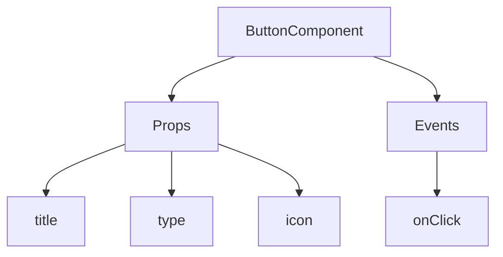
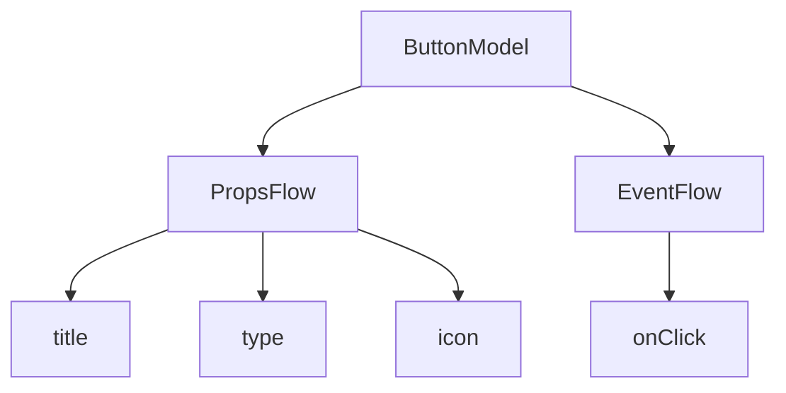

# Schnellstart: Eine orchestrierbare Schaltflächenkomponente erstellen

In React rendern wir eine Schaltflächenkomponente normalerweise so:

```tsx pure
import { Button } from 'antd';

export default function App() {
  return <Button type="primary">Primary Button</Button>;
}
```

Obwohl der obige Code einfach ist, handelt es sich um eine **statische Komponente**, die den Anforderungen einer No-Code-Plattform an Konfigurierbarkeit und Orchestrierungsfähigkeiten nicht gerecht wird.

In NocoBase's FlowEngine können Sie mithilfe von **FlowModel + FlowDefinition** schnell Komponenten erstellen, die Konfiguration und Ereignissteuerung unterstützen, und so leistungsfähigere No-Code-Funktionen realisieren.

---

## Schritt 1: Die Komponente mit FlowModel rendern

<code src="./demos/quickstart-1-basic.tsx"></code>

### 🧠 Schlüsselkonzepte

- `FlowModel` ist das zentrale Komponentenmodell in FlowEngine, das die Komponentenlogik, das Rendering und die Konfigurationsmöglichkeiten kapselt.
- Jede UI-Komponente kann über `FlowModel` instanziiert und einheitlich verwaltet werden.

### 📌 Implementierungsschritte

#### 1. Eine benutzerdefinierte Modellklasse erstellen

```tsx pure
class MyModel extends FlowModel {
  render() {
    return <Button {...this.props} />;
  }
}
```

#### 2. Eine Modellinstanz erstellen

```ts
const model = this.flowEngine.createModel({
  uid: 'my-model',
  use: 'MyModel',
  props: {
    type: 'primary',
    children: 'Primary Button',
  },
});
```

#### 3. Mit `<FlowModelRenderer />` rendern

```tsx pure
<FlowModelRenderer model={model} />
```

---
:::tip KI-Übersetzungshinweis
Diese Dokumentation wurde automatisch von KI übersetzt.
:::


## Schritt 2: PropsFlow hinzufügen, um Schaltflächeneigenschaften konfigurierbar zu machen

<code src="./demos/quickstart-2-register-propsflow.tsx"></code>

### 💡 Warum PropsFlow verwenden?

Die Verwendung von Flow anstelle statischer Props ermöglicht Folgendes für Eigenschaften:
- Dynamische Konfiguration
- Visuelle Bearbeitung
- Zustands-Wiedergabe und Persistenz

### 🛠 Wichtige Anpassungen

#### 1. Den Flow für Schaltflächeneigenschaften definieren

```tsx pure

const buttonSettings = defineFlow({
  key: 'buttonSettings',
  
  title: 'Schaltflächeneinstellungen',
  steps: {
    general: {
      title: 'Allgemeine Konfiguration',
      uiSchema: {
        title: {
          type: 'string',
          title: 'Schaltflächen-Titel',
          'x-decorator': 'FormItem',
          'x-component': 'Input',
        },
        type: {
          type: 'string',
          title: 'Typ',
          'x-decorator': 'FormItem',
          'x-component': 'Select',
          enum: [
            { label: 'Primär', value: 'primary' },
            { label: 'Standard', value: 'default' },
            { label: 'Gefahr', value: 'danger' },
            { label: 'Gestrichelt', value: 'dashed' },
            { label: 'Link', value: 'link' },
            { label: 'Text', value: 'text' },
          ],
        },
        icon: {
          type: 'string',
          title: 'Symbol',
          'x-decorator': 'FormItem',
          'x-component': 'Select',
          enum: [
            { label: 'Suchen', value: 'SearchOutlined' },
            { label: 'Hinzufügen', value: 'PlusOutlined' },
            { label: 'Löschen', value: 'DeleteOutlined' },
            { label: 'Bearbeiten', value: 'EditOutlined' },
            { label: 'Einstellungen', value: 'SettingOutlined' },
          ],
        },
      },
      defaultParams: {
        type: 'primary',
      },
      // Schritt-Handler-Funktion, setzt Modelleigenschaften
      handler(ctx, params) {
        ctx.model.setProps('children', params.title);
        ctx.model.setProps('type', params.type);
        ctx.model.setProps('icon', params.icon ? React.createElement(icons[params.icon]) : undefined);
      },
    },
  },
});

MyModel.registerFlow(buttonSettings);
```

#### 2. `stepParams` anstelle von statischen `props` verwenden

```diff
const model = this.flowEngine.createModel({
  uid: 'my-model',
  use: 'MyModel',
- props: {
-   type: 'primary',
-   children: 'Primary Button',
- },
+ stepParams: {
+   buttonSettings: {
+     general: {
+       title: 'Primary Button',
+       type: 'primary',
+     },
+   },
+ },
});
```

> ✅ Die Verwendung von `stepParams` ist der von FlowEngine empfohlene Ansatz, da er Probleme mit nicht serialisierbaren Daten (wie React-Komponenten) vermeidet.

#### 3. Die Eigenschaften-Konfigurationsoberfläche aktivieren

```diff
- <FlowModelRenderer model={model} />
+ <FlowModelRenderer model={model} showFlowSettings />
```

---

## Schritt 3: Schaltflächen-Ereignis-Flow (EventFlow) unterstützen

<code src="./demos/quickstart-3-register-eventflow.tsx"></code>

### 🎯 Szenario: Nach dem Klicken der Schaltfläche ein Bestätigungsdialogfeld anzeigen

#### 1. Auf das onClick-Ereignis lauschen

onClick auf nicht-intrusive Weise hinzufügen

```diff
const myPropsFlow = defineFlow({
  key: 'buttonSettings',
  steps: {
    general: {
      // ... ausgelassen
      handler(ctx, params) {
        // ... ausgelassen
+       ctx.model.setProps('onClick', (event) => {
+         ctx.model.dispatchEvent('click', { event });
+       });
      },
    },
  },
});
```

#### 2. Den Ereignis-Flow definieren

```ts
const myEventFlow = defineFlow({
  key: 'clickSettings',
  on: 'click',
  title: 'Schaltflächen-Ereignis',
  steps: {
    confirm: {
      title: 'Konfiguration der Bestätigungsaktion',
      uiSchema: {
        title: {
          type: 'string',
          title: 'Titel des Dialogfelds',
          'x-decorator': 'FormItem',
          'x-component': 'Input',
        },
        content: {
          type: 'string',
          title: 'Inhalt des Dialogfelds',
          'x-decorator': 'FormItem',
          'x-component': 'Input.TextArea',
        },
      },
      defaultParams: {
        title: 'Aktion bestätigen',
        content: 'Sie haben die Schaltfläche geklickt. Möchten Sie bestätigen?',
      },
      async handler(ctx, params) {
        // Dialogfeld
        const confirmed = await ctx.modal.confirm({
          title: params.title,
          content: params.content,
        });
        // Nachricht
        await ctx.message.info(`Sie haben die Schaltfläche geklickt. Bestätigungsergebnis: ${confirmed ? 'Bestätigt' : 'Abgebrochen'}`);
      },
    },
  },
});
MyModel.registerFlow(myEventFlow);
```

**Zusätzliche Hinweise:**
- Ein EventFlow ermöglicht es, das Verhalten der Schaltfläche flexibel über einen Flow zu konfigurieren, z. B. das Anzeigen von Dialogfeldern, Nachrichten, das Ausführen von API-Aufrufen usw.
- Sie können für verschiedene Ereignisse (wie `onClick`, `onMouseEnter` usw.) unterschiedliche EventFlows registrieren, um komplexe Geschäftsanforderungen zu erfüllen.

#### 3. Ereignis-Flow-Parameter konfigurieren

Beim Erstellen des Modells können Sie die Standardparameter für den Ereignis-Flow über `stepParams` konfigurieren:

```ts
const model = this.flowEngine.createModel({
  uid: 'my-model',
  use: 'MyModel',
  stepParams: {
    buttonSettings: {
      general: {
        title: 'Primary Button',
        type: 'primary',
      },
    },
    clickSettings: {
      confirm: {
        title: 'Aktion bestätigen',
        content: 'Sie haben die Schaltfläche geklickt. Möchten Sie bestätigen?',
      },
    },
  },
});
```

---

## Modellvergleich: ReactComponent vs. FlowModel

Flow ändert nichts an der Implementierung von Komponenten. Es erweitert lediglich eine ReactComponent um die Unterstützung für PropsFlow und EventFlow, sodass die Eigenschaften und Ereignisse der Komponente visuell konfiguriert und orchestriert werden können.


### ReactComponent



### FlowModel



## Zusammenfassung

Durch die oben genannten drei Schritte haben wir eine Schaltflächenkomponente erstellt, die Konfiguration und Ereignis-Orchestrierung unterstützt und folgende Vorteile bietet:

- 🚀 Visuelle Konfiguration von Eigenschaften (wie Titel, Typ, Symbol)
- 🔄 Ereignisreaktionen können von einem Flow übernommen werden (z. B. Klick zum Anzeigen eines Dialogfelds)
- 🔧 Unterstützung für zukünftige Erweiterungen (wie bedingte Logik, Variablenbindung usw.)

Dieses Muster ist auch auf jede UI-Komponente anwendbar, wie Formulare, Listen und Diagramme. In NocoBase's FlowEngine ist **alles orchestrierbar**.