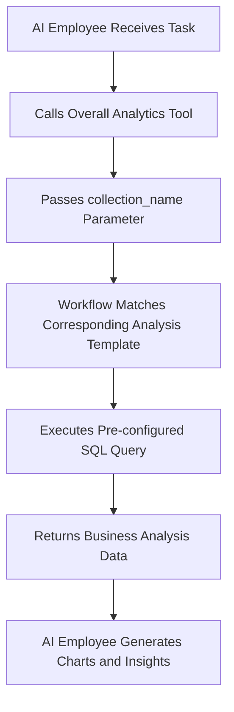

# Roles & Permissions

## Introduction

AI employee permission management consists of two levels:

1. **AI Employee Access Permissions**: Control which users can use which AI employees
2. **Data Access Permissions**: How AI employees apply permission controls when processing data

This document details the configuration methods and working principles of these two types of permissions.

---

## Configuring AI Employee Access Permissions

### Setting Available AI Employees for Roles

Go to the `User & Permissions` page, click the `Roles & Permissions` tab to enter the role configuration page.


Select a role, click the `Permissions` tab, and then click the `AI employees` tab. This will display the list of AI employees managed in the AI employees plugin.

Click the checkbox in the `Available` column of the AI employee list to control whether the current role can access that AI employee.


---

## Data Access Permissions

When AI employees process data, the permission control method depends on the type of tool used:

### System Built-in Data Query Tools (Follow User Permissions)


The following tools **strictly follow the current user's data permissions** for data access:

| Tool Name                            | Description                     |
| ------------------------------------ | ------------------------------- |
| **Data source query**                | Query database using data source, collection, and fields |
| **Data source records counting**     | Count total records using data source, collection, and fields |

**How It Works:**

When AI employees call these tools, the system will:
1. Identify the current logged-in user's identity
2. Apply the data access rules configured for that user in **Roles & Permissions**
3. Return only the data that the user has permission to view

**Example Scenario:**

Suppose salesperson A can only view customer data they are responsible for. When they use AI employee Viz to analyze customers:
- Viz calls `Data source query` to query the customer table
- The system applies salesperson A's data permission filtering rules
- Viz can only see and analyze customer data that salesperson A has access to

This ensures that **AI employees cannot bypass the user's own data access boundaries**.

---

### Workflow Custom Business Tools (Independent Permission Logic)

Business query tools customized through workflows have permission control **independent of user permissions**, determined by the workflow's business logic.

These tools are typically used for:
- Fixed business analysis processes
- Pre-configured aggregate queries
- Cross-permission boundary statistical analysis

#### Example 1: Overall Analytics (General Business Analysis)


In the CRM Demo, `Overall Analytics` is a template-based business analysis engine:

| Feature              | Description                                    |
| -------------------- | ---------------------------------------------- |
| **Implementation**   | Workflow reads pre-configured SQL templates and executes read-only queries |
| **Permission Control** | Not limited by current user permissions, outputs fixed business data defined by templates |
| **Use Cases**        | Provides standardized holistic analysis for specific business objects (e.g., leads, opportunities, customers) |
| **Security**         | All query templates are pre-configured and reviewed by administrators, avoiding dynamic SQL generation |

**Workflow:**



**Key Characteristics:**
- Any user calling this tool will get the **same business perspective**
- Data scope is defined by business logic, not filtered by user permissions
- Suitable for providing standardized business analysis reports

#### Example 2: SQL Execution (Advanced Analysis Tool)


In the CRM Demo, `SQL Execution` is a more flexible but strictly controlled tool:

| Feature              | Description                                    |
| -------------------- | ---------------------------------------------- |
| **Implementation**   | Allows AI to generate and execute SQL statements |
| **Permission Control** | Controlled by workflow, typically limited to administrators only |
| **Use Cases**        | Advanced data analysis, exploratory queries, cross-table aggregate analysis |
| **Security**         | Requires workflow to restrict read-only operations (SELECT) and control availability through task configuration |

**Security Recommendations:**

1. **Limit Scope**: Only enable in management block tasks
2. **Prompt Constraints**: Clearly define query scope and table names in task prompts
3. **Workflow Validation**: Validate SQL statements in workflow to ensure only SELECT operations are executed
4. **Audit Logs**: Record all executed SQL statements for traceability

**Example Configuration:**

```markdown
Task Prompt Constraints:
- Only query CRM-related tables (leads, opportunities, accounts, contacts)
- Only execute SELECT queries
- Time range limited to the last 1 year
- Return results limited to 1000 records
```

---

## Permission Design Recommendations

### Choose Permission Strategy by Business Scenario

| Business Scenario         | Recommended Tool Type | Permission Strategy | Reason                   |
| ------------------------- | -------------------- | ------------------- | ------------------------ |
| Salesperson viewing own customers | System built-in query tools | Follow user permissions | Ensure data isolation and protect business security |
| Department manager viewing team data | System built-in query tools | Follow user permissions | Automatically apply department data scope |
| Executive viewing global business analysis | Workflow custom tools (Overall Analytics) | Independent business logic | Provide standardized holistic perspective |
| Data analyst exploratory queries | SQL Execution | Strictly limit available objects | Requires flexibility but must control access scope |
| Regular users viewing standard reports | Overall Analytics | Independent business logic | Fixed analysis standards, no need to worry about underlying permissions |

### Multi-layer Protection Strategy

For sensitive business scenarios, it is recommended to adopt multi-layer permission control:

1. **AI Employee Access Layer**: Control which roles can use which AI employees
2. **Task Visibility Layer**: Control task display through block configuration
3. **Tool Authorization Layer**: Verify user identity and permissions in workflows
4. **Data Access Layer**: Control data scope through user permissions or business logic

**Example:**

```
Scenario: Only finance department can use AI for financial analysis

- AI Employee Permissions: Only finance role can access "Finance Analyst" AI employee
- Task Configuration: Finance analysis tasks only display in finance modules
- Tool Design: Finance workflow tools verify user department
- Data Permissions: Finance table access permissions only granted to finance role
```

---

## FAQ

### Q: What data can AI employees access?

**A:** Depends on the tool type used:
- **System built-in query tools**: Can only access data that the current user has permission to view
- **Workflow custom tools**: Determined by workflow business logic, may not be limited by user permissions

### Q: How to prevent AI employees from leaking sensitive data?

**A:** Adopt multi-layer protection:
1. Configure AI employee role access permissions to limit who can use them
2. For system built-in tools, rely on user data permissions for automatic filtering
3. For custom tools, implement business logic validation in workflows
4. Sensitive operations (such as SQL Execution) should only be authorized to administrators

### Q: What if I want certain AI employees to bypass user permission restrictions?

**A:** Use workflow custom business tools:
- Create workflows to implement specific business query logic
- Control data scope and access rules in workflows
- Configure tools for AI employees to use
- Control who can call this capability through AI employee access permissions

### Q: What's the difference between Overall Analytics and SQL Execution?

**A:**

| Comparison Dimension | Overall Analytics   | SQL Execution     |
| -------------------- | ------------------- | ----------------- |
| Flexibility          | Low (can only use pre-configured templates) | High (can dynamically generate queries) |
| Security             | High (all queries pre-reviewed) | Medium (requires constraints and validation) |
| Target Users         | Regular business users | Administrators or senior analysts |
| Maintenance Cost     | Need to maintain analysis templates | No maintenance, but requires monitoring |
| Data Consistency     | Strong (standardized metrics) | Weak (query results may be inconsistent) |

---

## Best Practices

1. **Default to User Permissions**: Unless there is a clear business need, prioritize using system built-in tools that follow user permissions
2. **Templated Standard Analysis**: For common analysis scenarios, use the Overall Analytics pattern to provide standardized capabilities
3. **Strictly Control Advanced Tools**: High-privilege tools like SQL Execution should only be authorized to a few administrators
4. **Task-level Isolation**: Configure sensitive tasks in specific blocks and implement isolation through page access permissions
5. **Audit and Monitoring**: Record AI employee data access behavior and regularly review abnormal operations
