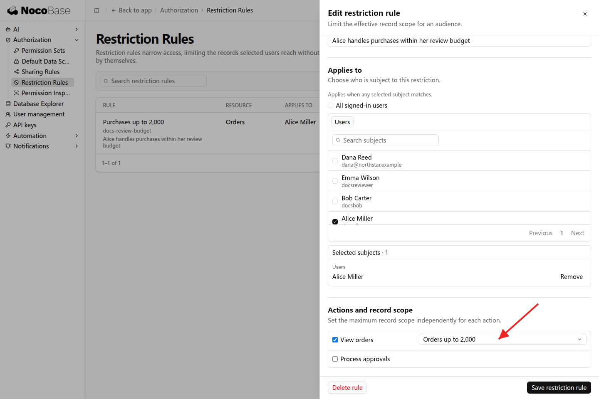
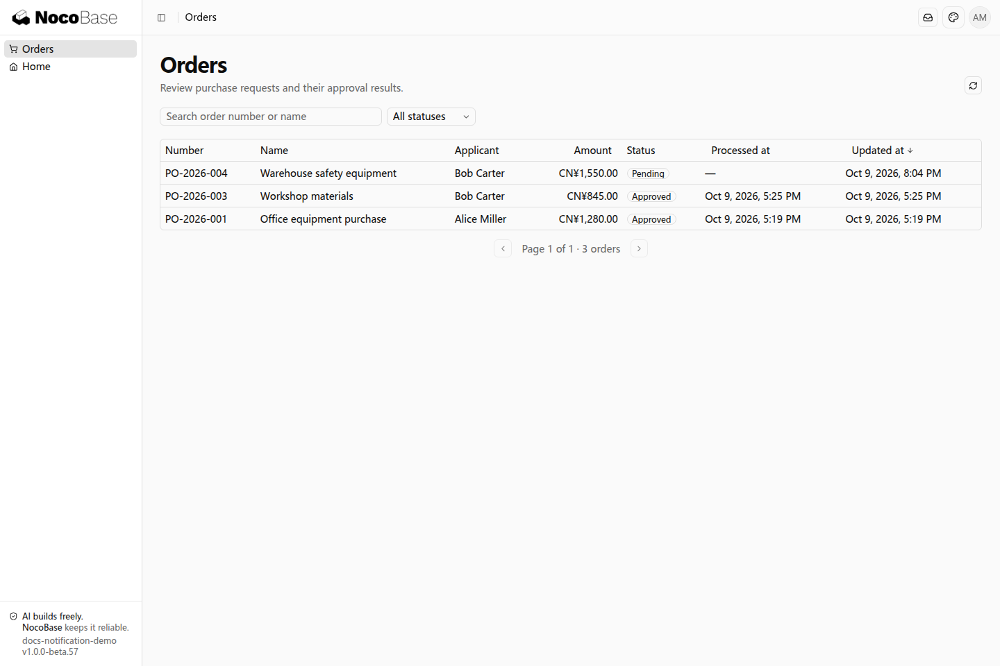

# Restriction rules

Restriction rules apply more specific conditions to records accessible through jobs and sharing. For example, a collaborator responsible for purchases up to CNY 2,000 can have a corresponding limit on their viewing scope.

## Example: view orders within a budget

```text
Alice's purchasing collaboration covers orders up to CNY 2,000.
Configure a restriction for her View orders action that allows records with amounts less than or equal to CNY 2,000.
Apply the restriction to viewing access obtained from permission sets, default scope, and sharing.
Let administrators select the appropriate amount scope in Settings.
```

In Settings → Authorization → Restriction Rules, select Alice, the order-viewing action, and the amount scope. The selected condition describes allowed records: orders up to CNY 2,000.



### View the result

Alice's list retains accessible orders whose amounts meet the condition, including the shared PO-2026-004 for CNY 1,550.



## Set conditions for responsibilities

The application provides conditions such as amount and business status. Confidential workflows can similarly allow only non-confidential records. Restrictions narrow existing scopes and express business boundaries that must apply consistently.

Viewing, editing, and approval are separate actions. Specify which actions the requirement covers. Collection-wide restrictions and complex relationship conditions are further development topics.
