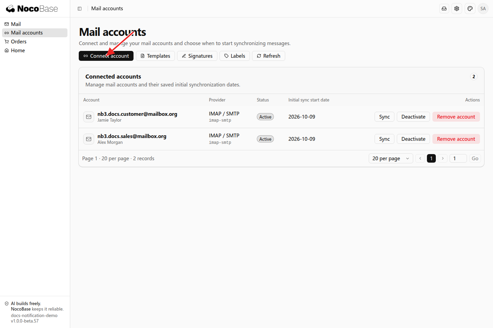
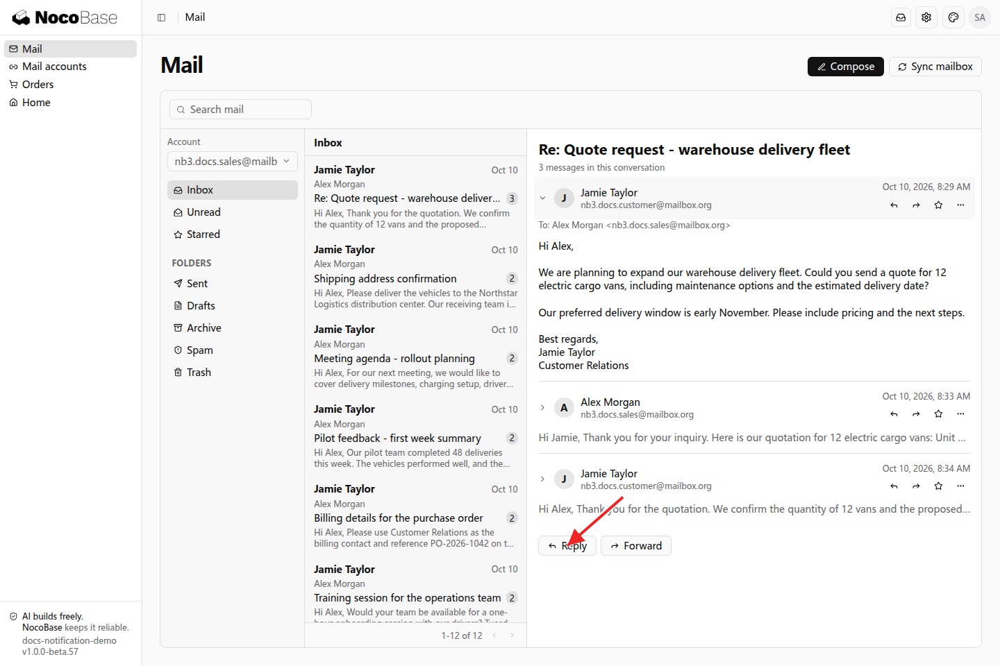
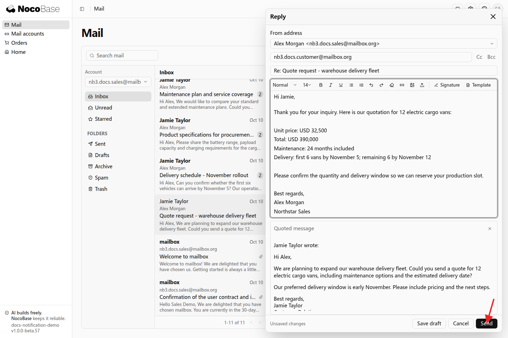
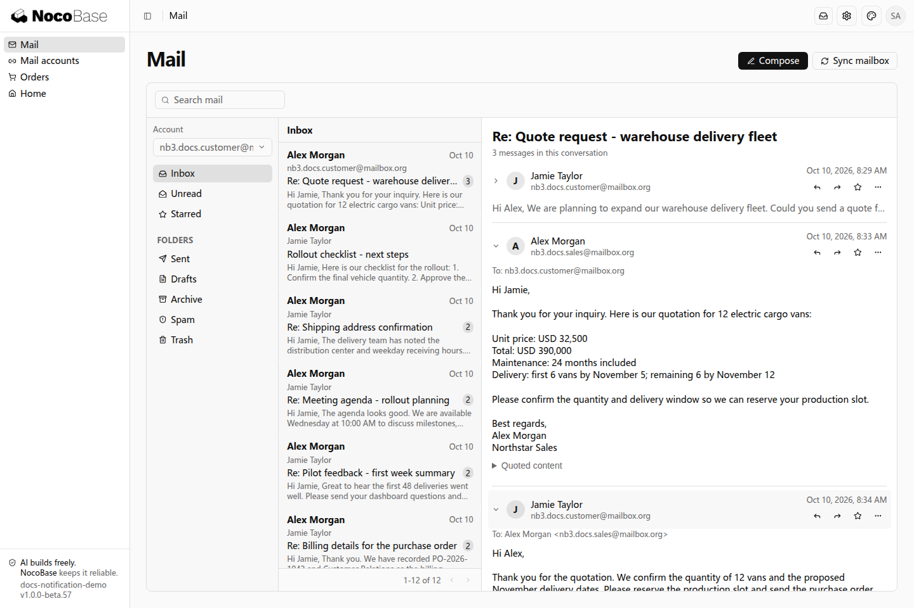

# Sync and Send Email

This example adds a mail center where a sales representative reads and replies to a customer quotation request. The message list, reading view, and reply actions share one workspace.

## Before you start

- An administrator configures an available mail provider. See [Mailbox Configuration](./configuration.md).
- Users prepare their mailbox credentials or app password. Gmail and Microsoft 365 use provider authorization.

## Example: reply to customer email

Give the following prompt to your Agent:

```text
Add a mail center and a mailbox account management entry to the application. Users can connect their own mailboxes, select a mailbox, synchronize incoming messages, read messages and attachments, and reply.

When a sales representative receives a quotation request, they can reply from the mail center. Keep the original subject and conversation context, and address the reply to the original sender. Each user works with their own connected mailboxes.
```

### 1. Connect a mailbox

Open the mailbox accounts page and click **Connect account**. Select a provider, enter the mailbox information, and choose a starting date for the initial synchronization. This example uses a dedicated sales mailbox. Its address and connection status appear in the account list.



### 2. Synchronize and read incoming messages

Open the mail center, select the sales mailbox, and synchronize incoming messages. The list contains quotation requests, delivery arrangements, and information requests. Select a message to read it.



### 3. Reply to the customer

Click **Reply** and enter the pricing and delivery details. The reply includes the recipient, subject, and original context. Click **Send** when ready.



### 4. View the received reply

The customer mailbox receives the pricing and delivery information. Both parties can continue the same conversation.



For signatures, templates, and business page integration, see [More Mail Features](./usage.md).
