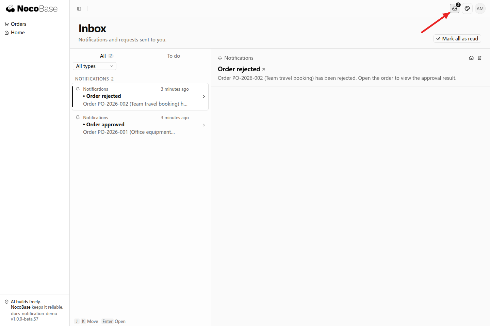
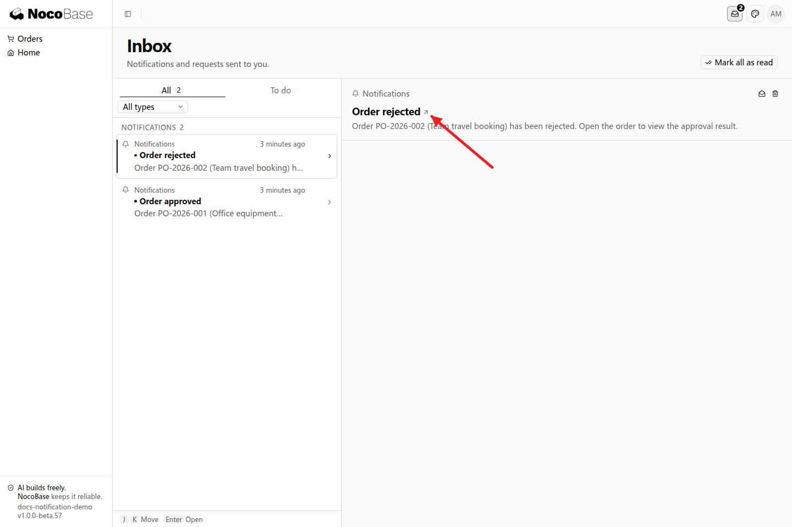
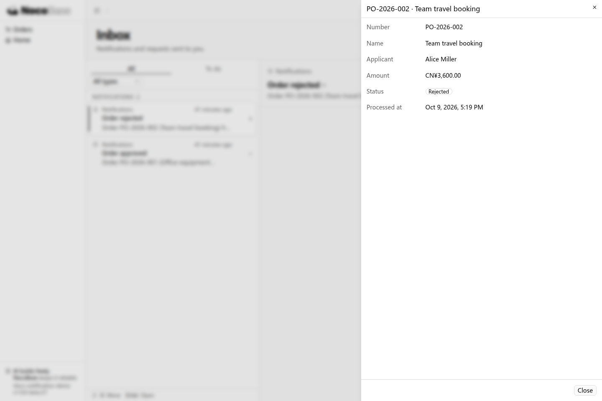
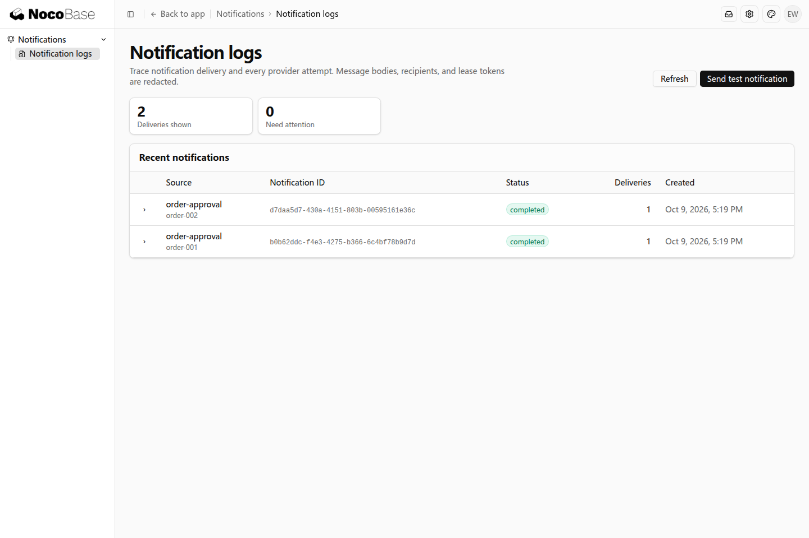

# Notifications

Notifications send messages to specified recipients when a business event occurs. Applications can deliver results and reminders through in-app messages, email, or group bots. Messages can also include links to business records.

For example, notify an applicant when an order is approved or rejected, notify an assignee when a task is assigned, or remind an owner before a certification expires.

## Available capabilities

| Notification type                  | Use cases                                                 | What you need                                                |
| ---------------------------------- | --------------------------------------------------------- | ------------------------------------------------------------ |
| In-app messages                    | Approval results and task reminders for application users | Application users and an enabled in-app channel              |
| Email                              | Business results and reminders sent to an email address   | An SMTP or Resend service, a sender, and recipient addresses |
| Feishu and DingTalk group messages | Team reminders sent to a specific group                   | A group bot and its Webhook configuration                    |

Notifications handle message delivery. Your application's business rules determine when to send a message, who receives it, and what it says. When using multiple channels, specify the recipients and sending conditions for each channel.

Email here means business notifications sent by the application. To connect a personal mailbox, read correspondence, and reply to customers, see [Mail](./mail).

## Before you start

The following example uses in-app messages, so you do not need an email service or a group bot. You need:

- **A running NocoBase application**: Your development Agent must be able to read and modify its source code. If you do not have an application yet, follow [Create an app with a Coding Agent](../get-started/create-app-with-agent).
- **Applicant and reviewer accounts**: The applicant receives messages, and the reviewer processes orders. Use existing business accounts or ask the Agent to create example accounts.

Tell the Agent which event triggers the notification, who receives it, what the message contains, and where its link should lead. The Agent connects the business trigger and record link to the application; administrators can view notification logs in Settings.

## Complete example: order approval notifications

In an order approval application, an applicant submits an order, and a reviewer approves or rejects it. After the decision, the applicant should receive an in-app message with a link to the order.

Give the following requirements to your development Agent. Reuse existing order data and pages if they are available; otherwise, ask the Agent to create them.

```text
I want to add order approval to the current application and notify applicants
of the results through in-app messages.

Orders include a number, name, applicant, amount, and approval status.
Applicants can view their own orders. Reviewers can view pending orders
and approve or reject them. Reuse existing order and approval features if available.

After approval or rejection, send one in-app message only to the order's applicant.
The title indicates whether the order was approved or rejected.
The body includes the order number, name, and approval result.
Clicking the message opens the corresponding order details.
Do not send while approval is pending. Notify only once for the same approval result.

Applicants view messages in their Inbox. Administrators can view delivery records
in notification logs. A notification failure does not affect the saved approval result.
```

### Complete the integration and process orders

After the Agent finishes, the application should have an order list, approval actions, and a link from each notification to its order. Reuse the application's existing Inbox and notification logs.

Sign in as a reviewer, open Orders, open a pending order, and click Approve. You can also open another order, click Reject, and confirm.

The following example shows both results: applicant Alice's order `PO-2026-001` was approved, and `PO-2026-002` was rejected.

### See the results

**Step 1: open the notification center to view approval results.**

Sign in as applicant Alice and click the Inbox icon with the unread count in the upper-right corner. The Inbox shows two messages, `Order approved` and `Order rejected`. Their bodies include the order number, name, and approval result.



**Step 2: click the message to view the order details.**

Select `Order rejected` on the left, then click the message title link on the right.



The application opens the corresponding order, `PO-2026-002`, with status `Rejected`. This takes the recipient from the notification to the business record.



Messages remain available in the Inbox after a refresh. This example sends to the order's applicant; other business rules can send to a task assignee or owner in the same way.

## View notification logs

The notification capability includes a Notification logs page in Settings. Administrators with the required permissions can open **Settings → Notifications → Notification logs** to view notifications and delivery status. This page records notifications from different business features. In this example, the two order decisions each created a record with status `completed`.



The **Send test notification** button in the upper-right corner is also provided by the notification capability. Administrators can select a configured channel and recipient to send a message directly and check delivery, without first processing an order.

If an applicant does not receive an approval message, look for its record here. If there is no record, ask the Agent to check the business trigger. If delivery failed, check the channel configuration and recipient.

## Further use: email and group notifications

Email and group notifications require an external service. The person responsible for developing or deploying the application configures these channels.

| Notification type                  | Who supplies the information                                                                                              | How to configure the application                                                                                |
| ---------------------------------- | ------------------------------------------------------------------------------------------------------------------------- | --------------------------------------------------------------------------------------------------------------- |
| SMTP email                         | The email service owner supplies the SMTP host, port, sending account, password or authorization code, and sender address | The developer or deployment operator configures an SMTP channel under `notification.channels` in `config.yml`   |
| Resend email                       | The Resend account owner supplies an API Key and a valid sender address                                                   | The developer or deployment operator adds a Resend channel in the same configuration section                    |
| Feishu and DingTalk group messages | Someone with permission to manage the target group adds a bot and obtains its Webhook URL                                 | The developer or deployment operator adds the corresponding group bot channel in the same configuration section |

Ask the development Agent to prepare the configuration fields for the selected service. The person responsible for configuration fills in passwords, authorization codes, API Keys, and Webhook URLs in the application's runtime environment. The Notification logs page provides delivery records and test messages.

After configuring a channel, give the Agent the business requirements. For example, add email alongside the existing in-app messages:

```text
Add email to the existing order approval notifications,
using the application's configured email channel.

After an order is approved or rejected, send the result to the applicant's account email.
Include the order number in the subject and the order name and result in the body.
Keep the existing in-app messages. If the applicant has no email address,
send only the in-app message.
An email failure must not affect the approval result or in-app message.
Administrators can view delivery records in notification logs.
```

## Related links

- [Send notifications](../tutorials/notifications) — Connect notifications to order pages and approval actions.
- [Mail](./mail) — Connect personal mailboxes and handle correspondence.
- [Scheduled tasks](./scheduler) — Trigger business reminders on a schedule.
