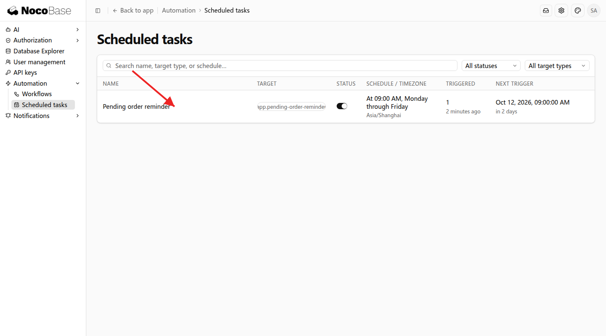
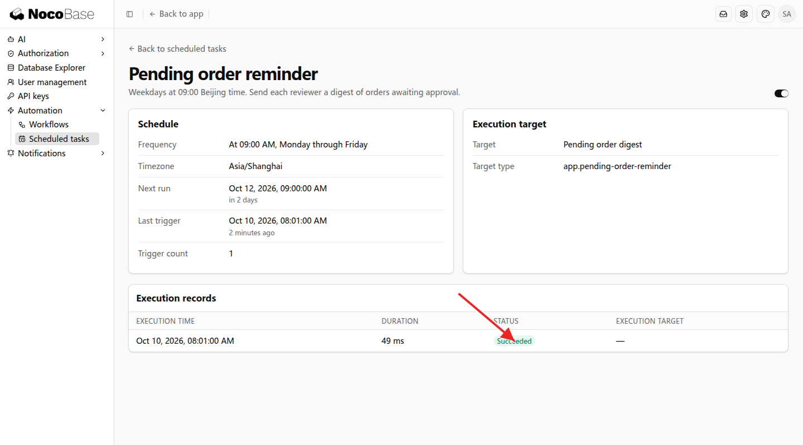
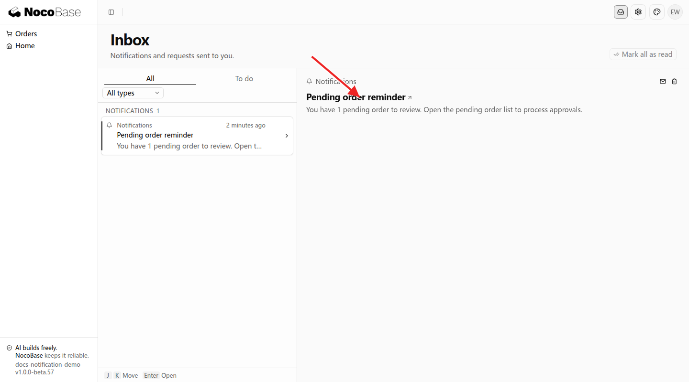

# Scheduled tasks

NocoBase 3 can run business operations at specified times or intervals. For example, remind people to process pending work each day, generate a weekly report, or periodically synchronize business data.

Tell your Agent when to run, which data to process, and what result to produce. After the Agent integrates the business logic, administrators can view the schedule and execution records in Settings, and pause or resume the task.

## Before you start

This example adds approval reminders to an existing order application. Prepare pending orders and reviewer accounts, and specify who reviews each order.

Tell the Agent the execution time and timezone, which orders to include, who receives the notification, and where it opens when clicked.

## Example: remind reviewers about pending orders

Reviewers need to process pending orders promptly. On weekdays, the application checks pending orders, groups them by reviewer, and sends an in-app reminder.

```text
Add a Pending order reminder to the existing order application.

At 09:00 Beijing time every weekday, find orders awaiting approval, group them by reviewer, and send each reviewer one in-app notification.
Include the pending order count and link to the pending order list. Send nothing when there are no pending orders.
Administrators can view the schedule and execution records in Settings, and pause or resume reminders.
```

### Viewing the result

1. As an administrator, open **Settings → Automation → Scheduled tasks**. **Pending order reminder** shows the schedule, timezone, next trigger, and current status.



2. Click the task name to open its details. **Execution records** shows each execution's time, duration, and status. **Succeeded** in this example means the reminder task ran successfully.



3. As a reviewer, open the notification center to see the pending order count. Click the notification to open the pending order list and process approvals.



The schedule determines when to run. Finding orders, counting them, and sending the notification are business operations integrated by the Agent. See [Notifications](./notification.md) for notification capabilities.

## Managing tasks

### Pausing and resuming

Administrators can use the switch in the task list or details. Pausing prevents new scheduled triggers; resuming continues according to the configured schedule. Historical records remain available, and business work that has already started continues under its executor.

### Changing the time or business rules

Ask the Agent to update the existing task. For example:

```text
Change Pending order reminder to run at 10:00 Beijing time every weekday.
Keep the existing order selection, recipients, and notification content.
```

After the change, check the updated schedule and next trigger in the details. The Agent adds, edits, or removes task definitions in application code; administrators view and enable or disable tasks in Settings.

## Further use

### Generating reports

Add a schedule and result notification to an existing reporting capability:

```text
At 08:00 Beijing time every Monday, generate last week's sales summary and notify the sales manager.
Include sales revenue, order count, and regional totals. Administrators can view the task and execution records.
```

### Synchronizing data

For an existing integration, specify the interval and data to process:

```text
Every 10 minutes, synchronize customer statuses from the existing customer system into the matching application records.
Keep other customer information unchanged. Administrators can view the schedule and execution records.
```

## Common questions

### Why does the task run at a different time than expected?

Check its timezone in the details. Specify Beijing time or your business timezone in the request; this example uses `Asia/Shanghai`. After the Agent changes the time, check the next trigger.

### Where can I see the business result?

View execution records in the task details and results in the relevant business page. This example uses the reviewer's inbox and pending order list; reporting tasks produce reports, and synchronization tasks update business data.

### Does the task run while the application is stopped?

Tasks require a running application process. For continuous operation, deployment administrators keep the service running. Multi-instance deployments also need a shared scheduling backend.

## Developer reference

Application code owns task definitions and execution targets. These are the main integration points:

| Integration point                             | Purpose                                         |
| --------------------------------------------- | ----------------------------------------------- |
| `schedulerServiceToken`                       | Resolve the scheduler service                   |
| `registerTarget()`                            | Register the business execution target          |
| `defineSchedule()`                            | Define the name, schedule, timezone, and target |
| Application Provider `register()` or `boot()` | Register targets and schedule definitions       |

Use a stable `key` unique within the application. Schedules support five- or six-field Cron expressions and IANA timezone names; the default timezone is `UTC`. Short tasks can complete directly. Longer tasks can use the application's background execution service and report their final outcome.

Application startup synchronizes definitions while preserving administrator enable/disable choices. Developers can also synchronize from the application root:

```bash
pnpm nocobase scheduler sync --json
```

After removing old task definitions in a deployment, deployment administrators can run the following once the complete code and plugin manifest is loaded:

```bash
node dist/cli/index.js scheduler sync --finalize --json
```

This deactivates tasks removed from code and preserves their history. A single process can use the built-in memory backend. Multi-instance deployments use a shared Redis backend, selected through `jobs.default`. Use `scheduler.jobs` for a separate scheduling configuration and keep its `attempts` at `1`.
