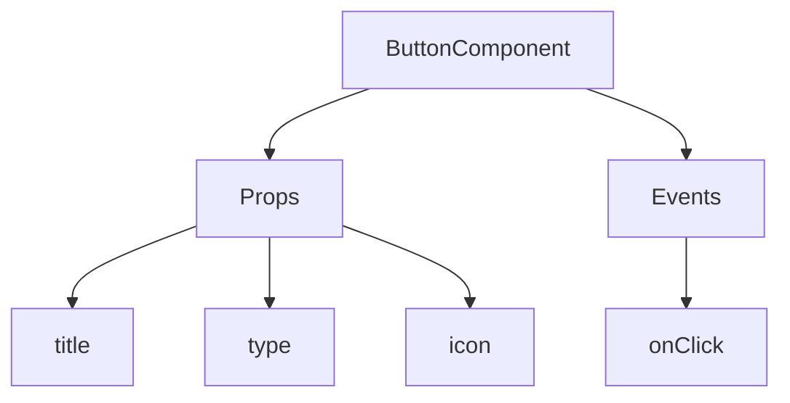
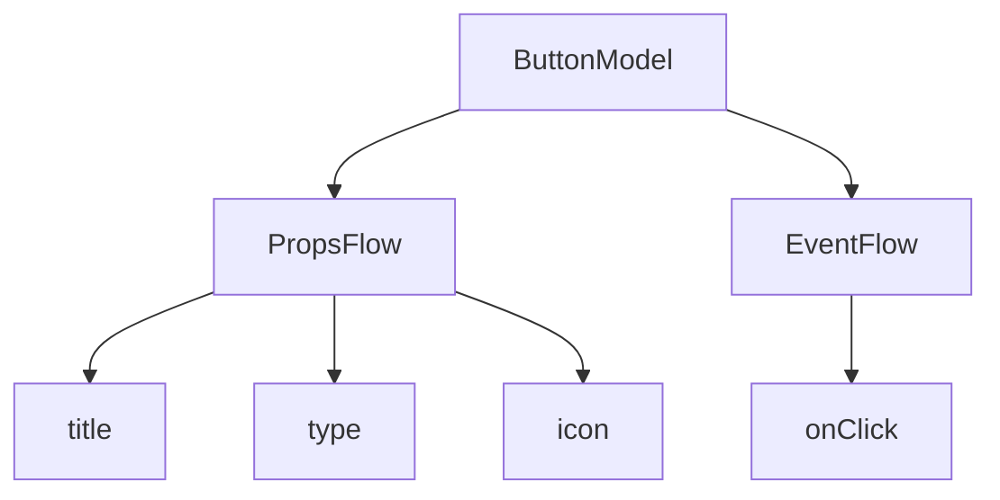

# Quick Start: Building an Orchestratable Button Component

In React, we usually render a button component like this:

```tsx pure
import { Button } from 'antd';

export default function App() {
  return <Button type="primary">Primary Button</Button>;
}
```

Although the code above is simple, it's a **static component** and cannot meet the needs of a no-code platform for configurability and orchestration capabilities.

In NocoBase's FlowEngine, we can quickly build components that support configuration and are event-driven using **FlowModel + FlowDefinition**, achieving more powerful no-code capabilities.

---

## Step 1: Render the Component Using FlowModel

<code src="./demos/quickstart-1-basic.tsx"></code>

### 🧠 Key Concepts

- `FlowModel` is the core component model in FlowEngine, encapsulating component logic, rendering, and configuration capabilities.
- Every UI component can be instantiated and managed uniformly through `FlowModel`.

### 📌 Implementation Steps

#### 1. Create a custom model class

```tsx pure
class MyModel extends FlowModel {
  render() {
    return <Button {...this.props} />;
  }
}
```

#### 2. Create a model instance

```ts
const model = this.flowEngine.createModel({
  uid: 'my-model',
  use: 'MyModel',
  props: {
    type: 'primary',
    children: 'Primary Button',
  },
});
```

#### 3. Render using `<FlowModelRenderer />`

```tsx pure
<FlowModelRenderer model={model} />
```

---

## Step 2: Add PropsFlow to Make Button Properties Configurable

<code src="./demos/quickstart-2-register-propsflow.tsx"></code>

### 💡 Why Use PropsFlow?

Using Flow instead of static props allows for:
- Dynamic configuration
- Visual editing
- State replay and persistence

### 🛠 Key Modifications

#### 1. Define the Flow for button properties

```tsx pure
const buttonSettings = defineFlow({
  key: 'buttonSettings',
  
  title: 'Button Settings',
  steps: {
    general: {
      title: 'General Configuration',
      uiSchema: {
        title: {
          type: 'string',
          title: 'Button Title',
          'x-decorator': 'FormItem',
          'x-component': 'Input',
        },
        type: {
          type: 'string',
          title: 'Type',
          'x-decorator': 'FormItem',
          'x-component': 'Select',
          enum: [
            { label: 'Primary', value: 'primary' },
            { label: 'Default', value: 'default' },
            { label: 'Danger', value: 'danger' },
            { label: 'Dashed', value: 'dashed' },
            { label: 'Link', value: 'link' },
            { label: 'Text', value: 'text' },
          ],
        },
        icon: {
          type: 'string',
          title: 'Icon',
          'x-decorator': 'FormItem',
          'x-component': 'Select',
          enum: [
            { label: 'Search', value: 'SearchOutlined' },
            { label: 'Add', value: 'PlusOutlined' },
            { label: 'Delete', value: 'DeleteOutlined' },
            { label: 'Edit', value: 'EditOutlined' },
            { label: 'Settings', value: 'SettingOutlined' },
          ],
        },
      },
      defaultParams: {
        type: 'primary',
      },
      // Step handler function, sets model properties
      handler(ctx, params) {
        ctx.model.setProps('children', params.title);
        ctx.model.setProps('type', params.type);
        ctx.model.setProps('icon', params.icon ? React.createElement(icons[params.icon]) : undefined);
      },
    },
  },
});

MyModel.registerFlow(buttonSettings);
```

#### 2. Use `stepParams` instead of static `props`

```diff
const model = this.flowEngine.createModel({
  uid: 'my-model',
  use: 'MyModel',
- props: {
-   type: 'primary',
-   children: 'Primary Button',
- },
+ stepParams: {
+   buttonSettings: {
+     general: {
+       title: 'Primary Button',
+       type: 'primary',
+     },
+   },
+ },
});
```

> ✅ Using `stepParams` is the recommended approach in FlowEngine, as it avoids issues with non-serializable data (like React components).

#### 3. Enable the property configuration interface

```diff
- <FlowModelRenderer model={model} />
+ <FlowModelRenderer model={model} showFlowSettings />
```

---

## Step 3: Support Button Event Flow (EventFlow)

<code src="./demos/quickstart-3-register-eventflow.tsx"></code>

### 🎯 Scenario: Show a confirmation dialog after clicking the button

#### 1. Listen for the onClick event

Add onClick in a non-intrusive way

```diff
const myPropsFlow = defineFlow({
  key: 'buttonSettings',
  steps: {
    general: {
      // ... omitted
      handler(ctx, params) {
        // ... omitted
+       ctx.model.setProps('onClick', (event) => {
+         ctx.model.dispatchEvent('click', { event });
+       });
      },
    },
  },
});
```

#### 2. Define the event flow

```ts
const myEventFlow = defineFlow({
  key: 'clickSettings',
  on: 'click',
  title: 'Button Event',
  steps: {
    confirm: {
      title: 'Confirmation Action Configuration',
      uiSchema: {
        title: {
          type: 'string',
          title: 'Dialog Prompt Title',
          'x-decorator': 'FormItem',
          'x-component': 'Input',
        },
        content: {
          type: 'string',
          title: 'Dialog Prompt Content',
          'x-decorator': 'FormItem',
          'x-component': 'Input.TextArea',
        },
      },
      defaultParams: {
        title: 'Confirm Action',
        content: 'You clicked the button, are you sure?',
      },
      async handler(ctx, params) {
        // Dialog
        const confirmed = await ctx.modal.confirm({
          title: params.title,
          content: params.content,
        });
        // Message
        await ctx.message.info(`You clicked the button, confirmation result: ${confirmed ? 'Confirmed' : 'Canceled'}`);
      },
    },
  },
});
MyModel.registerFlow(myEventFlow);
```

**Additional Notes:**
- EventFlow allows the button's behavior to be flexibly configured through a flow, such as showing dialogs, messages, making API calls, etc.
- You can register different event flows for different events (like `onClick`, `onMouseEnter`, etc.) to meet complex business requirements.

#### 3. Configure event flow parameters

When creating the model, you can configure the default parameters for the event flow via `stepParams`:

```ts
const model = this.flowEngine.createModel({
  uid: 'my-model',
  use: 'MyModel',
  stepParams: {
    buttonSettings: {
      general: {
        title: 'Primary Button',
        type: 'primary',
      },
    },
    clickSettings: {
      confirm: {
        title: 'Confirm Action',
        content: 'You clicked the button, are you sure?',
      },
    },
  },
});
```

---

## Model Comparison: ReactComponent vs FlowModel

Flow does not change how components are implemented. It simply adds support for PropsFlow and EventFlow to a ReactComponent, allowing the component's properties and events to be configured and orchestrated visually.


### ReactComponent



### FlowModel



## Summary

Through the three steps above, we have completed a button component that supports configuration and event orchestration, with the following advantages:

- 🚀 Visually configure properties (like title, type, icon)
- 🔄 Event responses can be managed by a flow (e.g., click to show a dialog)
- 🔧 Supports future extensions (like conditional logic, variable binding, etc.)

This pattern is also applicable to any UI component, such as forms, lists, and charts. In NocoBase's FlowEngine, **everything is orchestratable**.