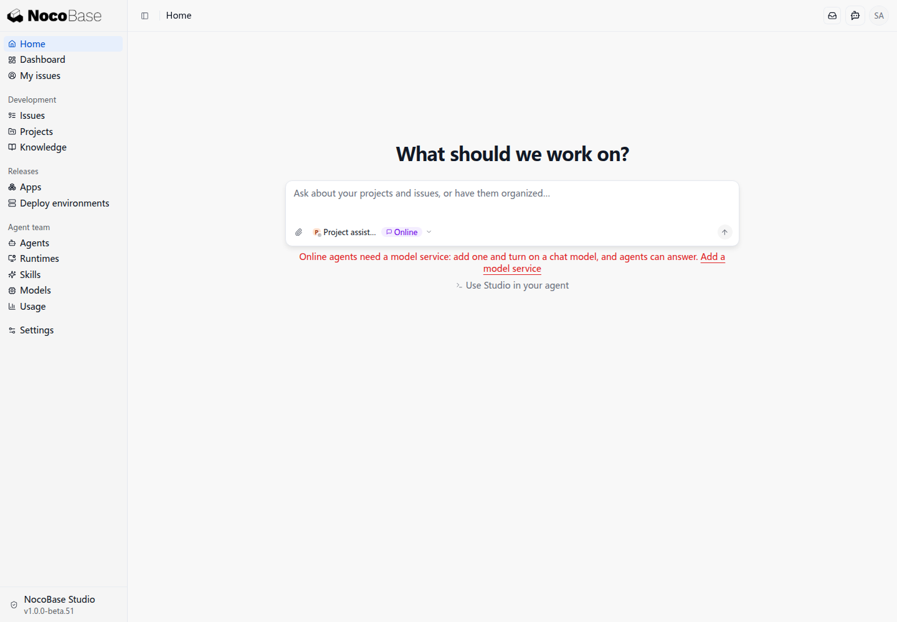
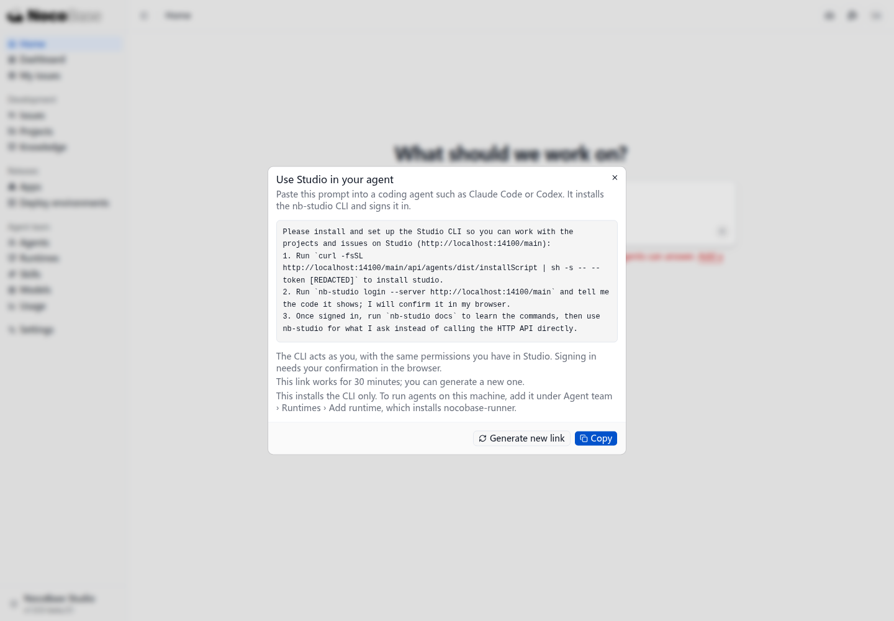
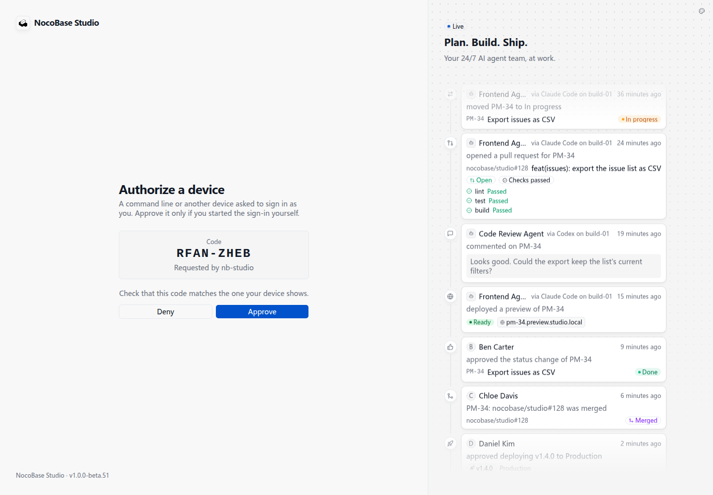
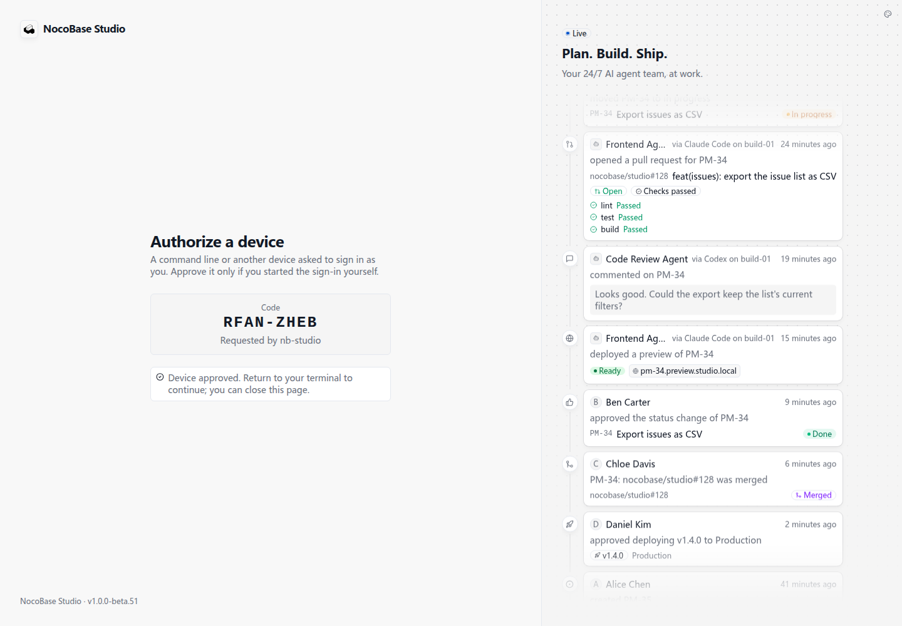

# Use Studio in your local agent

The Studio CLI lets Codex, Claude Code, and other local agents view projects, create issues, and update progress with your Studio account's permissions.

## Sign in to Studio

Open Studio and sign in with your username or email and password.


The home page offers a chat composer and **Use Studio in your agent**.



**Online** beside Project assistant is its type. Without a configured model service, its availability is **Model unavailable**. To use your local agent, choose the CLI setup link below the composer.

## Copy the setup prompt

Click **Use Studio in your agent** and paste its prompt into your local coding agent.



Your agent installs `nb-studio`, starts sign-in, and provides a confirmation code. Generate a new link if the installation credential expires. The screenshot redacts that credential; use the prompt generated by your own page.

## Approve sign-in

Open the authorization page, check that the code matches the terminal, and click **Approve**.



When the page reports **Device approved**, return to your agent.



After sign-in, the agent reads Studio's command reference. You can then ask it:

```text
List the projects in Studio and the unfinished issues in each project.
```

Next, [add a runtime](./runtimes) to connect a Runner that executes development tasks. The runtime can be your own computer, another computer, or a server. A connected Runner is required to dispatch development tasks from Studio.
