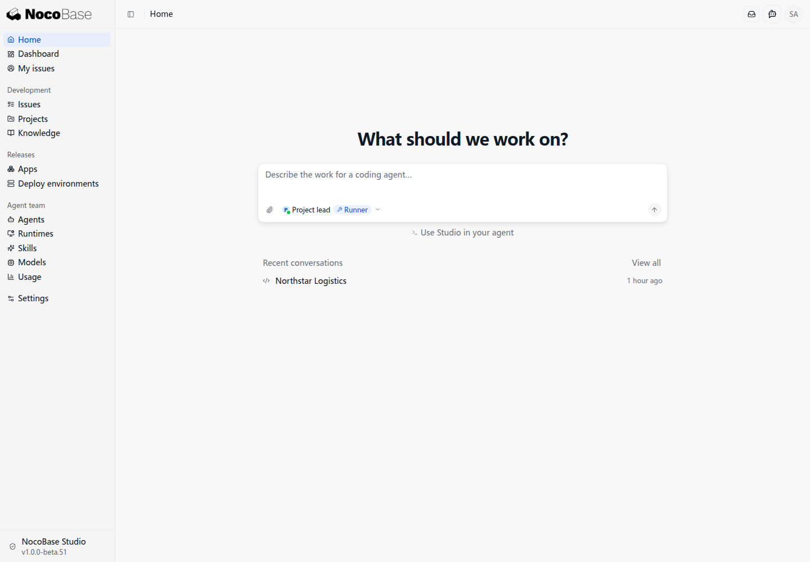
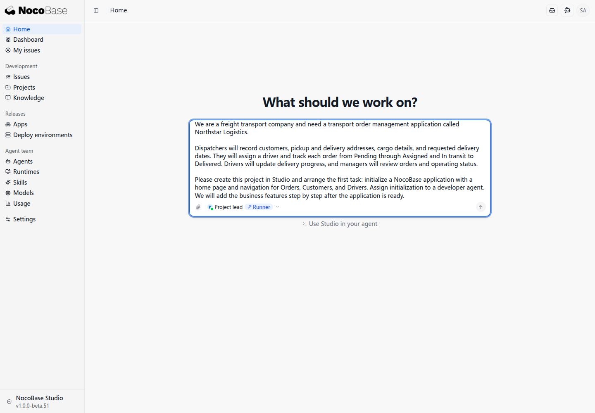
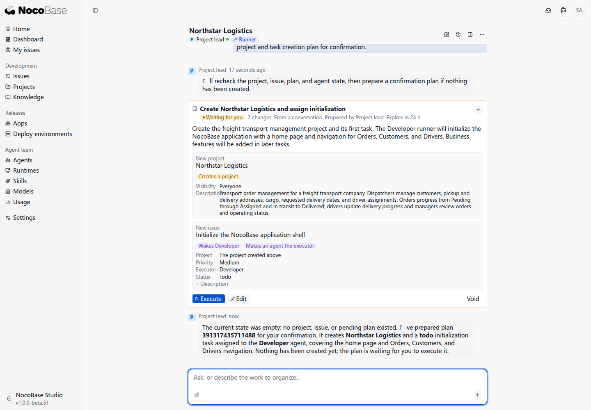
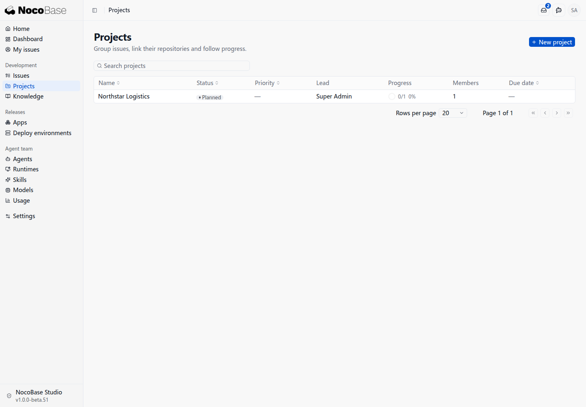

# Create your first project

Start a freight order management application by creating its project and arranging application initialization. Add order management, attachments, and notifications in later tasks.

:::danger Current blockers

1. **Repository preparation guidance is missing.** The issue was dispatched before a code location was linked, leaving initialization **Blocked**.
2. **Local Studio has no public address.** GitHub Webhooks and hosted Actions cannot reach it, blocking later CI integration.
3. **Developer lacks NocoBase 3 initialization guidance.** Without an initialization skill or explicit steps, the agent chose an older command.
4. **Runner blocks downloaded scaffold execution by default.** Even the correct command requires additional permission configuration.

These gaps interrupt local setup, application initialization, and later CI integration. See [Review notes](./review-notes) for configuration details and workflow proposals.

:::

:::warning Continue after local setup adjustments

For this walkthrough, we created a demo Git repository, linked its local directory to the project's Runner code location, and added the missing information to the original initialization issue. We now continue PM-1 so the developer agent can initialize the application. GitHub CI and Webhooks remain unconfigured; the public tunnel will be set up at the CI stage.

:::

## Choose the Project lead

Choose **Project lead** in the home page's agent picker. It runs through a Runner and can use your local Codex sign-in.



## Describe the business and first task

Explain who will use the application and what they do, then state the first task:

```text
We are a freight transport company and need a transport order management application called Northstar Logistics.

Dispatchers will record customers, pickup and delivery addresses, cargo details, and requested delivery dates. They will assign a driver and track each order from Pending through Assigned and In transit to Delivered. Drivers will update delivery progress, and managers will review orders and operating status.

Please create this project in Studio and arrange the first task: initialize a NocoBase application with a home page and navigation for Orders, Customers, and Drivers. Assign initialization to a developer agent. We will add the business features step by step after the application is ready.
```

Enter the prompt, check that Project lead is selected, and send it.



## Read the reply

The Project lead checks existing projects, issues, and available agents, then prepares an operation plan. This example includes two changes:

- Create the **Northstar Logistics** project.
- Create an application initialization issue assigned to **Developer**, covering a home page and navigation for Orders, Customers, and Drivers.



Review the project, issue, and executor, then click **Execute** to confirm. **Wakes Developer** indicates that executing the plan triggers the developer agent to handle the issue.

The confirmation dialog lists the project creation and agent run. Review it and click **Execute**.


After execution, **Projects** lists Northstar Logistics. Open its **Issues** tab to view initialization issue PM-1 and its status.


