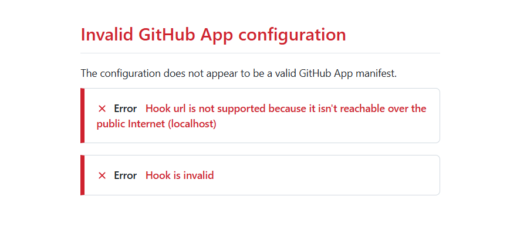

# Review notes

> Local review only. This page is excluded from the intended publication scope.

Project lead cannot create a project (fixed)

**Status: fixed.**

On 2026-10-10, the user confirmed that the missing project creation permission has been fixed online. As requested, the latest code was not pulled and the online behavior was not reverified. The earlier findings are retained below.

The first Northstar Logistics request failed: the signed-in administrator has `pm.projects/create`, but the built-in Project lead does not. The agent's reply attributes the refusal to the user's account. No project or task was created. The demo agent has been given this action locally to continue, without changing upstream source.

The earlier permission question is closed following the reported fix. The fix commit and implementation details have not been checked in this session.

## Online type and availability

Pending wording review. Project assistant shows its Online type even when its model is unavailable. The guide distinguishes the type from availability.

## Application initialization stops at repository preparation

**Status: workflow discussion pending; setup paused.**

The request was to create Northstar Logistics from scratch, initialize a NocoBase application, and provide home, Orders, Customers, and Drivers navigation. Executing the Project lead plan created the project and issue PM-1, assigned Developer, and started its run.

Developer found no linked repository or application source in its workspace. It requested a repository and moved the issue to Analysis. Solution designer then ran, and the issue ended in Blocked. No application code, branch, or pull request was created.

The plan covered project records and a regular development issue, but not the repository and application preparation needed for a new application. The missing prerequisite appeared only after dispatch, interrupting the onboarding flow. This does not establish that users must always create a repository first.

Discuss whether a dedicated initialization flow should create or select a repository and initialize the application before dispatch; where required Git information should be collected; and whether local initialization before repository linking is a supported product direction. At that discussion point no external repository had been created. The user subsequently authorized creating the private repository `Charls-Wu/northstar-logistics` on 2026-10-10. It has been cloned locally; Studio linking and a development retry remain pending.

### Proposal: choose a code location before application initialization

**Status: proposal only; not implemented.**

The source provides initialization routes for a new remote repository, an existing repository, or a directory on a Runner with an initialization prompt. GitHub is not a mandatory prerequisite for local onboarding; existing repositories may also be supplied by clone URL. The local initialization route has not been exercised in this walkthrough.

Proposed order: business request → distinguish a new application from an existing one → confirm a local directory or remote repository → approve the creation and initialization plan → prepare the code location and initialize the application → dispatch business development. A user should not have to create a GitHub repository before describing the application.

### Improve the Project lead instructions

The current instructions focus on reading, splitting, assigning, and progressing existing issues. Add guidance for starting from a new application request: confirm the code location, discover the dedicated initialization commands, prepare a reviewable plan, and wait for initialization and source availability before dispatching business development. Do not guess paths, repository visibility, or missing permissions; distinguish user permissions, agent capabilities, and Runner availability.

Instructions alone are insufficient. Verify that the agent can discover and invoke the initialization routes, has the required actions, and that dispatch validates the code location. The source declares `project setup create` and `project location add`; their actual availability to Project lead and support in operation plans have not yet been verified. No agent configuration has been changed in this discussion.

## Local Studio has no public address for GitHub CI

**Status: connectivity prerequisites pending; CI not yet tested.**

GitHub Webhooks and GitHub-hosted Actions need to reach Studio. The current local address is unreachable from GitHub, preventing later CI callbacks and deployment API access. Local application initialization can proceed first. The user chose to open a tunnel at the CI stage.

### Configuration proposal

This example created a project and an issue without linking a code location. The developer agent could not obtain application source, leaving initialization **Blocked**. Before executing a plan that wakes a developer agent:

1. **Prepare a repository or local directory.** Choose where the new application's source will live. For GitHub, create a dedicated repository under your account. Local development can use a directory accessible to the Runner. An initial repository commit does not initialize a NocoBase application.
2. **Add the project's code location in Studio.** Link the repository and branch, or select a Runner and local directory. Prepare read and push access for a private repository and confirm the executing Runner can access the location.
3. **Arrange application initialization.** Provide initialization instructions in project setup. Generate the application source, install dependencies, and confirm it starts before assigning home page, navigation, and business feature development.

**Before enabling GitHub CI builds and deployments, also configure:**

- **A public Studio address:** GitHub Webhooks and GitHub-hosted Actions must reach Studio. For local Studio, open a tunnel with a stable HTTPS address at this stage and configure Studio's public address accordingly. Local initialization can proceed before opening the tunnel.
- **The GitHub connection and Webhook:** Configure a GitHub App connection in Studio's Git settings and grant access to the repository. Set the App's Webhook URL to the connection's receiver address and configure the same Webhook secret on both sides. For a repository-level Webhook, use that repository's receiver address and secret. Receiver addresses depend on the actual connection or repository.
- **Actions credentials and workflow:** Use Studio's CI configuration to generate the repository's deployment API key and store it as the GitHub Actions secret **`NB_STUDIO_API_KEY`**. Set **`NB_STUDIO_URL`** in the workflow to the Studio address reachable from Actions (including `/main` in this example). Save the generated workflow under `.github/workflows/`, review its trigger branches and deployment environment, then enable it. Configure the Webhook secret and Actions API key separately.

The local code location is now linked. Application initialization and CI integration remain pending.

## Developer lacks NocoBase 3 initialization guidance

**Status: observed in this run; explicit steps added locally.**

Once the code location was linked, Developer found the repository but only its initial README, without application source or generated application skills. The run loaded only `nb-studio-cli`, which covers Studio operations rather than application scaffolding. The original issue did not specify NocoBase 3 initialization steps. A search of the older documentation returned no content, after which the agent chose `yarn create nocobase-app . -d postgres`. The transcript does not establish that this command came from a skill or a page it actually read.

Studio's dedicated NocoBase initialization implementation already specifies Node.js 24+, pnpm 11, and `pnpm create @nocobase/app northstar-logistics --template default --json`. The generator requires a new empty target directory; generate the application first, then place the source in the existing checkout. This guidance was not supplied to the ordinary development issue.

**Proposal:** Provide version-specific commands, prerequisites, and failure handling through the dedicated initialization flow or an initialization skill. The correct steps were added to PM-1 locally; this does not fix the default workflow.

## Runner blocks downloaded scaffold execution by default

**Status: default policy and refusals verified; a narrow local allowance added.**

Developer originally had a null `toolPolicy`, inheriting `DEFAULT_TOOL_POLICY`. Its command allowlist includes pnpm and yarn, but supplies no `allowedDownloads`. Runner separately checks commands that download and execute external code, including `pnpm create`, `yarn create`, and `pnpm dlx`, and refuses them by default. This restriction was not added during the local Runner installation and does not mean all npm dependency installation is prohibited.

The older command was refused, and the correct NocoBase 3 command was also refused after it was added. The dedicated initialization implementation supplies the command, while run claiming still merges the agent's default policy. No automatic initialization-specific download allowance was found in this version. Not every dedicated initialization entry has been exercised.

**Impact and proposal:** The default Developer cannot directly scaffold a new application this way. Prepare both the correct instructions and a scoped authorization before starting initialization. The local demo now allows only its official scaffold command, retaining other default restrictions. The first narrow rule omitted the `NODE_OPTIONS` memory-limit prefix and caused another refusal; that local configuration mistake has since been corrected and is distinct from the product default-policy gap.

### Local workaround and verification progress

These are adjustments to the demonstration environment, not a fix to the default product flow.

1. Create a dedicated Git repository and link its checkout as the project's Runner directory. Add the location to PM-1 and continue the original issue. The run transcript confirms the Runner used this directory.
2. Provide the official NocoBase 3 initialization command, required Node.js/pnpm versions, empty-directory requirement, and default SQLite setup in the issue. Developer executes them through the Runner.
3. Add a narrow `allowedDownloads` rule for this demonstration's official scaffold command, retaining other default checks. Correct the memory-prefix and regex-escaping errors. Verify with the Runner's actual policy function that the prescribed command is allowed and unrelated scaffolds remain denied. A subsequent run confirms the correct command actually executed.
4. Execution then failed while pnpm attempted to create its dlx cache in the isolated HOME. Add a writable repository-local `XDG_CACHE_HOME` path and allow the exact command with that path and the memory limit, then retry through the Runner.

5. With the repository-local pnpm cache, the official scaffold actually executed but returned `TEMPLATE_DOWNLOAD_FAILED` twice. Template version lookup succeeds. The generator invokes `npm pack --silent`, which did not expose the full underlying error. A repository-local `npm_config_cache` path has been supplied for Runner investigation; the final outcome remains pending.

**Subsequent verification:** Runner run `391364430790660` on 2026-10-10 set both `XDG_CACHE_HOME` and `npm_config_cache` to writable repository-local paths. The default template download and dependency installation succeeded, followed by successful default SQLite configuration through `pnpm nocobase config init --json`. Developer implemented the home page and Orders, Customers, and Drivers navigation and committed `035df70` on local branch `agent-pm-1`. The transcript and issue report confirm successful startup and relevant checks. Initialization succeeded with these local adjustments; the default product flow remains unchanged.

**Remaining blockers:** Runner has no usable GitHub push credentials, and Studio only links a local directory rather than a repository through a Git connection. Push failed and PR creation returned `NO_REPOSITORY`. No application PR exists yet; push credentials and Studio repository linking still need preparation.

## GitHub App registration blocked by a localhost hook URL

**Status: reproduced, unresolved.** On October 10, 2026, choosing Settings → Git → Add connection → GitHub → My account → Create on GitHub in local Studio produced `Invalid GitHub App configuration`. GitHub reported `Hook url is not supported because it isn't reachable over the public Internet (localhost)` and `Hook is invalid`. Registration failed before App installation or repository authorization.

**Source evidence:** In this walkthrough's isolated Studio, `buildAppManifest` in `server/git/github.ts` generates `hook_attributes: { url: input.webhookUrl, active: input.webhookActive }` even when the webhook is disabled, retaining the localhost URL. The UI says polling will be used, but the actual registration still fails GitHub's URL validation. That UI message does not establish that local registration works.

**Impact:** This blocks App registration now and is distinct from the later CI limitation caused by the lack of a public Studio address. The previous plan to defer the tunnel until CI did not account for this registration failure.

**Next steps:** Evaluate correcting the registration manifest or configuring a public address before retrying. No Studio source fix, tunnel, or completed authorization has been applied in this walkthrough; the blocker remains unresolved.
