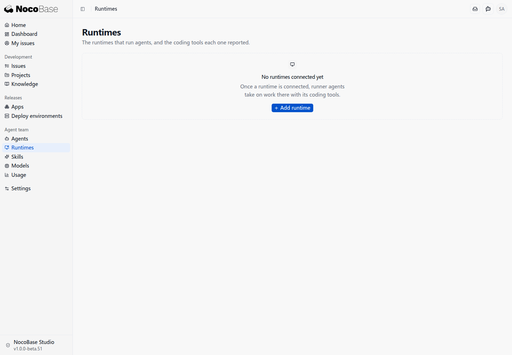
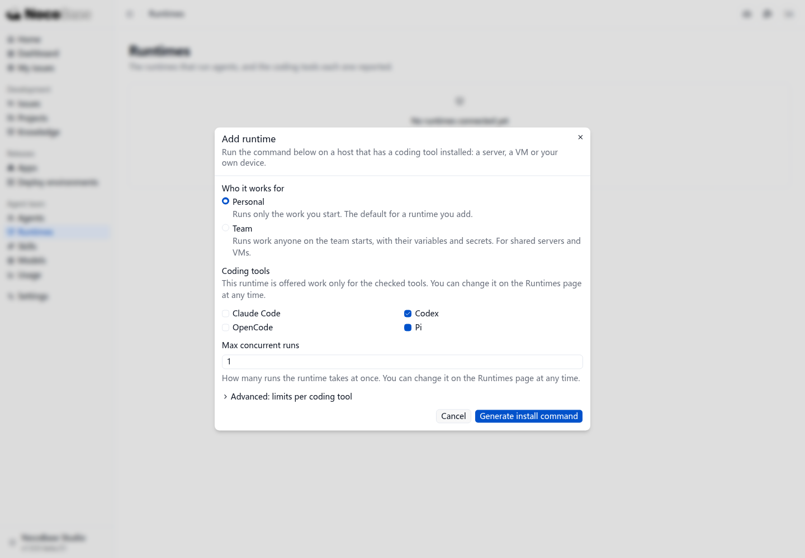
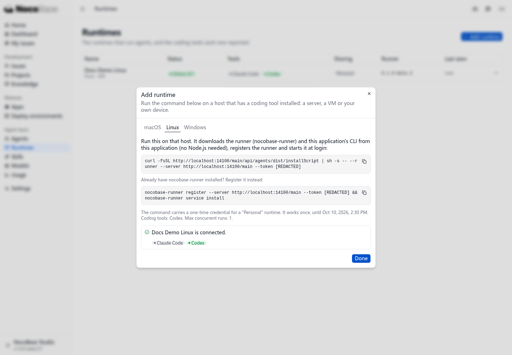
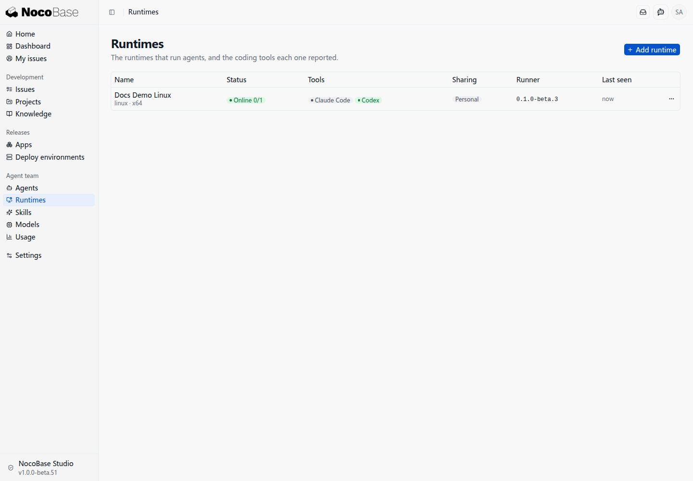
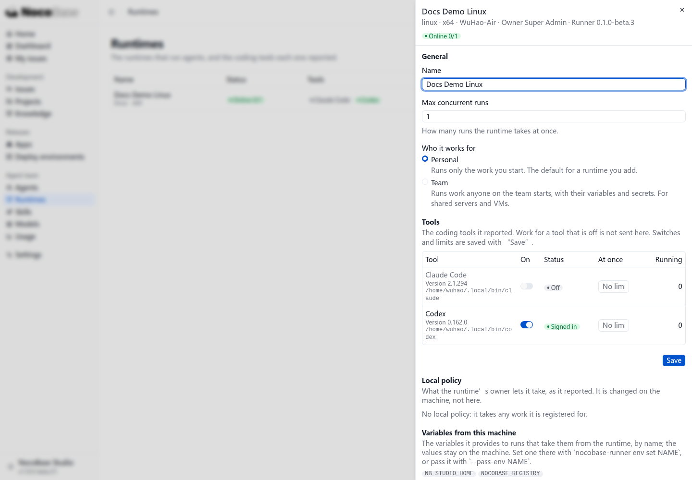

# Add a runtime

A runtime is a computer, server, or VM where a Runner connects to Studio and invokes installed coding tools.

## Prepare a coding tool

Install and sign in to the coding tool on that machine first. This example uses Codex signed in with a ChatGPT account, without a separate API model service.

The Runner supports macOS and Linux. Native Windows is not yet supported. On Windows, install and sign in to the coding tool inside WSL, then connect the Runner using the Linux install command. This example runs in Linux inside WSL.

## Generate the install command

Open **Agent team → Runtimes** and click **Add runtime**.

Choose **Personal**, enable **Codex**, and keep the maximum concurrent runs at **1**.

- **Personal** runs work you start, suitable for your own computer.
- **Team** runs work started by team members, suitable for a shared server.
- **Coding tools** selects the tools allowed to receive work here.

Click **Generate install command**.

## Run the command on that machine

Select **Linux**, copy the command, and run it in the machine's terminal.

The command downloads the packages, registers the runtime, and starts the Runner. Use the current page's command, which contains a one-time credential.

After the Runner starts, the page confirms the connection and lists the tools it detected.

## Check the result

Click **Done**. The runtime is **Online**, and Codex is **Signed in**.

Click its name to inspect tool versions, sign-in status, and enabled tools.

“Within seconds” refers to the time after installation, registration, and startup. Selecting a tool in Studio does not install it; prepare and sign in to it first.

Continue with [Create your first project](./first-project).
