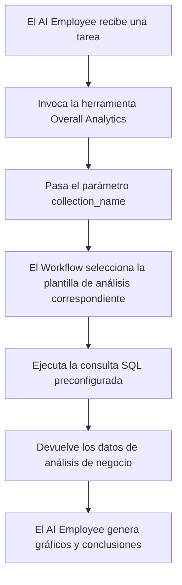

# Roles y permisos

## Introducción

La gestión de permisos del AI Employee abarca dos niveles:

1. **Permiso de acceso al AI Employee**: controla qué usuarios pueden utilizar qué AI Employees.
2. **Permiso de acceso a datos**: cómo se aplican los permisos cuando el AI Employee procesa datos.

Este documento explica con detalle la configuración y el funcionamiento de ambos tipos de permisos.

---

## Configurar el permiso de acceso al AI Employee

### Definir los AI Employees disponibles para un rol

Acceda a la página `User & Permissions`, haga clic en la pestaña `Roles & Permissions` para entrar en la configuración de roles.


Seleccione un rol, haga clic en la pestaña `Permissions` y luego en la pestaña `AI employees`. Allí se mostrará la lista de AI Employees gestionados por el plugin.

Marque la casilla de la columna `Available` en la lista de AI Employees para controlar si el rol actual puede acceder a ese AI Employee.


---

## Permisos de acceso a datos

Cuando el AI Employee procesa datos, el modo de control de permisos depende del tipo de Tool utilizado:

### Herramientas integradas de consulta de datos (siguen los permisos del usuario)

Las siguientes herramientas acceden a los datos respetando **estrictamente los permisos del usuario actual**:

| Nombre de la herramienta | Descripción |
| --- | --- |
| **Data source query** | Consulta la base de datos utilizando fuente de datos, Collection y Field |
| **Data source records counting** | Cuenta el total de registros utilizando fuente de datos, Collection y Field |

**Cómo funciona:**

Cuando el AI Employee invoca estas herramientas, el sistema:
1. Identifica al usuario actualmente autenticado.
2. Aplica las reglas de acceso a datos configuradas en **Roles y permisos** para dicho usuario.
3. Devuelve únicamente los datos a los que el usuario tiene permiso de visualización.

**Ejemplo de escenario:**

Suponga que el comercial A solo puede ver los datos de los clientes que él gestiona. Cuando utilice el AI Employee Viz para analizar clientes:
- Viz invoca `Data source query` para consultar la tabla de clientes.
- El sistema aplica las reglas de filtrado de datos del comercial A.
- Viz solo puede ver y analizar los clientes a los que el comercial A tiene acceso.

Esto garantiza que **el AI Employee no rebase los límites de acceso a datos del propio usuario**.

---

### Herramientas de negocio personalizadas en Workflow (lógica de permisos independiente)

Las herramientas de consulta de negocio personalizadas mediante Workflow tienen un control de permisos **independiente de los permisos del usuario** y vienen determinadas por la lógica de negocio del Workflow.

Este tipo de Tool suele utilizarse para:
- Procesos fijos de análisis de negocio.
- Consultas de agregación preconfiguradas.
- Análisis estadísticos que cruzan los límites de los permisos.

#### Ejemplo 1: Overall Analytics (análisis de negocio general)


En la CRM Demo, `Overall Analytics` es un motor plantillado de análisis de negocio:

| Característica | Descripción |
| --- | --- |
| **Implementación** | El Workflow lee plantillas de SQL preconfiguradas y ejecuta consultas de solo lectura |
| **Control de permisos** | No está limitado por los permisos del usuario actual; la salida son los datos de negocio fijos definidos por la plantilla |
| **Escenario de uso** | Análisis general estandarizado para objetos de negocio concretos (Lead, Opportunity, Account) |
| **Seguridad** | Todas las plantillas de consulta son configuradas y revisadas previamente por el administrador, evitando SQL generado dinámicamente |

**Flujo de trabajo:**



**Características clave:**
- Cualquier usuario que invoque la herramienta obtiene **la misma vista de negocio**.
- El alcance de los datos lo define la lógica de negocio, no se filtra por los permisos del usuario.
- Adecuado para informes de análisis de negocio estandarizados.

#### Ejemplo 2: SQL Execution (herramienta de análisis avanzado)


En la CRM Demo, `SQL Execution` es una herramienta más flexible que requiere un control estricto:

| Característica | Descripción |
| --- | --- |
| **Implementación** | Permite a la IA generar y ejecutar sentencias SQL |
| **Control de permisos** | Lo controla el Workflow; normalmente se restringe al administrador |
| **Escenario de uso** | Análisis avanzado, consultas exploratorias, agregaciones cruzadas entre tablas |
| **Seguridad** | Es necesario restringir las operaciones a solo lectura (SELECT) en el Workflow y controlar la disponibilidad mediante la configuración de la tarea |

**Recomendaciones de seguridad:**

1. **Limitar el alcance disponible**: configure su disponibilidad únicamente en tareas del Block de administración.
2. **Restricciones del prompt**: en el prompt de la tarea, delimite explícitamente el alcance de la consulta y los nombres de tabla.
3. **Validación en el Workflow**: valide la sentencia SQL en el Workflow para que solo se ejecuten operaciones SELECT.
4. **Logs de auditoría**: registre todas las sentencias SQL ejecutadas para poder hacer trazabilidad.

**Ejemplo de configuración:**

```markdown
Restricciones del prompt:
- Solo se pueden consultar tablas relacionadas con CRM (leads, opportunities, accounts, contacts)
- Solo se permiten consultas SELECT
- Rango de fechas limitado al último año
- El resultado no debe superar 1000 registros
```

---

## Recomendaciones para el diseño de permisos

### Elegir la estrategia de permisos según el escenario de negocio

| Escenario de negocio | Tipo de Tool recomendado | Estrategia de permisos | Razón |
| --- | --- | --- | --- |
| El comercial consulta sus propios clientes | Herramienta integrada | Sigue los permisos del usuario | Garantiza el aislamiento de datos y la seguridad del negocio |
| El responsable de departamento consulta los datos del equipo | Herramienta integrada | Sigue los permisos del usuario | Aplica automáticamente el alcance de datos del departamento |
| La dirección consulta el análisis global del negocio | Tool personalizado de Workflow / Overall Analytics | Lógica de negocio independiente | Proporciona una visión global estandarizada |
| El analista realiza consultas exploratorias | SQL Execution | Limitar estrictamente los objetos disponibles | Requiere flexibilidad pero hay que controlar el alcance |
| El usuario común consulta informes estándar | Overall Analytics | Lógica de negocio independiente | Métrica fija de análisis, sin preocuparse por los permisos subyacentes |

### Estrategia de protección por capas

Para escenarios de negocio sensibles, se recomienda aplicar un control de permisos por capas:

1. **Capa de acceso al AI Employee**: controla qué roles pueden utilizar el AI Employee.
2. **Capa de visibilidad de la tarea**: controla mediante la configuración del Block si la tarea se muestra.
3. **Capa de autorización del Tool**: valida la identidad y los permisos del usuario en el Workflow.
4. **Capa de acceso a datos**: controla el alcance de los datos mediante los permisos del usuario o la lógica de negocio.

**Ejemplo:**

```
Escenario: solo el departamento financiero puede usar la IA para análisis financiero

- Permiso del AI Employee: solo el rol financiero puede acceder al AI Employee «Finance Analyst»
- Configuración de la tarea: la tarea de análisis financiero solo se muestra en el módulo financiero
- Diseño del Tool: el Tool de Workflow financiero valida el departamento del usuario
- Permiso de datos: el acceso a las tablas financieras solo se concede al rol financiero
```

---

## Preguntas frecuentes

### P: ¿A qué datos puede acceder el AI Employee?

**R:** Depende del tipo de Tool:
- **Herramientas integradas**: solo accede a los datos que el usuario actual tiene permiso de ver.
- **Tools personalizados de Workflow**: lo determina la lógica de negocio del Workflow y puede no estar limitado por los permisos del usuario.

### P: ¿Cómo se evita que el AI Employee filtre datos sensibles?

**R:** Aplique protección por capas:
1. Configure el permiso de rol del AI Employee para limitar quién puede usarlo.
2. Para herramientas integradas, confíe en el filtrado automático por permisos del usuario.
3. Para Tools personalizados, implemente validación de la lógica de negocio en el Workflow.
4. Las operaciones sensibles (como SQL Execution) se autorizan únicamente al administrador.

### P: Quiero que algunos AI Employees superen los límites de permisos del usuario, ¿cómo lo hago?

**R:** Utilice Tools personalizados de Workflow:
- Cree un Workflow que implemente la lógica de consulta de negocio específica.
- Controle el alcance de los datos y las reglas de acceso en el Workflow.
- Configure el Tool para que lo utilice el AI Employee.
- Controle quién puede invocar esa capacidad mediante el permiso de acceso al AI Employee.

### P: ¿En qué se diferencian Overall Analytics y SQL Execution?

**R:**

| Dimensión | Overall Analytics | SQL Execution |
| --- | --- | --- |
| Flexibilidad | Baja (solo plantillas preconfiguradas) | Alta (puede generar consultas dinámicas) |
| Seguridad | Alta (todas las consultas se revisan previamente) | Media (requiere restricciones y validación) |
| Público objetivo | Personal de negocio común | Administradores o analistas avanzados |
| Coste de mantenimiento | Mantener las plantillas de análisis | No requiere mantenimiento, pero hay que monitorizarlo |
| Coherencia de datos | Fuerte (métrica estandarizada) | Débil (los resultados pueden ser inconsistentes) |

---

## Buenas prácticas

1. **Por defecto, seguir los permisos del usuario**: salvo que haya una necesidad de negocio explícita, prefiera las herramientas integradas que respetan los permisos del usuario.
2. **Plantillar el análisis estándar**: para escenarios de análisis frecuentes, utilice el patrón Overall Analytics para ofrecer capacidades estandarizadas.
3. **Controlar estrictamente las herramientas avanzadas**: SQL Execution y otras herramientas de alto privilegio se autorizan solo a unos pocos administradores.
4. **Aislamiento a nivel de tarea**: configure las tareas sensibles en Blocks específicos y aíslelas mediante los permisos de acceso a la página.
5. **Auditoría y monitorización**: registre el comportamiento de acceso a datos del AI Employee y revise periódicamente las operaciones anómalas.
