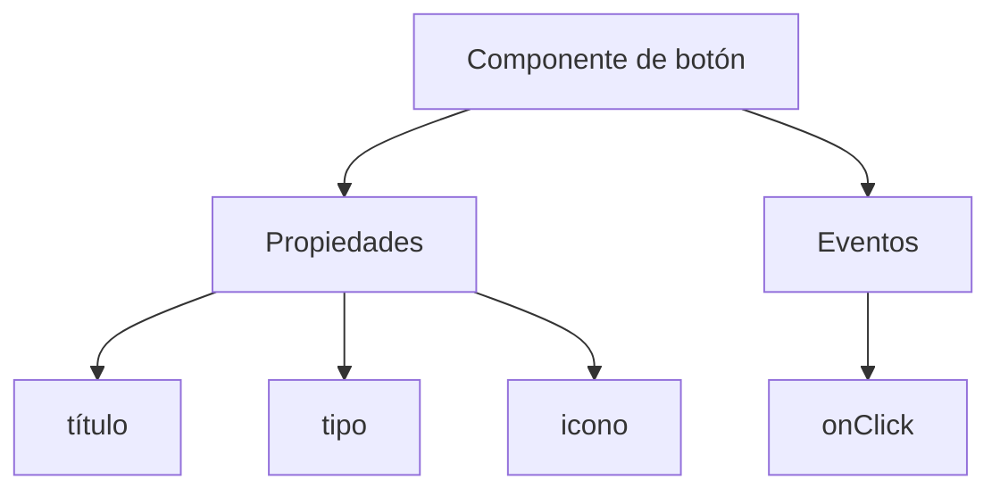
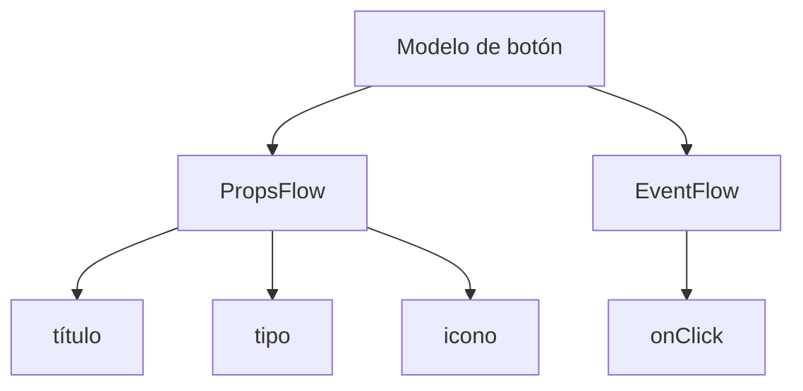

:::tip Aviso de traducción por IA
Esta documentación ha sido traducida automáticamente por IA.
:::


# Inicio rápido: Construyendo un componente de botón orquestable

En React, normalmente renderizamos un componente de botón de esta manera:

```tsx pure
import { Button } from 'antd';

export default function App() {
  return <Button type="primary">Primary Button</Button>;
}
```

Aunque el código anterior es simple, es un **componente estático** y no puede satisfacer las necesidades de una plataforma sin código en cuanto a configurabilidad y capacidad de orquestación.

En el FlowEngine de NocoBase, podemos construir rápidamente componentes que admiten configuración y están impulsados por eventos, utilizando **FlowModel + FlowDefinition**, logrando capacidades sin código más potentes.

---

## Paso 1: Renderice el componente usando FlowModel

<code src="./demos/quickstart-1-basic.tsx"></code>

### 🧠 Conceptos clave

- `FlowModel` es el modelo de componente central en FlowEngine, que encapsula la lógica del componente, el renderizado y las capacidades de configuración.
- Cada componente de UI puede ser instanciado y gestionado de forma unificada a través de `FlowModel`.

### 📌 Pasos de implementación

#### 1. Cree una clase de modelo personalizada

```tsx pure
class MyModel extends FlowModel {
  render() {
    return <Button {...this.props} />;
  }
}
```

#### 2. Cree una instancia del modelo

```ts
const model = this.flowEngine.createModel({
  uid: 'my-model',
  use: 'MyModel',
  props: {
    type: 'primary',
    children: 'Primary Button',
  },
});
```

#### 3. Renderice usando `<FlowModelRenderer />`

```tsx pure
<FlowModelRenderer model={model} />
```

## Paso 2: Agregue PropsFlow para hacer que las propiedades del botón sean configurables

<code src="./demos/quickstart-2-register-propsflow.tsx"></code>

### 💡 ¿Por qué usar PropsFlow?

Usar Flow en lugar de props estáticas permite:
- Configuración dinámica
- Edición visual
- Reproducción y persistencia del estado

### 🛠 Modificaciones clave

#### 1. Defina el Flow para las propiedades del botón

```tsx pure

const buttonSettings = defineFlow({
  key: 'buttonSettings',
  
  title: 'Configuración del botón',
  steps: {
    general: {
      title: 'Configuración general',
      uiSchema: {
        title: {
          type: 'string',
          title: 'Título del botón',
          'x-decorator': 'FormItem',
          'x-component': 'Input',
        },
        type: {
          type: 'string',
          title: 'Tipo',
          'x-decorator': 'FormItem',
          'x-component': 'Select',
          enum: [
            { label: 'Principal', value: 'primary' },
            { label: 'Predeterminado', value: 'default' },
            { label: 'Peligro', value: 'danger' },
            { label: 'Punteado', value: 'dashed' },
            { label: 'Enlace', value: 'link' },
            { label: 'Texto', value: 'text' },
          ],
        },
        icon: {
          type: 'string',
          title: 'Icono',
          'x-decorator': 'FormItem',
          'x-component': 'Select',
          enum: [
            { label: 'Buscar', value: 'SearchOutlined' },
            { label: 'Agregar', value: 'PlusOutlined' },
            { label: 'Eliminar', value: 'DeleteOutlined' },
            { label: 'Editar', value: 'EditOutlined' },
            { label: 'Configuración', value: 'SettingOutlined' },
          ],
        },
      },
      defaultParams: {
        type: 'primary',
      },
      // Función manejadora del paso, establece las propiedades del modelo
      handler(ctx, params) {
        ctx.model.setProps('children', params.title);
        ctx.model.setProps('type', params.type);
        ctx.model.setProps('icon', params.icon ? React.createElement(icons[params.icon]) : undefined);
      },
    },
  },
});

MyModel.registerFlow(buttonSettings);
```

#### 2. Use `stepParams` en lugar de `props` estáticas

```diff
const model = this.flowEngine.createModel({
  uid: 'my-model',
  use: 'MyModel',
- props: {
-   type: 'primary',
-   children: 'Primary Button',
- },
+ stepParams: {
+   buttonSettings: {
+     general: {
+       title: 'Primary Button',
+       type: 'primary',
+     },
+   },
+ },
});
```

> ✅ Usar `stepParams` es el enfoque recomendado en FlowEngine, ya que evita problemas con datos no serializables (como los componentes de React).

#### 3. Habilite la interfaz de configuración de propiedades

```diff
- <FlowModelRenderer model={model} />
+ <FlowModelRenderer model={model} showFlowSettings />
```

---

## Paso 3: Soporte el flujo de eventos del botón (EventFlow)

<code src="./demos/quickstart-3-register-eventflow.tsx"></code>

### 🎯 Escenario: Mostrar un cuadro de diálogo de confirmación después de hacer clic en el botón

#### 1. Escuche el evento onClick

Agregue onClick de una manera no intrusiva

```diff
const myPropsFlow = defineFlow({
  key: 'buttonSettings',
  steps: {
    general: {
      // ... omitido
      handler(ctx, params) {
        // ... omitido
+       ctx.model.setProps('onClick', (event) => {
+         ctx.model.dispatchEvent('click', { event });
+       });
      },
    },
  },
});
```

#### 2. Defina el flujo de eventos

```ts
const myEventFlow = defineFlow({
  key: 'clickSettings',
  on: 'click',
  title: 'Evento del botón',
  steps: {
    confirm: {
      title: 'Configuración de la acción de confirmación',
      uiSchema: {
        title: {
          type: 'string',
          title: 'Título del mensaje emergente',
          'x-decorator': 'FormItem',
          'x-component': 'Input',
        },
        content: {
          type: 'string',
          title: 'Contenido del mensaje emergente',
          'x-decorator': 'FormItem',
          'x-component': 'Input.TextArea',
        },
      },
      defaultParams: {
        title: 'Acción de confirmación',
        content: 'Ha hecho clic en el botón, ¿desea confirmar?',
      },
      async handler(ctx, params) {
        // Diálogo
        const confirmed = await ctx.modal.confirm({
          title: params.title,
          content: params.content,
        });
        // Mensaje
        await ctx.message.info(`Ha hecho clic en el botón, resultado de la confirmación: ${confirmed ? 'Confirmado' : 'Cancelado'}`);
      },
    },
  },
});
MyModel.registerFlow(myEventFlow);
```

**Notas adicionales:**
- El flujo de eventos (EventFlow) permite que el comportamiento del botón se configure de forma flexible a través de un flujo, como mostrar diálogos, mensajes, realizar llamadas a la API, etc.
- Usted puede registrar diferentes flujos de eventos para distintos eventos (como `onClick`, `onMouseEnter`, etc.) para satisfacer requisitos empresariales complejos.

#### 3. Configure los parámetros del flujo de eventos

Al crear el modelo, puede configurar los parámetros predeterminados para el flujo de eventos a través de `stepParams`:

```ts
const model = this.flowEngine.createModel({
  uid: 'my-model',
  use: 'MyModel',
  stepParams: {
    buttonSettings: {
      general: {
        title: 'Primary Button',
        type: 'primary',
      },
    },
    clickSettings: {
      confirm: {
        title: 'Acción de confirmación',
        content: 'Ha hecho clic en el botón, ¿desea confirmar?',
      },
    },
  },
});
```

---

## Comparación de modelos: ReactComponent vs FlowModel

Flow no cambia la forma en que se implementan los componentes. Simplemente agrega soporte para PropsFlow y EventFlow a un ReactComponent, permitiendo que las propiedades y los eventos del componente se configuren y orquesten visualmente.


### ReactComponent



### FlowModel



## Resumen

A través de los tres pasos anteriores, hemos completado un componente de botón que admite la configuración y la orquestación de eventos, con las siguientes ventajas:

- 🚀 Configure visualmente las propiedades (como título, tipo, icono)
- 🔄 Las respuestas a eventos pueden ser gestionadas por un flujo (por ejemplo, hacer clic para mostrar un diálogo)
- 🔧 Admite futuras extensiones (como lógica condicional, vinculación de variables, etc.)

Este patrón también es aplicable a cualquier componente de UI, como formularios, listas y gráficos. En el FlowEngine de NocoBase, **todo es orquestable**.