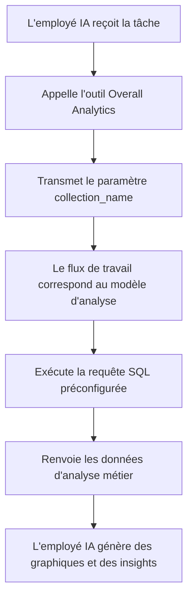

:::tip Avis de traduction IA
Cette documentation a été traduite automatiquement par IA.
:::

# Rôles et Permissions

## Introduction

La gestion des permissions des employés IA (Intelligence Artificielle) se décompose en deux niveaux :

1.  **Permissions d'accès des employés IA** : Contrôlez quels utilisateurs peuvent utiliser quels employés IA.
2.  **Permissions d'accès aux données** : Définissez comment les employés IA appliquent les contrôles de permission lors du traitement des données.

Ce document explique en détail les méthodes de configuration et le fonctionnement de ces deux types de permissions.

## Configuration des permissions d'accès des employés IA

### Définir les employés IA disponibles pour les rôles

Accédez à la page `User & Permissions`, cliquez sur l'onglet `Roles & Permissions` pour entrer dans la page de configuration des rôles.


Sélectionnez un rôle, cliquez sur l'onglet `Permissions`, puis cliquez sur l'onglet `AI employees`. Vous verrez alors la liste des employés IA gérés dans le **plugin** des employés IA.

Cliquez sur la case à cocher dans la colonne `Available` de la liste des employés IA pour contrôler si le rôle actuel peut accéder à cet employé IA.


## Permissions d'accès aux données

Lorsque les employés IA traitent des données, la méthode de contrôle des permissions dépend du type d'outil utilisé :

### Outils de requête de données intégrés au système (respectent les permissions de l'utilisateur)

Les outils suivants accèdent aux données en **respectant strictement les permissions de l'utilisateur actuel** :

| Nom de l'outil                      | Description                                                              |
| :---------------------------------- | :----------------------------------------------------------------------- |
| **Data source query**               | Interroge la base de données en utilisant la **source de données**, la **collection** et les champs. |
| **Data source records counting**    | Compte le nombre total d'enregistrements en utilisant la **source de données**, la **collection** et les champs. |

**Fonctionnement :**

Lorsqu'un employé IA appelle ces outils, le système :
1.  Identifie l'identité de l'utilisateur actuellement connecté.
2.  Applique les règles d'accès aux données configurées pour cet utilisateur dans **Rôles et Permissions**.
3.  Ne renvoie que les données que l'utilisateur est autorisé à consulter.

**Scénario d'exemple :**

Supposons que le commercial A ne puisse consulter que les données clients dont il est responsable. Lorsqu'il utilise l'employé IA Viz pour analyser les clients :
-   Viz appelle `Data source query` pour interroger la table des clients.
-   Le système applique les règles de filtrage des permissions de données du commercial A.
-   Viz ne peut voir et analyser que les données clients auxquelles le commercial A a accès.

Cela garantit que **les employés IA ne peuvent pas outrepasser les limites d'accès aux données de l'utilisateur lui-même**.

### Outils métier personnalisés via les flux de travail (logique de permission indépendante)

Les outils de requête métier personnalisés via les **flux de travail** ont un contrôle de permission **indépendant des permissions de l'utilisateur**, déterminé par la logique métier du **flux de travail**.

Ces outils sont généralement utilisés pour :
-   Des processus d'analyse métier fixes.
-   Des requêtes agrégées préconfigurées.
-   Des analyses statistiques dépassant les limites de permissions.

#### Exemple 1 : Overall Analytics (Analyse métier générale)


Dans la démo CRM, `Overall Analytics` est un moteur d'analyse métier basé sur des modèles :

| Caractéristique       | Description                                                                  |
| :-------------------- | :--------------------------------------------------------------------------- |
| **Mise en œuvre**     | Le **flux de travail** lit les modèles SQL préconfigurés et exécute des requêtes en lecture seule. |
| **Contrôle des permissions** | Non limité par les permissions de l'utilisateur actuel, produit des données métier fixes définies par les modèles. |
| **Cas d'utilisation** | Fournit une analyse globale standardisée pour des objets métier spécifiques (par exemple, prospects, opportunités, clients). |
| **Sécurité**          | Tous les modèles de requête sont préconfigurés et révisés par les administrateurs, évitant la génération dynamique de SQL. |

**Flux de travail :**



**Caractéristiques clés :**
-   Tout utilisateur appelant cet outil obtiendra la **même perspective métier**.
-   La portée des données est définie par la logique métier, non filtrée par les permissions de l'utilisateur.
-   Convient pour fournir des rapports d'analyse métier standardisés.

#### Exemple 2 : SQL Execution (Outil d'analyse avancée)


Dans la démo CRM, `SQL Execution` est un outil plus flexible mais qui nécessite un contrôle strict :

| Caractéristique       | Description                                                                  |
| :-------------------- | :--------------------------------------------------------------------------- |
| **Mise en œuvre**     | Permet à l'IA de générer et d'exécuter des instructions SQL.                 |
| **Contrôle des permissions** | Contrôlé par le **flux de travail**, généralement limité aux administrateurs uniquement. |
| **Cas d'utilisation** | Analyse de données avancée, requêtes exploratoires, analyse agrégée inter-tables. |
| **Sécurité**          | Nécessite que le **flux de travail** restreigne les opérations en lecture seule (SELECT) et contrôle la disponibilité via la configuration des tâches. |

**Recommandations de sécurité :**

1.  **Limitez la portée** : Activez uniquement dans les tâches du bloc de gestion.
2.  **Contraintes de l'invite** : Définissez clairement la portée de la requête et les noms de table dans les invites de tâche.
3.  **Validation du flux de travail** : Validez les instructions SQL dans le **flux de travail** pour vous assurer que seules les opérations SELECT sont exécutées.
4.  **Journaux d'audit** : Enregistrez toutes les instructions SQL exécutées pour la traçabilité.

**Exemple de configuration :**

```markdown
Contraintes de l'invite de tâche :
- Ne peut interroger que les tables liées au CRM (leads, opportunities, accounts, contacts)
- Ne peut exécuter que des requêtes SELECT
- Plage de temps limitée à la dernière année
- Le nombre de résultats retournés ne doit pas dépasser 1000 enregistrements
```

## Recommandations pour la conception des permissions

### Choisir une stratégie de permission par scénario métier

| Scénario métier                   | Type d'outil recommandé             | Stratégie de permission      | Raison                                       |
| :-------------------------------- | :---------------------------------- | :--------------------------- | :------------------------------------------- |
| Commercial consultant ses propres clients | Outils de requête intégrés au système | Respecte les permissions de l'utilisateur | Assure l'isolation des données et protège la sécurité métier. |
| Responsable de service consultant les données de son équipe | Outils de requête intégrés au système | Respecte les permissions de l'utilisateur | Applique automatiquement la portée des données du service. |
| Dirigeant consultant l'analyse métier globale | Outils personnalisés via les **flux de travail** / Overall Analytics | Logique métier indépendante  | Fournit une perspective globale standardisée. |
| Analyste de données effectuant des requêtes exploratoires | SQL Execution                       | Limite strictement les objets disponibles | Nécessite de la flexibilité, mais l'accès doit être contrôlé. |
| Utilisateur standard consultant des rapports standard | Overall Analytics                   | Logique métier indépendante  | Critères d'analyse fixes, pas besoin de se soucier des permissions sous-jacentes. |

### Stratégie de protection multicouche

Pour les scénarios métier sensibles, il est recommandé d'adopter un contrôle des permissions multicouche :

1.  **Couche d'accès des employés IA** : Contrôlez quels rôles peuvent utiliser quels employés IA.
2.  **Couche de visibilité des tâches** : Contrôlez l'affichage des tâches via la configuration des blocs.
3.  **Couche d'autorisation des outils** : Vérifiez l'identité et les permissions de l'utilisateur dans les **flux de travail**.
4.  **Couche d'accès aux données** : Contrôlez la portée des données via les permissions de l'utilisateur ou la logique métier.

**Exemple :**

```
Scénario : Seul le service financier peut utiliser l'IA pour l'analyse financière.

- Permissions des employés IA : Seul le rôle financier peut accéder à l'employé IA "Finance Analyst".
- Configuration des tâches : Les tâches d'analyse financière ne s'affichent que dans les modules financiers.
- Conception de l'outil : Les outils du flux de travail financier vérifient le service de l'utilisateur.
- Permissions des données : Les permissions d'accès aux tables financières ne sont accordées qu'au rôle financier.
```

## Questions Fréquentes

### Q: À quelles données les employés IA peuvent-ils accéder ?

**R:** Cela dépend du type d'outil utilisé :
-   **Outils de requête intégrés au système** : Ils ne peuvent accéder qu'aux données que l'utilisateur actuel est autorisé à consulter.
-   **Outils personnalisés via les flux de travail** : La logique métier du **flux de travail** détermine l'accès, qui peut ne pas être limité par les permissions de l'utilisateur.

### Q: Comment empêcher les employés IA de divulguer des données sensibles ?

**R:** Adoptez une protection multicouche :
1.  Configurez les permissions d'accès des rôles des employés IA pour limiter qui peut les utiliser.
2.  Pour les outils intégrés au système, fiez-vous aux permissions de données de l'utilisateur pour un filtrage automatique.
3.  Pour les outils personnalisés, implémentez la validation de la logique métier dans les **flux de travail**.
4.  Les opérations sensibles (telles que SQL Execution) ne doivent être autorisées qu'aux administrateurs.

### Q: Que faire si je souhaite que certains employés IA contournent les restrictions de permissions de l'utilisateur ?

**R:** Utilisez les outils métier personnalisés via les **flux de travail** :
-   Créez des **flux de travail** pour implémenter une logique de requête métier spécifique.
-   Contrôlez la portée des données et les règles d'accès dans les **flux de travail**.
-   Configurez les outils pour qu'ils soient utilisés par les employés IA.
-   Contrôlez qui peut appeler cette capacité via les permissions d'accès des employés IA.

### Q: Quelle est la différence entre Overall Analytics et SQL Execution ?

**R:**

| Dimension de comparaison | Overall Analytics               | SQL Execution                   |
| :----------------------- | :------------------------------ | :------------------------------ |
| Flexibilité              | Faible (ne peut utiliser que des modèles préconfigurés) | Élevée (peut générer des requêtes dynamiquement) |
| Sécurité                 | Élevée (toutes les requêtes sont pré-examinées) | Moyenne (nécessite des contraintes et une validation) |
| Utilisateurs cibles      | Utilisateurs métier réguliers   | Administrateurs ou analystes avancés |
| Coût de maintenance      | Nécessite la maintenance des modèles d'analyse | Aucune maintenance, mais nécessite une surveillance |
| Cohérence des données    | Forte (métriques standardisées) | Faible (les résultats des requêtes peuvent être incohérents) |

## Bonnes Pratiques

1.  **Respectez par défaut les permissions de l'utilisateur** : Sauf en cas de besoin métier explicite, privilégiez l'utilisation des outils intégrés au système qui respectent les permissions de l'utilisateur.
2.  **Analyse standardisée par modèle** : Pour les scénarios d'analyse courants, utilisez le modèle Overall Analytics pour offrir des capacités standardisées.
3.  **Contrôlez strictement les outils avancés** : Les outils à privilèges élevés comme SQL Execution ne doivent être autorisés qu'à un nombre limité d'administrateurs.
4.  **Isolation au niveau des tâches** : Configurez les tâches sensibles dans des blocs spécifiques et mettez en œuvre l'isolation via les permissions d'accès aux pages.
5.  **Audit et surveillance** : Enregistrez le comportement d'accès aux données des employés IA et examinez régulièrement les opérations anormales.