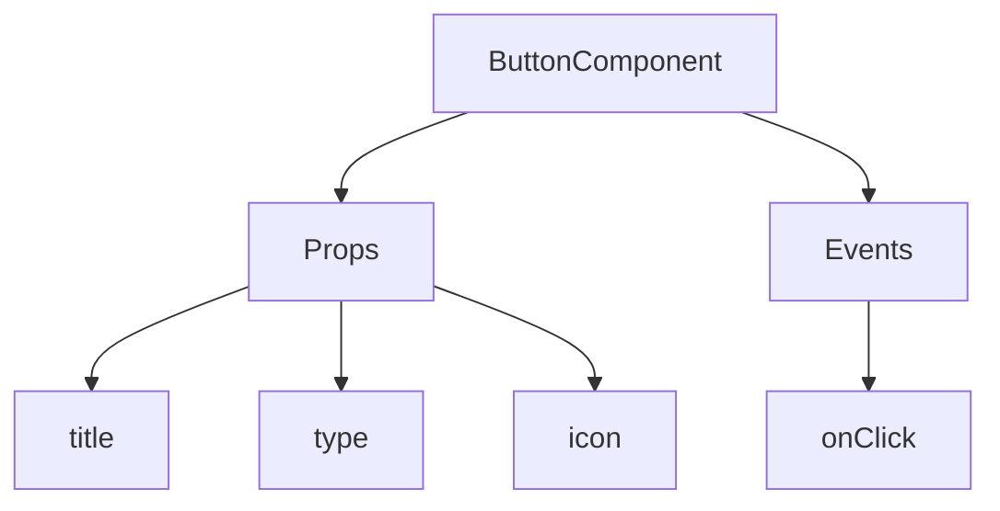
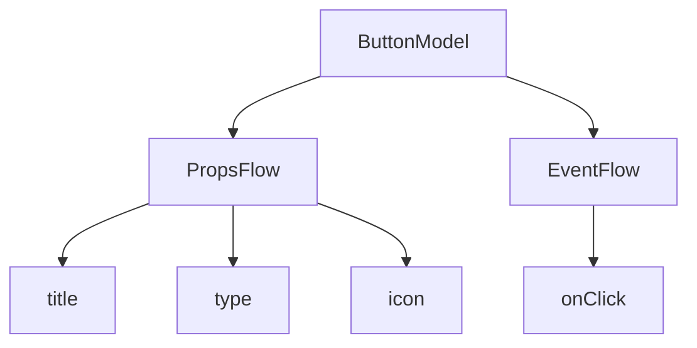

# Démarrage rapide : Créer un composant bouton orchestrable

Dans React, nous rendons généralement un composant bouton de cette manière :

```tsx pure
import { Button } from 'antd';

export default function App() {
  return <Button type="primary">Primary Button</Button>;
}
```

Bien que le code ci-dessus soit simple, il s'agit d'un **composant statique** et ne peut pas répondre aux besoins d'une plateforme sans code en matière de configurabilité et de capacités d'orchestration.

Dans le FlowEngine de NocoBase, vous pouvez rapidement créer des composants configurables et pilotés par les événements en utilisant **FlowModel + FlowDefinition**, ce qui permet d'obtenir des capacités sans code plus puissantes.

---

## Première étape : Rendre le composant avec FlowModel

<code src="./demos/quickstart-1-basic.tsx"></code>

### 🧠 Concepts clés

- `FlowModel` est le modèle de composant central du FlowEngine, encapsulant la logique, le rendu et les capacités de configuration des composants.
- Chaque composant d'interface utilisateur peut être instancié et géré de manière uniforme via `FlowModel`.

### 📌 Étapes de mise en œuvre

#### 1. Créer une classe de modèle personnalisée

```tsx pure
class MyModel extends FlowModel {
  render() {
    return <Button {...this.props} />;
  }
}
```

#### 2. Créer une instance de modèle

```ts
const model = this.flowEngine.createModel({
  uid: 'my-model',
  use: 'MyModel',
  props: {
    type: 'primary',
    children: 'Primary Button',
  },
});
```

#### 3. Rendre avec `<FlowModelRenderer />`

```tsx pure
<FlowModelRenderer model={model} />
```

---
:::tip Avis de traduction IA
Cette documentation a été traduite automatiquement par IA.
:::


## Deuxième étape : Ajouter un PropsFlow pour rendre les propriétés du bouton configurables

<code src="./demos/quickstart-2-register-propsflow.tsx"></code>

### 💡 Pourquoi utiliser un PropsFlow ?

L'utilisation d'un Flow plutôt que de props statiques permet :
- Une configuration dynamique
- Une édition visuelle
- La relecture et la persistance de l'état

### 🛠 Modifications clés

#### 1. Définir le Flow pour les propriétés du bouton

```tsx pure

const buttonSettings = defineFlow({
  key: 'buttonSettings',
  
  title: 'Paramètres du bouton',
  steps: {
    general: {
      title: 'Configuration générale',
      uiSchema: {
        title: {
          type: 'string',
          title: 'Titre du bouton',
          'x-decorator': 'FormItem',
          'x-component': 'Input',
        },
        type: {
          type: 'string',
          title: 'Type',
          'x-decorator': 'FormItem',
          'x-component': 'Select',
          enum: [
            { label: 'Principal', value: 'primary' },
            { label: 'Par défaut', value: 'default' },
            { label: 'Danger', value: 'danger' },
            { label: 'Tirets', value: 'dashed' },
            { label: 'Lien', value: 'link' },
            { label: 'Texte', value: 'text' },
          ],
        },
        icon: {
          type: 'string',
          title: 'Icône',
          'x-decorator': 'FormItem',
          'x-component': 'Select',
          enum: [
            { label: 'Rechercher', value: 'SearchOutlined' },
            { label: 'Ajouter', value: 'PlusOutlined' },
            { label: 'Supprimer', value: 'DeleteOutlined' },
            { label: 'Modifier', value: 'EditOutlined' },
            { label: 'Paramètres', value: 'SettingOutlined' },
          ],
        },
      },
      defaultParams: {
        type: 'primary',
      },
      // Fonction de gestion de l'étape, définit les propriétés du modèle
      handler(ctx, params) {
        ctx.model.setProps('children', params.title);
        ctx.model.setProps('type', params.type);
        ctx.model.setProps('icon', params.icon ? React.createElement(icons[params.icon]) : undefined);
      },
    },
  },
});

MyModel.registerFlow(buttonSettings);
```

#### 2. Utiliser `stepParams` au lieu des `props` statiques

```diff
const model = this.flowEngine.createModel({
  uid: 'my-model',
  use: 'MyModel',
- props: {
-   type: 'primary',
-   children: 'Primary Button',
- },
+ stepParams: {
+   buttonSettings: {
+     general: {
+       title: 'Primary Button',
+       type: 'primary',
+     },
+   },
+ },
});
```

> ✅ L'utilisation de `stepParams` est l'approche recommandée dans FlowEngine, car elle évite les problèmes liés aux données non sérialisables (comme les composants React).

#### 3. Activer l'interface de configuration des propriétés

```diff
- <FlowModelRenderer model={model} />
+ <FlowModelRenderer model={model} showFlowSettings />
```

---

## Troisième étape : Prendre en charge le flux d'événements du bouton (EventFlow)

<code src="./demos/quickstart-3-register-eventflow.tsx"></code>

### 🎯 Scénario : Afficher une boîte de dialogue de confirmation après avoir cliqué sur le bouton

#### 1. Écouter l'événement onClick

Ajouter onClick de manière non intrusive

```diff
const myPropsFlow = defineFlow({
  key: 'buttonSettings',
  steps: {
    general: {
      // ... omis
      handler(ctx, params) {
        // ... omis
+       ctx.model.setProps('onClick', (event) => {
+         ctx.model.dispatchEvent('click', { event });
+       });
      },
    },
  },
});
```

#### 2. Définir le flux d'événements

```ts
const myEventFlow = defineFlow({
  key: 'clickSettings',
  on: 'click',
  title: 'Événement du bouton',
  steps: {
    confirm: {
      title: 'Configuration de l\'action de confirmation',
      uiSchema: {
        title: {
          type: 'string',
          title: 'Titre de l\'invite de la boîte de dialogue',
          'x-decorator': 'FormItem',
          'x-component': 'Input',
        },
        content: {
          type: 'string',
          title: 'Contenu de l\'invite de la boîte de dialogue',
          'x-decorator': 'FormItem',
          'x-component': 'Input.TextArea',
        },
      },
      defaultParams: {
        title: 'Confirmer l\'action',
        content: 'Vous avez cliqué sur le bouton, êtes-vous sûr(e) ?',
      },
      async handler(ctx, params) {
        // Boîte de dialogue
        const confirmed = await ctx.modal.confirm({
          title: params.title,
          content: params.content,
        });
        // Message
        await ctx.message.info(`Vous avez cliqué sur le bouton, résultat de la confirmation : ${confirmed ? 'Confirmé' : 'Annulé'}`);
      },
    },
  },
});
MyModel.registerFlow(myEventFlow);
```

**Notes supplémentaires :**
- L'EventFlow permet de configurer de manière flexible le comportement du bouton via un flux, par exemple pour afficher des boîtes de dialogue, des messages, ou effectuer des appels API.
- Vous pouvez enregistrer différents flux d'événements pour différents événements (comme `onClick`, `onMouseEnter`, etc.) afin de répondre à des besoins métier complexes.

#### 3. Configurer les paramètres du flux d'événements

Lors de la création du modèle, vous pouvez configurer les paramètres par défaut du flux d'événements via `stepParams` :

```ts
const model = this.flowEngine.createModel({
  uid: 'my-model',
  use: 'MyModel',
  stepParams: {
    buttonSettings: {
      general: {
        title: 'Primary Button',
        type: 'primary',
      },
    },
    clickSettings: {
      confirm: {
        title: 'Confirm Action',
        content: 'You clicked the button, are you sure?',
      },
    },
  },
});
```

---

## Comparaison des modèles : ReactComponent vs FlowModel

Le Flow ne modifie pas la manière dont les composants sont implémentés. Il ajoute simplement la prise en charge des PropsFlow et EventFlow à un ReactComponent, permettant ainsi de configurer et d'orchestrer visuellement les propriétés et les événements du composant.


### ReactComponent



### FlowModel



## Résumé

Grâce aux trois étapes ci-dessus, nous avons créé un composant bouton qui prend en charge la configuration et l'orchestration d'événements, offrant les avantages suivants :

- 🚀 Configuration visuelle des propriétés (comme le titre, le type, l'icône)
- 🔄 Les réponses aux événements peuvent être gérées par un flux (par exemple, un clic pour afficher une boîte de dialogue)
- 🔧 Prend en charge les extensions futures (comme la logique conditionnelle, la liaison de variables, etc.)

Ce modèle est également applicable à tout composant d'interface utilisateur, tel que les formulaires, les listes et les graphiques. Dans le FlowEngine de NocoBase, **tout est orchestrable**.