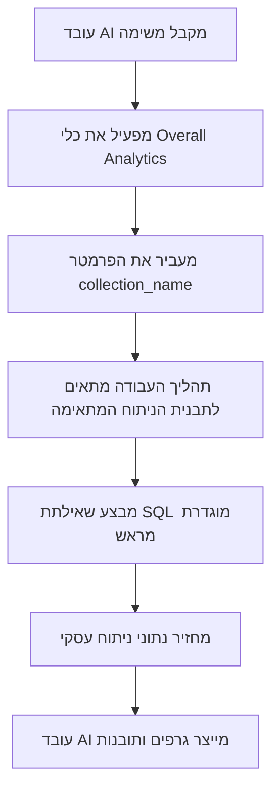

:::tip
מסמך זה תורגם על ידי בינה מלאכותית. לכל אי דיוק, אנא עיין ב[גרסה האנגלית](/en)
:::


# תפקידים והרשאות

## מבוא

ניהול הרשאות של עובדי AI כולל שני רבדים:

1.  **הרשאות גישה לעובדי AI**: שליטה אילו משתמשים יכולים להשתמש באילו עובדי AI.
2.  **הרשאות גישה לנתונים**: כיצד עובדי AI מיישמים בקרות הרשאה בעת עיבוד נתונים.

מסמך זה יפרט את שיטות התצורה ואת עקרונות העבודה של שני סוגי הרשאות אלו.

---

## הגדרת הרשאות גישה לעובדי AI

### הגדרת עובדי AI זמינים לתפקידים

עברו לדף `User & Permissions`, לחצו על לשונית `Roles & Permissions` כדי להיכנס לדף הגדרת התפקידים.


בחרו תפקיד, לחצו על לשונית `Permissions`, ולאחר מכן לחצו על לשונית `AI employees`. כאן תוצג רשימת עובדי ה-AI המנוהלים בתוסף עובדי ה-AI.

לחצו על תיבת הסימון בעמודה `Available` ברשימת עובדי ה-AI כדי לקבוע אם התפקיד הנוכחי יכול לגשת לעובד AI זה.


## הרשאות גישה לנתונים

כאשר עובדי AI מעבדים נתונים, שיטת בקרת ההרשאות תלויה בסוג הכלי שבו נעשה שימוש:

### כלי שאילתת נתונים מובנים במערכת (פועלים לפי הרשאות משתמש)

הכלים הבאים **פועלים אך ורק לפי הרשאות הנתונים של המשתמש הנוכחי** לצורך גישה לנתונים:

| שם הכלי                            | תיאור                     |
| :---------------------------------- | :------------------------ |
| **שאילתת מקור נתונים**             | שאילתת מסד נתונים באמצעות מקור נתונים, אוסף ושדות |
| **ספירת רשומות ממקור נתונים**      | ספירת סך הרשומות באמצעות מקור נתונים, אוסף ושדות |

**כיצד זה עובד:**

כאשר עובדי AI מפעילים כלים אלו, המערכת תבצע:
1.  זיהוי זהות המשתמש המחובר הנוכחי.
2.  יישום כללי הגישה לנתונים שהוגדרו עבור משתמש זה ב**תפקידים והרשאות**.
3.  החזרת הנתונים שהמשתמש מורשה לצפות בהם בלבד.

**תרחיש לדוגמה:**

נניח שאיש מכירות א' יכול לצפות רק בנתוני לקוחות שהוא אחראי עליהם. כאשר הוא משתמש בעובד AI בשם Viz כדי לנתח לקוחות:
-   Viz מפעיל את `Data source query` כדי לשלוף נתונים מטבלת הלקוחות.
-   המערכת מיישמת את כללי סינון הרשאות הנתונים של איש המכירות א'.
-   Viz יכול לראות ולנתח רק נתוני לקוחות שלאיש המכירות א' יש גישה אליהם.

זה מבטיח ש**עובדי AI לא יוכלו לעקוף את גבולות הגישה לנתונים של המשתמש עצמו**.

---

### כלי עסקי מותאם אישית של תהליך עבודה (לוגיקת הרשאות עצמאית)

לכלי שאילתות עסקיים המותאמים אישית באמצעות תהליכי עבודה יש בקרת הרשאות **עצמאית מהרשאות המשתמש**, והיא נקבעת על ידי הלוגיקה העסקית של תהליך העבודה.

כלים אלו משמשים בדרך כלל עבור:
-   תהליכי ניתוח עסקי קבועים.
-   שאילתות אגרגציה מוגדרות מראש.
-   ניתוח סטטיסטי החוצה גבולות הרשאה.

#### דוגמה 1: Overall Analytics (ניתוח עסקי כללי)


בהדגמת ה-CRM, `Overall Analytics` הוא מנוע ניתוח עסקי מבוסס תבניות:

| מאפיין              | תיאור                                    |
| :------------------ | :--------------------------------------- |
| **אופן מימוש**      | תהליך העבודה קורא תבניות SQL מוגדרות מראש ומבצע שאילתות לקריאה בלבד |
| **בקרת הרשאות**     | אינה מוגבלת על ידי הרשאות המשתמש הנוכחי, ומפיקה נתונים עסקיים קבועים המוגדרים על ידי תבניות |
| **תרחישי שימוש**    | מספקת ניתוח הוליסטי סטנדרטי עבור אובייקטים עסקיים ספציפיים (לדוגמה, לידים, הזדמנויות, לקוחות) |
| **אבטחה**           | כל תבניות השאילתות מוגדרות מראש ונבדקות על ידי מנהלי מערכת, מה שמונע יצירת SQL דינמית |

**תהליך עבודה:**



**מאפייני מפתח:**
-   כל משתמש שיפעיל כלי זה יקבל את **אותה פרספקטיבה עסקית**.
-   טווח הנתונים מוגדר על ידי הלוגיקה העסקית, ולא מסונן על ידי הרשאות משתמש.
-   מתאים למתן דוחות ניתוח עסקי סטנדרטיים.

#### דוגמה 2: SQL Execution (כלי ניתוח מתקדם)


בהדגמת ה-CRM, `SQL Execution` הוא כלי גמיש יותר אך דורש בקרה קפדנית:

| מאפיין              | תיאור                                    |
| :------------------ | :--------------------------------------- |
| **אופן מימוש**      | מאפשר ל-AI ליצור ולבצע פקודות SQL |
| **בקרת הרשאות**     | נשלטת על ידי תהליך העבודה, ובדרך כלל מוגבלת למנהלי מערכת בלבד |
| **תרחישי שימוש**    | ניתוח נתונים מתקדם, שאילתות חקרניות, ניתוח אגרגציה בין טבלאות |
| **אבטחה**           | דורש מתהליך העבודה להגביל פעולות קריאה בלבד (SELECT) ולשלוט בזמינות באמצעות הגדרת משימות |

**המלצות אבטחה:**

1.  **הגבלת טווח**: הפעילו רק במשימות של בלוקי ניהול.
2.  **אילוצי הנחיה**: הגדירו בבירור את טווח השאילתה ושמות הטבלאות בהנחיות המשימה.
3.  **אימות תהליך עבודה**: ודאו את פקודות ה-SQL בתהליך העבודה כדי להבטיח שרק פעולות SELECT מבוצעות.
4.  **יומני ביקורת**: תיעוד כל פקודות ה-SQL שבוצעו, לצורך מעקב.

**דוגמת תצורה:**

```markdown
אילוצי הנחיה למשימה:
- ניתן לשלוף נתונים רק מטבלאות הקשורות ל-CRM (leads, opportunities, accounts, contacts)
- ניתן לבצע רק שאילתות SELECT
- טווח הזמן מוגבל לשנה האחרונה
- מספר הרשומות המוחזרות מוגבל ל-1000
```

---

## המלצות לתכנון הרשאות

### בחירת אסטרטגיית הרשאות לפי תרחיש עסקי

| תרחיש עסקי                   | סוג כלי מומלץ               | אסטרטגיית הרשאות         | סיבה                                |
| :--------------------------- | :-------------------------- | :----------------------- | :---------------------------------- |
| איש מכירות צופה בלקוחותיו שלו | כלי שאילתות מובנים במערכת   | פועל לפי הרשאות משתמש   | מבטיח בידוד נתונים ומגן על אבטחת המידע העסקי. |
| מנהל מחלקה צופה בנתוני הצוות | כלי שאילתות מובנים במערכת   | פועל לפי הרשאות משתמש   | מיישם אוטומטית את טווח נתוני המחלקה. |
| מנהל בכיר צופה בניתוח עסקי גלובלי | כלי מותאם אישית של תהליך עבודה / Overall Analytics | לוגיקה עסקית עצמאית     | מספק פרספקטיבה הוליסטית סטנדרטית. |
| אנליסט נתונים מבצע שאילתות חקרניות | SQL Execution               | הגבלה קפדנית של אובייקטים זמינים | דורש גמישות אך חייב לשלוט בטווח הגישה. |
| משתמשים רגילים צופים בדוחות סטנדרטיים | Overall Analytics           | לוגיקה עסקית עצמאית     | קריטריוני ניתוח קבועים, אין צורך לדאוג להרשאות הבסיסיות. |

### אסטרטגיית הגנה רב-שכבתית

עבור תרחישים עסקיים רגישים, מומלץ לאמץ בקרת הרשאות רב-שכבתית:

1.  **שכבת גישה לעובדי AI**: שליטה אילו תפקידים יכולים להשתמש באילו עובדי AI.
2.  **שכבת נראות משימות**: שליטה על הצגת משימות באמצעות הגדרת בלוקים.
3.  **שכבת הרשאת כלים**: אימות זהות המשתמש והרשאותיו בתהליכי עבודה.
4.  **שכבת גישה לנתונים**: שליטה על טווח הנתונים באמצעות הרשאות משתמש או לוגיקה עסקית.

**דוגמה:**

```
תרחיש: רק מחלקת הכספים יכולה להשתמש ב-AI לניתוח פיננסי

- הרשאות עובד AI: רק תפקיד כספים יכול לגשת לעובד AI "Finance Analyst"
- הגדרת משימה: משימות ניתוח פיננסי מוצגות רק במודולים פיננסיים
- תכנון כלי: כלי תהליך העבודה הפיננסיים מאמתים את מחלקת המשתמש
- הרשאות נתונים: הרשאות גישה לטבלת הכספים ניתנות רק לתפקיד כספים
```

---

## שאלות נפוצות

### ש: לאילו נתונים עובדי AI יכולים לגשת?

**ת:** זה תלוי בסוג הכלי שבו נעשה שימוש:
-   **כלי שאילתות מובנים במערכת**: יכולים לגשת רק לנתונים שהמשתמש הנוכחי מורשה לצפות בהם.
-   **כלי מותאם אישית של תהליך עבודה**: נקבע על ידי הלוגיקה העסקית של תהליך העבודה, וייתכן שלא יהיה מוגבל על ידי הרשאות משתמש.

### ש: כיצד למנוע מעובדי AI לדלוף נתונים רגישים?

**ת:** אמצו הגנה רב-שכבתית:
1.  הגדירו הרשאות גישה לתפקידים של עובדי AI, כדי להגביל מי יכול להשתמש בהם.
2.  עבור כלים מובנים במערכת, הסתמכו על הרשאות נתוני המשתמש לסינון אוטומטי.
3.  עבור כלים מותאמים אישית, הטמיעו אימות לוגיקה עסקית בתהליכי עבודה.
4.  פעולות רגישות (כגון SQL Execution) צריכות להיות מורשות למנהלי מערכת בלבד.

### ש: מה אם אני רוצה שעובדי AI מסוימים יעקפו את מגבלות הרשאות המשתמש?

**ת:** השתמשו בכלי עסקי מותאם אישית של תהליך עבודה:
-   צרו תהליכי עבודה כדי ליישם לוגיקת שאילתות עסקיות ספציפיות.
-   שלטו בטווח הנתונים ובכללי הגישה בתהליכי העבודה.
-   הגדירו כלים עבור עובדי AI לשימוש.
-   שלטו מי יכול להפעיל יכולת זו באמצעות הרשאות גישה לעובדי AI.

### ש: מה ההבדל בין Overall Analytics ל-SQL Execution?

**ת:**

| מימד השוואה   | Overall Analytics                       | SQL Execution                           |
| :------------ | :-------------------------------------- | :-------------------------------------- |
| גמישות        | נמוכה (ניתן להשתמש רק בתבניות מוגדרות מראש) | גבוהה (יכול ליצור שאילתות באופן דינמי) |
| אבטחה         | גבוהה (כל השאילתות נבדקות מראש)        | בינונית (דורש אילוצים ואימות)          |
| משתמשי יעד    | משתמשים עסקיים רגילים                  | מנהלי מערכת או אנליסטים בכירים          |
| עלות תחזוקה   | צורך לתחזק תבניות ניתוח                | ללא תחזוקה, אך דורש ניטור               |
| עקביות נתונים | חזקה (מדדים סטנדרטיים)                  | חלשה (תוצאות שאילתה עשויות להיות לא עקביות) |

---

## שיטות עבודה מומלצות

1.  **ברירת מחדל – פועל לפי הרשאות משתמש**: אלא אם כן קיימת דרישה עסקית מפורשת, תעדיפו להשתמש בכלים המובנים במערכת הפועלים לפי הרשאות משתמש.
2.  **ניתוח סטנדרטי מבוסס תבניות**: עבור תרחישי ניתוח נפוצים, השתמשו בתבנית Overall Analytics כדי לספק יכולות סטנדרטיות.
3.  **בקרה קפדנית על כלים מתקדמים**: כלים בעלי הרשאות גבוהות כמו SQL Execution צריכים להיות מורשים למספר מצומצם של מנהלי מערכת בלבד.
4.  **בידוד ברמת משימה**: הגדירו משימות רגישות בבלוקים ספציפיים ויישמו בידוד באמצעות הרשאות גישה לדפים.
5.  **ביקורת וניטור**: תיעוד התנהגות גישת הנתונים של עובדי AI ובדיקה שוטפת של פעולות חריגות.