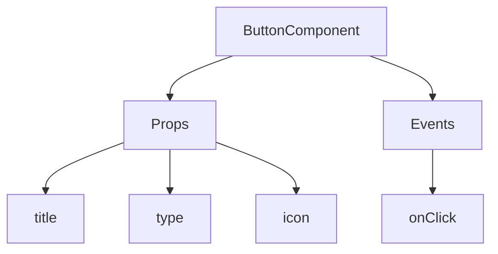
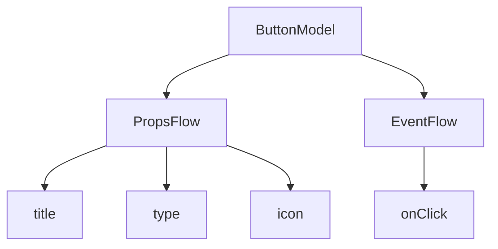

:::tip
מסמך זה תורגם על ידי בינה מלאכותית. לכל אי דיוק, אנא עיין ב[גרסה האנגלית](/en)
:::


# התחלה מהירה: בניית רכיב כפתור הניתן לארגון

ב-React, אנו בדרך כלל מרנדרים רכיב כפתור באופן הבא:

```tsx pure
import { Button } from 'antd';

export default function App() {
  return <Button type="primary">Primary Button</Button>;
}
```

למרות שהקוד לעיל פשוט, הוא נחשב ל**רכיב סטטי** ואינו יכול לענות על הצרכים של פלטפורמת No-Code לדרישות של יכולת הגדרה וארגון.

ב-FlowEngine של NocoBase, אנו יכולים לבנות במהירות רכיבים התומכים בהגדרה ומונעים על ידי אירועים, באמצעות **FlowModel + FlowDefinition**, ובכך להשיג יכולות No-Code חזקות יותר.

---

## שלב 1: רינדור הרכיב באמצעות FlowModel

<code src="./demos/quickstart-1-basic.tsx"></code>

### 🧠 מושגי מפתח

- `FlowModel` הוא מודל הרכיב המרכזי ב-FlowEngine, המאגד בתוכו לוגיקת רכיבים, רינדור ויכולות הגדרה.
- כל רכיב ממשק משתמש (UI) יכול להיות ממומש (instantiated) ומנוהל באופן אחיד באמצעות `FlowModel`.

### 📌 שלבי יישום

#### 1. יצירת מחלקת מודל מותאמת אישית

```tsx pure
class MyModel extends FlowModel {
  render() {
    return <Button {...this.props} />;
  }
}
```

#### 2. יצירת מופע של המודל

```ts
const model = this.flowEngine.createModel({
  uid: 'my-model',
  use: 'MyModel',
  props: {
    type: 'primary',
    children: 'Primary Button',
  },
});
```

#### 3. רינדור באמצעות `<FlowModelRenderer />`

```tsx pure
<FlowModelRenderer model={model} />
```

## שלב 2: הוספת PropsFlow כדי להפוך את מאפייני הכפתור לניתנים להגדרה

<code src="./demos/quickstart-2-register-propsflow.tsx"></code>

### 💡 למה להשתמש ב-PropsFlow?

שימוש ב-Flow במקום ב-props סטטיים מאפשר:
- הגדרה דינמית
- עריכה ויזואלית
- שיחזור מצב והתמדה

### 🛠 נקודות שינוי מרכזיות

#### 1. הגדרת ה-Flow עבור מאפייני הכפתור

```tsx pure

const buttonSettings = defineFlow({
  key: 'buttonSettings',
  
  title: 'הגדרות כפתור',
  steps: {
    general: {
      title: 'הגדרה כללית',
      uiSchema: {
        title: {
          type: 'string',
          title: 'כותרת כפתור',
          'x-decorator': 'FormItem',
          'x-component': 'Input',
        },
        type: {
          type: 'string',
          title: 'סוג',
          'x-decorator': 'FormItem',
          'x-component': 'Select',
          enum: [
            { label: 'ראשי', value: 'primary' },
            { label: 'ברירת מחדל', value: 'default' },
            { label: 'מסוכן', value: 'danger' },
            { label: 'מקווקו', value: 'dashed' },
            { label: 'קישור', value: 'link' },
            { label: 'טקסט', value: 'text' },
          ],
        },
        icon: {
          type: 'string',
          title: 'אייקון',
          'x-decorator': 'FormItem',
          'x-component': 'Select',
          enum: [
            { label: 'חיפוש', value: 'SearchOutlined' },
            { label: 'הוספה', value: 'PlusOutlined' },
            { label: 'מחיקה', value: 'DeleteOutlined' },
            { label: 'עריכה', value: 'EditOutlined' },
            { label: 'הגדרות', value: 'SettingOutlined' },
          ],
        },
      },
      defaultParams: {
        type: 'primary',
      },
      // פונקציית handler של השלב, מגדירה את מאפייני המודל
      handler(ctx, params) {
        ctx.model.setProps('children', params.title);
        ctx.model.setProps('type', params.type);
        ctx.model.setProps('icon', params.icon ? React.createElement(icons[params.icon]) : undefined);
      },
    },
  },
});

MyModel.registerFlow(buttonSettings);
```

#### 2. שימוש ב-`stepParams` במקום ב-`props` סטטיים

```diff
const model = this.flowEngine.createModel({
  uid: 'my-model',
  use: 'MyModel',
- props: {
-   type: 'primary',
-   children: 'Primary Button',
- },
+ stepParams: {
+   buttonSettings: {
+     general: {
+       title: 'Primary Button',
+       type: 'primary',
+     },
+   },
+ },
});
```

> ✅ שימוש ב-`stepParams` היא הגישה המומלצת ב-FlowEngine, מכיוון שהיא מונעת בעיות עם נתונים שאינם ניתנים לסריאליזציה (כמו רכיבי React).

#### 3. הפעלת ממשק הגדרת המאפיינים

```diff
- <FlowModelRenderer model={model} />
+ <FlowModelRenderer model={model} showFlowSettings />
```

---

## שלב 3: תמיכה בזרם אירועי כפתור (EventFlow)

<code src="./demos/quickstart-3-register-eventflow.tsx"></code>

### 🎯 תרחיש: הצגת תיבת אישור לאחר לחיצה על הכפתור

#### 1. האזנה לאירוע onClick

הוספת onClick באופן לא פולשני

```diff
const myPropsFlow = defineFlow({
  key: 'buttonSettings',
  steps: {
    general: {
      // ... הושמט
      handler(ctx, params) {
        // ... הושמט
+       ctx.model.setProps('onClick', (event) => {
+         ctx.model.dispatchEvent('click', { event });
+       });
      },
    },
  },
});
```

#### 2. הגדרת זרם האירועים

```ts
const myEventFlow = defineFlow({
  key: 'clickSettings',
  on: 'click',
  title: 'אירוע כפתור',
  steps: {
    confirm: {
      title: 'הגדרת פעולת אישור',
      uiSchema: {
        title: {
          type: 'string',
          title: 'כותרת הודעת חלון קופץ',
          'x-decorator': 'FormItem',
          'x-component': 'Input',
        },
        content: {
          type: 'string',
          title: 'תוכן הודעת חלון קופץ',
          'x-decorator': 'FormItem',
          'x-component': 'Input.TextArea',
        },
      },
      defaultParams: {
        title: 'אישור פעולה',
        content: 'לחצת על הכפתור, האם אתה בטוח?',
      },
      async handler(ctx, params) {
        // חלון קופץ
        const confirmed = await ctx.modal.confirm({
          title: params.title,
          content: params.content,
        });
        // הודעה
        await ctx.message.info(`לחצת על הכפתור, תוצאת האישור: ${confirmed ? 'אושר' : 'בוטל'}`);
      },
    },
  },
});
MyModel.registerFlow(myEventFlow);
```

**הערות נוספות:**
- זרם אירועים (EventFlow) מאפשר להגדיר באופן גמיש את התנהגות הכפתור באמצעות תהליך עבודה, לדוגמה: הצגת חלונות קופצים, הודעות, קריאות API ועוד.
- ניתן לרשום זרמי אירועים שונים עבור אירועים שונים (כגון `onClick`, `onMouseEnter` וכו') כדי לעמוד בדרישות עסקיות מורכבות.

#### 3. הגדרת פרמטרים של זרם האירועים

בעת יצירת המודל, ניתן להגדיר את פרמטרי ברירת המחדל עבור זרם האירועים באמצעות `stepParams`:

```ts
const model = this.flowEngine.createModel({
  uid: 'my-model',
  use: 'MyModel',
  stepParams: {
    buttonSettings: {
      general: {
        title: 'Primary Button',
        type: 'primary',
      },
    },
    clickSettings: {
      confirm: {
        title: 'אישור פעולה',
        content: 'לחצת על הכפתור, האם אתה בטוח?',
      },
    },
  },
});
```

---

## השוואת מודלים: ReactComponent מול FlowModel

Flow אינו משנה את אופן המימוש של רכיבים. הוא פשוט מוסיף תמיכה ב-PropsFlow וב-EventFlow לרכיב ReactComponent, ובכך מאפשר להגדיר ולארגן באופן ויזואלי את המאפיינים והאירועים של הרכיב.


### ReactComponent



### FlowModel



## סיכום

באמצעות שלושת השלבים לעיל, השלמנו רכיב כפתור התומך בהגדרה ובארגון אירועים, ובעל היתרונות הבאים:

- 🚀 הגדרה ויזואלית של מאפיינים (כמו כותרת, סוג, אייקון)
- 🔄 תגובות לאירועים יכולות להיות מנוהלות על ידי תהליך עבודה (לדוגמה, לחיצה להצגת חלון קופץ)
- 🔧 תומך בהרחבות עתידיות (כמו לוגיקה מותנית, קישור משתנים וכו')

תבנית זו ישימה גם לכל רכיב ממשק משתמש (UI), כגון טפסים, רשימות וגרפים. ב-FlowEngine של NocoBase, **הכל ניתן לארגון**.