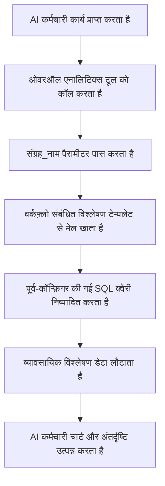

:::tip
यह दस्तावेज़ AI द्वारा अनुवादित किया गया है। किसी भी अशुद्धि के लिए, कृपया [अंग्रेजी संस्करण](/en) देखें
:::


# भूमिकाएँ और अनुमतियाँ

## परिचय

AI कर्मचारियों का अनुमति प्रबंधन दो स्तरों पर होता है:

1.  **AI कर्मचारियों के लिए एक्सेस अनुमतियाँ**: यह नियंत्रित करता है कि कौन से उपयोगकर्ता किन AI कर्मचारियों का उपयोग कर सकते हैं।
2.  **डेटा एक्सेस अनुमतियाँ**: जब AI कर्मचारी डेटा को प्रोसेस करते हैं, तो अनुमति नियंत्रण कैसे लागू होते हैं।

यह दस्तावेज़ इन दोनों प्रकार की अनुमतियों को कॉन्फ़िगर करने के तरीकों और उनके काम करने के सिद्धांतों के बारे में विस्तार से बताता है।

---

## AI कर्मचारियों के लिए एक्सेस अनुमतियाँ कॉन्फ़िगर करना

### भूमिकाओं के लिए उपलब्ध AI कर्मचारियों को सेट करना

`उपयोगकर्ता और अनुमतियाँ` पेज पर जाएँ, `भूमिकाएँ और अनुमतियाँ` टैब पर क्लिक करके भूमिका कॉन्फ़िगरेशन पेज पर पहुँचें।


एक भूमिका चुनें, `अनुमतियाँ` टैब पर क्लिक करें, और फिर `AI कर्मचारी` टैब पर क्लिक करें। यहाँ आपको AI कर्मचारी प्लगइन में प्रबंधित AI कर्मचारियों की सूची दिखाई देगी।

AI कर्मचारी सूची के `उपलब्ध` कॉलम में चेकबॉक्स पर क्लिक करके नियंत्रित करें कि क्या वर्तमान भूमिका उस AI कर्मचारी को एक्सेस कर सकती है।


## डेटा एक्सेस अनुमतियाँ

जब AI कर्मचारी डेटा को प्रोसेस करते हैं, तो अनुमति नियंत्रण का तरीका उपयोग किए गए टूल के प्रकार पर निर्भर करता है:

### सिस्टम के अंतर्निहित डेटा क्वेरी टूल (उपयोगकर्ता अनुमतियों का पालन करते हैं)

निम्नलिखित टूल डेटा एक्सेस के लिए **वर्तमान उपयोगकर्ता की डेटा अनुमतियों का कड़ाई से पालन** करते हैं:

| टूल का नाम                            | विवरण                     |
| ------------------------------------ | ------------------------------- |
| **डेटा स्रोत क्वेरी**                | डेटा स्रोत, संग्रह और फ़ील्ड का उपयोग करके डेटाबेस को क्वेरी करें      |
| **डेटा स्रोत रिकॉर्ड की गणना**     | डेटा स्रोत, संग्रह और फ़ील्ड का उपयोग करके कुल रिकॉर्ड की गणना करें     |

**यह कैसे काम करता है:**

जब AI कर्मचारी इन टूल को कॉल करते हैं, तो सिस्टम:
1.  वर्तमान लॉग-इन उपयोगकर्ता की पहचान करता है।
2.  उस उपयोगकर्ता के लिए **भूमिकाएँ और अनुमतियाँ** में कॉन्फ़िगर किए गए डेटा एक्सेस नियमों को लागू करता है।
3.  केवल वही डेटा लौटाता है जिसे देखने की उपयोगकर्ता को अनुमति है।

**उदाहरण परिदृश्य:**

मान लीजिए कि सेल्सपर्सन A केवल उन ग्राहक डेटा को देख सकता है जिसके लिए वह ज़िम्मेदार है। जब वह ग्राहकों का विश्लेषण करने के लिए AI कर्मचारी Viz का उपयोग करता है:
-   Viz ग्राहक तालिका को क्वेरी करने के लिए `डेटा स्रोत क्वेरी` को कॉल करता है।
-   सिस्टम सेल्सपर्सन A के डेटा अनुमति फ़िल्टरिंग नियमों को लागू करता है।
-   Viz केवल उस ग्राहक डेटा को देख और विश्लेषण कर सकता है जिस तक सेल्सपर्सन A की पहुँच है।

यह सुनिश्चित करता है कि **AI कर्मचारी उपयोगकर्ता की अपनी डेटा एक्सेस सीमाओं को पार नहीं कर सकते**।

---

### वर्कफ़्लो कस्टम व्यावसायिक टूल (स्वतंत्र अनुमति तर्क)

वर्कफ़्लो के माध्यम से अनुकूलित व्यावसायिक क्वेरी टूल का अनुमति नियंत्रण **उपयोगकर्ता अनुमतियों से स्वतंत्र** होता है, जो वर्कफ़्लो के व्यावसायिक तर्क द्वारा निर्धारित होता है।

इन टूल का उपयोग आमतौर पर इसके लिए किया जाता है:
-   निश्चित व्यावसायिक विश्लेषण प्रक्रियाएँ
-   पूर्व-कॉन्फ़िगर की गई एग्रीगेट क्वेरीज़
-   क्रॉस-अनुमति सीमा सांख्यिकीय विश्लेषण

#### उदाहरण 1: ओवरऑल एनालिटिक्स (सामान्य व्यावसायिक विश्लेषण)


CRM डेमो में, `ओवरऑल एनालिटिक्स` एक टेम्पलेट-आधारित व्यावसायिक विश्लेषण इंजन है:

| विशेषता     | विवरण                                    |
| ------ | ------------------------------------- |
| **कार्यान्वयन** | वर्कफ़्लो पूर्व-कॉन्फ़िगर किए गए SQL टेम्पलेट्स को पढ़ता है और केवल-पढ़ने वाली क्वेरीज़ निष्पादित करता है              |
| **अनुमति नियंत्रण** | वर्तमान उपयोगकर्ता अनुमतियों द्वारा सीमित नहीं, टेम्पलेट्स द्वारा परिभाषित निश्चित व्यावसायिक डेटा आउटपुट करता है           |
| **उपयोग के मामले** | विशिष्ट व्यावसायिक वस्तुओं (जैसे लीड, अवसर, ग्राहक) के लिए मानकीकृत समग्र विश्लेषण प्रदान करता है       |
| **सुरक्षा**  | सभी क्वेरी टेम्पलेट्स प्रशासकों द्वारा पूर्व-कॉन्फ़िगर और समीक्षा किए जाते हैं, जिससे गतिशील SQL जनरेशन से बचा जा सके        |

**कार्यप्रवाह:**



**मुख्य विशेषताएँ:**
-   इस टूल को कॉल करने वाले किसी भी उपयोगकर्ता को **समान व्यावसायिक दृष्टिकोण** प्राप्त होगा।
-   डेटा का दायरा व्यावसायिक तर्क द्वारा परिभाषित होता है, उपयोगकर्ता अनुमतियों द्वारा फ़िल्टर नहीं किया जाता।
-   मानकीकृत व्यावसायिक विश्लेषण रिपोर्ट प्रदान करने के लिए उपयुक्त।

#### उदाहरण 2: SQL एग्जीक्यूशन (उन्नत विश्लेषण टूल)


CRM डेमो में, `SQL एग्जीक्यूशन` एक अधिक लचीला लेकिन कड़ाई से नियंत्रित टूल है:

| विशेषता     | विवरण                                    |
| ------ | ------------------------------------- |
| **कार्यान्वयन** | AI को SQL स्टेटमेंट जनरेट और निष्पादित करने की अनुमति देता है                    |
| **अनुमति नियंत्रण** | वर्कफ़्लो द्वारा नियंत्रित, आमतौर पर केवल प्रशासकों तक सीमित                  |
| **उपयोग के मामले** | उन्नत डेटा विश्लेषण, खोजपूर्ण क्वेरीज़, क्रॉस-टेबल एग्रीगेट विश्लेषण                  |
| **सुरक्षा**  | वर्कफ़्लो को केवल-पढ़ने वाले ऑपरेशंस (SELECT) को प्रतिबंधित करने और कार्य कॉन्फ़िगरेशन के माध्यम से उपलब्धता को नियंत्रित करने की आवश्यकता है   |

**सुरक्षा संबंधी सुझाव:**

1.  **दायरा सीमित करें**: केवल प्रबंधन ब्लॉक के कार्यों में सक्षम करें।
2.  **प्रॉम्प्ट बाधाएँ**: कार्य प्रॉम्प्ट में क्वेरी के दायरे और तालिका के नामों को स्पष्ट रूप से परिभाषित करें।
3.  **वर्कफ़्लो सत्यापन**: यह सुनिश्चित करने के लिए वर्कफ़्लो में SQL स्टेटमेंट को मान्य करें कि केवल SELECT ऑपरेशंस ही निष्पादित हों।
4.  **ऑडिट लॉग**: ट्रेसबिलिटी के लिए सभी निष्पादित SQL स्टेटमेंट को रिकॉर्ड करें।

**उदाहरण कॉन्फ़िगरेशन:**

```markdown
कार्य प्रॉम्प्ट बाधाएँ:
- केवल CRM-संबंधित तालिकाओं (leads, opportunities, accounts, contacts) को क्वेरी करें
- केवल SELECT क्वेरीज़ निष्पादित करें
- समय सीमा पिछले 1 वर्ष तक सीमित
- लौटाए गए परिणाम 1000 रिकॉर्ड से अधिक न हों
```

---

## अनुमति डिज़ाइन संबंधी सुझाव

### व्यावसायिक परिदृश्य के अनुसार अनुमति रणनीति चुनें

| व्यावसायिक परिदृश्य         | अनुशंसित टूल प्रकार         | अनुमति रणनीति         | कारण                   |
| ------------ | -------------- | ------------ | -------------------- |
| सेल्सपर्सन अपने ग्राहकों को देख रहा है  | सिस्टम के अंतर्निहित क्वेरी टूल       | उपयोगकर्ता अनुमतियों का पालन करें       | डेटा अलगाव सुनिश्चित करता है और व्यावसायिक सुरक्षा की रक्षा करता है        |
| विभाग प्रबंधक टीम डेटा देख रहा है   | सिस्टम के अंतर्निहित क्वेरी टूल       | उपयोगकर्ता अनुमतियों का पालन करें       | स्वचालित रूप से विभाग डेटा दायरे को लागू करता है           |
| कार्यकारी वैश्विक व्यावसायिक विश्लेषण देख रहा है   | वर्कफ़्लो कस्टम टूल / ओवरऑल एनालिटिक्स       | स्वतंत्र व्यावसायिक तर्क       | मानकीकृत समग्र दृष्टिकोण प्रदान करता है           |
| डेटा विश्लेषक खोजपूर्ण क्वेरीज़   | SQL एग्जीक्यूशन  | उपलब्ध वस्तुओं को कड़ाई से सीमित करें     | लचीलेपन की आवश्यकता है, लेकिन एक्सेस दायरे को नियंत्रित करना होगा      |
| नियमित उपयोगकर्ता मानक रिपोर्ट देख रहे हैं   | ओवरऑल एनालिटिक्स | स्वतंत्र व्यावसायिक तर्क       | निश्चित विश्लेषण मानक, अंतर्निहित अनुमतियों के बारे में चिंता करने की आवश्यकता नहीं      |

### बहु-स्तरीय सुरक्षा रणनीति

संवेदनशील व्यावसायिक परिदृश्यों के लिए, बहु-स्तरीय अनुमति नियंत्रण अपनाने की सलाह दी जाती है:

1.  **AI कर्मचारी एक्सेस लेयर**: नियंत्रित करें कि कौन सी भूमिकाएँ किन AI कर्मचारियों का उपयोग कर सकती हैं।
2.  **कार्य दृश्यता लेयर**: ब्लॉक कॉन्फ़िगरेशन के माध्यम से कार्य प्रदर्शन को नियंत्रित करें।
3.  **टूल प्राधिकरण लेयर**: वर्कफ़्लो में उपयोगकर्ता पहचान और अनुमतियों को सत्यापित करें।
4.  **डेटा एक्सेस लेयर**: उपयोगकर्ता अनुमतियों या व्यावसायिक तर्क के माध्यम से डेटा दायरे को नियंत्रित करें।

**उदाहरण:**

```
परिदृश्य: केवल वित्त विभाग ही वित्तीय विश्लेषण के लिए AI का उपयोग कर सकता है

- AI कर्मचारी अनुमतियाँ: केवल वित्त भूमिका ही "Finance Analyst" AI कर्मचारी को एक्सेस कर सकती है
- कार्य कॉन्फ़िगरेशन: वित्तीय विश्लेषण कार्य केवल वित्त मॉड्यूल में प्रदर्शित होते हैं
- टूल डिज़ाइन: वित्त वर्कफ़्लो टूल उपयोगकर्ता विभाग को सत्यापित करते हैं
- डेटा अनुमतियाँ: वित्त तालिका एक्सेस अनुमतियाँ केवल वित्त भूमिका को दी जाती हैं
```

---

## अक्सर पूछे जाने वाले प्रश्न

### प्र: AI कर्मचारी किस डेटा को एक्सेस कर सकते हैं?

**उ:** उपयोग किए गए टूल के प्रकार पर निर्भर करता है:
-   **सिस्टम के अंतर्निहित क्वेरी टूल**: केवल उस डेटा को एक्सेस कर सकते हैं जिसे देखने की वर्तमान उपयोगकर्ता को अनुमति है।
-   **वर्कफ़्लो कस्टम टूल**: वर्कफ़्लो के व्यावसायिक तर्क द्वारा निर्धारित होता है, उपयोगकर्ता अनुमतियों द्वारा सीमित नहीं हो सकता है।

### प्र: AI कर्मचारियों को संवेदनशील डेटा लीक करने से कैसे रोकें?

**उ:** बहु-स्तरीय सुरक्षा अपनाएँ:
1.  AI कर्मचारी भूमिका एक्सेस अनुमतियों को कॉन्फ़िगर करें, यह सीमित करने के लिए कि कौन उनका उपयोग कर सकता है।
2.  सिस्टम के अंतर्निहित टूल के लिए, स्वचालित फ़िल्टरिंग के लिए उपयोगकर्ता डेटा अनुमतियों पर निर्भर रहें।
3.  कस्टम टूल के लिए, वर्कफ़्लो में व्यावसायिक तर्क सत्यापन लागू करें।
4.  संवेदनशील ऑपरेशंस (जैसे SQL एग्जीक्यूशन) को केवल प्रशासकों को ही अधिकृत किया जाना चाहिए।

### प्र: यदि मैं चाहता हूँ कि कुछ AI कर्मचारी उपयोगकर्ता अनुमति प्रतिबंधों को बायपास करें तो क्या होगा?

**उ:** वर्कफ़्लो कस्टम व्यावसायिक टूल का उपयोग करें:
-   विशिष्ट व्यावसायिक क्वेरी तर्क को लागू करने के लिए वर्कफ़्लो बनाएँ।
-   वर्कफ़्लो में डेटा दायरे और एक्सेस नियमों को नियंत्रित करें।
-   AI कर्मचारियों के उपयोग के लिए टूल कॉन्फ़िगर करें।
-   AI कर्मचारी एक्सेस अनुमतियों के माध्यम से नियंत्रित करें कि कौन इस क्षमता को कॉल कर सकता है।

### प्र: ओवरऑल एनालिटिक्स और SQL एग्जीक्यूशन में क्या अंतर है?

**उ:**

| तुलना का आयाम   | ओवरऑल एनालिटिक्स   | SQL एग्जीक्यूशन     |
| ------ | ------------------- | ----------------- |
| लचीलापन    | कम (केवल पूर्व-कॉन्फ़िगर किए गए टेम्पलेट्स का उपयोग कर सकते हैं)        | उच्च (गतिशील रूप से क्वेरीज़ जनरेट कर सकते हैं)        |
| सुरक्षा    | उच्च (सभी क्वेरीज़ पूर्व-समीक्षित होती हैं)         | मध्यम (बाधाओं और सत्यापन की आवश्यकता है)        |
| लक्षित उपयोगकर्ता   | नियमित व्यावसायिक उपयोगकर्ता              | प्रशासक या वरिष्ठ विश्लेषक        |
| रखरखाव लागत   | विश्लेषण टेम्पलेट्स को बनाए रखने की आवश्यकता है            | रखरखाव की आवश्यकता नहीं, लेकिन निगरानी की आवश्यकता है       |
| डेटा संगति  | मजबूत (मानकीकृत मेट्रिक्स)            | कमजोर (क्वेरी परिणाम असंगत हो सकते हैं)      |

---

## सर्वोत्तम अभ्यास

1.  **डिफ़ॉल्ट रूप से उपयोगकर्ता अनुमतियों का पालन करें**: जब तक कोई स्पष्ट व्यावसायिक आवश्यकता न हो, उपयोगकर्ता अनुमतियों का पालन करने वाले सिस्टम के अंतर्निहित टूल का उपयोग करने को प्राथमिकता दें।
2.  **टेम्पलेट-आधारित मानक विश्लेषण**: सामान्य विश्लेषण परिदृश्यों के लिए, मानकीकृत क्षमताएँ प्रदान करने हेतु ओवरऑल एनालिटिक्स पैटर्न का उपयोग करें।
3.  **उन्नत टूल को कड़ाई से नियंत्रित करें**: SQL एग्जीक्यूशन जैसे उच्च-विशेषाधिकार वाले टूल को केवल कुछ ही प्रशासकों को अधिकृत किया जाना चाहिए।
4.  **कार्य-स्तरीय अलगाव**: संवेदनशील कार्यों को विशिष्ट ब्लॉकों में कॉन्फ़िगर करें और पेज एक्सेस अनुमतियों के माध्यम से अलगाव लागू करें।
5.  **ऑडिट और निगरानी**: AI कर्मचारी डेटा एक्सेस व्यवहार को रिकॉर्ड करें और असामान्य ऑपरेशंस की नियमित रूप से समीक्षा करें।