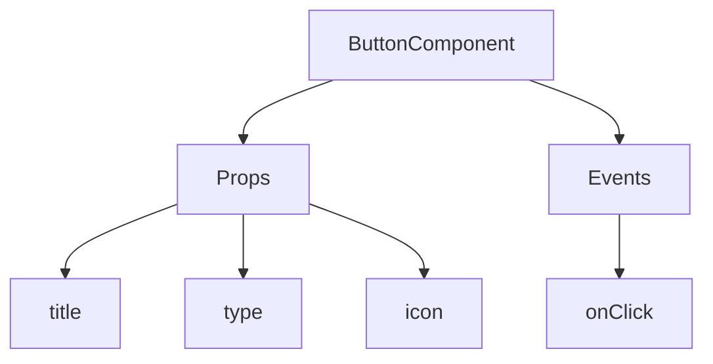
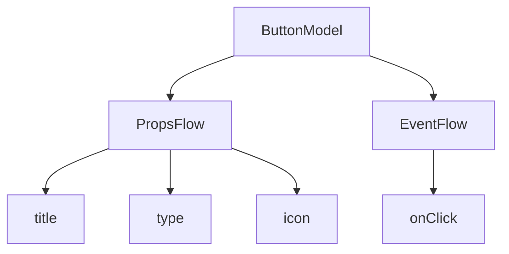

:::tip
यह दस्तावेज़ AI द्वारा अनुवादित किया गया है। किसी भी अशुद्धि के लिए, कृपया [अंग्रेजी संस्करण](/en) देखें
:::


# तुरंत शुरू करें: एक ऑर्केस्ट्रेटेबल बटन कॉम्पोनेंट बनाना

React में, हम आमतौर पर एक बटन कॉम्पोनेंट को इस तरह रेंडर करते हैं:

```tsx pure
import { Button } from 'antd';

export default function App() {
  return <Button type="primary">Primary Button</Button>;
}
```

ऊपर दिया गया कोड सरल है, लेकिन यह एक **स्थिर कॉम्पोनेंट** है और नो-कोड प्लेटफॉर्म की कॉन्फ़िगरेबिलिटी (विन्यासयोग्यता) और ऑर्केस्ट्रेशन (व्यवस्थापन) क्षमताओं की ज़रूरतों को पूरा नहीं कर सकता।

NocoBase के FlowEngine में, हम **FlowModel + FlowDefinition** का उपयोग करके ऐसे कॉम्पोनेंट तेज़ी से बना सकते हैं जो कॉन्फ़िगरेशन और इवेंट-ड्रिवन (इवेंट-आधारित) हों, जिससे ज़्यादा शक्तिशाली नो-कोड क्षमताएँ प्राप्त होती हैं।

---

## पहला चरण: FlowModel का उपयोग करके कॉम्पोनेंट रेंडर करें

<code src="./demos/quickstart-1-basic.tsx"></code>

### 🧠 मुख्य अवधारणाएँ

- `FlowModel` FlowEngine में मुख्य कॉम्पोनेंट मॉडल है, जो कॉम्पोनेंट लॉजिक, रेंडरिंग और कॉन्फ़िगरेशन क्षमताओं को समाहित करता है।
- प्रत्येक UI कॉम्पोनेंट को `FlowModel` के माध्यम से इंस्टेंशिएट (instantiate) और समान रूप से प्रबंधित किया जा सकता है।

### 📌 कार्यान्वयन के चरण

#### 1. एक कस्टम मॉडल क्लास बनाएँ

```tsx pure
class MyModel extends FlowModel {
  render() {
    return <Button {...this.props} />;
  }
}
```

#### 2. एक मॉडल इंस्टेंस बनाएँ

```ts
const model = this.flowEngine.createModel({
  uid: 'my-model',
  use: 'MyModel',
  props: {
    type: 'primary',
    children: 'Primary Button',
  },
});
```

#### 3. `<FlowModelRenderer />` का उपयोग करके रेंडर करें

```tsx pure
<FlowModelRenderer model={model} />
```

## दूसरा चरण: बटन प्रॉपर्टीज़ को कॉन्फ़िगरेबल बनाने के लिए PropsFlow जोड़ें

<code src="./demos/quickstart-2-register-propsflow.tsx"></code>

### 💡 PropsFlow का उपयोग क्यों करें?

स्टैटिक प्रॉप्स (static props) के बजाय Flow का उपयोग करने से प्रॉपर्टीज़ के लिए निम्नलिखित सुविधाएँ मिलती हैं:
- डायनामिक कॉन्फ़िगरेशन (गतिशील विन्यास)
- विज़ुअल एडिटिंग (दृश्य संपादन)
- स्टेट रीप्ले (state replay) और परसिस्टेंस (persistence)

### 🛠 मुख्य बदलाव

#### 1. बटन प्रॉपर्टीज़ के लिए Flow को परिभाषित करें

```tsx pure

const buttonSettings = defineFlow({
  key: 'buttonSettings',
  
  title: 'बटन सेटिंग्स',
  steps: {
    setProps: {
      title: 'सामान्य कॉन्फ़िगरेशन',
      uiSchema: {
        title: {
          type: 'string',
          title: 'बटन शीर्षक',
          'x-decorator': 'FormItem',
          'x-component': 'Input',
        },
        type: {
          type: 'string',
          title: 'प्रकार',
          'x-decorator': 'FormItem',
          'x-component': 'Select',
          enum: [
            { label: 'प्राथमिक', value: 'primary' },
            { label: 'डिफ़ॉल्ट', value: 'default' },
            { label: 'खतरनाक', value: 'danger' },
            { label: 'डैशड', value: 'dashed' },
            { label: 'लिंक', value: 'link' },
            { label: 'टेक्स्ट', value: 'text' },
          ],
        },
        icon: {
          type: 'string',
          title: 'आइकॉन',
          'x-decorator': 'FormItem',
          'x-component': 'Select',
          enum: [
            { label: 'खोज', value: 'SearchOutlined' },
            { label: 'जोड़ें', value: 'PlusOutlined' },
            { label: 'हटाएँ', value: 'DeleteOutlined' },
            { label: 'संपादित करें', value: 'EditOutlined' },
            { label: 'सेटिंग्स', value: 'SettingOutlined' },
          ],
        },
      },
      defaultParams: {
        type: 'primary',
      },
      // स्टेप हैंडलर फ़ंक्शन, मॉडल प्रॉपर्टीज़ सेट करता है
      handler(ctx, params) {
        ctx.model.setProps('children', params.title);
        ctx.model.setProps('type', params.type);
        ctx.model.setProps('icon', params.icon ? React.createElement(icons[params.icon]) : undefined);
      },
    },
  },
});

MyModel.registerFlow(buttonSettings);
```

#### 2. स्टैटिक `props` के बजाय `stepParams` का उपयोग करें

```diff
const model = this.flowEngine.createModel({
  uid: 'my-model',
  use: 'MyModel',
- props: {
-   type: 'primary',
-   children: 'Primary Button',
- },
+ stepParams: {
+   buttonSettings: {
+     general: {
+       title: 'Primary Button',
+       type: 'primary',
+     },
+   },
+ },
});
```

> ✅ `stepParams` का उपयोग करना FlowEngine में अनुशंसित तरीका है, क्योंकि यह गैर-सीरियलाइजेबल (non-serializable) डेटा (जैसे React कॉम्पोनेंट) से जुड़ी समस्याओं से बचाता है।

#### 3. प्रॉपर्टी कॉन्फ़िगरेशन इंटरफ़ेस सक्षम करें

```diff
- <FlowModelRenderer model={model} />
+ <FlowModelRenderer model={model} showFlowSettings />
```

---

## तीसरा चरण: बटन इवेंट फ्लो (EventFlow) को सपोर्ट करें

<code src="./demos/quickstart-3-register-eventflow.tsx"></code>

### 🎯 परिदृश्य: बटन पर क्लिक करने के बाद एक पुष्टिकरण डायलॉग दिखाएँ

#### 1. onClick इवेंट को सुनें

बिना किसी हस्तक्षेप के, onClick जोड़ें

```diff
const myPropsFlow = defineFlow({
  key: 'buttonSettings',
  steps: {
    general: {
      // ... omitted
      handler(ctx, params) {
        // ... omitted
+       ctx.model.setProps('onClick', (event) => {
+         ctx.model.dispatchEvent('click', { event });
+       });
      },
    },
  },
});
```

#### 2. इवेंट फ्लो को परिभाषित करें

```ts
const myEventFlow = defineFlow({
  key: 'clickSettings',
  on: 'click',
  title: 'बटन इवेंट',
  steps: {
    confirm: {
      title: 'पुष्टिकरण कार्रवाई कॉन्फ़िगरेशन',
      uiSchema: {
        title: {
          type: 'string',
          title: 'डायलॉग प्रॉम्प्ट शीर्षक',
          'x-decorator': 'FormItem',
          'x-component': 'Input',
        },
        content: {
          type: 'string',
          title: 'डायलॉग प्रॉम्प्ट सामग्री',
          'x-decorator': 'FormItem',
          'x-component': 'Input.TextArea',
        },
      },
      defaultParams: {
        title: 'कार्रवाई की पुष्टि करें',
        content: 'आपने बटन पर क्लिक किया है, क्या आप पुष्टि करते हैं?',
      },
      async handler(ctx, params) {
        // डायलॉग
        const confirmed = await ctx.modal.confirm({
          title: params.title,
          content: params.content,
        });
        // संदेश
        await ctx.message.info(`आपने बटन पर क्लिक किया है, पुष्टिकरण परिणाम: ${confirmed ? 'पुष्टि की गई' : 'रद्द किया गया'}`);
      },
    },
  },
});
MyModel.registerFlow(myEventFlow);
```

**अतिरिक्त नोट्स:**
- इवेंट फ्लो (EventFlow) बटन के व्यवहार को एक फ्लो के माध्यम से लचीले ढंग से कॉन्फ़िगर करने की अनुमति देता है, जैसे डायलॉग दिखाना, संदेश भेजना, API कॉल करना आदि।
- आप विभिन्न इवेंट्स (जैसे `onClick`, `onMouseEnter` आदि) के लिए अलग-अलग इवेंट फ्लो रजिस्टर कर सकते हैं, ताकि जटिल व्यावसायिक ज़रूरतों को पूरा किया जा सके।

#### 3. इवेंट फ्लो पैरामीटर्स कॉन्फ़िगर करें

मॉडल बनाते समय, आप `stepParams` के माध्यम से इवेंट फ्लो के डिफ़ॉल्ट पैरामीटर्स को कॉन्फ़िगर कर सकते हैं:

```ts
const model = this.flowEngine.createModel({
  uid: 'my-model',
  use: 'MyModel',
  stepParams: {
    buttonSettings: {
      general: {
        title: 'प्राथमिक बटन',
        type: 'primary',
      },
    },
    clickSettings: {
      confirm: {
        title: 'कार्रवाई की पुष्टि करें',
        content: 'आपने बटन पर क्लिक किया है, क्या आप पुष्टि करते हैं?',
      },
    },
  },
});
```

---

## मॉडल तुलना: ReactComponent बनाम FlowModel

Flow कॉम्पोनेंट के कार्यान्वयन के तरीके को नहीं बदलता है। यह केवल एक ReactComponent में PropsFlow और EventFlow के लिए सपोर्ट जोड़ता है, जिससे कॉम्पोनेंट की प्रॉपर्टीज़ और इवेंट्स को विज़ुअल तरीके से कॉन्फ़िगर और ऑर्केस्ट्रेट किया जा सकता है।


### ReactComponent



### FlowModel



## सारांश

ऊपर दिए गए तीन चरणों के माध्यम से, हमने एक बटन कॉम्पोनेंट पूरा किया है जो कॉन्फ़िगरेशन और इवेंट ऑर्केस्ट्रेशन को सपोर्ट करता है, जिसमें निम्नलिखित फायदे हैं:

- 🚀 प्रॉपर्टीज़ को विज़ुअली कॉन्फ़िगर करें (जैसे शीर्षक, प्रकार, आइकॉन)
- 🔄 इवेंट रिस्पॉन्स को एक फ्लो द्वारा प्रबंधित किया जा सकता है (जैसे क्लिक करने पर डायलॉग दिखाना)
- 🔧 भविष्य के एक्सटेंशन (जैसे कंडीशनल लॉजिक, वेरिएबल बाइंडिंग आदि) को सपोर्ट करता है

यह पैटर्न किसी भी UI कॉम्पोनेंट पर भी लागू होता है, जैसे फ़ॉर्म, लिस्ट और चार्ट। NocoBase के FlowEngine में, **सब कुछ ऑर्केस्ट्रेटेबल है**।