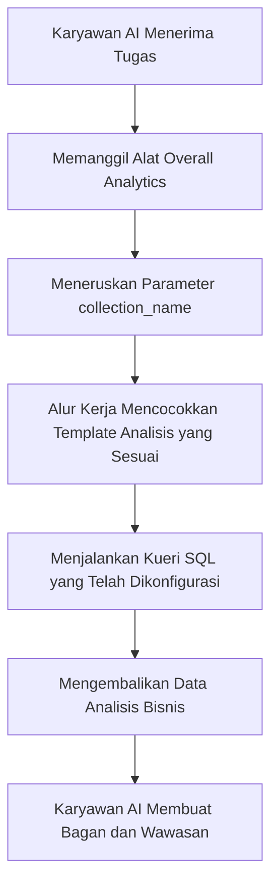

:::tip
Dokumen ini diterjemahkan oleh AI. Untuk ketidakakuratan apa pun, silakan lihat [versi bahasa Inggris](/en)
:::


# Peran & Izin

## Pendahuluan

Pengelolaan izin karyawan AI terdiri dari dua tingkatan:

1.  **Izin Akses Karyawan AI**: Mengontrol pengguna mana yang dapat menggunakan karyawan AI mana.
2.  **Izin Akses Data**: Bagaimana karyawan AI menerapkan kontrol izin saat memproses data.

Dokumen ini akan menjelaskan secara rinci metode konfigurasi dan prinsip kerja kedua jenis izin ini.

---

## Mengonfigurasi Izin Akses Karyawan AI

### Menetapkan Karyawan AI yang Tersedia untuk Peran

Buka halaman `User & Permissions`, klik tab `Roles & Permissions` untuk masuk ke halaman konfigurasi peran.


Pilih sebuah peran, klik tab `Permissions`, lalu klik tab `AI employees`. Di sini akan ditampilkan daftar karyawan AI yang dikelola dalam **plugin** karyawan AI.

Klik kotak centang di kolom `Available` pada daftar karyawan AI untuk mengontrol apakah peran saat ini dapat mengakses karyawan AI tersebut.


## Izin Akses Data

Saat karyawan AI memproses data, metode kontrol izin bergantung pada jenis alat yang digunakan:

### Alat Kueri Data Bawaan Sistem (Mengikuti Izin Pengguna)

Alat-alat berikut akan **secara ketat mengikuti izin data pengguna saat ini** untuk akses data:

| Nama Alat                            | Deskripsi                                 |
| :----------------------------------- | :---------------------------------------- |
| **Data source query**                | Melakukan kueri database menggunakan **sumber data**, **koleksi**, dan kolom. |
| **Data source records counting**     | Menghitung total catatan menggunakan **sumber data**, **koleksi**, dan kolom. |

**Cara Kerja:**

Ketika karyawan AI memanggil alat-alat ini, sistem akan:
1.  Mengidentifikasi identitas pengguna yang sedang masuk.
2.  Menerapkan aturan akses data yang dikonfigurasi untuk pengguna tersebut di **Peran & Izin**.
3.  Hanya mengembalikan data yang diizinkan untuk dilihat oleh pengguna tersebut.

**Skenario Contoh:**

Misalkan staf penjualan A hanya dapat melihat data pelanggan yang menjadi tanggung jawabnya. Ketika ia menggunakan karyawan AI Viz untuk menganalisis pelanggan:
-   Viz memanggil `Data source query` untuk mengueri **koleksi** pelanggan.
-   Sistem menerapkan aturan pemfilteran izin data staf penjualan A.
-   Viz hanya dapat melihat dan menganalisis data pelanggan yang dapat diakses oleh staf penjualan A.

Ini memastikan bahwa **karyawan AI tidak dapat melewati batas akses data pengguna itu sendiri**.

---

### Alat Bisnis Kustom Alur Kerja (Logika Izin Independen)

Alat kueri bisnis yang disesuaikan melalui **alur kerja**, kontrol izinnya **independen dari izin pengguna**, ditentukan oleh logika bisnis **alur kerja**.

Alat-alat ini biasanya digunakan untuk:
-   Proses analisis bisnis tetap
-   Kueri agregat yang telah dikonfigurasi sebelumnya
-   Analisis statistik lintas batas izin

#### Contoh 1: Overall Analytics (Analisis Bisnis Umum)


Dalam Demo CRM, `Overall Analytics` adalah mesin analisis bisnis berbasis template:

| Fitur              | Deskripsi                                                               |
| :------------------- | :---------------------------------------------------------------------- |
| **Implementasi**   | **Alur kerja** membaca template SQL yang telah dikonfigurasi dan menjalankan kueri hanya-baca. |
| **Kontrol Izin** | Tidak dibatasi oleh izin pengguna saat ini, menghasilkan data bisnis tetap yang ditentukan oleh template. |
| **Skenario Penggunaan**        | Menyediakan analisis holistik terstandardisasi untuk objek bisnis tertentu (misalnya, prospek, peluang, pelanggan). |
| **Keamanan**         | Semua template kueri dikonfigurasi dan ditinjau sebelumnya oleh administrator, menghindari pembuatan SQL dinamis. |

**Alur Kerja:**



**Karakteristik Utama:**
-   Setiap pengguna yang memanggil alat ini akan mendapatkan **perspektif bisnis yang sama**.
-   Lingkup data ditentukan oleh logika bisnis, tidak difilter oleh izin pengguna.
-   Cocok untuk menyediakan laporan analisis bisnis terstandardisasi.

#### Contoh 2: SQL Execution (Alat Analisis Lanjutan)


Dalam Demo CRM, `SQL Execution` adalah alat yang lebih fleksibel namun memerlukan kontrol ketat:

| Fitur              | Deskripsi                                                               |
| :------------------- | :---------------------------------------------------------------------- |
| **Implementasi**   | Memungkinkan AI untuk membuat dan menjalankan pernyataan SQL.             |
| **Kontrol Izin** | Dikontrol oleh **alur kerja**, biasanya hanya terbatas pada administrator. |
| **Skenario Penggunaan**        | Analisis data lanjutan, kueri eksplorasi, analisis agregat lintas **koleksi**. |
| **Keamanan**         | Memerlukan **alur kerja** untuk membatasi operasi hanya-baca (SELECT) dan mengontrol ketersediaan melalui konfigurasi tugas. |

**Rekomendasi Keamanan:**

1.  **Batasi Lingkup Ketersediaan**: Hanya aktifkan dalam tugas di blok manajemen.
2.  **Batasan Prompt**: Definisikan dengan jelas lingkup kueri dan nama **koleksi** dalam prompt tugas.
3.  **Validasi Alur Kerja**: Validasi pernyataan SQL dalam **alur kerja** untuk memastikan hanya operasi SELECT yang dijalankan.
4.  **Log Audit**: Catat semua pernyataan SQL yang dijalankan untuk tujuan penelusuran.

**Contoh Konfigurasi:**

```markdown
Batasan Prompt Tugas:
- Hanya mengueri koleksi terkait CRM (leads, opportunities, accounts, contacts)
- Hanya menjalankan kueri SELECT
- Rentang waktu terbatas pada 1 tahun terakhir
- Mengembalikan hasil terbatas hingga 1000 catatan
```

---

## Rekomendasi Desain Izin

### Pilih Strategi Izin Berdasarkan Skenario Bisnis

| Skenario Bisnis                         | Jenis Alat yang Direkomendasikan | Strategi Izin           | Alasan                                      |
| :-------------------------------------- | :------------------------------- | :---------------------- | :------------------------------------------ |
| Staf penjualan melihat pelanggan sendiri | Alat kueri bawaan sistem         | Mengikuti izin pengguna | Memastikan isolasi data dan melindungi keamanan bisnis |
| Manajer departemen melihat data tim     | Alat kueri bawaan sistem         | Mengikuti izin pengguna | Menerapkan lingkup data departemen secara otomatis |
| Eksekutif melihat analisis bisnis global | Alat kustom **alur kerja** / Overall Analytics | Logika bisnis independen | Menyediakan perspektif holistik terstandardisasi |
| Analis data melakukan kueri eksplorasi  | SQL Execution                    | Membatasi objek yang tersedia secara ketat | Memerlukan fleksibilitas tetapi harus mengontrol lingkup akses |
| Pengguna biasa melihat laporan standar  | Overall Analytics                | Logika bisnis independen | Standar analisis tetap, tidak perlu khawatir tentang izin dasar |

### Strategi Perlindungan Berlapis

Untuk skenario bisnis yang sensitif, disarankan untuk mengadopsi kontrol izin berlapis:

1.  **Lapisan Akses Karyawan AI**: Mengontrol peran mana yang dapat menggunakan karyawan AI mana.
2.  **Lapisan Visibilitas Tugas**: Mengontrol tampilan tugas melalui konfigurasi blok.
3.  **Lapisan Otorisasi Alat**: Memverifikasi identitas dan izin pengguna dalam **alur kerja**.
4.  **Lapisan Akses Data**: Mengontrol lingkup data melalui izin pengguna atau logika bisnis.

**Contoh:**

```
Skenario: Hanya departemen keuangan yang dapat menggunakan AI untuk analisis keuangan

- Izin Karyawan AI: Hanya peran keuangan yang dapat mengakses karyawan AI "Finance Analyst"
- Konfigurasi Tugas: Tugas analisis keuangan hanya ditampilkan di modul keuangan
- Desain Alat: Alat alur kerja keuangan memverifikasi departemen pengguna
- Izin Data: Izin akses koleksi keuangan hanya diberikan kepada peran keuangan
```

---

## Pertanyaan Umum

### T: Data apa yang dapat diakses oleh karyawan AI?

**J:** Bergantung pada jenis alat yang digunakan:
-   **Alat kueri bawaan sistem**: Hanya dapat mengakses data yang diizinkan untuk dilihat oleh pengguna saat ini.
-   **Alat kustom **alur kerja****: Ditentukan oleh logika bisnis **alur kerja**, mungkin tidak dibatasi oleh izin pengguna.

### T: Bagaimana cara mencegah karyawan AI membocorkan data sensitif?

**J:** Terapkan perlindungan berlapis:
1.  Konfigurasi izin akses peran karyawan AI, batasi siapa yang dapat menggunakannya.
2.  Untuk alat bawaan sistem, andalkan izin data pengguna untuk pemfilteran otomatis.
3.  Untuk alat kustom, terapkan validasi logika bisnis dalam **alur kerja**.
4.  Operasi sensitif (seperti SQL Execution) hanya boleh diotorisasi kepada administrator.

### T: Bagaimana jika saya ingin karyawan AI tertentu melewati batasan izin pengguna?

**J:** Gunakan alat bisnis kustom **alur kerja**:
-   Buat **alur kerja** untuk mengimplementasikan logika kueri bisnis tertentu.
-   Kontrol lingkup data dan aturan akses dalam **alur kerja**.
-   Konfigurasi alat untuk digunakan oleh karyawan AI.
-   Kontrol siapa yang dapat memanggil kemampuan ini melalui izin akses karyawan AI.

### T: Apa perbedaan antara Overall Analytics dan SQL Execution?

**J:**

| Dimensi Perbandingan | Overall Analytics                               | SQL Execution                               |
| :------------------- | :---------------------------------------------- | :------------------------------------------ |
| Fleksibilitas          | Rendah (hanya dapat menggunakan template yang telah dikonfigurasi) | Tinggi (dapat menghasilkan kueri secara dinamis) |
| Keamanan             | Tinggi (semua kueri ditinjau sebelumnya)        | Sedang (memerlukan batasan dan validasi)    |
| Pengguna Target         | Pengguna bisnis biasa                           | Administrator atau analis senior            |
| Biaya Pemeliharaan     | Perlu memelihara template analisis              | Tidak perlu pemeliharaan, tetapi memerlukan pemantauan |
| Konsistensi Data     | Kuat (metrik terstandardisasi)                  | Lemah (hasil kueri mungkin tidak konsisten) |

---

## Praktik Terbaik

1.  **Secara Default Mengikuti Izin Pengguna**: Kecuali ada kebutuhan bisnis yang jelas, prioritaskan penggunaan alat bawaan sistem yang mengikuti izin pengguna.
2.  **Analisis Standar Berbasis Template**: Untuk skenario analisis umum, gunakan pola Overall Analytics untuk menyediakan kemampuan terstandardisasi.
3.  **Kontrol Ketat Alat Lanjutan**: Alat dengan hak istimewa tinggi seperti SQL Execution hanya boleh diotorisasi kepada beberapa administrator.
4.  **Isolasi Tingkat Tugas**: Konfigurasi tugas sensitif dalam blok tertentu dan terapkan isolasi melalui izin akses halaman.
5.  **Audit dan Pemantauan**: Catat perilaku akses data karyawan AI dan tinjau secara berkala operasi yang tidak normal.