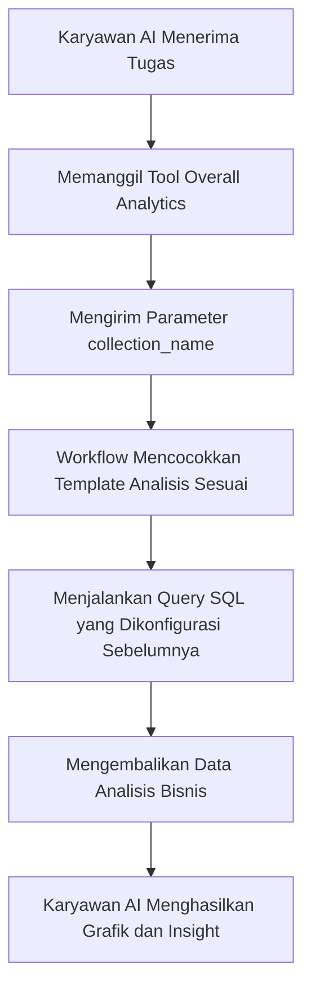

# Role dan Permission

## Pengantar

Manajemen Permission Karyawan AI mencakup dua tingkat:

1. **Permission akses Karyawan AI**: Mengontrol Pengguna mana yang dapat menggunakan Karyawan AI mana
2. **Permission akses data**: Bagaimana Karyawan AI menerapkan kontrol Permission saat memproses data

Dokumentasi ini akan menjelaskan secara detail metode konfigurasi dan prinsip kerja kedua Permission ini.

---

## Mengonfigurasi Permission Akses Karyawan AI

### Mengatur Karyawan AI yang Dapat Digunakan Role

Masuk ke halaman `User & Permissions`, klik tab `Roles & Permissions`, masuk ke halaman konfigurasi role.


Pilih satu role, klik tab `Permissions`, kemudian klik tab `AI employees`, di sini akan ditampilkan daftar Karyawan AI yang dikelola oleh Plugin Karyawan AI.

Klik checkbox di kolom `Available` daftar Karyawan AI, untuk mengontrol apakah role saat ini dapat mengakses Karyawan AI tersebut.


---

## Permission Akses Data

Saat Karyawan AI memproses data, metode kontrol Permission tergantung pada tipe tools yang digunakan:

### Tools Query Data Bawaan Sistem (Mengikuti Permission Pengguna)

Tools berikut akan **secara ketat melakukan akses data berdasarkan Permission data Pengguna saat ini**:

| Nama Tool | Penjelasan |
| ---------- | ---------- |
| **Data source query** | Menggunakan data source, tabel data, dan Field untuk query database |
| **Data source records counting** | Menggunakan data source, tabel data, dan Field untuk menghitung total record |

**Prinsip Kerja:**

Saat Karyawan AI memanggil tools ini, sistem akan:
1. Mengenali identitas Pengguna login saat ini
2. Menerapkan aturan akses data yang dikonfigurasi Pengguna tersebut di **Roles & Permissions**
3. Hanya mengembalikan data yang Pengguna tersebut berhak melihat

**Contoh Skenario:**

Misalnya tenaga penjualan A hanya dapat melihat data pelanggan yang menjadi tanggung jawabnya, saat ia menggunakan Karyawan AI Viz untuk menganalisis pelanggan:
- Viz memanggil `Data source query` untuk query tabel pelanggan
- Sistem menerapkan aturan filter Permission data tenaga penjualan A
- Viz hanya dapat melihat dan menganalisis data pelanggan yang tenaga penjualan A berhak mengakses

Ini memastikan **Karyawan AI tidak akan melewati batas akses data Pengguna sendiri**.

---

### Tools Bisnis Kustom Workflow (Logika Permission Independen)

Tools query bisnis yang dikustomisasi melalui Workflow, kontrol Permission-nya **independen dari Permission Pengguna**, ditentukan oleh logika bisnis Workflow.

Tools jenis ini biasanya digunakan untuk:
- Alur analisis bisnis yang tetap
- Query agregasi yang dikonfigurasi sebelumnya
- Analisis statistik lintas batas Permission

#### Contoh 1: Overall Analytics (Analisis Bisnis Umum)


Pada CRM Demo, `Overall Analytics` adalah engine analisis bisnis berbasis template:

| Karakteristik | Penjelasan |
| ------------- | ---------- |
| **Cara Implementasi** | Workflow membaca template SQL yang dikonfigurasi sebelumnya, menjalankan query read-only |
| **Kontrol Permission** | Tidak dibatasi Permission Pengguna saat ini, output ditentukan oleh data bisnis tetap yang ditentukan template |
| **Skenario Penggunaan** | Memberikan analisis keseluruhan terstandar untuk objek bisnis tertentu (seperti leads, opportunities, pelanggan) |
| **Keamanan** | Semua template query dikonfigurasi dan diaudit terlebih dahulu oleh administrator, menghindari pembuatan SQL secara dinamis |

**Alur Kerja:**


```mermaid
flowchart TD
    A[Karyawan AI Menerima Tugas] --> B[Memanggil Tool Overall Analytics]
    B --> C[Mengirim Parameter collection_name]
    C --> D[Workflow Mencocokkan Template Analisis Sesuai]
    D --> E[Menjalankan Query SQL yang Dikonfigurasi Sebelumnya]
    E --> F[Mengembalikan Data Analisis Bisnis]
    F --> G[Karyawan AI Menghasilkan Grafik dan Insight]
```

**Karakteristik Kunci:**
- Pengguna mana pun yang memanggil tool ini akan mendapatkan **perspektif bisnis yang sama**
- Cakupan data ditentukan oleh logika bisnis, tidak difilter oleh Permission Pengguna
- Cocok untuk menyediakan laporan analisis bisnis terstandar

#### Contoh 2: SQL Execution (Tool Analisis Lanjutan)


Pada CRM Demo, `SQL Execution` adalah tool yang lebih fleksibel namun perlu dikontrol secara ketat:

| Karakteristik | Penjelasan |
| ------------- | ---------- |
| **Cara Implementasi** | Memungkinkan AI menghasilkan dan menjalankan SQL statement |
| **Kontrol Permission** | Dikontrol oleh Workflow siapa yang dapat mengakses, biasanya hanya untuk administrator |
| **Skenario Penggunaan** | Analisis data lanjutan, query eksploratif, analisis agregasi lintas tabel |
| **Keamanan** | Perlu membatasi operasi read-only (SELECT) di Workflow, dan mengontrol ketersediaan melalui konfigurasi tugas |

**Saran Keamanan:**

1. **Batasi Cakupan Ketersediaan**: Hanya konfigurasikan untuk diaktifkan pada tugas Block manajemen
2. **Kendala Prompt**: Tentukan dengan jelas cakupan query dan nama tabel di prompt tugas
3. **Validasi Workflow**: Validasi SQL statement di Workflow, pastikan hanya menjalankan operasi SELECT
4. **Log Audit**: Catat semua SQL statement yang dieksekusi, untuk memudahkan pelacakan

**Contoh Konfigurasi:**

```markdown
Kendala prompt tugas:
- Hanya dapat query tabel terkait CRM (leads, opportunities, accounts, contacts)
- Hanya dapat menjalankan query SELECT
- Rentang waktu dibatasi dalam 1 tahun terakhir
- Hasil yang dikembalikan tidak melebihi 1000 record
```

---

## Saran Desain Permission

### Pilih Strategi Permission Berdasarkan Skenario Bisnis

| Skenario Bisnis | Tipe Tool yang Direkomendasikan | Strategi Permission | Alasan |
| --------------- | ------------------------------- | ------------------- | ------ |
| Tenaga penjualan melihat pelanggannya sendiri | Tool query bawaan sistem | Mengikuti Permission Pengguna | Memastikan isolasi data, melindungi keamanan bisnis |
| Manajer departemen melihat data tim | Tool query bawaan sistem | Mengikuti Permission Pengguna | Otomatis menerapkan cakupan data departemen |
| Eksekutif melihat analisis bisnis global | Tool kustom Workflow / Overall Analytics | Logika bisnis independen | Memberikan perspektif keseluruhan terstandar |
| Analis data query eksploratif | SQL Execution | Batasi objek yang tersedia secara ketat | Membutuhkan fleksibilitas, tetapi harus mengontrol cakupan akses |
| Pengguna umum melihat laporan standar | Overall Analytics | Logika bisnis independen | Standar analisis tetap, tidak perlu memikirkan Permission yang mendasarinya |

### Strategi Perlindungan Berlapis

Untuk skenario bisnis sensitif, disarankan mengadopsi kontrol Permission berlapis:

1. **Lapisan Akses Karyawan AI**: Kontrol role mana yang dapat menggunakan Karyawan AI tersebut
2. **Lapisan Visibilitas Tugas**: Kontrol apakah tugas ditampilkan melalui konfigurasi Block
3. **Lapisan Otorisasi Tool**: Validasi identitas Pengguna dan Permission di Workflow
4. **Lapisan Akses Data**: Kontrol cakupan data melalui Permission Pengguna atau logika bisnis

**Contoh:**

```
Skenario: Hanya departemen keuangan yang dapat menggunakan AI untuk analisis keuangan

- Permission Karyawan AI: Hanya role keuangan yang dapat mengakses Karyawan AI "Finance Analyst"
- Konfigurasi tugas: Tugas analisis keuangan hanya ditampilkan di modul keuangan
- Desain tool: Tool Workflow keuangan memvalidasi departemen Pengguna
- Permission data: Permission akses tabel keuangan hanya diberikan kepada role keuangan
```

---

## Pertanyaan Umum

### Q: Data apa yang dapat diakses Karyawan AI?

**A:** Tergantung pada tipe tools yang digunakan:
- **Tool query bawaan sistem**: Hanya dapat mengakses data yang Pengguna saat ini berhak melihat
- **Tool kustom Workflow**: Ditentukan oleh logika bisnis Workflow, mungkin tidak dibatasi oleh Permission Pengguna

### Q: Bagaimana mencegah Karyawan AI membocorkan data sensitif?

**A:** Adopsi perlindungan berlapis:
1. Konfigurasi Permission akses role Karyawan AI, batasi siapa yang dapat menggunakan
2. Untuk tools bawaan sistem, andalkan filter otomatis Permission data Pengguna
3. Untuk tools kustom, implementasikan validasi logika bisnis di Workflow
4. Operasi sensitif (seperti SQL Execution) hanya diberikan otorisasi kepada administrator

### Q: Saya ingin agar beberapa Karyawan AI melewati batas Permission Pengguna, bagaimana?

**A:** Gunakan tools bisnis kustom Workflow:
- Buat Workflow untuk mengimplementasikan logika query bisnis tertentu
- Kontrol cakupan data dan aturan akses di Workflow
- Konfigurasikan tool ke Karyawan AI untuk digunakan
- Kontrol siapa yang dapat memanggil kemampuan ini melalui Permission akses Karyawan AI

### Q: Apa perbedaan Overall Analytics dan SQL Execution?

**A:**

| Dimensi Perbandingan | Overall Analytics | SQL Execution |
| -------------------- | ----------------- | ------------- |
| Fleksibilitas | Rendah (hanya dapat menggunakan template yang dikonfigurasi sebelumnya) | Tinggi (dapat menghasilkan query secara dinamis) |
| Keamanan | Tinggi (semua query diaudit terlebih dahulu) | Sedang (perlu kendala dan validasi) |
| Objek yang Sesuai | Pengguna bisnis umum | Administrator atau analis lanjutan |
| Biaya Pemeliharaan | Perlu memelihara template analisis | Tidak perlu pemeliharaan, tetapi perlu monitoring |
| Konsistensi Data | Kuat (standar tetap) | Lemah (hasil query mungkin tidak konsisten) |

---

## Praktik Terbaik

1. **Default Mengikuti Permission Pengguna**: Kecuali ada kebutuhan bisnis yang jelas, prioritaskan menggunakan tools bawaan sistem yang mengikuti Permission Pengguna
2. **Analisis Standar Berbasis Template**: Untuk skenario analisis umum, gunakan mode Overall Analytics untuk menyediakan kemampuan terstandar
3. **Kontrol Ketat Tools Lanjutan**: Tools dengan Permission tinggi seperti SQL Execution hanya diberikan otorisasi kepada sedikit administrator
4. **Isolasi Tingkat Tugas**: Konfigurasikan tugas sensitif di Block tertentu, implementasikan isolasi melalui Permission akses halaman
5. **Audit dan Monitoring**: Catat perilaku akses data Karyawan AI, secara berkala tinjau operasi anomali
