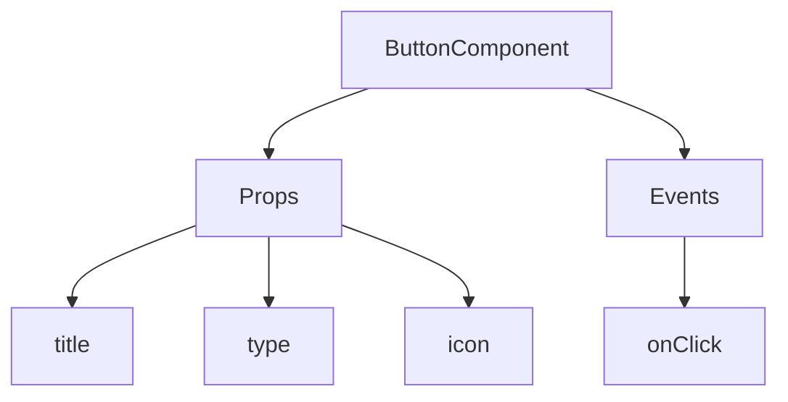
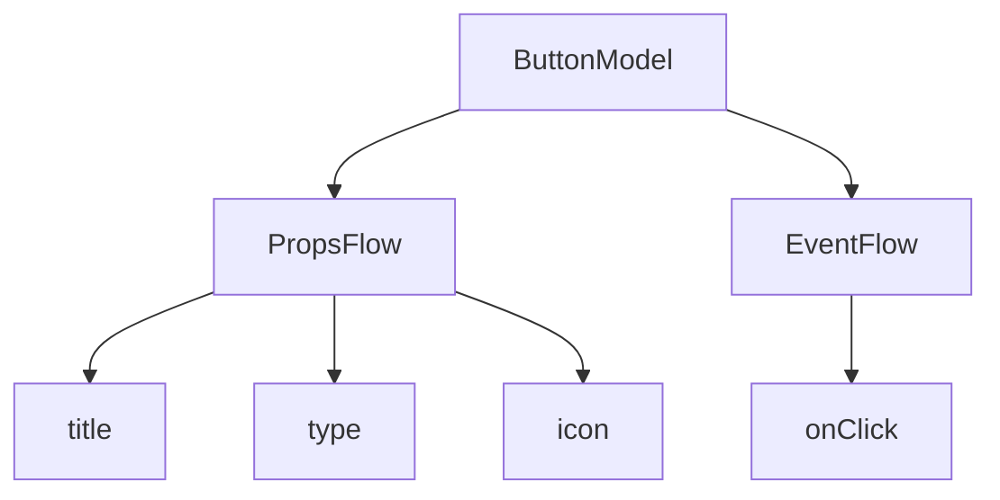

:::tip
Dokumen ini diterjemahkan oleh AI. Untuk ketidakakuratan apa pun, silakan lihat [versi bahasa Inggris](/en)
:::


# Mulai Cepat: Membangun Komponen Tombol yang Dapat Diorkestrasi

Di React, kita biasanya merender komponen tombol seperti ini:

```tsx pure
import { Button } from 'antd';

export default function App() {
  return <Button type="primary">Primary Button</Button>;
}
```

Meskipun kode di atas sederhana, ini adalah **komponen statis** dan tidak dapat memenuhi kebutuhan platform tanpa kode (no-code) akan kemampuan konfigurasi dan orkestrasi.

Di FlowEngine NocoBase, kita dapat dengan cepat membangun komponen yang mendukung konfigurasi dan berbasis peristiwa (event-driven) menggunakan **FlowModel + FlowDefinition**, sehingga mencapai kemampuan tanpa kode yang lebih kuat.

---

## Langkah 1: Merender Komponen Menggunakan FlowModel

<code src="./demos/quickstart-1-basic.tsx"></code>

### 🧠 Konsep Utama

- `FlowModel` adalah model komponen inti di FlowEngine, yang merangkum logika komponen, kemampuan rendering, dan konfigurasi.
- Setiap komponen UI dapat diinstansiasi dan dikelola secara terpadu melalui `FlowModel`.

### 📌 Langkah-langkah Implementasi

#### 1. Membuat kelas model kustom

```tsx pure
class MyModel extends FlowModel {
  render() {
    return <Button {...this.props} />;
  }
}
```

#### 2. Membuat instans model

```ts
const model = this.flowEngine.createModel({
  uid: 'my-model',
  use: 'MyModel',
  props: {
    type: 'primary',
    children: 'Primary Button',
  },
});
```

#### 3. Merender menggunakan `<FlowModelRenderer />`

```tsx pure
<FlowModelRenderer model={model} />
```

## Langkah 2: Menambahkan PropsFlow untuk Membuat Properti Tombol Dapat Dikonfigurasi

<code src="./demos/quickstart-2-register-propsflow.tsx"></code>

### 💡 Mengapa Menggunakan PropsFlow?

Menggunakan Flow alih-alih props statis memungkinkan properti untuk:
- Konfigurasi dinamis
- Pengeditan visual
- Pemutaran ulang dan persistensi status

### 🛠 Modifikasi Utama

#### 1. Mendefinisikan Flow untuk properti tombol

```tsx pure

const buttonSettings = defineFlow({
  key: 'buttonSettings',
  
  title: 'Pengaturan Tombol',
  steps: {
    setProps: {
      title: 'Konfigurasi Umum',
      uiSchema: {
        title: {
          type: 'string',
          title: 'Judul Tombol',
          'x-decorator': 'FormItem',
          'x-component': 'Input',
        },
        type: {
          type: 'string',
          title: 'Tipe',
          'x-decorator': 'FormItem',
          'x-component': 'Select',
          enum: [
            { label: 'Utama', value: 'primary' },
            { label: 'Bawaan', value: 'default' },
            { label: 'Bahaya', value: 'danger' },
            { label: 'Garis Putus-putus', value: 'dashed' },
            { label: 'Tautan', value: 'link' },
            { label: 'Teks', value: 'text' },
          ],
        },
        icon: {
          type: 'string',
          title: 'Ikon',
          'x-decorator': 'FormItem',
          'x-component': 'Select',
          enum: [
            { label: 'Cari', value: 'SearchOutlined' },
            { label: 'Tambah', value: 'PlusOutlined' },
            { label: 'Hapus', value: 'DeleteOutlined' },
            { label: 'Edit', value: 'EditOutlined' },
            { label: 'Pengaturan', value: 'SettingOutlined' },
          ],
        },
      },
      defaultParams: {
        type: 'primary',
      },
      // Fungsi penanganan langkah, mengatur properti model
      handler(ctx, params) {
        ctx.model.setProps('children', params.title);
        ctx.model.setProps('type', params.type);
        ctx.model.setProps('icon', params.icon ? React.createElement(icons[params.icon]) : undefined);
      },
    },
  },
});

MyModel.registerFlow(buttonSettings);
```

#### 2. Menggunakan `stepParams` sebagai pengganti `props` statis

```diff
const model = this.flowEngine.createModel({
  uid: 'my-model',
  use: 'MyModel',
- props: {
-   type: 'primary',
-   children: 'Primary Button',
- },
+ stepParams: {
+   buttonSettings: {
+     general: {
+       title: 'Primary Button',
+       type: 'primary',
+     },
+   },
+ },
});
```

> ✅ Menggunakan `stepParams` adalah pendekatan yang direkomendasikan di FlowEngine, karena menghindari masalah dengan data yang tidak dapat diserialisasi (seperti komponen React).

#### 3. Mengaktifkan antarmuka konfigurasi properti

```diff
- <FlowModelRenderer model={model} />
+ <FlowModelRenderer model={model} showFlowSettings />
```

---

## Langkah 3: Mendukung Alur Peristiwa Tombol (EventFlow)

<code src="./demos/quickstart-3-register-eventflow.tsx"></code>

### 🎯 Skenario: Menampilkan dialog konfirmasi setelah mengeklik tombol

#### 1. Mendengarkan peristiwa onClick

Tambahkan onClick dengan cara non-intrusif

```diff
const myPropsFlow = defineFlow({
  key: 'buttonSettings',
  steps: {
    general: {
      // ... dihilangkan
      handler(ctx, params) {
        // ... dihilangkan
+       ctx.model.setProps('onClick', (event) => {
+         ctx.model.dispatchEvent('click', { event });
+       });
      },
    },
  },
});
```

#### 2. Mendefinisikan alur peristiwa

```ts
const myEventFlow = defineFlow({
  key: 'clickSettings',
  on: 'click',
  title: 'Peristiwa Tombol',
  steps: {
    confirm: {
      title: 'Konfigurasi Tindakan Konfirmasi',
      uiSchema: {
        title: {
          type: 'string',
          title: 'Judul Prompt Dialog',
          'x-decorator': 'FormItem',
          'x-component': 'Input',
        },
        content: {
          type: 'string',
          title: 'Konten Prompt Dialog',
          'x-decorator': 'FormItem',
          'x-component': 'Input.TextArea',
        },
      },
      defaultParams: {
        title: 'Tindakan Konfirmasi',
        content: 'Anda mengeklik tombol, apakah Anda yakin?',
      },
      async handler(ctx, params) {
        // Dialog
        const confirmed = await ctx.modal.confirm({
          title: params.title,
          content: params.content,
        });
        // Pesan
        await ctx.message.info(`Anda mengeklik tombol, hasil konfirmasi: ${confirmed ? 'Dikonfirmasi' : 'Dibatalkan'}`);
      },
    },
  },
});
MyModel.registerFlow(myEventFlow);
```

**Catatan Tambahan:**
- Alur peristiwa (EventFlow) memungkinkan perilaku tombol dikonfigurasi secara fleksibel melalui alur kerja, seperti menampilkan dialog, pesan, melakukan panggilan API, dll.
- Anda dapat mendaftarkan alur peristiwa yang berbeda untuk peristiwa yang berbeda (seperti `onClick`, `onMouseEnter`, dll.) untuk memenuhi kebutuhan bisnis yang kompleks.

#### 3. Mengonfigurasi parameter alur peristiwa

Saat membuat model, Anda dapat mengonfigurasi parameter default untuk alur peristiwa melalui `stepParams`:

```ts
const model = this.flowEngine.createModel({
  uid: 'my-model',
  use: 'MyModel',
  stepParams: {
    buttonSettings: {
      general: {
        title: 'Primary Button',
        type: 'primary',
      },
    },
    clickSettings: {
      confirm: {
        title: 'Tindakan Konfirmasi',
        content: 'Anda mengeklik tombol, apakah Anda yakin?',
      },
    },
  },
});
```

---

## Perbandingan Model: ReactComponent vs FlowModel

Flow tidak mengubah cara komponen diimplementasikan. Flow hanya menambahkan dukungan untuk PropsFlow dan EventFlow ke ReactComponent, sehingga properti dan peristiwa komponen dapat dikonfigurasi dan diorkestrasi secara visual.


### ReactComponent



### FlowModel



## Ringkasan

Melalui tiga langkah di atas, kita telah menyelesaikan komponen tombol yang mendukung konfigurasi dan orkestrasi peristiwa, dengan keunggulan sebagai berikut:

- 🚀 Mengonfigurasi properti secara visual (seperti judul, tipe, ikon)
- 🔄 Respons peristiwa dapat dikelola oleh alur kerja (misalnya, mengeklik untuk menampilkan dialog)
- 🔧 Mendukung ekstensi di masa mendatang (seperti logika kondisional, pengikatan variabel, dll.)

Pola ini juga berlaku untuk komponen UI apa pun, seperti formulir, daftar, dan bagan. Di FlowEngine NocoBase, **semuanya dapat diorkestrasi**.