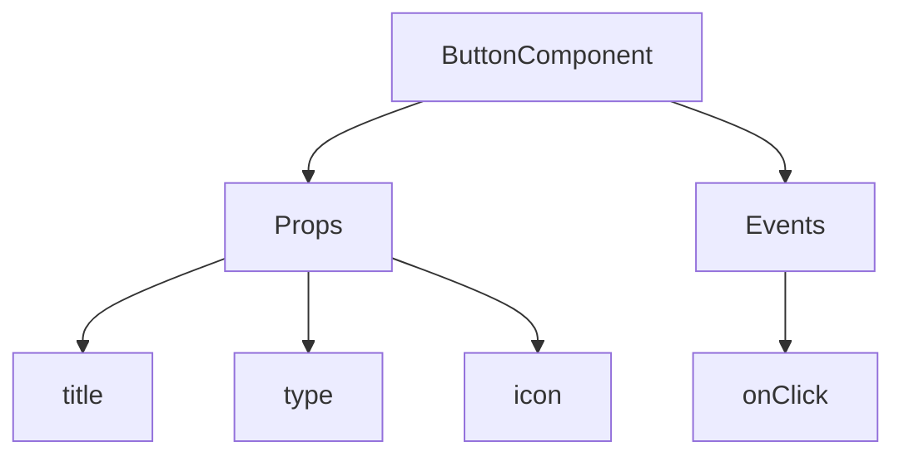
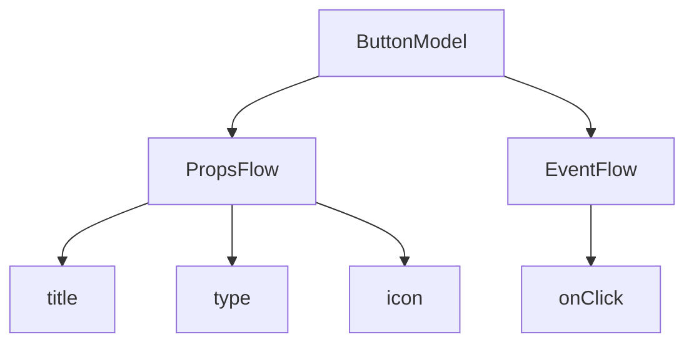

# Mulai Cepat: Membangun Komponen Tombol yang Dapat Diorkestrasi

Di React, kita biasanya merender komponen tombol seperti ini:

```tsx pure
import { Button } from 'antd';

export default function App() {
  return <Button type="primary">Primary Button</Button>;
}
```

Meskipun kode di atas sederhana, ini adalah **komponen statis** yang tidak dapat memenuhi kebutuhan platform no-code akan kemampuan konfigurasi dan orkestrasi.

Pada FlowEngine NocoBase, kita dapat dengan cepat membangun komponen yang mendukung konfigurasi dan event-driven melalui **FlowModel + FlowDefinition**, sehingga mewujudkan kemampuan no-code yang lebih kuat.

---

## Langkah Pertama: Render Komponen Menggunakan FlowModel

<code src="./demos/quickstart-1-basic.tsx"></code>

### 🧠 Konsep Kunci

- `FlowModel` adalah model komponen inti dalam FlowEngine, yang merangkum logika komponen, render, dan kemampuan konfigurasi.
- Setiap komponen UI dapat di-instansiasi dan dikelola secara terpadu melalui `FlowModel`.

### 📌 Langkah Implementasi

#### 1. Membuat Kelas Model Kustom

```tsx pure
class MyModel extends FlowModel {
  render() {
    return <Button {...this.props} />;
  }
}
```

#### 2. Membuat Instance Model

```ts
const model = await this.flowEngine.createModelAsync({
  uid: 'my-model',
  use: 'MyModel',
  props: {
    type: 'primary',
    children: 'Primary Button',
  },
});
```

#### 3. Menggunakan `<FlowModelRenderer />` untuk Render

```tsx pure
<FlowModelRenderer model={model} />
```

---

## Langkah Kedua: Menambahkan PropsFlow agar Properti Tombol Dapat Dikonfigurasi

<code src="./demos/quickstart-2-register-propsflow.tsx"></code>

### 💡 Mengapa Menggunakan PropsFlow?

Menggunakan Flow alih-alih props statis memungkinkan properti untuk:
- Konfigurasi dinamis
- Pengeditan visual
- Replay state dan persistensi

### 🛠 Poin Modifikasi Kunci

#### 1. Mendefinisikan Flow untuk Properti Tombol

```tsx pure

const buttonSettings = defineFlow({
  key: 'buttonSettings',
  
  title: 'Pengaturan Tombol',
  steps: {
    setProps: {
      title: 'Konfigurasi Umum',
      uiSchema: {
        title: {
          type: 'string',
          title: 'Judul Tombol',
          'x-decorator': 'FormItem',
          'x-component': 'Input',
        },
        type: {
          type: 'string',
          title: 'Tipe',
          'x-decorator': 'FormItem',
          'x-component': 'Select',
          enum: [
            { label: 'Primary', value: 'primary' },
            { label: 'Default', value: 'default' },
            { label: 'Danger', value: 'danger' },
            { label: 'Dashed', value: 'dashed' },
            { label: 'Link', value: 'link' },
            { label: 'Text', value: 'text' },
          ],
        },
        icon: {
          type: 'string',
          title: 'Ikon',
          'x-decorator': 'FormItem',
          'x-component': 'Select',
          enum: [
            { label: 'Search', value: 'SearchOutlined' },
            { label: 'Plus', value: 'PlusOutlined' },
            { label: 'Delete', value: 'DeleteOutlined' },
            { label: 'Edit', value: 'EditOutlined' },
            { label: 'Setting', value: 'SettingOutlined' },
          ],
        },
      },
      defaultParams: {
        type: 'primary',
      },
      // Step handler function, set model props
      handler(ctx, params) {
        ctx.model.setProps('children', params.title);
        ctx.model.setProps('type', params.type);
        ctx.model.setProps('icon', params.icon ? React.createElement(icons[params.icon]) : undefined);
      },
    },
  },
});

MyModel.registerFlow(buttonSettings);
```

#### 2. Menggunakan `stepParams` Sebagai Pengganti `props` Statis

```diff
const model = await this.flowEngine.createModelAsync({
  uid: 'my-model',
  use: 'MyModel',
- props: {
-   type: 'primary',
-   children: 'Primary Button',
- },
+ stepParams: {
+   buttonSettings: {
+     general: {
+       title: 'Primary Button',
+       type: 'primary',
+     },
+   },
+ },
});
```

> ✅ Menggunakan `stepParams` adalah cara yang direkomendasikan FlowEngine, untuk menghindari masalah data yang tidak dapat di-serialize (seperti komponen React).

#### 3. Mengaktifkan Antarmuka Konfigurasi Properti

```diff
- <FlowModelRenderer model={model} />
+ <FlowModelRenderer model={model} showFlowSettings />
```

---

## Langkah Ketiga: Mendukung Event Flow Tombol (EventFlow)

<code src="./demos/quickstart-3-register-eventflow.tsx"></code>

### 🎯 Skenario: Menampilkan Kotak Konfirmasi Setelah Tombol Diklik

#### 1. Mendengarkan Event onClick

Menggunakan cara non-intrusif untuk menambahkan onClick

```diff
const myPropsFlow = defineFlow({
  key: 'buttonSettings',
  steps: {
    general: {
      // ... omitted
      handler(ctx, params) {
        // ... omitted
+       ctx.model.setProps('onClick', (event) => {
+         ctx.model.dispatchEvent('click', { event });
+       });
      },
    },
  },
});
```

#### 2. Mendefinisikan Event Flow

```ts
const myEventFlow = defineFlow({
  key: 'clickSettings',
  on: 'click',
  title: 'Event Tombol',
  steps: {
    confirm: {
      title: 'Konfigurasi Konfirmasi Action',
      uiSchema: {
        title: {
          type: 'string',
          title: 'Judul Popup Konfirmasi',
          'x-decorator': 'FormItem',
          'x-component': 'Input',
        },
        content: {
          type: 'string',
          title: 'Konten Popup Konfirmasi',
          'x-decorator': 'FormItem',
          'x-component': 'Input.TextArea',
        },
      },
      defaultParams: {
        title: 'Konfirmasi Action',
        content: 'Anda mengklik tombol, apakah dikonfirmasi?',
      },
      async handler(ctx, params) {
        // Popup
        const confirmed = await ctx.modal.confirm({
          title: params.title,
          content: params.content,
        });
        // Pesan
        await ctx.message.info(`Anda mengklik tombol, hasil konfirmasi: ${confirmed ? 'dikonfirmasi' : 'dibatalkan'}`);
      },
    },
  },
});
MyModel.registerFlow(myEventFlow);
```

**Catatan tambahan:**
- Event Flow (EventFlow) memungkinkan perilaku tombol dikonfigurasi secara fleksibel melalui flow, seperti popup, pesan, panggilan API, dan sebagainya.
- Anda dapat mendaftarkan event flow yang berbeda untuk event yang berbeda (seperti `onClick`, `onMouseEnter`, dan lain-lain) untuk memenuhi kebutuhan bisnis yang kompleks.

#### 3. Mengkonfigurasi Parameter Event Flow

Saat membuat model, Anda dapat mengkonfigurasi parameter default event flow melalui `stepParams`:

```ts
const model = await this.flowEngine.createModelAsync({
  uid: 'my-model',
  use: 'MyModel',
  stepParams: {
    buttonSettings: {
      general: {
        title: 'Primary Button',
        type: 'primary',
      },
    },
    clickSettings: {
      confirm: {
        title: 'Konfirmasi Action',
        content: 'Anda mengklik tombol, apakah dikonfirmasi?',
      },
    },
  },
});
```

---

## Diagram Perbandingan Model: ReactComponent vs FlowModel

Flow tidak mengubah cara implementasi komponen. Ini hanya menambahkan dukungan untuk PropsFlow dan EventFlow ke ReactComponent, sehingga properti dan event komponen dapat dikonfigurasi dan diorkestrasi secara visual.


### ReactComponent


```mermaid
graph TD
  Button[ButtonComponent]
  Button --> Props[Props]
  Button --> Events[Events]
  Props --> title[title]
  Props --> type[type]
  Props --> icon[icon]
  Events --> onClick[onClick]
```

### FlowModel


```mermaid
graph TD
  Button[ButtonModel]
  Button --> Props[PropsFlow]
  Button --> Events[EventFlow]
  Props --> title[title]
  Props --> type[type]
  Props --> icon[icon]
  Events --> onClick[onClick]
```

## Ringkasan

Melalui tiga langkah di atas, kita telah membangun komponen tombol yang mendukung konfigurasi dan orkestrasi event, dengan keunggulan berikut:

- 🚀 Konfigurasi properti secara visual (seperti judul, tipe, ikon)
- 🔄 Respons event dapat diambil alih oleh flow (seperti popup saat diklik)
- 🔧 Mendukung ekspansi lanjutan (seperti logika kondisional, binding variabel, dan sebagainya)

Pola ini juga berlaku untuk komponen UI apa pun seperti form, list, chart, dan sebagainya. Pada FlowEngine NocoBase, **segalanya dapat diorkestrasi**.
