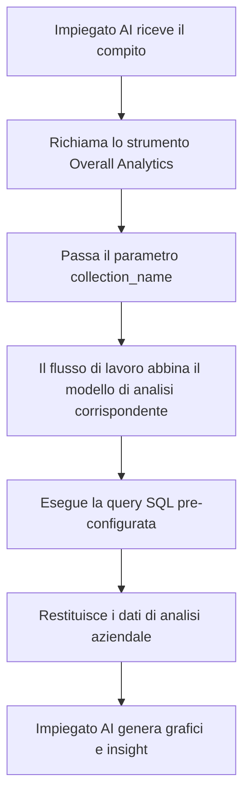

# Ruoli e Permessi

## Introduzione

La gestione dei permessi degli impiegati AI si articola su due livelli:

1.  **Permessi di accesso degli impiegati AI**: Controllano quali utenti possono utilizzare quali impiegati AI.
2.  **Permessi di accesso ai dati**: Definiscono come gli impiegati AI applicano i controlli di permesso durante l'elaborazione dei dati.

Questo documento illustra in dettaglio le modalità di configurazione e il funzionamento di queste due tipologie di permessi.

---

## Configurazione dei permessi di accesso degli impiegati AI

### Impostazione degli impiegati AI disponibili per i ruoli

Acceda alla pagina `User & Permissions`, clicchi sulla scheda `Roles & Permissions` per accedere alla pagina di configurazione dei ruoli.


Selezioni un ruolo, clicchi sulla scheda `Permissions` e poi sulla scheda `AI employees`. Qui verrà visualizzato l'elenco degli impiegati AI gestiti nel **plugin** degli impiegati AI.

Clicchi sulla casella di spunta nella colonna `Available` dell'elenco degli impiegati AI per controllare se il ruolo attuale può accedere a quell'impiegato AI.


---
:::tip Avviso di traduzione IA
Questa documentazione è stata tradotta automaticamente dall'IA.
:::


## Permessi di accesso ai dati

Quando gli impiegati AI elaborano i dati, il metodo di controllo dei permessi dipende dal tipo di strumento utilizzato:

### Strumenti di query dati integrati nel sistema (seguono i permessi utente)


I seguenti strumenti accedono ai dati **seguendo rigorosamente i permessi dati dell'utente attuale**:

| Nome strumento                   | Descrizione                                                               |
| :------------------------------- | :------------------------------------------------------------------------ |
| **Data source query**            | Interroga il database utilizzando la **fonte dati**, la **collezione** e i campi. |
| **Data source records counting** | Conta il numero totale di record utilizzando la **fonte dati**, la **collezione** e i campi. |

**Come funziona:**

Quando gli impiegati AI richiamano questi strumenti, il sistema:
1.  Identifica l'identità dell'utente attualmente loggato.
2.  Applica le regole di accesso ai dati configurate per quell'utente in **Ruoli e Permessi**.
3.  Restituisce solo i dati che l'utente ha il permesso di visualizzare.

**Scenario di esempio:**

Supponiamo che il venditore A possa visualizzare solo i dati dei clienti di cui è responsabile. Quando utilizza l'impiegato AI Viz per analizzare i clienti:
-   Viz richiama `Data source query` per interrogare la tabella dei clienti.
-   Il sistema applica le regole di filtro dei permessi dati del venditore A.
-   Viz può visualizzare e analizzare solo i dati dei clienti a cui il venditore A ha accesso.

Questo assicura che gli **impiegati AI non possano superare i limiti di accesso ai dati dell'utente stesso**.

---

### Strumenti aziendali personalizzati del **flusso di lavoro** (logica di permesso indipendente)

Gli strumenti di query aziendali personalizzati tramite **flussi di lavoro** hanno un controllo dei permessi **indipendente dai permessi utente**, determinato dalla logica aziendale del **flusso di lavoro** stesso.

Questi strumenti sono tipicamente utilizzati per:
-   Processi di analisi aziendale fissi.
-   Query aggregate pre-configurate.
-   Analisi statistiche che superano i limiti dei permessi.

#### Esempio 1: Overall Analytics (Analisi aziendale generale)


Nella demo CRM, `Overall Analytics` è un motore di analisi aziendale basato su modelli:

| Caratteristica        | Descrizione                                                                                              |
| :-------------------- | :------------------------------------------------------------------------------------------------------- |
| **Implementazione**   | Il **flusso di lavoro** legge i modelli SQL pre-configurati ed esegue query di sola lettura.             |
| **Controllo permessi** | Non è limitato dai permessi dell'utente attuale; produce dati aziendali fissi definiti dai modelli.       |
| **Casi d'uso**        | Fornisce un'analisi olistica standardizzata per oggetti aziendali specifici (es. lead, opportunità, clienti). |
| **Sicurezza**         | Tutti i modelli di query sono pre-configurati e revisionati dagli amministratori, evitando la generazione dinamica di SQL. |

**Flusso di lavoro**:



**Caratteristiche chiave:**
-   Qualsiasi utente che richiami questo strumento otterrà la **stessa prospettiva aziendale**.
-   L'ambito dei dati è definito dalla logica aziendale, non filtrato dai permessi utente.
-   Adatto per fornire report di analisi aziendale standardizzati.

#### Esempio 2: SQL Execution (Strumento di analisi avanzata)


Nella demo CRM, `SQL Execution` è uno strumento più flessibile ma che richiede un controllo rigoroso:

| Caratteristica        | Descrizione                                                                                              |
| :-------------------- | :------------------------------------------------------------------------------------------------------- |
| **Implementazione**   | Permette all'AI di generare ed eseguire istruzioni SQL.                                                  |
| **Controllo permessi** | Controllato dal **flusso di lavoro**, tipicamente limitato solo agli amministratori.                     |
| **Casi d'uso**        | Analisi dati avanzata, query esplorative, analisi aggregate tra tabelle.                                 |
| **Sicurezza**         | Richiede che il **flusso di lavoro** limiti le operazioni di sola lettura (SELECT) e controlli la disponibilità tramite la configurazione delle attività. |

**Raccomandazioni di sicurezza:**

1.  **Limiti l'ambito di utilizzo**: Abiliti solo nelle attività del blocco di gestione.
2.  **Vincoli del prompt**: Definisca chiaramente l'ambito della query e i nomi delle tabelle nei prompt delle attività.
3.  **Validazione del flusso di lavoro**: Convalidi le istruzioni SQL nel **flusso di lavoro** per assicurarsi che vengano eseguite solo operazioni SELECT.
4.  **Log di audit**: Registri tutte le istruzioni SQL eseguite per facilitare la tracciabilità.

**Esempio di configurazione:**

```markdown
Vincoli del prompt dell'attività:
- Può interrogare solo tabelle relative al CRM (leads, opportunities, accounts, contacts)
- Può eseguire solo query SELECT
- L'intervallo di tempo è limitato all'ultimo anno
- I risultati restituiti non superano i 1000 record
```

---

## Raccomandazioni per la progettazione dei permessi

### Scelta della strategia dei permessi in base allo scenario aziendale

| Scenario aziendale                                  | Tipo di strumento raccomandato          | Strategia dei permessi        | Motivo                                         |
| :-------------------------------------------------- | :-------------------------------------- | :---------------------------- | :--------------------------------------------- |
| Venditore che visualizza i propri clienti           | Strumenti di query integrati nel sistema | Segue i permessi utente       | Garantisce l'isolamento dei dati e protegge la sicurezza aziendale |
| Responsabile di reparto che visualizza i dati del team | Strumenti di query integrati nel sistema | Segue i permessi utente       | Applica automaticamente l'ambito dei dati del reparto |
| Dirigente che visualizza l'analisi aziendale globale | Strumenti personalizzati del **flusso di lavoro** / Overall Analytics | Logica aziendale indipendente | Fornisce una prospettiva olistica standardizzata |
| Analista dati che esegue query esplorative         | SQL Execution                           | Limita rigorosamente gli oggetti disponibili | Richiede flessibilità, ma è necessario controllare l'ambito di accesso |
| Utenti comuni che visualizzano report standard      | Overall Analytics                       | Logica aziendale indipendente | Standard di analisi fissi, non è necessario preoccuparsi dei permessi sottostanti |

### Strategia di protezione a più livelli

Per scenari aziendali sensibili, si consiglia di adottare un controllo dei permessi a più livelli:

1.  **Livello di accesso degli impiegati AI**: Controlla quali ruoli possono utilizzare quali impiegati AI.
2.  **Livello di visibilità delle attività**: Controlla la visualizzazione delle attività tramite la configurazione dei blocchi.
3.  **Livello di autorizzazione degli strumenti**: Verifica l'identità e i permessi dell'utente nei **flussi di lavoro**.
4.  **Livello di accesso ai dati**: Controlla l'ambito dei dati tramite i permessi utente o la logica aziendale.

**Esempio:**

```
Scenario: Solo il dipartimento finanziario può utilizzare l'AI per l'analisi finanziaria

- Permessi impiegato AI: Solo il ruolo finanziario può accedere all'impiegato AI "Finance Analyst"
- Configurazione attività: Le attività di analisi finanziaria vengono visualizzate solo nei moduli finanziari
- Progettazione strumento: Gli strumenti del flusso di lavoro finanziario verificano il dipartimento dell'utente
- Permessi dati: I permessi di accesso alle tabelle finanziarie sono concessi solo al ruolo finanziario
```

---

## Domande frequenti

### D: Quali dati possono accedere gli impiegati AI?

**R:** Dipende dal tipo di strumento utilizzato:
-   **Strumenti di query integrati nel sistema**: Possono accedere solo ai dati che l'utente attuale ha il permesso di visualizzare.
-   **Strumenti personalizzati del flusso di lavoro**: Determinati dalla logica aziendale del **flusso di lavoro**, potrebbero non essere limitati dai permessi utente.

### D: Come prevenire la fuga di dati sensibili da parte degli impiegati AI?

**R:** Adotti una protezione a più livelli:
1.  Configuri i permessi di accesso al ruolo degli impiegati AI, limitando chi può utilizzarli.
2.  Per gli strumenti integrati nel sistema, si affidi ai permessi dati dell'utente per il filtraggio automatico.
3.  Per gli strumenti personalizzati, implementi la validazione della logica aziendale nei **flussi di lavoro**.
4.  Le operazioni sensibili (come SQL Execution) dovrebbero essere autorizzate solo agli amministratori.

### D: Cosa fare se desidero che alcuni impiegati AI superino le restrizioni dei permessi utente?

**R:** Utilizzi gli strumenti aziendali personalizzati del **flusso di lavoro**:
-   Crei **flussi di lavoro** per implementare logiche di query aziendali specifiche.
-   Controlli l'ambito dei dati e le regole di accesso nei **flussi di lavoro**.
-   Configuri gli strumenti per l'utilizzo da parte degli impiegati AI.
-   Controlli chi può richiamare questa capacità tramite i permessi di accesso degli impiegati AI.

### D: Qual è la differenza tra Overall Analytics e SQL Execution?

**R:**

| Dimensione di confronto | Overall Analytics                             | SQL Execution                                 |
| :--------------------- | :-------------------------------------------- | :-------------------------------------------- |
| Flessibilità           | Bassa (può usare solo modelli pre-configurati) | Alta (può generare query dinamicamente)      |
| Sicurezza              | Alta (tutte le query pre-revisionate)         | Media (richiede vincoli e validazione)        |
| Utenti target          | Utenti aziendali comuni                       | Amministratori o analisti senior              |
| Costo di manutenzione  | Necessità di mantenere i modelli di analisi   | Nessuna manutenzione, ma richiede monitoraggio |
| Coerenza dei dati      | Forte (metriche standardizzate)               | Debole (i risultati delle query potrebbero essere incoerenti) |

---

## Migliori pratiche

1.  **Segua i permessi utente per impostazione predefinita**: A meno che non ci sia un'esigenza aziendale chiara, dia priorità all'utilizzo degli strumenti integrati nel sistema che seguono i permessi utente.
2.  **Analisi standardizzata tramite modelli**: Per scenari di analisi comuni, utilizzi il modello Overall Analytics per fornire capacità standardizzate.
3.  **Controlli rigorosamente gli strumenti avanzati**: Strumenti con privilegi elevati come SQL Execution dovrebbero essere autorizzati solo a pochi amministratori.
4.  **Isolamento a livello di attività**: Configuri le attività sensibili in blocchi specifici e implementi l'isolamento tramite i permessi di accesso alla pagina.
5.  **Audit e monitoraggio**: Registri il comportamento di accesso ai dati degli impiegati AI e revisioni regolarmente le operazioni anomale.